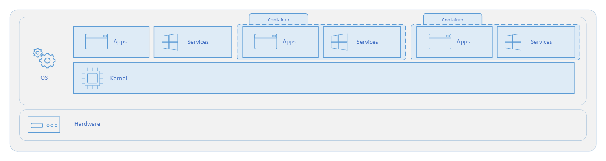
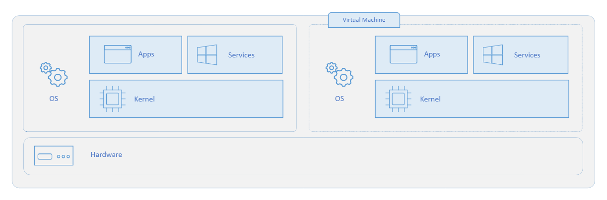
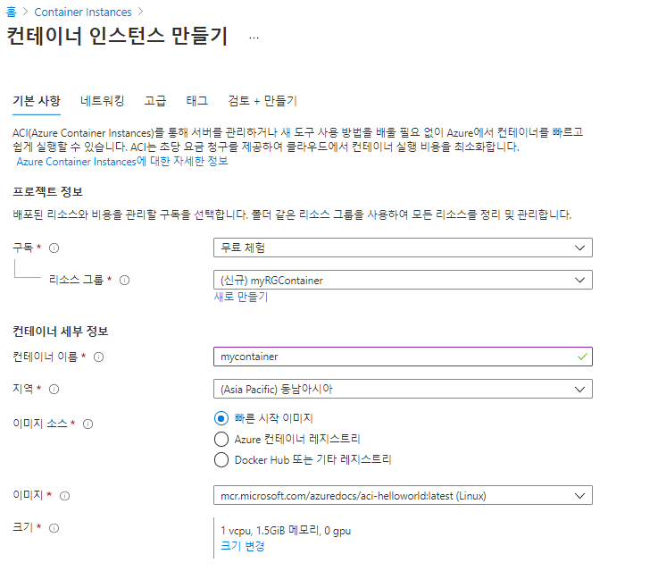
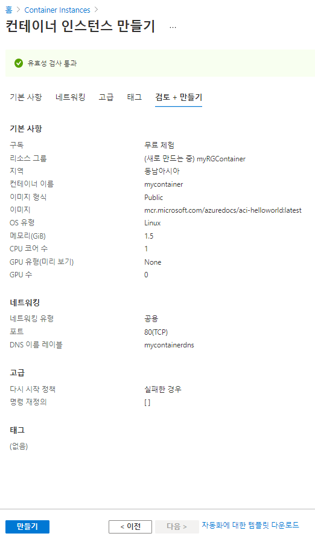
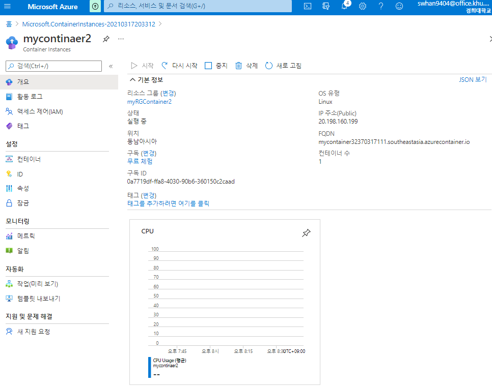
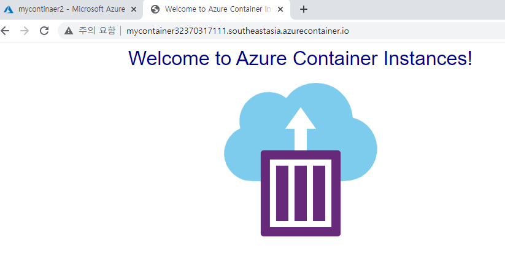

- 컨테이너와 VM은 어떤 차이가 있는가?
  - 운영체제
    - 가상 머신은 커널을 포함하여 완전한 운영체제를 실행하므로 더 많은 시스템 리소스(CPU, 메모리 및 스토리지)가 필요
    - 컨테이너는 운영체제의 사용자 모드 부분에서 실행하며, 앱에 필요한 서비스만 포함하도록 조정하여 시스템 리소스를 줄일 수 있음
  - 배포
    - 가상머신은 Windows Admin Center 또는 Hyper-V 관리자를 사용하여 개별 VM을 배포합니다. PowerShell 또는 System Center Virtual Machine Manager를 사용하여 여러 VM을 배포합니다.
    - 컨테이너는 명령줄을 통해 Docker를 사용하여 개별 컨테이너를 배포합니다. Azure Kubernetes Service 같은 오케스트레이터를 사용하여 여러 컨테이너를 배포합니다.
  - 스토리지
    - 가상머신은 단일 VM의 경우 로컬 스토리지에 VHD(가상 하드 디스크)를 사용하고, 여러 서버에서 공유하는 스토리지에는 SMB 파일 공유를 사용합니다.
    - 컨테이너는 단일 노드에는 로컬 스토리지용 Azure 디스크를 사용하고, 여러 노드나 서버에서 공유하는 스토리지에는 Azure Files(SMB 공유)를 사용합니다.

- 컨테이너

- 가상머신

# 1. 컨테이너 만들기

1. `Container Instances` 검색

   - Container란?

     - 가상화 환경(Docker)
     - 단일 호스트 컴퓨터에서 애플리케이션의 여러 인스턴스를 실행하는 경우
     - VM은 한 번에 하나의 운영 체제만 실행, 여러개의 런타임. 운영체제를 시작하는 시간 기다림. 하드웨어를 가상화. 유연성. 환경 완벽제어

     - VM과 달린 운영 체제를 관리하지 않음. 표준화된 런타임. 앱만 시작될떄까지 기다림. 운영체제 가상화. 컨테이너의 이식성
     - 컨테이너는 저용량, 동적 생성, 스케일 아웃 및 중지 할 수 있도록 설계됨.
     - 오케스트레이션 가능
     - Azure Container Instances : PaaS 형태 서비스. VM를 프로비저닝하지 않고, 컨테이너를 실행하는 가장 빠르고 간단한 방법 제공.
     - Azure Kubernetes Service : 컨테이너 클러스터 오케스트레이션 서비스. 많은 컨테이너를 관리 및 자동화. 가용성과 보안이 높은 완전 관리형.

2. 기본사항

   - 구독 - 무료체험

   - 리소스그룹 - 새로만들기 - myRGContainer

     - 동일한 라이프사이클(수명 주기 – 삭제)을 가지며, 리소스들에 대한 논리적 그룹화.  간편하게 관리하고 구성. 

     - 리소스를 관리 가능한 단일 단위로 집계하는 논리 컨테이너 역할

     - 모든 리소스는 하나의 리소스 그룹에만 존재하여야 하고, 한 리소스는 단일 리소스 그룹의 멤버여야 합니다.

     - 리소스 그룹은 중첩할 수 없습니다. 

     - 동일한 구독안에서 리소스 그룹의 이름은 고유합니다.
     - 리소스와 리소스 그룹의 이름은 변경하지 못합니다.

     - 리소스 그룹과 리소스의 지역은 다를 수가 있습니다.

     - RBAC(역할 기반 액세스 제어)를 통해 리소스 그룹 권한 범위 부여

     - 여러 가상 머신에 동시에 권한을 위임해야 하는 경우, 가상 머신을 동일한 리소스 그룹에 배포해야 한다.(상속)

     - 리소스 그룹의 리소스를 다른 리소스 그룹, 구독, 지역으로 이동할 수 있습니다.

     - Azure 가상 머신이 중지되더라도, 가상 머신과 관련된 스토리지 비용을 계속 지불합니다.

   - 컨테이너 이름 - myContainer

   - 지역 - (Asia Pacific)동남아시아

   - 이미지소스 - 빠른 시작 이미지

   - 이미지 - mcr.microsoft.com/azuredocs/aci-helloworld:latest(Linux)

   - 크기 

     - CPU 코어수 - 1
     - 메모리 -1.5GB
     - GPU 유형 - None

3. 컨테이너 인스턴스 만들기 - 네트워킹

   - 네트워킹 유형 - 공용
   - DNS 이름 레이블 - mycontainer32370317111
     - 전세계에서 유일한 이름으로 정해야함
     - 컨테이너는 dns-name-label.region.azurecontainer.io 라는 도메인으로 접근할 수 있습니다. **DNS name label not available** 애러 메세지가 표시되면 다른 DNS 이름 레이블을 지정합니다.
     - 만약 DNS가 중복되서 최종검토 + 만들기에서 실패할 경우 처음부터 다시 만들어야함

4. 최종 검토 + 만들기

   - 확실히 VM 만들 떄 보다 빠르게 만들어짐

# 2. 컨테이너 확인하기

1. 개요

# 3. 컨테이너 실행해보기

- 접속하기
  - IP주소(public) 
  - FQDN
  - 둘다 접속이 됨.

# 4. 질문사항

- 서버를 가상화하는 방식이 2개
  - VM
    - OS까지 가상화
    - 처음부터 설정을 다 해야함
    - 자기만의 저장소가 있음
  - container
    - 호스트 OS 위에 설치되는 방식
    - 기존의 컴퓨터 환경을 그대로 사용하는 방식이기때문에 설치 및 구성이 편리
    - 저장소가 없음 - 저장되는 것 같지만 꺼졌다가 켜지면 
    - 실제 서비스를 하기 위해서는 외부 DB을 활용해야함