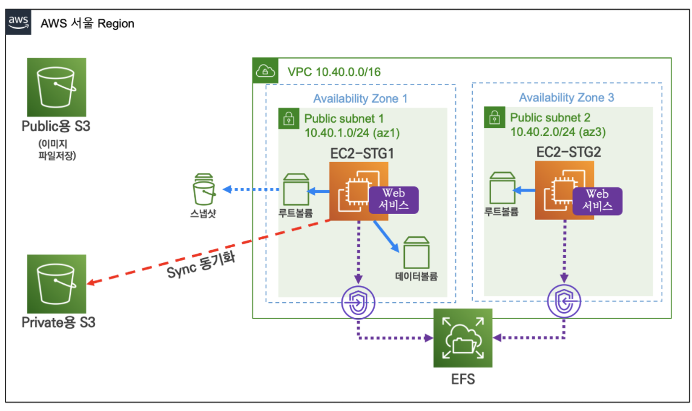

- 학습 목표
   - 버킷 생성
   - 파일 업로드 하고 업로드 한 팡리에 접근하기
   - 주기적인 백업을 S3에 하도록 만들기
   
   
# S3

- public용 S3
  - 외부에서 접근이 가능한 스토리지
- Private용 S3
  - 외부에서는 접근이 안되지만, 내부에서 사용할 수 있는 private 용도 bucket
  - 보통, EC2 서버 등에 사용하는 데이터를 압축하여 S3에 백업하는 용도로 쓰임
    - 최적화된 비용으로 스토리지 운용


## Public S3 버킷 생성하고 파일올리기

1. S3 검색 > 버킷만들기 버튼
2. 버킷만들기
   - 버킷 이름 : 유일한 이름이어야함
   - 리전 : ap-northeast-2
   - 접근차단 해제
     - 현재 설정으로 인해 이 버킷과 그 안에 포함된 객체가 퍼블릭 상태가 될 수 있음 체크

3. 파일 올리기
   - 사진파일


4. 파일이 올려지면 생성된 url 주소해서 들어가보기
   - 접근이 안됨 - 퍼블릭으로 설정하지 않았기 때문


5. 파일 퍼블릭으로 설정하기
   - 아까 주소로 접속하면 사진이 나오는 것을 확인할 수 있음


### 파일 접근 퍼블릭으로 설정하기

- 내가 만든 버킷 > 권한 탭  > 버킷 정책 편집
  - Action에서 s3:GetObject 를
  - Effect 에서 Allow 허용해라

 ```json
{
  "Version": "2012-10-17",
  "Statement": [
    {
      "Sid": "PublicReadGetObject",
      "Effect": "Allow",
      "Principal": "*",
      "Action": [
        "s3:GetObject"
        ],
      "Resource": [
        "arn:aws:s3:::버킷이름/*"
        ]
    }
  ]
}
 ```


## Private S3 생성하기

1. Xshell에서 S3 확인해보기
   - CloudFormation으로 설정이 되어있기 떄문에 S3 조회가 가능함
     - aws CLI 설치
     - IAM 정책권한 설정

```shell
# S3 조회
[root@EC2-STG2 ~]# aws s3 ls 
2021-07-06 16:43:32 han-s3-s3

```


2. 버킷생성하기

```shell
# S3 버킷 생성
# aws s3 mb s3://버킷(유일한 이름) --region ap-northeast-2
[root@EC2-STG2 ~]# aws s3 mb s3://han-s3-s3-2 --region ap-northeast-2
make_bucket: han-s3-s3-2
```


3. 파일 업로드

```shell
# 버킷 이름을 변수에 지정
# MyS3=버킷
[root@EC2-STG2 ~]# MyS3=han-s3-s3-2

# 로컬 파일 생성
[root@EC2-STG2 ~]# echo "111" > /var/www/html/111.txt

# 로컬 파일 s3로 이동
[root@EC2-STG2 ~]# aws s3 cp /var/www/html/111.txt s3://$MyS3
upload: ../var/www/html/111.txt to s3://han-s3-s3-2/111.txt    

# s3 디렉토리 목록 확인하기
[root@EC2-STG2 ~]# aws s3 ls s3://$MyS3
2021-07-06 16:50:15          4 111.txt

```


4. 하위 디렉토리를 S3 로 올리기(백업하기)

```shell
# 디렉토리 구조 확인하기
[root@EC2-STG2 ~]# tree /var/www/html
/var/www/html
├── 111.txt
├── efs
│   └── index.html
└── index.html

# 기존에 있는 S3 버켓을 지우고, 현재 디렉토리에 있는 파일을 동기화 시켜라
[root@EC2-STG2 ~]# aws s3 sync --delete /var/www/html s3://$MyS3
upload: ../var/www/html/efs/index.html to s3://han-s3-s3-2/efs/index.html
upload: ../var/www/html/index.html to s3://han-s3-s3-2/index.html 

# 서브 디렉토리 포함 확인하기
[root@EC2-STG2 ~]# aws s3 ls s3://$MyS3 --recursive
2021-07-06 16:50:15          4 111.txt
2021-07-06 16:54:50         60 efs/index.html
2021-07-06 16:54:50        137 index.html

```


### 주기적으로 백업하기

> 매 1분 마다 웹 디렉터리(하위 포함)을 버킷에 업로드(백업)하기 - 동기화하기

```shell
# crontab 내용 추가
cat <<EOF >> /etc/crontab
*/1 * * * * root aws s3 sync --delete /var/www/html s3://$MyS3
EOF

# 적용 
systemctl restart crond
# cron 의 동작을 log로 확인하기
tail -f /var/log/cron

# 파일 추가 생성
echo "222" > /var/www/html/222.txt
echo "333" > /var/www/html/333.txt

# 3초마다 s3 디렉토리 확인하기 - 1분정도 경과 후 s3에 파일이 동기화 되었는지 확인하기
while true; do aws s3 ls s3://$MyS3; date; echo "---[S3 ls]---"; sleep 3; done
```


### 특정 기간동안 객체 접근 허용하기

> Pre-sign URL 현재 버킷의 객체는 외부에서 접근이 불가능하지만 특정 기간 동안 특정 객체 다운 허용

```shell
# 파일 생성
echo "presigned test" > /var/www/html/presigned.txt

# S3 버킷에 업로드
aws s3 cp /var/www/html/presigned.txt s3://$MyS3

# 직접 객체 URL 바로 접속 시 안됨

# Pre-sign URL 생성 : 120초 - 임시 url이 나오게 됨
aws s3 presign s3://$MyS3/presigned.txt --expires-in 120
```


# 자원 삭제하기

1. ec2 인스턴스 종료하기
2. ebs 스냅샷 삭제(존재한다면), ebs 볼륨 삭제(분리 후)
3. efs 삭제
4. S3 버킷 삭제 (비우기 > 삭제)
   - 버킷에 내용이 있으면 삭제가 안되니 비우고 삭제하기
5. cloudFormation 삭제하기