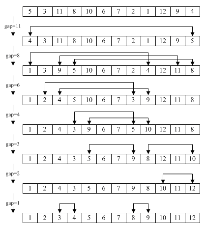

# 1. 버블정렬(거품정렬)

> 서로 인접한 두 원소의 대소를 비교하고, 조건에 맞지 않다면 자리를 교환하며 정렬하는 알고리즘
>
> 정렬과정에서 원소의 이동이 거품이 수면으로 올라오는 듯한 모습을 보이기 때문에 버블정렬이라고 이름지어짐


## 1.1 정렬과정

- 첫번째 원소부터 뒤의 원소와 크기를 비교해서 맨 마지막 자리까지 이동
  - 뒤의 원소가 크면 그대로
  - 뒤의 원소가 작으면 교환
- 한 단계가 끝나면 가장 큰 원소가 마지막 자리로 정렬됨
- 지금 정렬한 마지막 자리를 제외하고 다시 반복 - > 모든 수가 정렬될 떄까지

undefined


## 1.2 코드

### 1.2.1 python

```python
inp = [78,55,12,42,1]

for i in range(len(inp)-1, 0, -1) :
    for j in range(0,i) :
        if inp[j] > inp[j+1] :
            inp[j], inp[j+1] = inp[j+1], inp[j]

print(inp)
```


### 1.2.2 Java

```java
void bubbleSort(int[] arr) {
    int temp = 0;
	for(int i = 0; i < arr.length; i++) {       // 1.
		for(int j= 1 ; j < arr.length-i; j++) { // 2.
			if(arr[j-1] > arr[j]) {             // 3.
                // swap(arr[j-1], arr[j])
				temp = arr[j-1];
				arr[j-1] = arr[j];
				arr[j] = temp;
			}
		}
	}
	System.out.println(Arrays.toString(arr));
}
```


## 1.3 복잡도

- 시간 복잡도
  - (n-1) + (n-2) + (n-3) + .... + 2 + 1 => n(n-1)/2
  - 따라서 O(n^2)
  - 2개의 원소를 비교하기 때문에 최선, 평균, 최악의 경우 모두 시간복잡도가 **O(n^2)** 으로 동일

- 공간복잡도
  - 주어진 배열 안에서 교환(swap)을 통해, 정렬이 수행되므로 **O(n)** 


## 1.4 특징

- 구현이 매우 간단하고, 소스코드가 직관적이다.
- 정렬하고자 하는 배열 안에서 교환하는 방식이므로, 다른 메모리 공간을 필요로 하지 않다. => 제자리 정렬(in-place sorting)
- 안정 정렬(Stable Sort) 이다
  - 중복된 키를 순서대로 원래 순서대로 정렬함


## 1.5 개량버전 - 칵테일정렬(cocktail sort)

> 거품 정렬이 최대/최소 값을 향해서 한 방향으로만 정렬하는 방식이라면 
>
> 칵테일 정렬은 최댓값, 최솟값이 배열 가장자리에 위치하여 왕복하며 정렬하는 구조이다. 
>
> 정렬되는 동작이 칵테일 쉐이커를 흔드는 것과 비슷하여 칵테일 알고리즘이란 이름이 붙었다.


### 1.5.1 정렬과정

1. 첫 번째 단계는 버블 정렬과 마찬가지로 배열을 왼쪽에서 오른쪽으로 반복합니다. 루프 중에 인접한 항목이 비교되고 왼쪽의 값이 오른쪽의 값보다 크면 값이 바뀝니다. 첫 번째 반복이 끝날 때 가장 큰 숫자가 어레이 끝에 있습니다.
2. 두 번째 단계는 가장 최근에 정렬 된 항목 바로 앞의 항목에서 시작하여 배열의 시작 부분으로 다시 이동하는 반대 방향으로 배열을 반복합니다. 여기에서도 인접 항목이 비교되고 필요한 경우 교체됩니다.

undefined

### 1.5.2 코드-python

```python
def cocktail(arr, a, b): 
    swap = True # 정방향 True / 역방향 False
    swapped = True # 바뀌었는지 
    while swapped : 
        swapped = False
        
        if swap : # 정방향
            for i in range (a, b): 
                if arr[i] > arr[i + 1]: 
                    arr[i], arr[i + 1]= arr[i + 1], arr[i]
                    swapped = True # 바뀐게 있는지
            b = b-1
            swap = False # 방향전환
        else : # 역방향            
            for i in range(b-1, a-1, -1): 
                if arr[i] > arr[i + 1]: 
                    arr[i], arr[i + 1] = arr[i + 1], arr[i] 
                    swapped = True # 바뀐게 있는지
            a = a + 1
            swap = True # 방향전환
```

### 1.5.3 버블 정렬과 차이점

- 정렬 방향이 한방향이 아니라 양방향으로 바뀌면서 반복됨으로 빨라짐 
  - 예시 : (2,3,4,5,1) 과 같이 모든 요소가 최종위치에서 최대 k 만큼 다른 위치에 있는 경우
    - 버블 정렬의 경우
      1. 0 번쨰 자리 시작 : (2,3,4,1,5)
      2. 1번쨰 자리 시작 : (2,3,1,4,5)
      3. 2번째 자리 시작 : (2,1,3,4,5)
      4. 3번째 자리 시작 : (1,2,3,4,5)
    - 칵테일 정렬의 경우
      1. 0 번째 자리 시작 : (2,3,4,1,5)
      2. 4 번째 자리 역방향 : (1,2,3,4,5)
- 일반적으로 칵테일 정렬이 버블 정렬보다 2배 빠름


## 1.6 개량버전 - 빗질정렬(comb sort)

> 빗질정렬은 1보다 큰 크기의 간격을 사용하여 속도를 향상시킴
>
> 간격은 큰 값으로 시작하여 매 반복마다 1.3배씩 줄어듬
>
> 이 1.3 의 축소계수는 경험적으로 실험해본 결과에서 나오게 됨

### 1.6.1 정렬방식

1. 기본 과정은 버블 정렬 (Bubble Sort) 와 동일하다

2. 특정한 감소량 (shrink factor) 를 통해 차이 (Gap)을 줄여가며 버블 정렬을 실행한다

3. shrink factor는 1.3이 가장 이상적이라는 소문이 있으나, 가장 빠른 수치로 결정하면 됨
4. Gap 이 결정되면 해당 대상과의 Gap 만큼 차이가 나는 노드의 크기를 비교하여 버블 정렬을 수행함




undefined


- 축소 계수
  - 축소 계수는 빗질 정렬의 효율성에 큰 역할을 미침
  - k = 1.3은 200,000 개가 넘는 무작위 목록에 대해 경험적 테스트를 거친 후에 의해 이상적인 수축 계수로 제안됨
  - 값이 너무 작으면 불필요하게 많은 비교를 수행하여 알고리즘 속도가 느리고, 값이 너무 크면 1 간격 크기로 가는데까지 더 많은 시간이 걸림


### 1.6.2 코드- python

```python
def combSort(arr):
    n = len(arr)
  
    gap = n
  
    swapped = True
  
    while gap !=1 or swapped == 1:
  
        # gap 1.3 배 감소
        gap = (gap * 10)/13
        if gap < 1:
            gap = 1
  
        swapped = False
  
        for i in range(0, n-gap):
            if arr[i] > arr[i + gap]:
                arr[i], arr[i + gap]=arr[i + gap], arr[i]
                swapped = True
```


### 1.6.3 버블정렬과 차이점

- 복잡성
  - 최악의 시간 복잡성 : O(N^2)
  - 평균 케이스 시간 복잡도 : Ω(N^2 / 2^p)
    - p는 gap 이 줄어든 횟수
  - 최상의 경우 시간 복잡성 : Θ(N log N)
    - 최상의 경우는 Bubble Sort의 O(N^2) 에 비해 성능이 크게 향상됨
- 사실 이게 왜 더 빠른지 잘 이해가 안됨..

