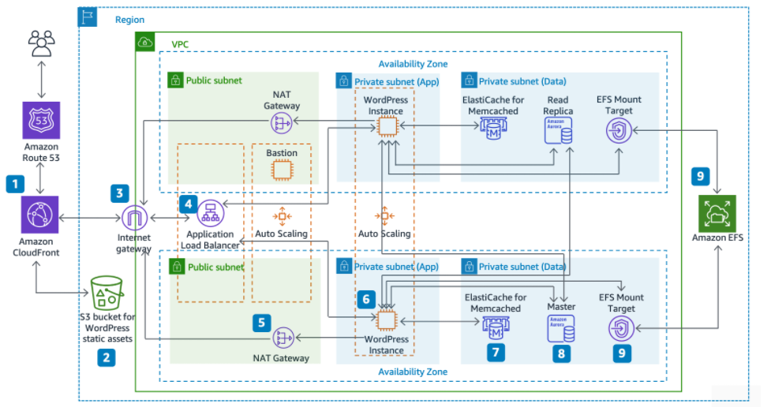
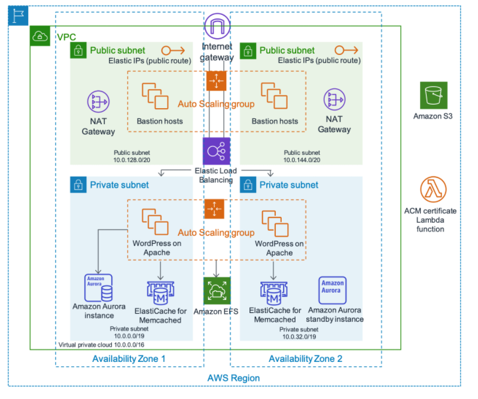
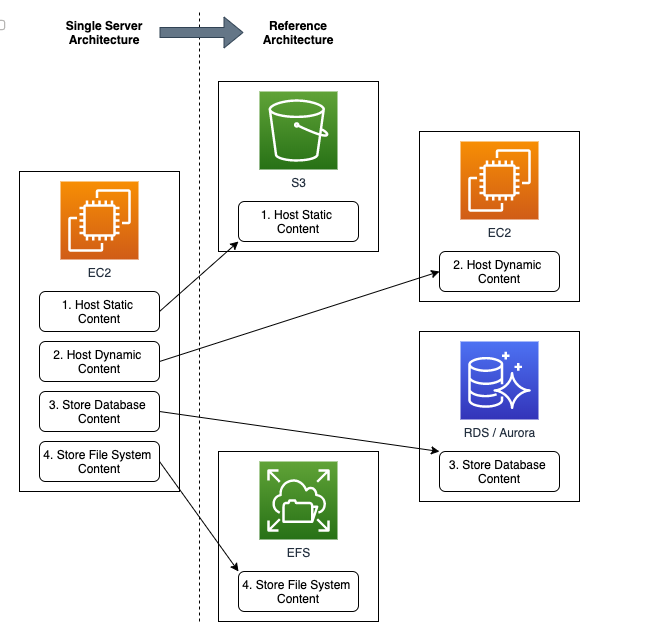
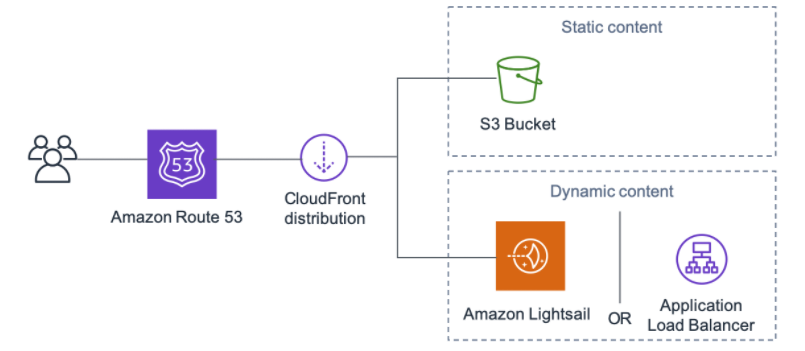

# Best Practices for WordPress on AWS 소개 

Best Practices for WordPress on AWS 소개 - [링크](https://docs.aws.amazon.com/whitepapers/latest/best-practices-wordpress/reference-architecture.html)

**[구성에 대한 설명]**

1. 가용영역 이중화 - 고가용성 증가
2. CloudFront를 사용하여 정적 및 동적 웹 콘텐츠를 사용자에게 더 빨리 배포
3. 네트워크의 보안성을 강화하기 위해 private subnet을 이용하여 웹서버를 배치하고, 이 웹서버에 대한 접근을 ALB를 통해 하도록 함
4. 웹서버의 업데이트를 위해서 외부 통신시에는 NAT게이트를 이용하여 통신
5. 오토스케일링을 적용하여 사용자의 증감에 따라 인스턴스 갯수를 조정할 수 있도록 만듬
6. DB는 Master와 Read Replica 로 이중화 구성을 area 별로 만들었음
7. 또한 워드프레스에 대한 정보는 Amazon EFS 데이터볼륨을 통해 저장해서, 복제시에도 동일한 정보를 유지하게 함
8. 정적 정보들은 S3 Bucket에 저장하여, 사용자에 대한 정보를 가지러 데이터볼륨까지 접근하지 않고,  응답할 수 있도록 하여 서비스의 원할함을 도움

# WordPress HA 권장사항

`Wordpress HA 권장 구성` - [링크](https://docs.aws.amazon.com/whitepapers/latest/best-practices-wordpress/wordpress-high-availability-by-bitnami-on-aws-quick-start.html)

# 데이터 유형에 따른 권장 저장위치

> EC2에 쓰지 말고 효율적으로 나눠쓰자!

- S3 - 정적인 웹콘텐츠
- EC2 - HOST 동적 컨텐츠
- RDS - EC2에서 DB 분리
- EFS - webSrv 설정 파일

# CDN 권장구성

- Amazon Route 53 을 이용하여 DNS 등록
- CloudFront 를 통해 CDN 이용
- S3 - 정적 파일
  ALB - 트래픽을 라우팅
