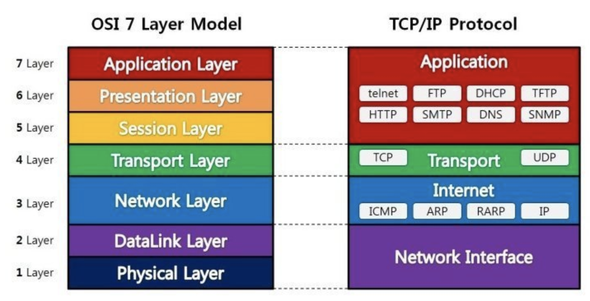
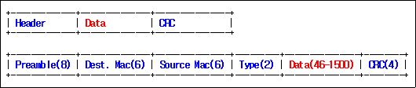
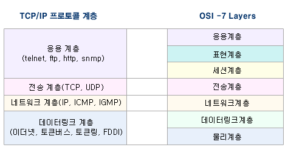
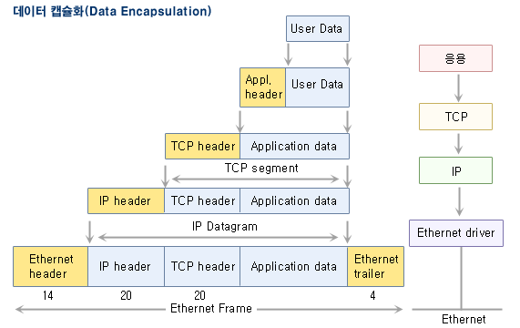
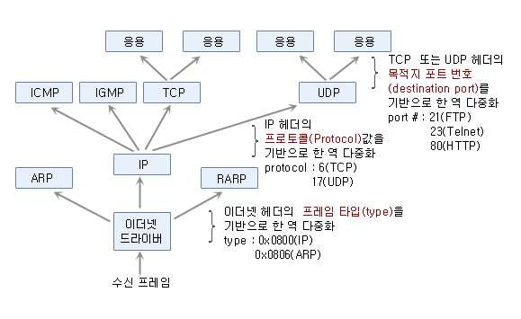
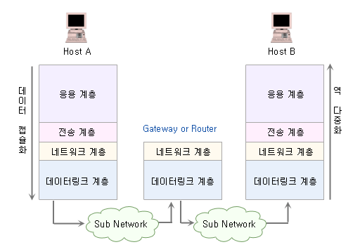
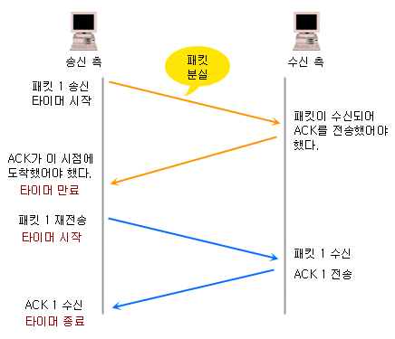
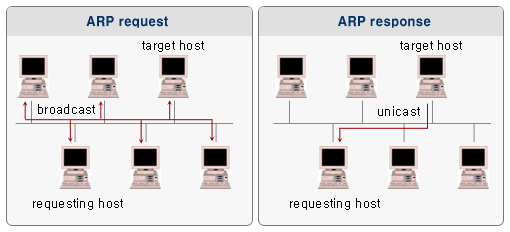
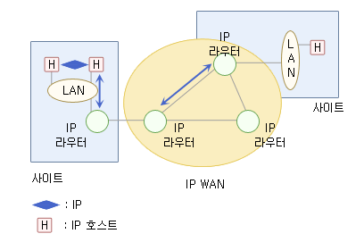

# OSI 7 레이어 모델

- 국제 표준화기구에서 개발한 모델
- 네트워크 동작 과정을 7개 계층으로 나누어 네트워크 통신 흐름을 한 눈에 알아보고 이해할 수 있도록 도와주는 역할
- 계층별로 하위 계층의 기능을 이용하고, 상위 계층으로 기능을 제공하는 상하 관계를 맺고 있음

## 1 계층 - 물리 계층(Physical Layer)

물리 계층은 전기적, 기계적, 기능적인 특성을 이용해서 통신 장비로 데이터를 전송하게 된다.

물리 계층에서 사용되는 통신 단위는 Bit로 1과 0으로 나타낸다. 즉 전기적으로 On, Off 상태라고 생각하면 된다.

물리 계층에서는 단지 데이터를 전달만 한다. 전송할 때(또는 받을 때) 데이터가 무엇인지, 어떤 에러가 있는지 등에는 전혀 신경 쓰지 않는다. 정말 단순하게 데이터를 전기적인 신호로 변환해서 주고받는 기능만 할 뿐이다.

결국 물리 계층은 어떤 에러가 있는지 전혀 관여하지 않는다.

- PDU : 비트(Bit)
  - 프로토콜 데이터 단위(PDU, Protocol Data Unit)는 데이터 통신에서 상위 계층이 전달한 데이터에 붙이는 제어정보를 뜻한다.
- 프로토콜 : Modem, Cable, Fiber, RS-232C
- 대표장비 : 허브, 리피터

## 2 계층 - 링크 계층(Link Layer)

링크 계층은 네트워크 기기들 사이의 데이터를 전송하는 역할을 한다. 물리 계층을 통해 송수신되는 정보의 오류와 흐름을 관리하여 안전한 정보의 전달을 수행할 수 있도록 도와주는 역할을 한다.

링크 계층에서는 프레임에 주소값을 물리적으로 할당받는데 이는 **맥(MAC; Media Access Control) 주소**라고 불린다.

네트워크 계층(3계층)에서 정보를 받아 주소와 제어정보를 헤더와 테일에 추가한다.

결국 링크 계층은 **에러검출 / 재전송 / 흐름제어** 역할을 한다.

- PDU : 프레임(Frame)
- 프로토콜 : 이더넷(Ethernet), MAC, PPP, ATM, LAN, Wifi
- 대표장비 : 브릿지, 스위치

### 프레임

> 인터넷 계층에서 하위로 내려오는 데이터에 네트워크 인터페이스 계층에서 생성되는 헤더(Header)와 테일(Tail)을 붙이면 이것을 이더넷 프래임 또는 패킷이라고 부른다.

- 밑의 그림은 ethernet 의 프레임 구조
  - 프리엄플(Preamble)
    - 네트웍 통신에서 두 개 이상의 시스템간에 전송 타이밍을 동기화하기 위해 사용되는 신호
    - 프리앰블은 "누군가가 지금 막 데이터를 전송하려한다"는 의미로서 통신 시스템들이 이해할 수 있는 일련의 특정 송신 펄스를 정의한다. 이것은 정보를 수신하고 있는 시스템들이 언제 데이터 전송이 시작되는지를 올바르게 이해하도록 보장한다. 프리앰블로서 사용되는 실제 펄스들은 사용하는 네트웍 통신 기술에 따라 달라진다.
  - 목적지 이더넷 주소(Destination Ethernet Address)
  - 소스 이더넷 주소(Source Ethernet Address)
  - 타입(Type)
  - 데이터(인터넷 계층의 데이터)
  - CRC(체크섬)로 구성

## 3 계층 - 네트워크 계층(Network Layer)

중요한 기능 중 하나는 **라우팅**이다. 이는 데이터를 목적지까지 안전하고 빠르게 전달하는 기능을 말한다. 경로를 선택하고 주소를 정하고 경로에 따라 패킷을 전달해주는 것이 네트워크 계층의 역할이다.

네트워크 계층은 사용되는 프로토콜 종류도 다양하고 라우팅하는 기술도 다양하다. 또한 어느 컴퓨터에게 데이터를 전송할지 주소를 가지고 있어서 이를 바탕으로 통신한다. 우리가 아는 IP 주소가 바로 네트워크 계층의 헤더에 있다.

송신측에서 수신측까지 데이터를 안전하게 전달하기 위해서 논리적 링크(네트워크) 를 설정 하고 상위계층 데이터를 작은 크기의 **패킷**으로 분할하여 전송하는 역할을 수행한다.

결국 네트워크 계층은 **주소 부여(IP) / 경로 설정(Route)** 역할을 한다.

- PDU : 패킷(Packet)
- 프로토콜 : IP, ICMP 등
- 대표장비 : 라우터, L3 스위치

## 4 계층 - 전송 계층(Transport Layer)

전송 계층은 통신을 할성화하기 위한 계층이다. 양 끝단의 사용자들이 신뢰성있는 데이터를 주고 받게 해주는 역할을 한다.

보통 TCP 프로토콜을 이용하며, 포트를 열어서 응용프로그램이 전송을 할 수 있게 한다.

중요한 것은 데이터 전송을 위해서 Port 번호가 사용된다는 점이다. 대표적인 프로토콜로 TCP와 UDP가 있다. 이 계층에서 사용하는 데이터 단위는 세그먼트이다.

결국 전송 계층은 **패킷 생성(Assembly/Sequencing/Deassembly/Error detection/Request repeat/Flow control) 및 전송** 역할을 한다.

OSI 7계층 구조는 전송계층을 기점으로 하위계층으로 이루어진 네트워크 서비 스와 상위계층으로 이루어진 사용자 서비스로 구별 될 수 있다.

전체 메시지를 발신지 대 목적지 (end-to-end)간 제어와 에러를 관리한다.

end-to-end 전송은 단순히 한 컴퓨터에서 다음 컴퓨터로의 전달이 아니라, 송신 컴퓨터의 응용프로그램(프로세스)에서 최종 수신 컴퓨터의 응용프로그램(프로세스) 으로의 전달을 의미한다.

- PDU : 세그먼트(Segment)
- 프로토콜 : TCP, UDP , ARP, RTP
  - ARP(Address Resolution Protocol) 프로토콜은 네트워크 상에서 IP 주소를 MAC 주소와 대응하기 위해 사용
  - 여기서 스푸핑(Spoofing)이 일어남
    - 로컬에서 통신하고 있는 서버와 클라이언트의 IP 주소에 대한 2계층 MAC 주소를 공격자의 MAC 주소로 속여 클라이언트가 서버로 가는 패킷이나 서버에서 클라이언트로 가는 패킷을 중간에서 가로채는 공격이다.
    - 공격자는 이 패킷을 읽고 확인한 후 정상적인 목적지로 향하도록 다시 돌려 보내 연결이 끊어지지 않고 연결되도록 유지한다.
- 대표장비 : 게이트웨이, L4 스위치

## 5 계층 - 세션 계층(Session Layer)

통신 세션을 구성하는 계층으로, 포트(Port)번호를 기반으로 연결한다. 통신장치 간의 상호작용을 설정하고 유지하며 동기화한다.

> 세션이란 **데이터가 통신하기 위한 논리적인 연결**을 말한다. (통신을 하기 위한 문)

세션 계층은 **TCP/IP 세션을 만들고 없애는 책임**을 진다.

결국 세션 계층은 통신을 하기 위한 세션을 확립 / 유지 / 중단 역할을 한다. (운영체제가 해줌)

세션계층은 표현계층(6계층)으로부터 받은 데이터를 효율적인 세션 관리를 위해 짧은 데이터 단위로 나눈 후에 전송 계층으로 내려 보낸다.

- PDU : 데이터(Data)
- 프로토콜 : NetBIOS, SSH, TLS

## 6 계층 - 표현 계층(Presentation Layer)

표현 계층(Presentation layer)은 코드 간의 번역을 담당하여 사용자 시스템에서 데이터의 형식상 차이를 다루는 부담을 응용 계층으로부터 덜어 준다. MIME 인코딩이나 암호화 등의 동작이 표현 계층에서 이루어지는 것이다.

예를 들면, EBCDIC로 인코딩된 문서 파일을 ASCII로 인코딩된 파일로 바꿔 주는 것, 해당 데이터가 TEXT인지, 그림인지, GIF인지 JPG인지의 구분 등이 표현 계층의 몫이다.

결국 표현 계층은 사용자의 명령어를 완성 및 결과 **표현하며, 압축 / 암호화 역할**을 한다.

- PDU : 데이터(Data)
- 프로토콜 : JPG, MPEG, SMB, AFP

## 7 계층 - 응용 계층(Application Layer)

응용 계층은 사용자와 바로 연결되어 있으며 응용 SW를 도와주는 계층이다. 사용자로부터 정보를 입력받아 하위 계층으로 전달하고 하위 계층에서 전송한 데이터를 사용자에게 전달한다.

파일 전송, DB, 메일 전송 등 여러가지 응용 서비스를 네트워크에 연결해주는 역할을 한다.

결국 응용 계층은 응용 프로세스와 직접 관계하여 일반적인 **응용 서비스를 수행**한다.

- PDU : 데이터(Data)
- 프로토콜 : DHCP, DNS, FTP, HTTP

#  TCP / IP

- 데이터가 의도된 목적지에 닿을 수 있도록 보장해주는 통신 규약

- TCP (Transmission Control Protocol )
  - 두 호스트가 교환하는 데이터와 승인 메세지의 형식을 정의하여, 서버와 클라이언트간의 데이터를 신뢰성있게 전달하기 위해 만들어진 규약
  - 데이터를 전달하는 속도와 손실되는 데이터의 양이 달라지는데, 이는 데이터를 전달하는 과정에서 그 순서가 의도하지 않게 뒤바뀌거나 손실이 되어 전달될 수 있음을 뜻한다.
    - TCP는 데이터 패킷에 일련의 번호를 부여함으로써, 데이터 손실을 찾아내서 교정하고, 순서를 재조합하여 클라이언트에게 전달할 수 있게 해준다.

- IP ( Internet Protocol ) 
  - 컴퓨터와 컴퓨터간에 데이터를 전송하기 위해서 사용되는 4바이트로 이루어진 컴퓨터의 주소
    - `192.168.9.255`와 같이 3개의 마침표로 나뉘어진 숫자로 표시
  - 단지 데이터를 전달하는 역할만을 담당
  - 참고로 IP주소는 하드웨어 고유의 식별번호인 MAC주소와 다르게 임시적으로 다른 주체(통신사)에게 받는 주소이므로, 바뀔수 있다.

## 데이터의 캡슐화 / 역다중화

- **데이터 캡슐화(Data Encapsulation)** ? 송신 측 입장에서 데이터 생성과정
  - 데이터가 생성 이되면 각각의 계층에서는 각각의 헤더(Header)를 붙이게 된다.
  - 각 계층을 지나면서 각 계층에서 해야 할 일을 헤더에 붙이는 작업을 데이터 **캡슐화(Data Encapsulation)**라고 한다. 

-  **역 다중화(Demultiplexing)** ? 수신 측 입장에서 데이터 생성과정
   - 이더넷 드라이버에서 수신이 되며, 해당 데이터를 어느 쪽(ARP, IP, RARP)을 보낼지 이더넷 헤더의 프레임타입(type)을 확인해서 결정
   - IP에서는 TCP, UDP로 보낼지는 결정해야 하는데, 이때 사용되는 프로토콜의 헤더 값을 확인해서 결정한다. 
   - 응용계층에서는 각각의 포토번호를 확인해서 데이터를 보낸다. 

## TCP 의 연결설정

- TCP의 연결설정 방법은 3-way Handshaking방법을 사용
- 그림 설명
  1. 위 그림과 같이 컴퓨터 A가 B에 연결을 시도하기 위해서 SYN라는 메시지를 보내게된다. 그러면서 코드 1000이라고 같이 붙어여 보내게 되는데, 
  2. B컴퓨터에서는 A컴퓨터의 SYN(1000)메세지를 확인해서 B컴퓨터가 연결을 시도하려는거라는걸 알게된다. B 컴퓨터는 다시 A 컴퓨터에게 ACK라는 메시지와 함께 1001이라고 코드를 같이 보내게 된다.(응답 받은 코드에서 +1을 더해서 보냄) 그러면서SYN(4000)이라고 보내게 되는데 B 컴퓨터 또한 A 컴퓨터에 연결을 시도하는 것이기 때문이다. 
  3. A컴퓨터는 다시 B 컴퓨터에게ACK(4001) 보내게되므로서 연결이 된다. 이렇게 3단계를 거쳐 연결을 되기 때문에 3-way Handshaking이라 한다. 

## TCP 재전송 타이머

- TCP는 타이머를 통해서 신뢰성 있는 데이터를 주고 받는다. 
- 즉, A 컴퓨터에서 패킷을 보냄과 동시에 타이머가 시작되고, A 컴퓨터에선 B 컴퓨터가 응답을 보낼 시간을 대략적으로 계산해 그 시간까지 응답이 없으면 중단에 패킷이 분실된 줄 알고 타이머가 만료되고, 다시 이전에 보냈던 패킷을 재전송을 하게 된다. 

## 1계층 - 데이터 링크 계층 프로토콜

- 패킷을 전달하는 물리적 인터페이스와 관련된 하드웨어를 제어하는 기능을 수행한다.
  (NIC, Hub, Connector, Cable 등)
- ARP(Address Resolution Protocol)
  - TCP/IP 상에서 데이터 전송을 위해서는 IP주소(32bit)와 MAC주소(48bit) 주소필요.
        (송.수진 측 모두 필요)
  - 물리적의 IP주소를 사용하여 목적지 MAC주소를 획득하는 프로토콜.
  - 3 ARP request(Broadcast)  / ARP response(Unicast)
    - ARP request : 목적지 IP주소를 써서 모든 컴퓨터에게 보낸다. 즉, 내가 목적지의 IP주소를 알고 있는데,그 목적지의 MAC Address을 알고 있으면 응답을 달라 요청함. (boradcast)
    - ARP response : 목적지의 컴퓨터가 요청한 컴퓨터에게 바로 직접적으로 응답을 해준다. (nicast)

## 2계층 - 네트워크 계층 프로토콜

- 네트워크 상의 패킷 이동의 제어(패킷을 전달하고 경로를 선택)기능을 수행하는 프로토콜이다. (라우팅 기능 수행)

- 개념

  1. IP (Internet Protocol)
     - 사용자의 데이터를 패킷 형태로 전송하는 기능을 수행하는 비 연결형 프로토콜
     - 전송 요청을 라우터에 보내면, 라우터가 알아서 해당 목적지에 요청을 한다. (라우팅 기능)
     - 패킷의 완전한 전달을 보장하지 않는다.
     - IP패킷 헤더 내에 수신 및 발신 주소를 포함한다.
  2. ICMP (Internet Control Message Protocol)
     - 인터넷 계층 프로토콜 중 ICMP는 호스트 또는 라우터 사이에 오류정보, 제어 메세지를 전달하는데 사용되며 주로 IP가 이용하지만 ping과같은 응용프로그램이 직접 사용하는 경우도 있다.
  3. IGMP (Internet Group Message Protocol)
     - 로컬 네트워크상의 멀티캐스팅 그룹관리를 위한 프로토콜
     - 하나의 라우터와 여러 호스트로 구성되는 서브네트워크 상에서, 호스트들이 어떤 멀티캐스트 그룹에 속하는 가를 라우터가 알도록 하기위한 일종의 그룹 관리용 프로토콜
     - ICMP, IGMP등은 데이터 전송용 프로토콜이 아니고, 네트워크상에 이벤트 또는 변화를 알리는데 사용되는 제어용 프로토콜
  4. ARP (Address Resolution Protocol)
     - 인터넷에 연결되는 모든 호스트는 네트워크 계층 주소에 해당하는 32bit의 IP주소를 가지고 있다.
     - LAN에서 어떤 컴퓨터에 IP패킷을 물리적으로 전달하기 위해서는 먼저 그 장비의 MAC주소를 알아야 하는데 어떤 장비의 IP주소를 가지고 그 장비의 MAC 주소를 알아내기 위한 절차(프로토콜)를 ARP 라고 한다.
     - 동일한 목적지 호스트에 IP패킷을 연속하여 보낼 때 매번 ARP를 사용하면 ARP를 처리하기 위한 패킷들을 자주 전송하게 되어 대역 이용률이 떨어진다. 이와같이 매번 ARP request 패킷을 방송하지 않도록 하기위하여, ARP로 얻은 최근의 정보를 캐시에 기록해 두는 것이 효율적이다.
  5. RARP (Reverse Address Resolution Protocol)
     -  ARP의 역과정 , 즉 48 비트의 MAC주소로부터 그 장비의 32비트 IP 주소를 알아내는 과정을 RARP 라고 한다.

  

## 3계층 - 전송 계층 프로토콜

- 두 호스트 간에 종단 간 연결을 맺고 데이터를 전달할 수 있는 기능을 수행.

- 종류

  1. TCP (Transmission Control Protocol)

     - TCP는 종단 간에 **연결을 설정한 후** 데이터를 전송하는 **신뢰성**있고, 순서적인 데이터 전달 서비스를 제공하는 접속형 프로토콜.
       신뢰성 서비스 : 신뢰성을 제공하기 위해 수신 데이터에 대한 확인응답, 흐름제어, 세그먼트화 등을 제공.
     - TCP는 연결지향 프로토콜인데, 이것은 메시지들이 각단의 응용프로그램들에 의해 교환되는 시간동안 연결이 확립되고 유지되는 것을 의미한다.
     - TCP는 IP가 처리 할 수 있도록 메시지를 여러개의 패킷들로 확실히 나누고, 반대편에서는 완전한 메시지로 패킷들을 재조립할 책임이 있다.

  2. UDP (User Datagram Protocol)

     - UDP는 종단 간에 연결을 설정하지 않은 채 데이터를 전송하는 **비접속형** 전송 서비스를 제공하는 **비신뢰성** 프로토콜

     - UDP 는 TCP와는 달리 메시지를 패킷으로 나누고, 반대편에서 재조립하는 등의 서비스는 제공하지 않는다.
     - 교환해야할 데이터가 매우 적은 네트워크 응용프로그램들은 처리시간 단축을 위해 Tcp보다 UDP를 쓴다.

  3. SCTP (Stream Control Transmission Protocol)

     - TCP와 UDP의 단점을 개선한 전송계층 기술로 고속전송과 신뢰성을 보장한다.
     - Flow control : 시간당 송신자가 보내는 패킷의 양이 수신자가 수신할 수 있는 패킷의 양을 넘어서지 않게 하는 것이다.

## 4계층 - 응용 계층 프로토콜

- TCP/IP 프로토콜의 이용하는 서비스
- 종류
  1. FTP (File Transfer Protocol)
     - 파일 전송 프로토콜
  2. VSFTP (Very Secure File Transfer Protocol)
     - VSFTP는 보안 부분을 특히 강조한 데몬으로 Redhat,Suse,Open-BSD에서 기본 FTP로 채택하고 있으며 보안, 빠른 퍼포먼스, 안정성을 주요 특징으로 소개하고 있다.
  3. SNMP (Simple Network Management Protocol)
     - SNMP는 TCP/IP 프로토콜 그룹을 이용하여 인터넷상에서 장치를 관리하기위한 기반구조이다. 이것은 인터넷을 감시하고 관리하기 위한 기본적인 운영을 제공한다.
  4. SMTP (Simple Mail Transfer Protocol)
     - 전자 우편을 보내고 받는데 사용되는 TCP/IP 프로토콜이다.
  5. HTTP (Hyper Text Transfer Protocol)
     - Web-Browser같은 응용프로그램을 통해 Web-Client와 Web-Server사이에 데이터를 전송하는 프로토콜 이다.
     - 평문 (암호화 하지않은) 통신이기 때문에 도청이 가능하다.
  6. HTTPS (Hyper Test Transfer Protocol Secure)
     -  HTTP의 약점을 보안하기 위하여 HTTP 암호화나 인증 등의 구조를 더한 것 이다.
     -  웹페이지의 로그인이나 쇼핑의 결제 화면 등에서 사용되고 있다.
  7. DNS (Domain Name System)
     - 네트워크상에서 컴퓨터들은 IP주소를 이용하여 서로를 구별하고 통신한다. 사람들이 네트워크를 통해 원격의 컴퓨터에 접속하기 위해서는 IP주소를 이용하여야 하지만, 숫자의 연속인 IP주소를 일일이 외울 수 없기 때문에 쉽게 기억할 수 있는 도메인 주소 체계가 만들어 졌다.
     - 도메인 주소를 IP주소로 변환시켜주거나 그 반대의 기능을 한다.

 