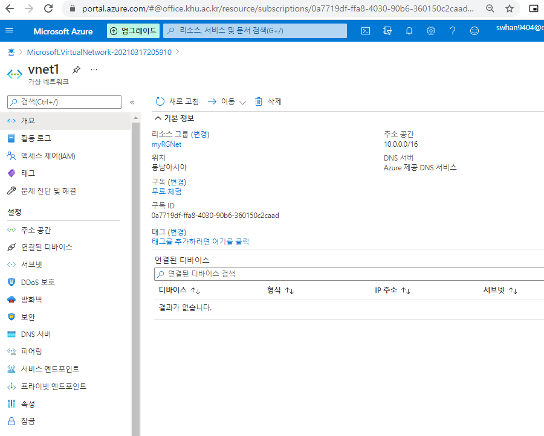
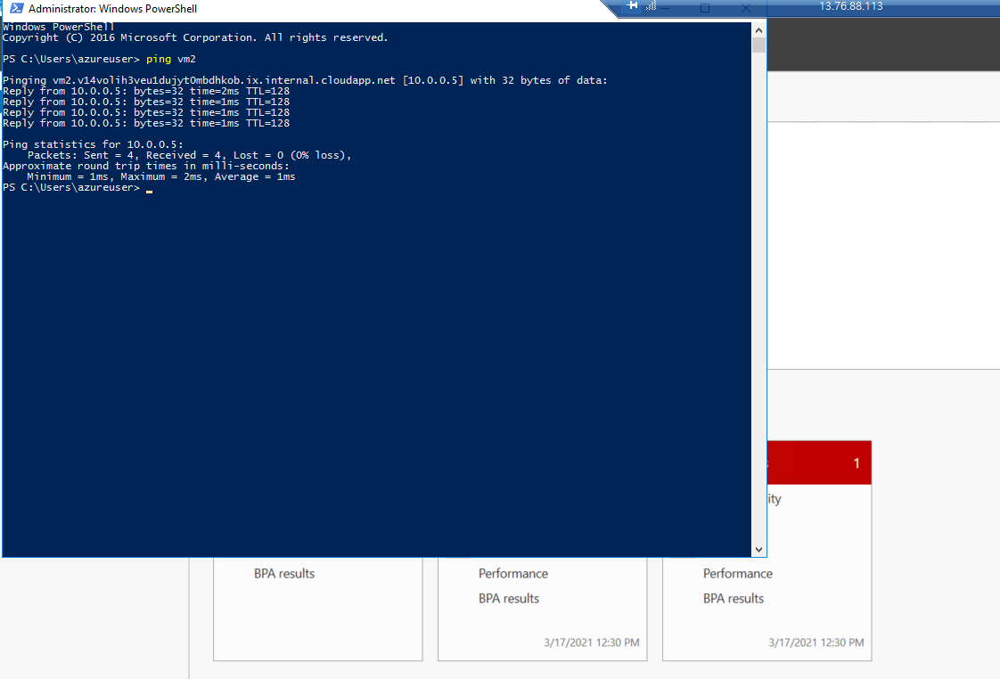

할 것 : 

1. 가상 네트워크를 만들고 
2. 두 개의 가상 머신을 해당 가상 네트워크에 배포
3. 하나의 가상 머신이 가상 네트워크를 통해 다른 가상 머신에게 ping 통신을 할 수 있도록 구성

# 1. 가상네트워크 만들기

1. `가상 네트워크` 검색
2. 기본사항 설정
   - 구독 - 무료체험
   - 리소스 그룹 - 새로만들기 - myRGNet
   - 인스턴스이름 - vnet1
   - 지역 - (Asia Pacific) 동남아시아
3. IP Address 설정
   - default 있는것 확인
   - 서브넷

      - 하나의 네트워크가 분할되어 나눠진 작은 네트워크
      - 서브넷 마스크 값은 네트워크 주소를 나타내는 비트 수를 명시한 값
        - `205.0.1.129/25`
          - 뒤의 /25는 최상위 비트부터 25비트까지가 네트워크 주소로 인식된다는 것을 의미
      - 필요 이유
        - **네트워크를 운영중인 서비스의** **규모****에 맞게 분할**하여 사용하기 위한 기술
        - **낭비되는 IP주소 자원을 최소화하려는 것이 주된 목적**
        -  **네트워크의 규모를 줄여서 브로드 캐스팅으로 인한 부하를 줄일 수 있는 것**
4. 보안 설정
   - DDos Protection, 방화벽, BastionHost를 설정할 수 있지만 안함 체크 
   - DDos 에 선택을 하지않아도 기본으로 어느정도는 해줌
5. 가상네트워크 확인하기
   - 자동화 - 템플릿 내보내기 가 있으면 나중에 현재 만든 것을 그대로 빠르게 만들 수 있음

# 2. 가상머신 만들기

1. `가상머신` 검색
2. 가상머신 만들기 - 기본사항
   - 구독 - 무료체험
   - 리소스그룹 - `myRGNet` 선택 (방금만든 가상네트워크 리소스그룹 선택)
   - 이름 - vm1
   - 지역 - 동남아시아
   - 이미지 - Window Server 2016 Datacenter - Gen1
   - 크기 - Standard_DS2_v2 - 2vcpu, 7Gib메모리
   - 사용자이름 - azureuser
   - 암호 : Pa$sWord!12@@
   - 공용 인바운드 포트 - 선택한 포트 허용
   - 인바운드 포트 선택 -RDP3389
3. 검토만들기

4. 두번째 가상머신 만들기 -기본사항
   - 구독 - 무료체험
   - 리소스그룹 - `myRGNet` 선택 (방금만든 가상네트워크 리소스그룹 선택)
   - 이름 - vm2
   - 지역 - 동남아시아
   - 이미지 - Window Server 2016 Datacenter - Gen1
   - 크기 - Standard_DS2_v2 - 2vcpu, 7Gib메모리
   - 사용자이름 - azureuser
   - 암호 : Pa$sWord!12@@
   - 공용 인바운드 포트 - 선택한 포트 허용
   - 인바운드 포트 선택 -RDP3389

# 3. 연결하기

1. vm1 개요 보기 - 연결 -RDP 클릭
2. RDP파일 다운로드
3. RDP 파일 실행 - vm1 만들때의 아이디, 비번 넣기
4. 가상머신 연결 후 검색 - powershell (관리자모드로)
5. `ping vm2` 입력
   - vm2 에 핑을 보내기(ICMP 통신을 한 것)

