## 준비사항

### Django project

- 완성된 프로젝트
- 의존성 저장 - `pip freeze > requirements.txt`
- 원격저장소 업로드

### AWS ([https://aws.amazon.com/ko/](https://aws.amazon.com/ko/))

- AWS 계정 생성
- 기본정보입력
- 카드정보입력 (해외결제가 가능한 체크카드 or 신용카드)
- 휴대폰인증
- 완료후 로그인


## 사용할 것들의 개념

- cloud9
  - 원격 컴퓨터에 접속할 수 있는 인터페이스를 제공하는 서비스
  - 코드를 쓸 수 있는 인터페이스
- EC2
  - 가상 컴퓨터
- pyenv
  - 리눅스 시스템에서  python 환경 설치 및 관리 api
  - 이걸로 python 을 install 할 것
- nginx
  - django는 서버가 아님
    - 정확하게 표현하면 django는 서버에서 돌아가는 어플리케이션
    - django에서 run server를 하면 내장된 작은 development 용 서버가 실행되는 것
  - 이것이 실제 서버역할
    - client 요청이 처음 도달하는 곳
  - 우리가 여기서 할것
    - `/`(루트주소)로 들어오면 django로 가게
    - `/static/` 으로 들어오면 staticfiles 폴더로 가게
- uWSGI
  - nginx 와 django 사이를 중재하는 역할


## Deploy

### cloud9

- AWS Management Console 에서 Cloud9 검색 후 Create environment 클릭
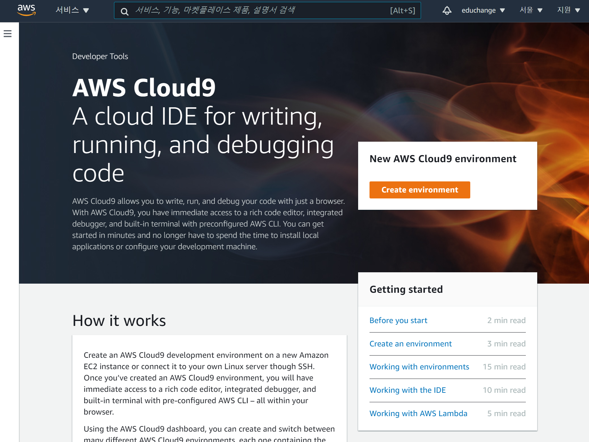


- 이름입력 후 Next step

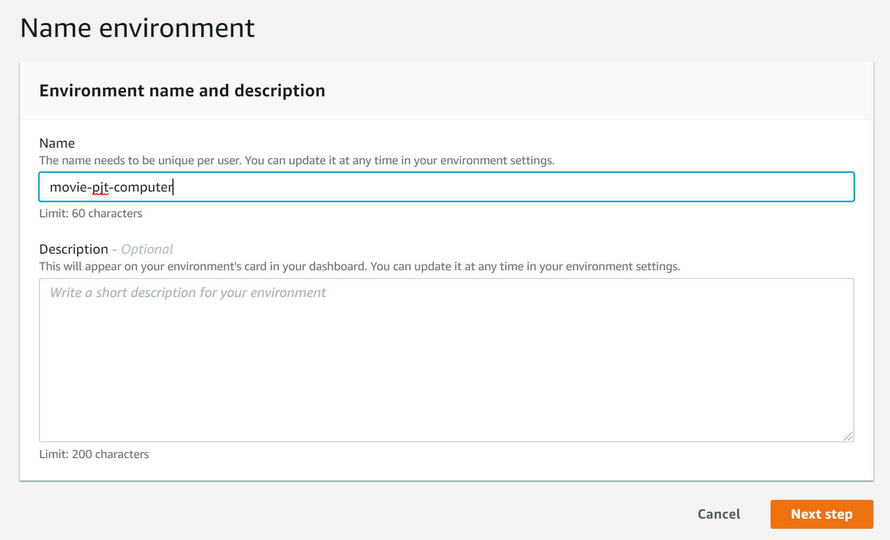

- 설정
    - Platform - Ubuntu Server 18.04 LTS
    - Cost-saving setting - 일정시간 후 꺼지도록 설정가능 (Never 설정시 과금주의)

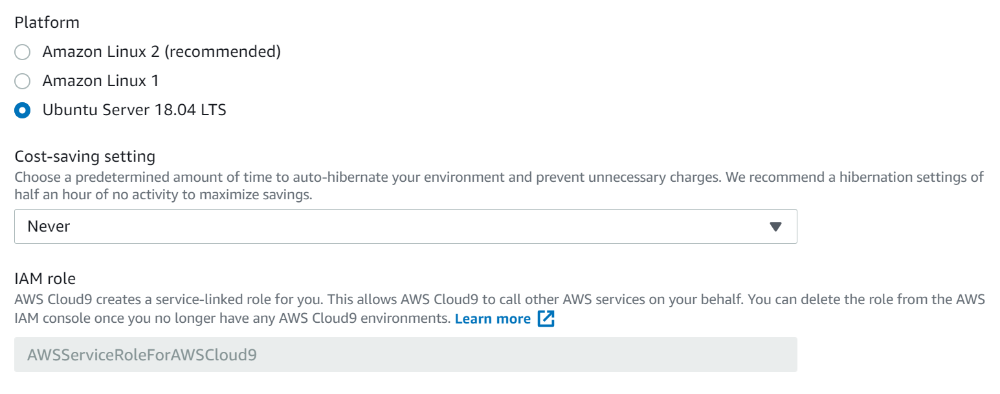

- 생성 완료 후 cloud9 화면 확인

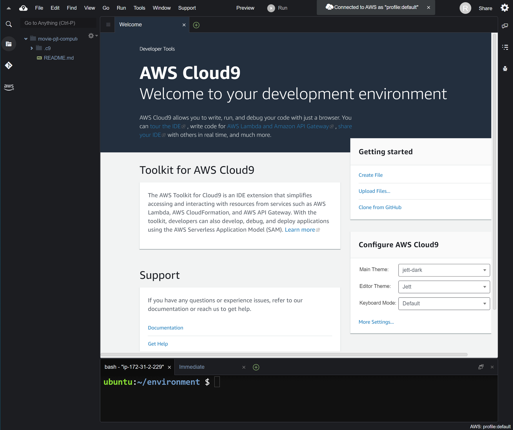

- 파일트리 설정 (home directory기준으로 진행)
    - Show Environment Root 체크해제
    - Show Home in Favorites 체크

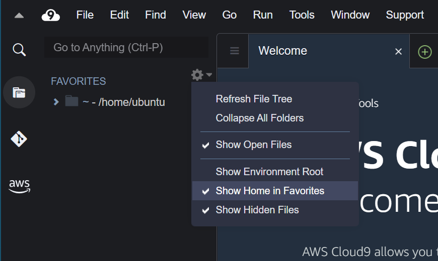

### EC2

새로운 탭에서 진행
EC2는 cloud9 생성시 자동생성

- 서비스 검색

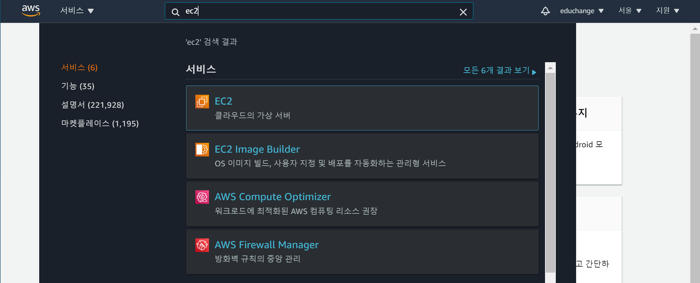

- 보안그룹 탭 이동 후 생성된 보안 그룹 ID 클릭


- 하단 화면의 인바운드 규칙 편집
  - 수신 트래픽 제어
  - EC2 접근 제어

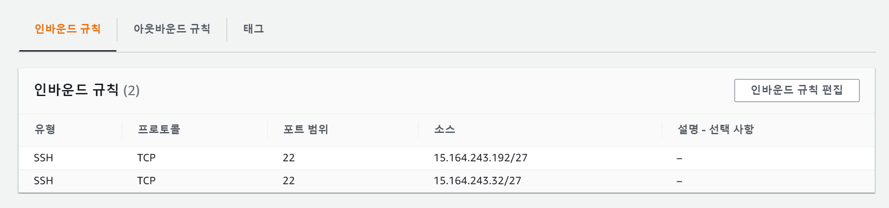

- 규칙 추가 후 저장
    - 포트 범위 - 80
    - 소스 - `0.0.0.0/0` , `::/0`

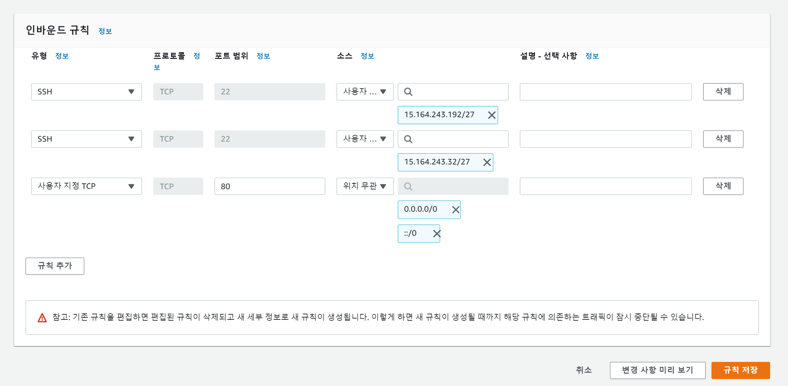

### 서버 설정

이후 내용은 cloud9 터미널에서 진행합니다.

- pyenv 설치
    - [https://github.com/pyenv/pyenv](https://github.com/pyenv/pyenv)
    - 1줄 : pyenv 설치
    - 2~5줄 : bash 설정

```bash
git clone https://github.com/pyenv/pyenv.git ~/.pyenv
echo 'export PYENV_ROOT="$HOME/.pyenv"' >> ~/.profile
echo 'export PATH="$PYENV_ROOT/bin:$PATH"' >> ~/.profile
echo 'eval "$(pyenv init --path)"' >> ~/.profile
echo -e 'if command -v pyenv 1>/dev/null 2>&1; then\n  eval "$(pyenv init -)"\nfi' >> ~/.bashrc
```

- 터미널 재시작 후 pyenv 설치 확인

```bash
pyenv -v
# 출력 확인 => pyenv 1.2.27-31-ga7f3e3a5
```

- python 설치 (프로젝트에서 사용한 버전설치)
    - global 설정 후 버전확인
    - global 명령어 사용 전에는 python 2버전 대가 찍힘

```bash
pyenv install 3.8.7
pyenv global 3.7.4
python -V
#=> Python 3.7.4
```

### project clone

루트폴더와 프로젝트폴더, 두개의 이름에 주의하며 진행
두 폴더의 이름을 통일하면 조금더 편하게 설정할 수 있음

- clone
    - home을 기준으로 진행( `cd ~` 는 홈디렉토리로 이동)

```bash
cd ~
git clone {project_remote_url}
```

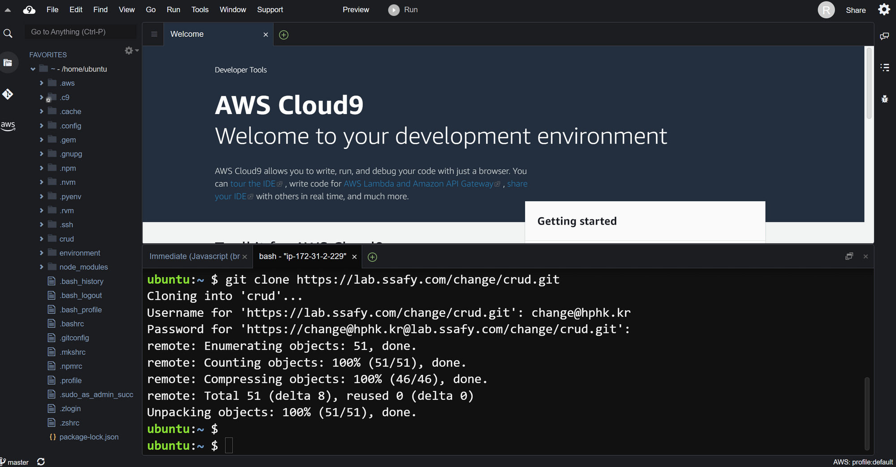

- 폴더구조
    - 프로젝트 이름은 변수처럼 사용예정 이름을 기억해주세요!
    - 루트 폴더 - 프로젝트 이름
    - 프로젝트 폴더 - 프로젝트 내 setting 들어있는 app 

```bash
home/
	ubuntu/
		{루트폴더}
			{프로젝트폴더}
			{앱}
			manage.py
			requirements.txt
```

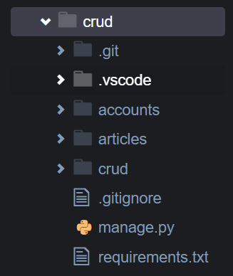

편의를 위해 루트폴더와 프로젝트 폴더의 이름을 통일하였습니다.

- 루트폴더로 이동

```bash
cd ~/{루트폴더}
```

- 가상환경생성 (가상환경이름 기억)

```bash
python -m venv venv
```

- 가상환경설정 (window와 명령어가 다름)

```bash
source venv/bin/activate
```

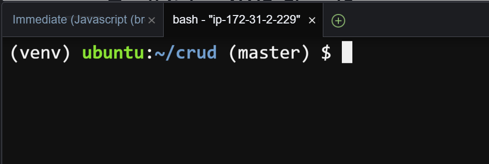

- 라이브러리 설치

```bash
pip install -r requirements.txt
```

- 마이그레이션

```bash
python manage.py migrate
```

- createsuperuser

```bash
python manage.py createsuperuser
```

- loaddata (fixture가 있는경우)

```bash
python manage.py loaddata {data.json}
```

- collectstatic
  
    - static 파일은 기본적으로 django가 직접적으로 관리 x
      
        django  앞에 있는 서버가 그 역할을 하게 됨 
        
        그것은 Nginx가 할 수 있도록 static파일을 모으는 작업을 하는 것
        
    - `[setting.py](http://setting.py)` 수정
    
        ```python
        # settings.py
        import os
        STATIC_ROOT = os.path.join(BASE_DIR, 'staticfiles')
        ```
    
    - collectstatic
    
        - staticfiles란 폴더에 137개의 static파일이 카피됨
    
        ```bash
        python manage.py collectstatic
        ```

### nginx

vim을 사용하여 터미널에서 파일을 수정

- 설치
  - apt-get 은 pip같은 역할임
    - 리눅스 시스템에서 내가 필요한 패키지를 다운로드 받을 떄 사용

```bash
sudo apt-get update
sudo apt-get install -y nginx
```

- 복사할 코드 작성
    - 아래의 코드에서 각자의 프로젝트이름에 맞게 수정 후 메모장에 입력
    - staticfiles의 경우 다른 폴더를 썼다면 이름수정
    - 코드의 역할
      - `/`(루트주소)로 들어오면 django로 가게
      - `/static/` 으로 들어오면 staticfiles 폴더로 가게

```python
server_name *.compute.amazonaws.com;

location / {
	uwsgi_pass unix:///home/ubuntu/{루트폴더}/tmp/{프로젝트폴더}.sock;
	include uwsgi_params;
}

location /static/ {
	alias /home/ubuntu/{루트폴더}/staticfiles/;
}
```

- 파일수정

  - c9 환경에서는 root folder에 접근할 수 있는 권한이 없기 때문에

    vim을 이용하여 수정을 하는 것

```bash
sudo vi /etc/nginx/sites-enabled/default
```

- vim 명령어
    - `i` 버튼으로 수정모드로 전환
    - 아래의 부분으로 방향키를 이용하여 이동
    - 수정
    - `esc` 로 수정모드 빠져나오기
    - `:wq` 명령어로 저장 후 종료
- 수정

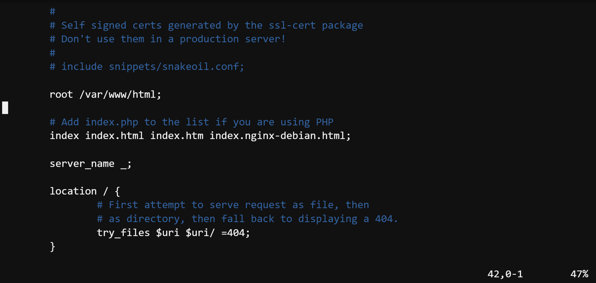

- 수정후

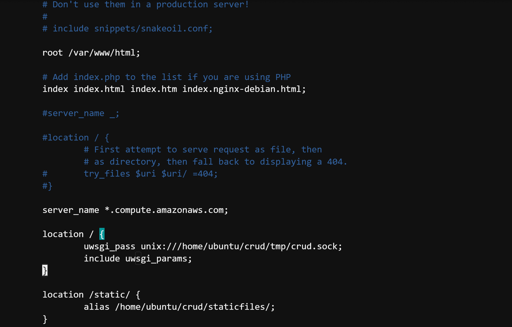

### uWSGI

- 설치

```bash
pip install uwsgi
```

- 루트 폴더 이동 (기존의 위치와 동일)

```bash
cd ~/{루트폴더}
```

- uwsgi 설정, 로그 저장할 폴더 생성 (파일트리에서 생성해도 무방)

```bash
mkdir tmp
mkdir -p log/uwsgi
mkdir -p .config/uwsgi/
```

- uwsgi 설정파일 생성 (파일트리에서 생성해도 무방)

```bash
touch .config/uwsgi/{프로젝트폴더}.ini
```

- `uwsgi.ini` 수정
  - chdir =  django 프로젝트위치
  - home = django 프로젝트 실행 환경

```bash
# {루트폴더}/.config/uwsgi/{프로젝트폴더}.ini

[uwsgi]
chdir = /home/ubuntu/{루트폴더}
module = {프로젝트폴더}.wsgi:application
home = /home/ubuntu/{루트폴더}/{가상환경이름}

uid = ubuntu
gid = ubuntu

socket = /home/ubuntu/{루트폴더}/tmp/{프로젝트폴더}.sock
chmod-socket = 666
chown-socket = ubuntu:ubuntu

enable-threads = true
master = true
vacuum = true
pidfile = /home/ubuntu/{루트폴더}/tmp/{프로젝트폴더}.pid
logto = /home/ubuntu/{루트폴더}/log/uwsgi/@(exec://date +%%Y-%%m-%%d).log
log-reopen = true
```

### daemon

- 설정파일 생성

```bash
touch .config/uwsgi/uwsgi.service
```

- `.config/uwsgi/uwsgi.service` 설정파일 수정

```bash
[Unit]
Description=uWSGI Service
After=syslog.target

[Service]
User=ubuntu
ExecStart=/home/ubuntu/{루트폴더}/{가상환경이름}/bin/uwsgi -i /home/ubuntu/{루트폴더}/.config/uwsgi/{프로젝트폴더}.ini

Restart=always
KillSignal=SIGQUIT
Type=notify
StandardError=syslog
NotifyAccess=all

[Install]
WantedBy=multi-user.target
```

- 심볼릭링크 생성

  - 바로가기 설정 정도로 이해하면 됨

```bash
sudo ln -s ~/{루트폴더}/.config/uwsgi/uwsgi.service /etc/systemd/system/uwsgi.service
```

- 등록 (아래의 명령어 모두 실행)

```bash
# daemon reload
sudo systemctl daemon-reload

# uswgi daemon enable and restart
sudo systemctl enable uwsgi
sudo systemctl restart uwsgi.service

# check daemon
sudo systemctl | grep nginx
sudo systemctl | grep uwsgi

# nginx restart
sudo systemctl restart nginx
sudo systemctl restart uwsgi
```

- nginx status

```bash
systemctl status nginx.service
```

- 80번 포트를 이미 사용중인경우 아래의 명령어 입력 후 `nginx` 재시작
    - `sudo lsof -t -i tcp:80 -s tcp:listen | sudo xargs kill`
    - Nginx는 기본설정으로 apach2 페이지를 랜더링하기 떄문에 그것을 없애는 것

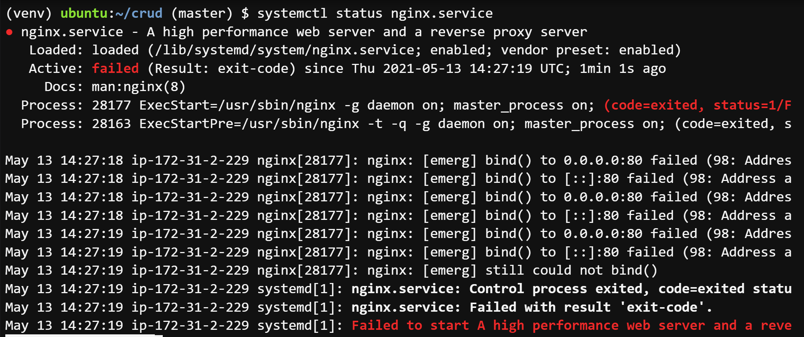

### 배포확인

- EC2 대시보드에서 퍼블릭 IP로 접속
- DisallowedHost
  - 이 화면이 뜬다면 django까지 도달한 것

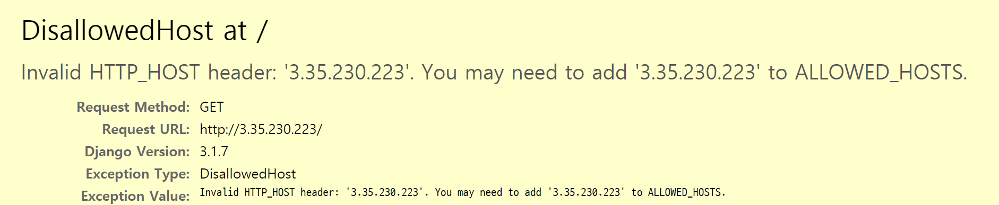

- `settings.py` 수정
    - settings.py 맨 위 쪽에 있음
    - 수정 후 `nginx` 재시작
        - sudo systemctl restart nginx
            sudo systemctl restart uwsgi

```bash
ALLOWED_HOSTS = [
    '3.35.230.223'
]
```

- 이제 제대로 작동하는 것을 볼 수 있음
  - 하지만 https 설정이 아직 안되어 있어 주소창에 주의요함 이 뜨게 됨


## DNS

> 도메인 결제 후 진행

- click 같이 끝나는 도메인은 가격이 쌈
  - 도메인이 만들어지는데 1~3일정도 소요됨

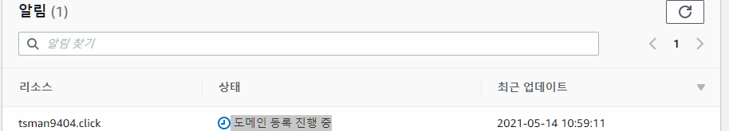


### Route53

- 레코드 생성
    - 레코드 유형 - A
    - 값 - EC2 퍼블릭IP

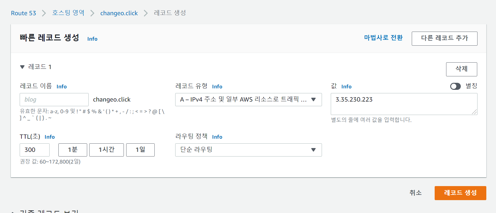

- `settings.py` 수정
    - 수정 후 `nginx` 재시작

```bash
ALLOWED_HOSTS = [
    '3.35.230.223',
    'tsman9404.click'
]
```

## HTTPS

### Let's Encrypt

[https://letsencrypt.org/ko/getting-started/](https://letsencrypt.org/ko/getting-started/)
certbot 사용을 권장

### certbot

[https://certbot.eff.org/](https://certbot.eff.org/)

- Software(nginx), System(Ubuntu) 선택 후 가이드진행

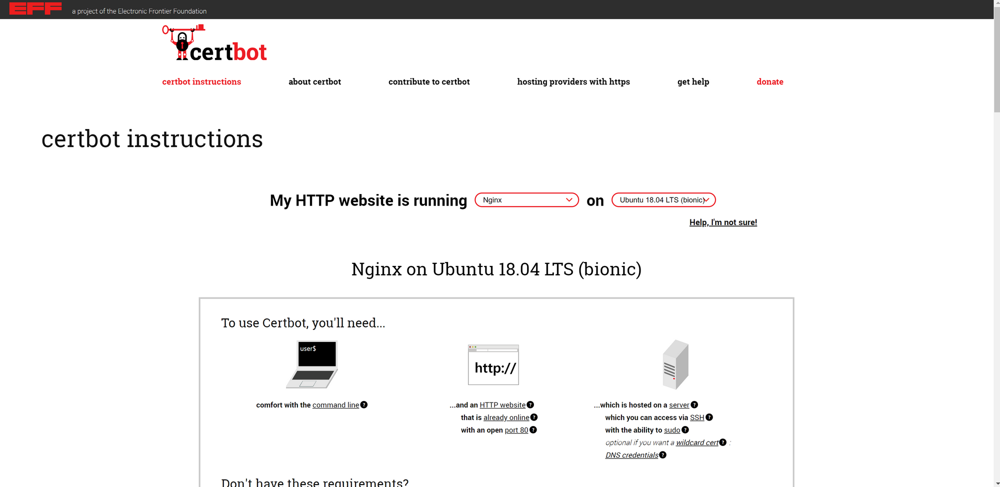

- core 설치 (EC2에 설치되어있음)

```bash
sudo snap install core; sudo snap refresh core
```

- certbot 설치

```bash
sudo snap install --classic certbot
```

- 명령어 확인

```bash
sudo ln -s /snap/bin/certbot /usr/bin/certbot
```

- 자동 설정

```bash
sudo certbot --nginx
```

- 이메일 입력

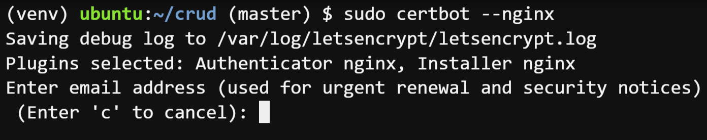

- 동의 (y입력)

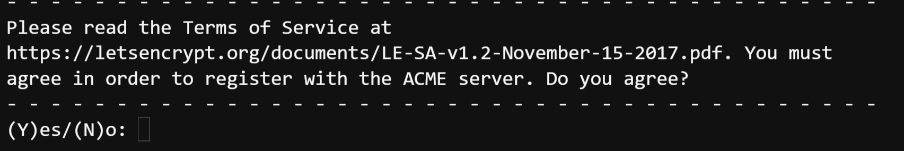

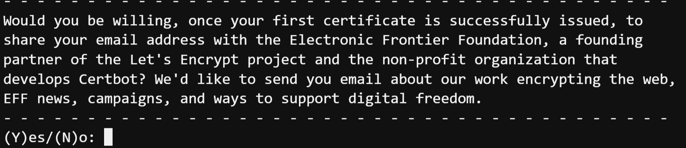

- 도메인 입력 (`http://` 를 제외하고 입력합니다.)

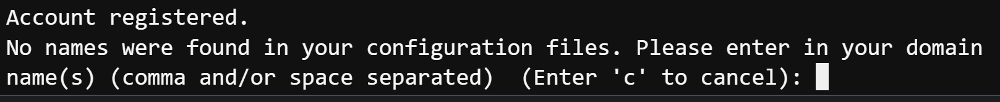

- EC2 보안그룹 탭 이동 후 생성된 보안 그룹 ID 클릭

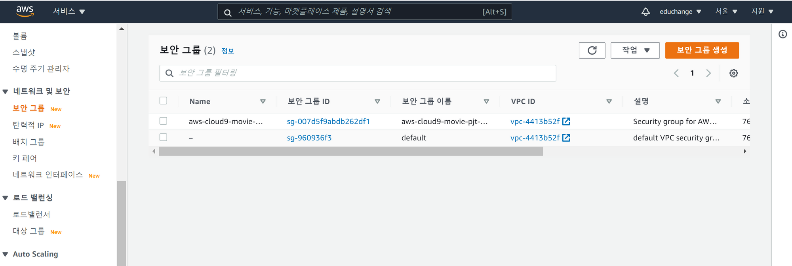

- 하단 화면의 인바운드 규칙 편집

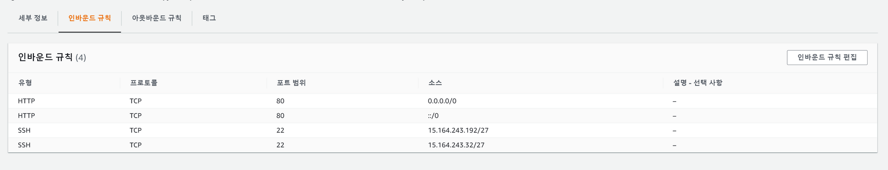
- 규칙 추가 후 저장
    - 포트 범위 - 443
    - 소스 - `0.0.0.0/0` , `::/0`

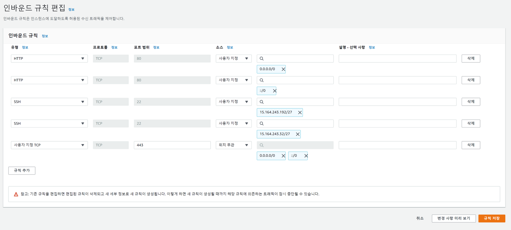
- `https://` 주소로 요청 후 확인
  - 좌물쇠 모양 생긴 것 확인


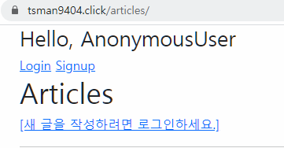


# 더 해야할 것

- settings.py 에서 
  - DEBUG = False
  -  등 수정할 작업이나 여러가지 할 것들이 많음

