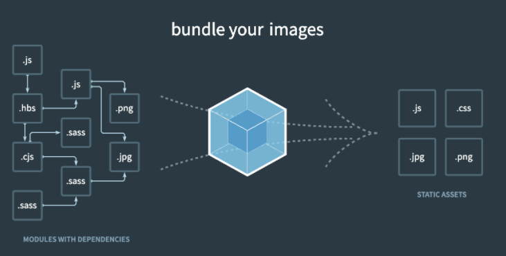
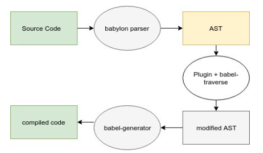

# Node.js

>  Chrome V8 Javascript 엔진으로 빌드된 Javascript **런타임**(프로그래밍 언어가 구동되는 환경)


## 설치

- 운영체제 별로 설치파일을 다운받으면 된다. [Nodejs.org 사이트](https://nodejs.org/ko/)에서 노드 최신 버전을 설치
- 두 가지 버전을 선택하여 설치할 수 있다. 왼쪽 짝수 버전, 오른쪽이 홀수 버전이다. 안정적이고 장기간 지원하는 것이 짝수 버전이고, 불안정할 수 있지만 최신 기능을 지원하는 것이 홀수 버전이다. 
  - 짝수 버전: 안정적, 신뢰도 높음 (LTS)
  - 홀수 버전: 최신 기능
- 버튼을 몇 번 클릭하면 아래 경로에 Node.js 와 NPM이 설치된다.(운영체제에 따라 경로는 다를 수 있다)
  - Node.js: `/usr/local/bin/node`
  - NPM: `/usr/local/bin/npm`


## npm 의 버전관리- package.json

1. 특정 버전 사용 경우

```
1.2.3
```


2. 특정 버전보다 높거나 낮을 경우는 다음과 같이 명시

```
>1.2.3
>=1.2.3
<1.2.3
<=1.2.3
```


3. 틸드(~)와 캐럿(^)을 이용해 범위를 명시
   - 틸트(~)
     - 마이너 버전이 명시되어 있으면 패치버전만 변경한다. 예를 들어 ~1.2.3 표기는 1.2.3 부터 1.3.0 미만 까지를 포함한다. 마이너 버전이 없으면 마이너 버전을 갱신한다. ~0 표기는 0.0.0부터 1.0.0 미만 까지를 포함
   - 캐럿(^)
     - 정식버전에서 마이너와 패치 버전을 변경한다. 예를 들어 ^1.2.3 표기는 1.2.3부터 2.0.0 미만 까지를 포함한다. 정식버전 미만인 0.x 버전은 패치만 갱신한다. ^0 표기는 0.0.0부터 0.1.0 미만 까지를 포함

```
~1.2.3
^1.2.3
```


# 웹팩

> 웹팩이란 최신 프런트엔드 프레임워크에서 가장 많이 사용되는 모듈 번들러(Module Bundler)

- 모듈 번들러란?

  - 웹 애플리케이션을 구성하는 자원(HTML, CSS, Javscript, Images 등)을 모두 각각의 모듈로 보고 이를 조합해서 병합된 하나의 결과물을 만드는 도구를 의미

  



## 모듈이란?

- 모듈이란 프로그래밍 관점에서 특정 기능을 갖는 작은 코드 단위를 의미
  - 성격이 비슷한 기능들을 하나의 의미 있는 파일로 관리하면 모듈이 됩니다.

- 웹팩에서의 모듈
  - 자바스크립트 모듈에만 국한되지 않고 웹 애플리케이션을 구성하는 모든 자원을 의미
  - HTML, CSS, Javascript, Images, Font 등 많은 파일들이 필요하죠. 이 파일 하나하나가 모두 모듈


## 웹팩이 등장한 이유

1. 파일 단위의 자바스크립트 모듈 관리의 필요성
   - javascript의 변수의 유효범위는 기본적으로 전역 범위를 가지기 때문에 복잡한 애플리케이션을 개발할 경우, 변수의 중복선언이나 의도치 않은 값 할당으로 문제가 발생함
   - 이처럼 파일 단위로 관리하고 싶은 욕구, 자바스크립트 모듈화에 대한 욕구를 이전까지는 AMD, Common.js의 라이브러리들을 이용하여 풀어왔음
2. 웹 개발 작업 자동화 도구 (Web Task Manager)
   - 웹 서비스를 개발하고 웹 서버에 배포할 때 아래와 같은 작업들을 해야 했습니다.
     - HTML, CSS, JS 압축
     - 이미지 압축
     - CSS 전처리기 변환
   - 이러한 일들을 자동화 해주는 도구들이 필요했습니다. 그래서 Grunt와 Gulp 같은 도구들이 등장
3. 웹 애플리케이션의 빠른 로딩 속도와 높은 성능
   - 특정 웹 사이트를 접근할 때 5초 이내로 웹 사이트가 표시되지 않으면 대부분의 사용자들은 해당 사이트를 벗어나거나 집중력을 잃게되어 웹 사이트의 로딩 속도를 높이기 위해 많은 노력들을 해옴
     - 브라우저에서 서버로 요청하는 파일 숫자를 줄이는 것 - 태스크 매니저를 이용해 파일들을 압축하고 병합하는 작업들을 진행
     -  초기 페이지 로딩 속도를 높이기 위해 나중에 필요한 자원들은 나중에 요청하는 레이지 로딩(Lazy Loading)이 등장
   - 웹팩은 기본적으로 필요한 자원은 미리 로딩하는게 아니라 그 때 그 때 요청하자는 철학을 가지고 있음


## 웹팩으로 해결하는 문제들

- 웹팩에서 해결하고자 하는 기존의 문제점 3가지
  1. 자바스크립트 변수 유효 범위
     - ES6의 Modules 문법과 웹팩의 모듈 번들링으로 해결
  2. 브라우저별 HTTP 요청 숫자의 제약
     - 웹팩을 이용해 여러 개의 파일을 하나로 합치면 위와 같은 브라우저별 HTTP 요청 숫자 제약을 피할 수 있습니다
  3. Dynamic Loading & Lazy Loading 미지원
     - Require.js와 같은 라이브러리를 쓰지 않으면 동적으로 원하는 순간에 모듈을 로딩하는 것이 불가능 했습니다. 
     - 그러나 이젠 웹팩의 Code Splitting 기능을 이용하여 원하는 모듈을 원하는 타이밍에 로딩할 수 있습니다.


## 로더와 플러그인

- 로더 - 웹팩은 모든 파일을 모듈로 바라본다
  - 로더는 타입스크립트 같은 다른 언어를 자바스크립트 문법으로 변환해 주거나 이미지를 data URL 형식의 문자열로 변환한다. 뿐만아니라 CSS 파일을 자바스크립트에서 직접 로딩할수 있도록 해준다.
- 플러그인 
  - 로더가 파일 단위로 처리하는 반면 플러그인은 번들된 결과물을 처리한다. 번들된 자바스크립트를 난독화 한다거나 특정 텍스트를 추출하는 용도로 사용


# Babel

> 브라우져마다 사용하는 언어가 달라서 프론트엔트 코드는 일관적이지 못할 때 ( 크로스 브라우징)을 해결해주는 역할

- 바벨(Babel)은 여러 자바스크립트 표준에 맞추어 코드를 자동으로 변환해주는 트랜스파일러로 코드를 직접 바꾸지 않더라도 최신 표준에 맞추어 개발 할 수 있도록 도와준다


## 크로스 브라우징

- 크로스 브라우징
  - Cross Browsing이란 적어도 표준 웹 기술을 채용하여 다른 기종 혹은 플랫폼에 따라 달리 구현되는 기술을 비슷하게 만듦과 동시에 어느 한쪽에 최적화되어 치우치지 않도록 공통 요소를 사용하여 웹 페이지를 제작하는 기법을 말하는 것
- 크로스 브라우징이 필요한 원인
  - 브라우저마다 랜더링 엔진이 다름
- IE를 버전마다 크로스 브라우징 하는 이유
  - 최신버전으로 자동 업데이트가 되는 브라우저는 많으나 IE는 해당되지 않는다.
  - IE는 사용자가 직접 업데이트를 진행해야하며, 윈도우 버젖ㄴ에 따라 최대 버전이 한정되어있다.


## 바벨의 동작과정

1. 파싱(Pharsing)

   - 바벨은 먼저 소스 코드를 가지고 추상적인 형태의 코드로 변환하는 과정을 수행, 이를 바벨에선 파싱(*Parsing*)이라 표현
   - 추상구문트리(**AST**: Abstract Systax Tree) 
     - 바벨이 변환한 추상화된 코드의 표현체
     - 이 트리는 소스코드의 각 구문과 각 코드간의 관계를 모두 서술

2. 변환(Transformation)

   - 추상구문트리를 받아와 각 브라우저의 환경에 맞는 결과로 변환하는 작업을 수행하고 새로운 추상구문트리를 만들어냄
   - 바벨의 플러그인 중 *preset/plugin* 에 의해 처리되는 곳
     - *preset* 은 *plugin* 들을 모아놓은 배열
   - 이 플러그인들은 babel-traverse 를 이용해 원본 추상구문트리를 가로질러가는(traverse) 과정 속에서 각 부분들이 어떻게 바뀌고 어떻게 정의되어야하는지를 기록함

3. 코드생성(Generation)

   - 2단계에서 생성된 새로운 추상구문트리를 바탕으로 실제 브라우저 환경에 맞는 소스코드로 변환하는 과정이 이뤄집니다.

     




# ESLint와 Prettier

- ESLint

  - 느슨한 형식의 언어인 Javascript에서는 코드 에러가 자주 발생하고, 에러를 찾기 위해서는 코드를 직접 실행해서 확인이 가능하기 때문에 이를 도와주는 것이 Linter
  - Linter는 코드를 정적으로 분석하기 때문에, 프로그램을 실행하지 않고도 코딩 컨벤션에 위배되는 코드나 안티 패턴을 자동으로 검출해줍니다. 추가적으로 간단한 코드 포맷팅 기능도 있습니다.
  - 즉, 논리적인 코드를 알려주는 역할

- Prettier

  - 코드 포맷터

  - ex. 필요없는 공백 제거, 작은 따옴표를 큰 따옴표로 바꾸어 준다던가…
  - 즉, 논리적인 코드는 고치지 않는다. 오직 포맷팅만 해준다.

- eslint-config-prettier

  - ESLint와 Prettier을 둘다 사용할 경우 서로 충돌할 수 있다. 이를 방지하기 위해 eslint-config-prettier은 Prettier와 충돌하는 ESLint 규칙을 끄는 역할을 한다.

- eslint-plugin-prettier

  - 프리티어 규칙을 ESLint 규칙으로 추가하는 플러그인이다. 프리티어의 모든 규칙이 ESLint로 들어오기 때문에 ESLint만 실행하면 된다.

