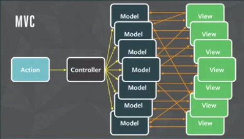
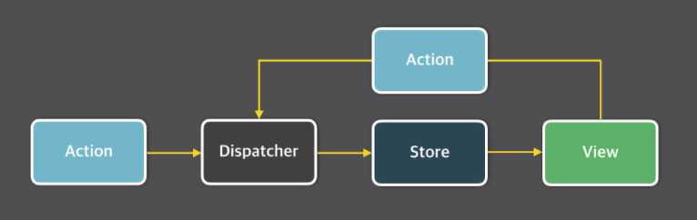
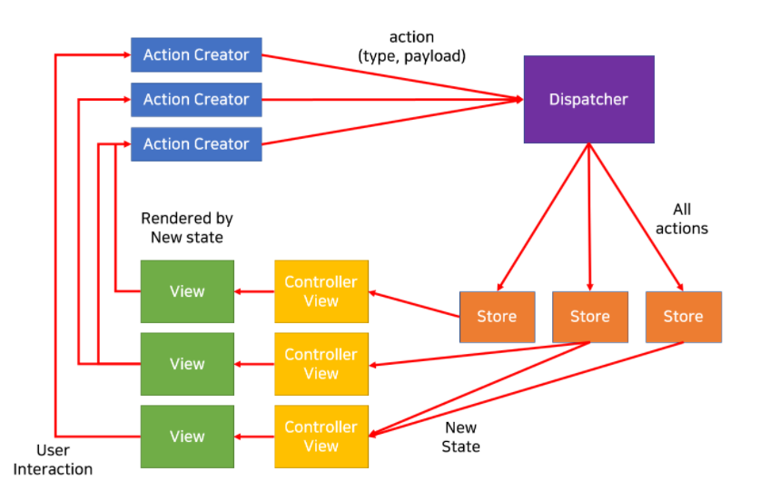

- 왜 전역 상태관리가 필요한가?
  - 화면이 복잡해지게되면 컴포넌트 간의 상태 교환도 복잡해지기 때문에 관리가 어려워진다.
  - 그래서 전역적으로 상태를 관리하여 더 편하게 관리 할 수 있게 한다.
- 상태관리 라이브러리들의 종류
  1. Context API
     - 리액트 내장 라이브러리
  2. Redux
     - 가장 많이 사용되고 있는 대표적인 상태관리 라이브러리
  3. Mobx
     - 객체지향에 초점을 두고 있는 라이브러리
  4. Recoil
     - react를 만들어낸 facebook 이 공식으로 만들고 있는 상태관리 라이브러리


# 상태란 무엇인가?

> `State`는 컴포넌트 안에서 관리 되고 시간이 지나면서 바뀌는 동적인 데이터다.


- 리액트의 상태
  - 범위
    - 지역상태 - 자신의 컴포넌트에만 영향을 미침
    - 전역상태 - 많은 컴포넌트에 영향을 미침
  - 역할
    - UI 상태 -  어플리케이션의 인터렉티브한 부분을 컨트롤
    - 서버 캐싱 상태 - 서버로부터 데이터를 가져와 캐싱
    - Form 상태 -Form의 로딩, Submitting, disabled, validation 등등 데이터를 다룸
    - URL 상태 - 브라우저에 의해서 관리되고 새로고침해도 변함 없음 
    - ...


## Flux 구조란?

- MVC 모델의 한계
  - 기존의 UI 상태관리는 MVC(Model-View-Controller)모델을 써서 관리를 하였는데,
    Model과 View 와 양방향 데이터흐름을 가지고 있고 모델의 상태가 바뀌면 뷰가 바뀌고, 뷰가 바뀌면 모델을 바뀌는 조작을 Controller가 하는 방식이다.
  - 이런 양방향 데이터흐름은, UI 인터렉션이 많아짐에 따라 관리가 불가능한 구조가 되어버렸다.


- Flux 구조란?

  - 단방향 데이터 흐름을 가지는 구조이다.
    - 이 흐름에 의해 `상태의전이현상`(뷰와 모델 사이의 데이터 변경이 연결된 수많은 곳으로 따라 변경되는 현상)을  없애주고, 데이터를 `예측가능`하게 해준다.

  - 데이터의 흐름은 dispatcher => store => view 순서 이며 
    view 에서 입력이 발생하면 action을 통해서 dispatcher로 향하게 됩니다.





**Dispatcher **

- Flux 어플리케이션의 모든 데이터 흐름을 관리하는 일종의 허브 역할
  - action 발생 > dispatcher를 통해  > store로 전달
- 모든 action들을 받아서 의존성을 적절히 처리해준 다음 모든 store에게 넘긴다.
  - 모든 store가 모든 action 을 받는것!


**Action Creator **

- 기존 상태를 변경하기 위한 액션의 생성을 담당하며, 해당 액션을 생성해서 디스패쳐에 넘겨준다.


**Action**

- action의 구성
  - `type` : 어떤 행위 인가?
  - `payload` : 그 행위로부터 넘겨 받을 값? 

- 이전의 상태를 새로운 상태로 바꾸는 행위이다.


**Store**

- 상태를 저장하는 공간이다.
- 모든 상태 변경은 스토어에 의해 결정되며, 상태변경을 위한 요청은 직접하지 못하고  dispatcher를 통해야한다.
- 모든 action을 dispatch에 의해서 받은 store는, 
  - 우선, 모든 액션을 받은 후 액션을 처리할지 말지 결정하고,
  - 이후, 상태값을 변경하고 자신에게 연결된 View Controller에게 변경 사실을 알린다.


**View Controller 와 View**

- Controller View는 화면에 나타나는 자식 뷰들과 스토어를 연결하는 매개체
- View는 Controller View에게 변화된 상태를 받고 그 상태에 따라 다시 랜더링 됨





### 동작방식

**준비과정 **

1. 스토어(store)가 디스패처(dispatcher)에게
   "액션 생성자(the action creator)한테 액션 메시지가 오면 알려줘!"

   라고 말해둔다.

2. 그 다음 컨트롤러 뷰(the controller view)는 스토어(store)에게
   "현재 보여줘야하는 최신 상태(state)가 뭐야?"
   라고 묻는다.
   그럼 스토어(store)는 컨트롤러 뷰(the controller view)에게
   "이게 최신 상태(state)야!"
   라는 답과 함께 상태(state)를 전해주고,

3. 상태를 전달받은 컨트롤러 뷰(the controller view)는 이 상태를 렌더링 하기 위해 모든 자식 뷰(the view)에게
   "이게 현재 최신 상태(state) 니까 rendering 해!"
   라고 말하며 상태를 넘겨준다.

4. 마지막으로 컨트롤러 뷰(the controller view)는 스토어(store)에게
   "상태(state)가 바뀌면 또 알려줘야 돼!"
   라고 다시 부탁한다.


**데이터 흐름(data flow)**

0. 사용자의 입력이 들어온다.

1. **뷰(view)**는 **액션 생성자(the action creator)** 에게
   **"사용자한테 입력 들어왔어! 액션 준비해!"**
   라고 말하며,
   사용자에게 들어온 액션을 **액션 생성자(the action creator)** 에게 넘겨준다.

   - 뷰 : 액션생성자야 액션 준비해라

2. **액션 생성자(the action creator)**는 액션을 포맷에 맞게 가공 한 다음,
   **디스패처(dispatcher)**에게 넘겨준다.

   - 액션생성자 : 디스패처야 액션 받아라

3. **디스패처(dispatcher)**는 들어온 액션의 순서에 따라 액션을 **스토어(store)**로 보낸다.
   각 **스토어(store)**는 모든 액션을 받게 되지만 필요한 액션 만을 골라 상태(state)를 필요에 맞게 변경한다.

   - 디스패처: 스토어야 액션왔다 받아라!
   - 스토어: (내가 쓸것만 골라야지)

4. 상태(state) 변경이 완료되면 **스토어(store)**는 자신을 구독(subscribe) 하고 있는 **컨트롤러 뷰(the controller view)**에게 그 사실을 알린다.

   - 스토어: 컨트롤러 뷰! 상태 바꼈어!

5. 연락을 받은 **컨트롤러 뷰(the controller view)**들은 **스토어(store)**에게 변경된 상태를 요청하고, **스토어(store)**는 상태(state)를 **컨트롤러 뷰(the controller view)**에게 전달한다.

   - 컨트롤러 뷰: 상태 바꼈어? 알겠어, 그럼 바뀐 상태 줘!
   - 스토어: 여기있어, 바뀐 상태!

6. **스토어(store)**에게 새로운 상태(state)를 전달받은 **컨트롤러 뷰(the controller view)**는 자신 아래의 모든 **뷰(the view)**에게 새로운 상태(state)에 맞게 렌더링(re-rendering) 하라고 알린다.

   - 컨트롤러 뷰: 이게 변경된 상태 부분이니까 이부분 변경해!

     


## 사용 방법

1.  Context 만들고 꺼내쓸 수 있도록 export
    - createContext 메서드는 Context의 Consumer와 Provider를 생성해줌
      - Consumer : context와 연결해주는 역할
      - Provider 
        - redux의 store와 비슷한 역할
        - Context의 Provider는 여러 개를 생성하여 사용할 수 있음
        - value로 넘겨준 상태를 state로, 업데이트 함수를 actions로 묶어서 전달함

```js
export const context명 = React.createContext(초기값);
```

2. 공유하려는 컴포넌트들의 최상단 컴포넌트에 context 를 import 하고,context.provider를 이용하여 컴포넌트들 감싸주기
   - value : Context 의 값 지정
   - react가 해당 context object를 구독하고 있는 컴포넌트를 render할 때 context value를 가장 가까운 provider에서 찾게되는데, provider가 존재하지 않을 경우, createContext에서 정했던 default값이 적용됨

```js
import { context명 } from './context';

const App = () => {
    return (
    	<context명.Provider value={ 값 }>
        ...
        </context명.Provider>
    )
}
```


3. 하위 컴포넌트에서 App 컴포넌트에서 생성한 Context object를 import한 후, 

   useContext를 이용하여 value를 가져옴

   - 혹은 `<context명.Consumer>` 로 감싸줌
   - useContext 를 사용하면, consumer와 provider가 React 컴포넌트이기 때문에 생기는 wrapper hell을 consumer만이라도 줄일 수 있다.(provider는 그대로)

```js
import { context명 } from './context';

// useContext 사용x
const ColorBox = () => {
    return (
    	<context명.Consumer>
        	...내용
        </context명.Consumer>
    )
}

혹은
// useContext 사용o
const ColorBox = () => {
    const 담을곳 = useContext(context명);
    return (
    	<>
        	...내용
        </>
    )
}
```


