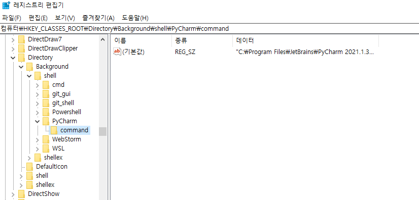
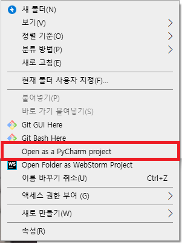

### 1. 레지스트리 편집기 열기

- `win+R` 윈도우 실행창
- regedit 입력
- 레지스트리 편집기를 켜기

### 2. 등록 위치 찾기

- `Computer\HKEY_CLASSES_ROOT\Directory\Background\shell`
  - 디렉토리를 편집기에 입력

### 3. 등록하기

- shell 폴더 오른쪽 버튼 > 새로만들기 > 키

  - 새 항목 이름 : PyCharm
  - 오른쪽에 (기본값) 되어있는 부분 클릭
    - 데이터 : Open Folder as PyCharm Project 로 변경
    - 이 부분은 폴더에서 오른쪽 버튼을 눌렀을 떄 나오는 메뉴 내용을 말함

- PyCharm 폴더 오른쪽 버튼 > 새로만들기 > 키

  - 새 항목 이름 : command

  - 오른쪽에 (기본값) 되어있는 부분 클릭

    - 데이터 : ` "d:\JetBrains PyCharm 2020.1.1\bin\pycharm64.exe" "%V"`

    - 이것은 win > PyCharm 검색 > PyCharm 오른쪽키 - 파일위치 열기 > PyCharm 오른쪽 키 - 파일속성 > 대상 부분 내용

    - 에다가 "%V" 붙여준 것

      

### 확인

- 아이콘도 등록 해줄수 있지만 굳이 귀찮으니 패스

