**[실습목표]**


- 실습 1번 목표(AllinOne)

  - EC2 의 접근을 CloudFront > ALB 를 통해 하도록 만들기

- 실습 2번 목표

  - 워드프레스에 대한 설정정보는 내부에 두게 되면 인스턴스 증가나 감소시에 다른 DB를 사용하여 내용이 불일치 되는 것을 방지하기 위해 EFS를 이용해 정보를 보관하여 통일성을 유지할 수 있도록 하기

  - 서버의 부하도를 줄이기 위해  필요한 자료의 업로드는 S3 bucket을 이용
  - RDS를 이중화 하여 장애에 대비

- 실습3

  - 오토스케일링 테스트


# 실습전 환경배포

- CloudFormation 실습 기본 환경 배포
  - https://console.aws.amazon.com/cloudformation/home?region=ap-northeast-2#/stacks/new?stackName=WPHALab&templateURL=https:%2F%2Fs3.ap-northeast-2.amazonaws.com%2Fcloudformation.cloudneta.net%2FWordpress%2Faws-wp.yaml


# 실습1

- cloudFront는 CloudFormation 을 통해 이미 구성되어있음


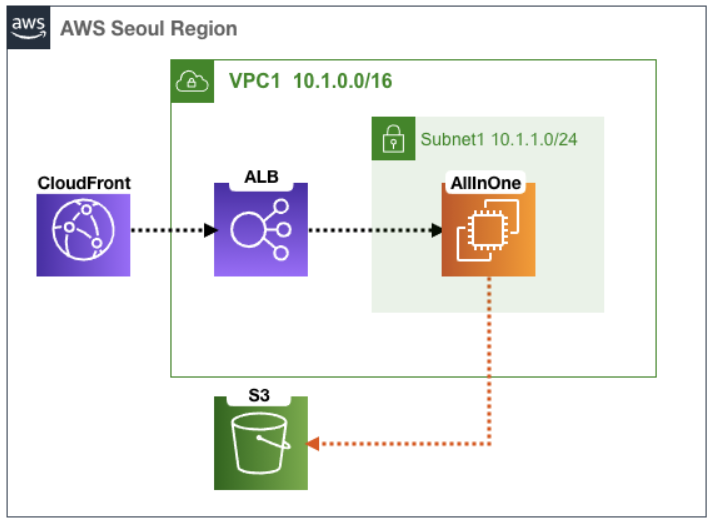


## cloudFormation을 통해 만들어진 것 정보 확인

- CloudFront 정보 확인
  - Distribution domain name 을 통해서 우리는 접근하게 됨


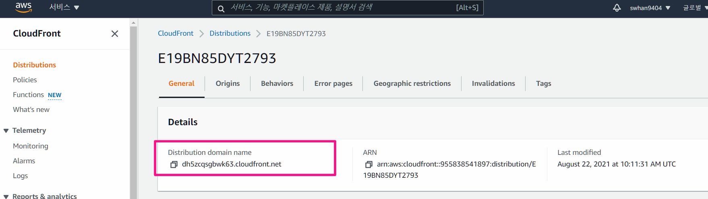


- EC2 
  - IAM Role : S3 FullAccess로 되어있음

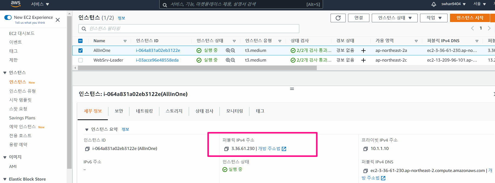


- 로드밸런서( EC2 - 로드밸런싱 - 대상그룹 )
  - AllinOne EC2 와 cloudFront 에 연결되어 있음


## cloudFront로 EC2 접근하기

1. EC2의 public IP를 이용해 접근해보기
   - 워드프레스 설정을 마치고, 워드프레스 설치
2. 워드프레스 주소 바꾸기
   - 설정 > 워드프레스 주소, 사이트 주소 를 cloudFront의 Distribution domain name 로 변경
   - 주소를 쓸 때 https 는 따로 보안절차를 만들어야해서, http로 하기
3. 이렇게 변경 이후에는 홈페이지 접근을 cloudFront 주소를 통해서 접속하게 됨


## EC2 

1. EC2 를 xshell로 접근 후 폴더 내용 확인

```shell
# 업로드 폴더로 이동
cd /var/www/html/wp-content/uploads

# 업로드 폴더 정보 확인
[root@AllInOne uploads]# tree
.
└── 2021
    └── 08
```

2. 워드프레스 홈페이지(cloudFront 주소로)로 들어가서, 글하나 작성하기(사진과 함께)
   - 사진파일이 여러 크기로 저장되는 것을 확인할 수 있음(썸네일 용도)

```shell
# 업로드 폴더 정보 확인
[ec2-user@AllInOne uploads]$ tree
.
└── 2021
    └── 08
        ├── 2-1024x738.png
        ├── 2-150x150.png
        ├── 2-300x216.png
        ├── 2-768x554.png
        └── 2.png

2 directories, 5 files

```


3. 저장 장소를 S3로 바꾸기 위해 플러그인 다운
   - 워드프레스 → 플러그인 → 새로 추가 → 키워드 WP Offload Media Lite 검색 → 지금 설치 클릭 ⇒ 활성화 클릭 → 설정 클릭

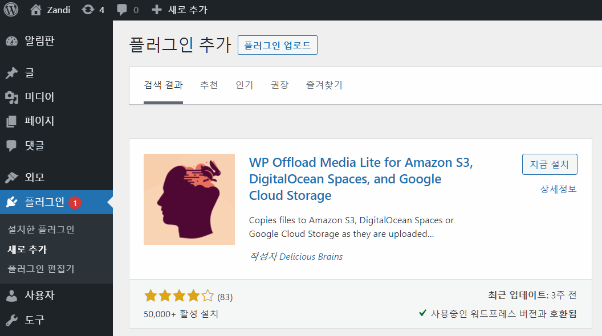


4. 설정 - Offload Media Lite - Amazon S3 설정
   - My server is on Amazon Web servies and I'd like to use IAM Roles 선택 후 다음
   - create New bucket 클릭
     - Region : Seoul
     - name : zandi123 하고 bucket 생성 클릭
   - ADVANCED OPTIONS 의 Remove Files From Server 를 ON 으로 변경
     - EC2 서버 내에 파일을 사용하지 않겠다는 설정 


5. 다시 새로운 글을 그림 넣어서 작성해보기
   - 이미지의 링크를 확인해보면 S3 버킷으로 연결되어 있음을 확인할 수 있음
6. EC2 를 xshell로 접근 후 폴더 내용 다시 확인
   - 방금 전 글에 해당하는 내용은 EC2 내에는 저장되지 않았음을 확인할 수 있음

```shell
# 업로드 폴더 정보 확인
[ec2-user@AllInOne uploads]$ tree
.
└── 2021
    └── 08
        ├── 2-1024x738.png
        ├── 2-150x150.png
        ├── 2-300x216.png
        ├── 2-768x554.png
        └── 2.png

2 directories, 5 files


# aws s3 내용 확인하기 
[ec2-user@AllInOne uploads]$ aws s3 ls s3://zandi123 --recursive
2021-08-22 12:44:35      60389 wp-content/uploads/2021/08/22214434/js-1024x576.jpg
2021-08-22 12:44:35      11344 wp-content/uploads/2021/08/22214434/js-150x150.jpg
2021-08-22 12:44:36     100432 wp-content/uploads/2021/08/22214434/js-1536x864.jpg
2021-08-22 12:44:36     104002 wp-content/uploads/2021/08/22214434/js-1568x882.jpg
2021-08-22 12:44:35      13452 wp-content/uploads/2021/08/22214434/js-300x169.jpg
2021-08-22 12:44:35      41375 wp-content/uploads/2021/08/22214434/js-768x432.jpg
2021-08-22 12:44:35     375210 wp-content/uploads/2021/08/22214434/js.jpg


```


## S3 버킷 외부 다운로드 설정

> 사용자들이 해당 파일을 다운로드 할 수 있게 설정

- 권한 → 버킷 정책 → 편집 : 아래 버킷이름을 자신의 버킷 이름으로 변경 입력 후 하단 변경 사항 저장 클릭

```json
{
  "Version": "2012-10-17",
  "Statement": [
    {
      "Sid": "PublicReadGetObject",
      "Effect": "Allow",
      "Principal": "*",
      "Action": [
        "s3:GetObject"
        ],
      "Resource": [
        "arn:aws:s3:::자신의버킷이름/*"
        ]
    }
  ]
}
```


## 다음 실습을 위해 정리

1. AllInOne 인스턴스 중지
2. S3 버킷 초기화 : S3 버킷 → 비어 있음 → 영구 삭제 입력 → 비어 있음 클릭 → 종료 클릭


# 실습2

- 실습목표

  - 워드프레스에 대한 설정정보는 내부에 두게 되면 인스턴스 증가나 감소시에 다른 DB를 사용하여 내용이 불일치 되는 것을 방지하기 위해 EFS를 이용해 정보를 보관하여 통일성을 유지할 수 있도록 하기

  - 서버의 부하도를 줄이기 위해  필요한 자료의 업로드는 S3 bucket을 이용
  - RDS를 이중화 하여 장애에 대비
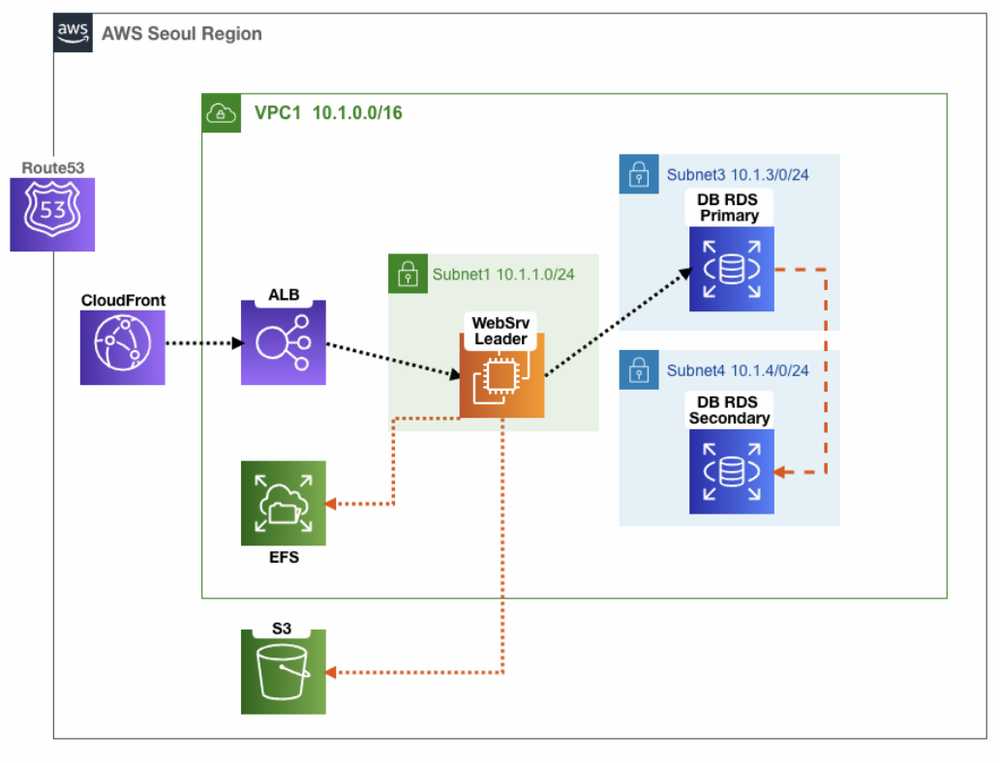


## RDS 구성

1. RDS 만들기(RDS -> 데이터베이스 생성 클릭)
   - 생성 방식 : 표준 생성
   - 엔진 옵션 : MySQL
   - 템플릿 : 개발/테스트
   - DB 인스턴스 식별자 : wpdb (현재 AWS 리전에서 AWS 계정이 소유하는 모든 DB 인스턴스에 대해 유일, 각자 편하게 설정)
   - 마스터 사용자 이름 : root
   - 마스터 암호(암호확인) : qwe12345
   - DB 인스턴스 클래스 : 버스터블 클래스(t 클래스 포함) db.t2.micro (이전 세대 클래스 포함)
   - 다중 AZ 배포 : 대기 인스턴스 생성 
   - VPC : WP-VPC1
   - 퍼블릭 액세스 가능 : 아니요
   - VPC 보안 그룹 : ##-VPC1SG3-## 포함된것 선택 , 기본 default 는 제거
     - DB 접근을 위해 TCP 포트를 열어놓는 정책
   - 추가 구성 : 클릭
     - 초기 데이터베이스 이름 : wordpressdb
     - DB 파라미터 그룹 : ##-mydbparametergroup-## 포함된것 선택 
     - 백업 보존 기간 : 1일
     - Enhanced 모니터링 활성화 (Uncheck)
2. 이러고 나면 데이터베이스 생성 12분 정도 소요 -> 백업본생성에 4분 정도 소요)
3. 설정확인하기
   - RDS의 endpoint 주소 저장해두기
     - wpdb.ckm3nprg4gom.ap-northeast-2.rds.amazonaws.com
   - 구성 탭에서
     - 다중AZ 가 예로 되어 있는지 확인
     - 보조 영역이 ap-northeast-2a 임을 확인
     - 메인의 리전 및 AZ가 보조영역과 다른 것도 확인

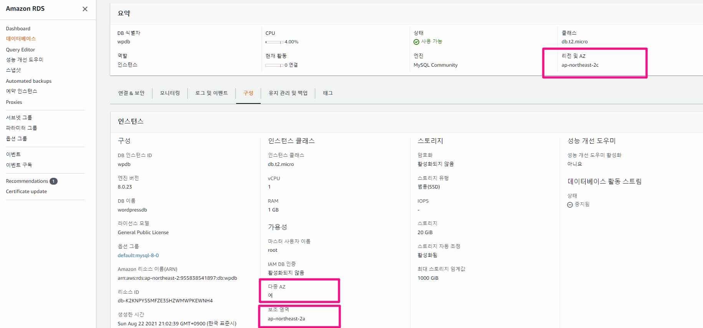


## ALB와 RDS 연결

1. EC2 > 대상그룹 > ALB-TG 클릭 > 타겟 탭에서 타겟 등록하기 클릭 

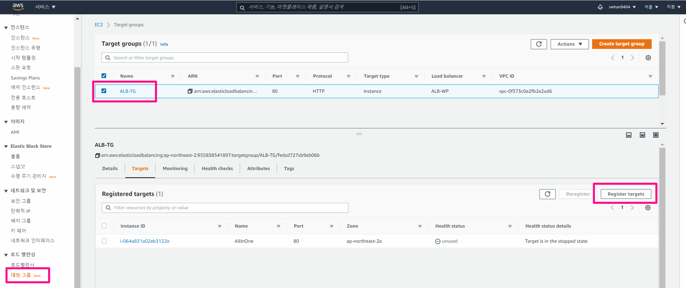


2. WebSrv EC2를 등록하기

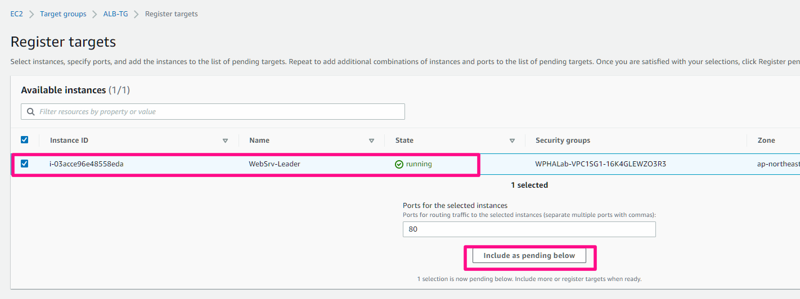


3. Xshell으로 WebSrv Leader EC2 접속해서, 확인

```shell
# 관리자 권한으로 변경
sudo su -

# EFS 파일시스템 마운트 확인
[ec2-user@WebSrv-Leader ~]$ df -hT |egrep '(File|nfs)'
Filesystem                                     Type      Size  Used Avail Use% Mounted on
fs-467ff326.efs.ap-northeast-2.amazonaws.com:/ nfs4      8.0E   66M  8.0E   1% /var/www/wordpress

# EFS 접근되는지 확인-wordpress 파일을 출력하기
[root@WebSrv-Leader ~]# tree -L 1 /var/www/wordpress/
/var/www/wordpress/
├── index.php
├── license.txt
├── load.php
├── readme.html
├── wp-activate.php
├── wp-admin
├── wp-blog-header.php
├── wp-comments-post.php
├── wp-config.php
├── wp-config-sample.php
├── wp-content
├── wp-cron.php
├── wp-includes
├── wp-links-opml.php
├── wp-load.php
├── wp-login.php
├── wp-mail.php
├── wp-settings.php
├── wp-signup.php
├── wp-trackback.php
├── xff.php
└── xmlrpc.php


# RDS 엔드포인트를 변수에 지정
RDS=wpdb.ckm3nprg4gom.ap-northeast-2.rds.amazonaws.com

# 현재 위치 확인
grep -n DB_HOST /var/www/wordpress/wp-config.php

# wp-config.php 파일에 DB 주소를 RDS 엔드포인트로 설정
sed -i "s/localhost/$RDS/g" /var/www/wordpress/wp-config.php


# DB 접속 테스트
mysql -h $RDS -uroot -pqwe12345 -e 'show databases;'
mysql -h $RDS -uroot -pqwe12345
exit

# dig 조회 > RDS의 주소
dig +short $RDS
```


## EC2 에 워드클라우드 설치

1. CloudFront 주소로 접근 후 WordPress 설치하기

   - ALB와 WebSrv-Leader 를 연결했고, ALB와 cloudFront는 이미 연결되어 있기 때문에 WebSrv-Leader로 접근됨

2. WordPress 설정 > 워드프레스 주소, 사이트 주소를 CloudFront 주소로 바꾸기(http로)

   - CloudFront의 Origin 탭에 있는 elb 라는 Origin name의 내용을 확인해보면 HTTP만 허용으로 되어있기 떄문

     

     

     

## 다음실습을 위한 세팅

1. ALB에서 WebSrv-Leader  대상 그룹에서 제거

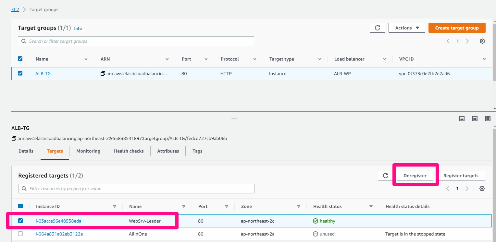


# 실습3

- Auto Scaling으로 재구성 및 부하도 테스트

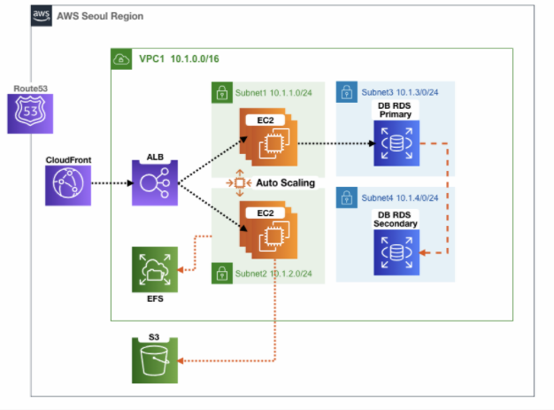


## EC2 시작 템플릿만들기

1. EC2 > 시작템플릿 > 시작템플릿 생성
   - 시작 템플릿 이름 : WPEC2LaunchTemplate
   - 설명 : Wordpress Web Auto Scaling v1.0
   - Auto Scaling 지침 : 체크
   - AMI : Amazon Linux 2 AMI(HVM), SSD Volume Type - 아키텍처 : 64비트(x86)
   - 인스턴스 유형 : t2.micro
   - 키 페어 : (각자 자신의 SSH 키페어 선택)
   - 네트워킹 플랫폼 : VPC
   - 보안 그룹 : ###-WP-VPC1SG-### 포함된것 선택
     - 80번 포트 열기
   - 리소스 태그 : 키(Lab) , 값(WPLab)
   - 고급 세부 정보 ← 클릭
     - IAM 인스턴스 프로파일 : WPLabInstanceProfile
       - S3 접근권한 부여
     - 세부 CloudWatch 모니터링 : 활성화
     - 사용자 데이터 : 아래 내용 복붙!
       - 중간에 EFS 파일시스템ID 부분 바꿔서 넣어주기

```shell
#!/bin/bash
amazon-linux-extras install lamp-mariadb10.2-php7.2 php7.2 -y
yum install httpd htop amazon-efs-utils tree -y
systemctl start httpd && systemctl enable httpd
yum install gcc php-xml php-mbstring php-sodium php-devel php-pear ImageMagick-devel ghostscript -y
cat <<EOT> /etc/php.d/40-imagick.ini
extension = imagick.so
EOT
printf "\n" | pecl install imagick
sed -i 's/^upload_max_filesize = 2M/upload_max_filesize = 64M/g' /etc/php.ini
sed -i 's/^post_max_size = 8M/post_max_size = 64M/g' /etc/php.ini
sed -i 's/^max_execution_time = 30/max_execution_time = 300/g' /etc/php.ini
sed -i 's/^memory_limit = 128M/memory_limit = -1/g' /etc/php.ini
mkdir -p /var/www/wordpress/
mount -t efs 자신의EFS파일시스템ID:/ /var/www/wordpress
chown -R apache:apache /var/www
chmod 2775 /var/www
find /var/www -type d -exec chmod 2775 {} \;
find /var/www -type f -exec chmod 0664 {} \;
chmod u+wrx /var/www/wordpress/wp-content/*
echo 'ServerName 127.0.0.1:80' >> /etc/httpd/conf.d/MyBlog.conf
echo 'DocumentRoot /var/www/wordpress' >> /etc/httpd/conf.d/MyBlog.conf
echo '<Directory /var/www/wordpress>' >> /etc/httpd/conf.d/MyBlog.conf
echo '  Options Indexes FollowSymLinks' >> /etc/httpd/conf.d/MyBlog.conf
echo '  AllowOverride All' >> /etc/httpd/conf.d/MyBlog.conf
echo '  Require all granted' >> /etc/httpd/conf.d/MyBlog.conf
echo '</Directory>' >> /etc/httpd/conf.d/MyBlog.conf
systemctl restart php-fpm
systemctl restart httpd
```


2. 작업 > Auto Scaling 그룹생성

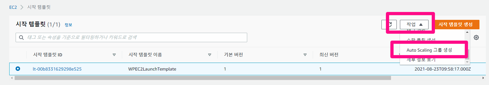


3. Auto Scaling 그룹생성 설정

   - 시작 템플릿 또는 구성 선택
     - Auto Scaling 그룹 이름 : FirstEC2AutoScalingGroup
     - 시작 템플릿 : WPEC2LaunchTemplate
   - 설정구성
     - 인스턴스 구매 옵션 : 시작 템플릿 준수
     - 네트워크 - VPC : WP-VPC1
     - 서브넷 : WP-VPC1-Subnet-1, WP-VPC1-Subnet-2

   - 고급 옵션 구성
     - 로드 밸런싱 : 기존 로드 밸런서에 연결
     - 로그 밸런서 대상 그룹에서 선택 : 선택
     - 기존 로드 밸런서 대상 그룹 : ALB-TG
     - 상태 확인 유형 : ELB (Check)
     - 상태 확인 유예 기간 : 60초
     - 모니터링 - CloudWatch 내에서 그룹 지표 수집 활성화 : 체크
   - 그룹 크기 및 조정 정책 구성
     - 원하는 용량 : 2
     - 최소 용량 : 2
     - 최대 용량 : 4
     - 조정 정책 : 대상 추척 조정 정책
     - 조정 정책 이름 : Scale Out Policy
     - 대상 값 : 30 → 3분 동안 3번 연속 CPU 30% 경우(1분 마다 기록)
     - 인스턴스 요구 사항 : 60초 → 지표에 포함하기 전 워밍업 시간(초)
     - 확대 정책만 생성하려면 축소 비활성화 : Check → 축소 설정하지 않음
     - 인스턴스 축소 보호 활성화 : UnCheck
   - 태그 추가
     - 키(Name) , 값(WebServers)


4. ALB의 Target Group에 등록이 되어있는 것을 확인하기


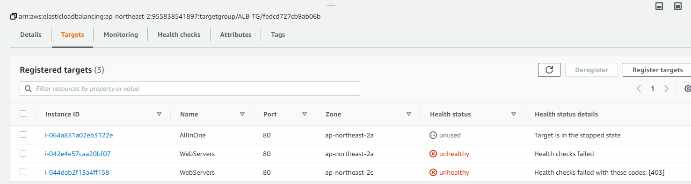


5. CloudFront 주소로 들어가서 정상작동 확인하기


## 부하도 테스트

```shell
# 웹 접속 테스트 (리전, 인스턴스ID, Private IP)
WPDNS=dh5zcqsgbwk63.cloudfront.net # cloudFront 주소
Web1=13.125.26.196 # 퍼블릭주소
Web2=52.79.236.122 # 퍼블릭주소

# 변수 제대로 들어갔는지 확인 - private IP 확인 > 여러번 반복하면 부하 분산으로 인해 private IP 가 번갈아 바뀌는 것을 확인할 수 있음
curl $WPDNS/xff.php;echo

# 터미널1 - 1개 요청(풀)로 총합 500번 요청 진행
ab -n 500 -c 1 http://$Web1/load.php

# 터미널2 - 20개 요청(풀)로 총합 1000번 요청 진행
ab -n 1000 -c 20 http://$WPDNS/load.php
ab -n 1000 -c 20 http://$Web2/load.php


# 접속 되는 EC2 마다 현재 CPU 부하 출력
while true; do curl $WPDNS/xff.php --silent --connect-timeout 1; date; echo "---[AutoScaling]---"; sleep 1; done

# EC2 증가 이후 증감 확인
for i in {1..100}; do curl $WPDNS/xff.php --silent;echo ; done | sort | uniq -c | sort -nr
```

- 테스트 진행될수록 EC2 가 증가하는 것을 확인할 수 있음


## RDS primary 장애 발생시키기

1. 현재 RDS IP 확인하기

```shell
# RDS 엔드포인트를 변수에 지정
RDS=wpdb.ckm3nprg4gom.ap-northeast-2.rds.amazonaws.com

# dig 조회 > RDS의 주소
dig +short $RDS # 10.1.4.147
```


2. RDS -> 작업 -> 재부팅
   - `장애 조치로 재부팅하시겠습니까?` 체크 -> `확인` 클릭
3. RDS IP 다시 확인 - RDS 주소가 바뀐 것을 확인할 수 있음

```shell
# dig 조회 > RDS의 주소
dig +short $RDS # 10.1.3.11
```


##  AZ 자체에 장애를 발생시키기

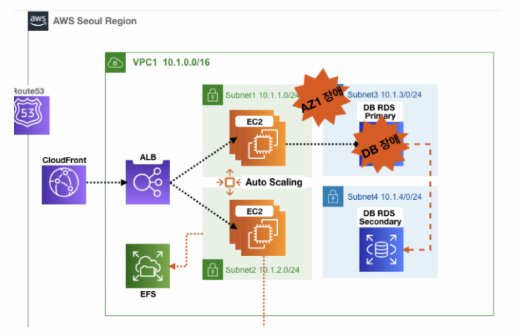

1. VPC > 네트워크 > 네트워크 ACL > 네트워크 ACL 생성
   - 네트워크 ACL은 네트워크 전체를 차단
     보안그룹은 인스턴스마다 적용/ 둘은 적용 범위의 차이를 가지고 있음
2. 네트워크 ACL 생성
   - 이름: AllDeny
   - VPC: WP-VPC1
   - 태그: Name, AllDeny
3. 작업 > 서브넷 연결 편집
   - 가용영역 ap-northeast-2a 로 되어있는 두개의 서브넷을 선택 후 변경사항 저장 ( ap-northeast-2a 장애내기 )

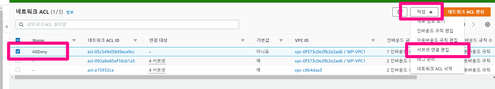


4. 확인하기

```shell
# 웹 접속 테스트 (리전, 인스턴스ID, Private IP)
WPDNS=dh5zcqsgbwk63.cloudfront.net # cloudFront 주소

# 변수 제대로 들어갔는지 확인 - private IP 확인 > 여러번 해봐도 ap-northeast-2c 의 인스턴스의 ip만 나오는 것을 확인할 수 있음
curl $WPDNS/xff.php;echo
```


# 자원 삭제하기

1. RDS 삭제: 최종 스냅샷 언체크 -> 인스턴스 삭제 시 ~ 체크 !
2. EC2 AutoScalingGroup 삭제
3. S3 버킷 -> 삭제 -> 비우기 -> 삭제
4. EC2 시작 템플릿 삭제
5. 위 자원들 전부 삭제 후 -> CloudFormation 스택 삭제