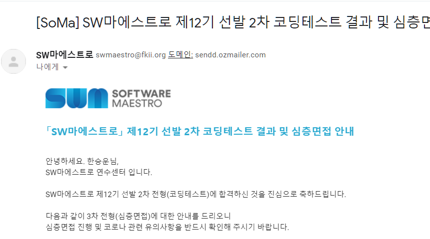

심심해서 본 sw 마에스트로에 합격하였다.
오픈 카카오 방에서 흘려들리는 이야기로는 알고리즘 2문제 + 웹이나 데이터베이스 1문제를 맞으면 합격한다는 것 같다.

이미 SSAFY에 다니고 있어서 굳이 저 면접에 갈 생각은 없지만, SSAFY, 네이버 부스트캠프, sw 마에스트로, 서울24까지 약간 도장깨기가 된 거 같다. 나에게 이런 시험을 보는 것은 그렇게 큰 의미는 없지만 sw 역량 테스트의 내용은 각각의 교육의 방향성을 어느정도 담고 있기 때문에 문제를 풂으로써 현 탑티어급들의 소프트웨어 교육들의 방향성을 느껴볼 수 있다는 점에서는 의미가 있을 것 같다.