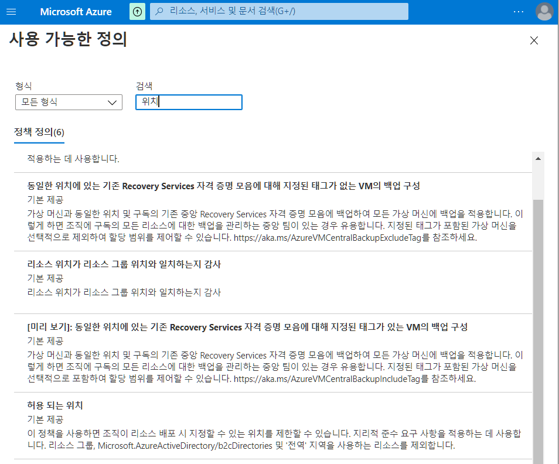
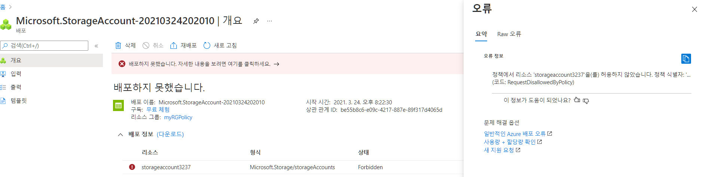
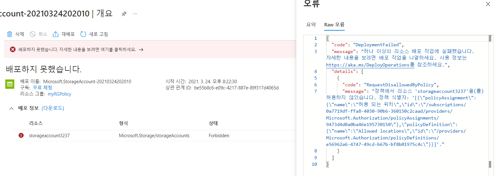
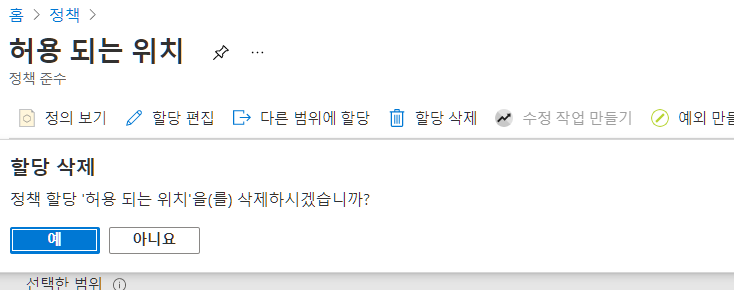

- 구독, 리소스에 적용할 수 있음
- 유용한 시나리오

  - *비용 추적*: 지역별로 다른 구독을 관리할 수 있으며, 해당 지역에 모든 리소스가 배포되어 비용 추적에 도움이 됩니다.

  - *데이터 상주 및 보안 규정 준수*: 또한 데이터 상주 요구 사항이 있는 고객 또는 특정 워크로드에 구독을 생성하고 데이터 및 보안 규정 준수 요구 사항을 보장하기 위해, 모든 데이터를 특정 데이터 센터에 배포하도록 정의 할 수 있습니다.
- 실습 내용
  - 정책 만들기 및 할당 - 위치 지정
  - 위치 이외의 곳에 스토리지 만들어서 정책 제대로 작동하는지 실험해보기

# 1. 정책 만들기

1. `정책` 검색

2. 살펴보기

   - 제작 - 정의
     - 정의 유형 
       - 이니셔티브 - 정책모음이라고 생각하면됨
     - 모든형식
     - 모든 범주 
   - 정책할당 
     - 범위 - 구독이나 리소스 그룹으로 범위를 설정할 수 있음
     - 기본내용 - 정책정의

3. 정책할당 - 기본내용

   - 범위 - 무료 계정
   - 정책정의 - 위치 검색
     - 허용 되는 위치 선택

4. 정책 할당 - 매개변수

   - 실제로 정책에 대한 내용을 설정

   - 허용되는 위치 - 동남아시아 선택

# 2. 스토리지 계정 만들기 -정책 테스트

1. `스토리지 계정` 검색

2. 만들기 선택 - 기본사항
   - 구독 : 무료체험
   - 리소스그룹 - 새로만들기 - myRGPolicy
   - 스토리지계정이름 - storageaccount3237
   - 위치 - 미국 동부
     - 이것으로 정책이 제대로 작동하는지 확인
   - 성능 표준
   - 계정종류 - StorageV2(범용v2)
3. 실패!

# 3. 정책 삭제

1. 검색 - 정책
2. 지울 정책 클릭
3. 할당 삭제 클릭

# 4. 아까 2번 내용으로 다시 스토리지 만들어보기

1. `스토리지 계정` 검색

2. 만들기 선택 - 기본사항
   - 구독 : 무료체험
   - 리소스그룹 - myRGPolicy
   - 스토리지계정이름 - storageaccount3237
   - 위치 - 미국 동부
     - 이것으로 정책이 때문에 생성이 안됬는지 확인하기 위해 동일하게 미국동부로
   - 성능 표준
   - 계정종류 - StorageV2(범용v2)

3. 배포 성공