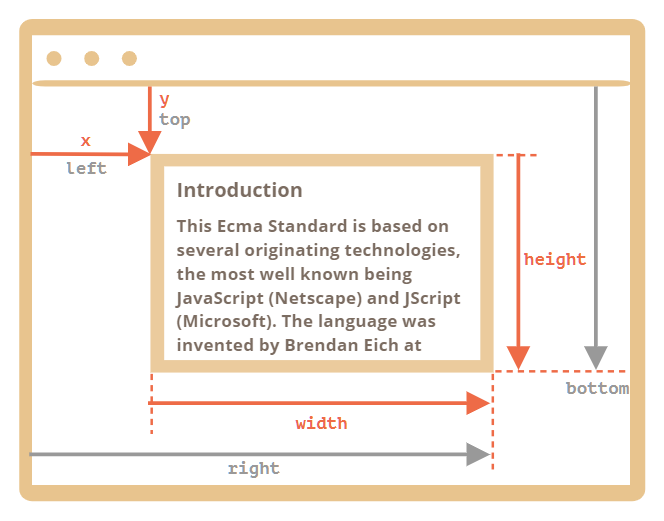
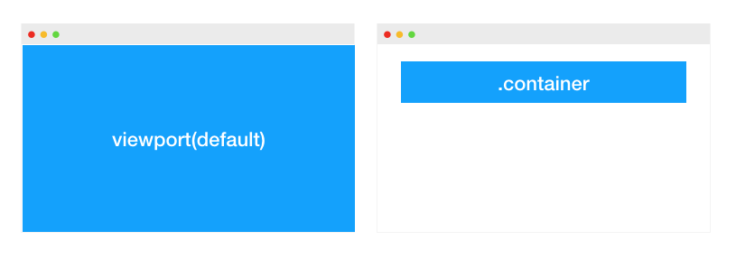
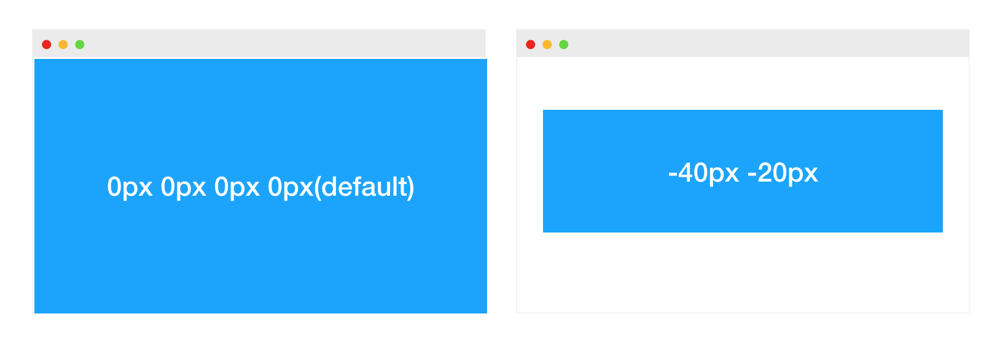
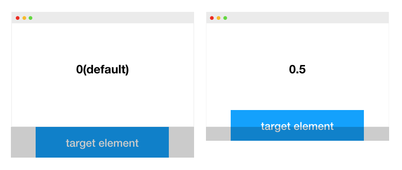
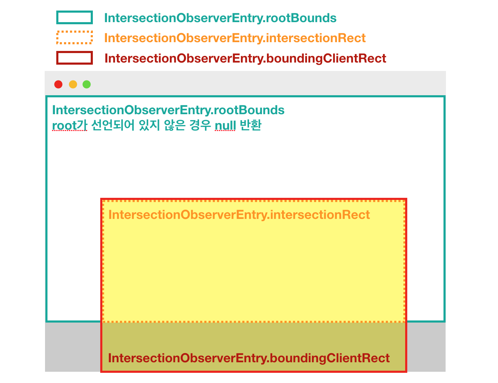
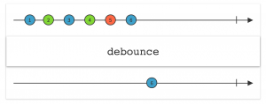
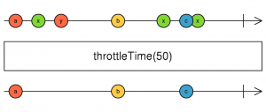

# 문제상황

- django에서 template에서 무한스크롤을 구현했던 방식으로 vue에서 무한스크롤을 구현했는데 scroll 이벤트가 작동을 안함

  - mounted로 부착되더라도 높이를 제대로 인식하지 못하고, 끝에 도착하지 않았는데도 다음요소를 계속 가져오는 현상발생

  - 원래 방식 - scroll 이벤트에 스크롤 바닥을 감지해서 요소를 추가해줌
    - window height + window scrollY 값이 document height보다 클 경우
    - `window.innerHeight `: 이는 브라우저에서 실제로 표시되고 있는 영역의 높이를 의미합니다. 사용자가 보고 있는 영역의 높이인 셈입니다.
    - `window.scrollY` : 스크롤이 Y축으로 얼마만큼 이동했는지를 의미합니다. 맨 처음에 0부터 시작해서 스크롤을 내릴수록 증가하는 값입니다.
    - `document.body.offsetHeight` : offsetHeight는 요소의 실제 높이를 의미합니다. 보여지고 있는 영역 외에 가려진 영역까지 더해진 콘텐츠의 실제 높이입니다. body.offsetHeight 라 함은 사실상 페이지 전체의 높이를 의미하는 셈입니다. 

```js
//스크롤 바닥 감지
window.onscroll = function(e) {
    //추가되는 임시 콘텐츠
    //window height + window scrollY 값이 document height보다 클 경우,
    if((window.innerHeight + window.scrollY) >= document.body.offsetHeight) {
    	//실행할 로직 (콘텐츠 추가)
		
        //article에 추가되는 콘텐츠를 append
        $('article').append(addContent);
    }
};
```


## 나의 구현 방식

- 무한 스크롤이 구현 될 요소 태그에 @scroll  로 스크롤 바닥감지 function을 넣어줌
- ref  로 대상에 접근해서 높이를 구함

```js
  methods : {
    // 무한스크롤 정의
    handleNotificationListScroll : function() {
      console.log("작동체크")
      const { scrollHeight, scrollTop, clientHeight } = this.$refs.scrollTarget//e.target;//
      const isAtTheBottom = scrollHeight === scrollTop + clientHeight;
      console.log(scrollHeight, scrollTop, clientHeight,isAtTheBottom)
      // 일정 한도 밑으로 내려오면 함수 실행
      if (isAtTheBottom) this.getData();
    },
  mounted : function() {
    window.addEventListener('scroll', this.handleNotificationListScroll)
  }
```


# 무한 Scroll의 이벤트 구현의 방법론들


## 스크롤 위치를 계산해서 구현

```js
//스크롤 바닥 감지
window.onscroll = function(e) {
    //추가되는 임시 콘텐츠
    //window height + window scrollY 값이 document height보다 클 경우,
    if((window.innerHeight + window.scrollY) >= document.body.offsetHeight) {
    	//실행할 로직 (콘텐츠 추가)
		
        //article에 추가되는 콘텐츠를 append
        $('article').append(addContent);
    }
};
```


## getBoundingClientRect 이용

> 뷰포트 내에 대상 엘리먼트가 존재하는지 유무 판별하는 방법 중 하나

- `elem.getBoundingClientRect()` 메서드는 `elem`을 감싸는 가장 작은 네모의 창 기준 좌표를 [DOMRect](https://www.w3.org/TR/geometry-1/#domrect) 클래스의 객체 형태로 반환합니다.

  `DOMRect`의 주요 프로퍼티는 다음과 같습니다.

  - `x`와 `y` – 요소를 감싸는 네모의 창 기준 X, Y 좌표
  - `width`와 `height` – 요소를 감싸는 네모의 너비, 높이(음수도 가능)

  `x`와 `y`, `width`와 `height` 이외에 다음과 같은 파생 프로퍼티도 있습니다.

  - `top`과 `bottom` – 요소를 감싸는 네모의 위쪽 모서리, 아래쪽 모서리의 Y 좌표
  - `left`와 `right` – 요소를 감싸는 네모의 왼쪽 모서리, 오른쪽 모서리의 X 좌표

   



### 구현 방법

- vue 기준으로 구현하는 법

```js
    methods : function(){
      isScrolledIntoView : function(el) { // 요소를 받아서 현재 viewport 내에서 보이는지 확인
          let rect = el.getBoundingClientRect()
          let elemTop = rect.top
          let elemBottom = rect.bottom

          let isVisible = elemTop < window.innerHeight && elemBottom >= 0
          return isVisible
      },
      scroll : function() { // scroll 이벤트- 윈도우에 부착할 것
          window.onscroll = () => {
              let scrolledTo = document.querySelector('.replace-with-your-element')

              if (scrolledTo && this.isScrolledIntoView(scrolledTo)) {
                  console.log('scrolled')
              }
          }
      }
    },
    mounted () {
      this.scroll()
    }
```


## IntersectionObserver 이용

- `IntersectionObserver`(교차 관찰자 API)는 DOM 엘리먼트가 뷰포트상에 노출되었는지 여부를 비동기적으로 감시하는 API이다. 
  - 비동기적으로 실행되기 때문에 메인 스레드에 영향을 주지 않으면서 변경 사항을 관찰할 수 있습니다. 
  - `IntersectionObserverEntry`의 속성을 활용하면 `getBoundingClientRect()`를 호출한 것과 같은 결과를 알 수 있기 때문에 따로 `getBoundingClientRect()` 함수를 호출할 필요가 없어 리플로우 현상을 방지할 수 있습니다.

- 기존 방식들은 해당 엘리먼트의 크기와 위치값을 계속 계산을 해야하기 때문에 성능이슈가 발생할 수 있다.(reflow)
  - “리플로우”는 모든 엘리먼트의 위치와 길이 등을 다시 계산하는 것으로 문서의 일부 혹은 전체를 다시 렌더링한다.
    단일 엘리먼트 하나를 변경해도, 하위 엘리먼트나 상위 엘리먼트 등에 영향을 미칠 수 있다.

- MDN에서는 `IntersectionObserver`를 통해 다음과 같은 것들을 할 수 있다고 설명한다.
  - 페이지 스크롤에 따른 이미지/콘텐츠의 레이지 로딩 구현
  - 무한 스크롤 웹사이트 구현
  - 광고 수익 측정을 위한 광고 문구 노출 여부 계산
  - 사용자가 결과를 볼지 유무에 따라 애니메이션 또는 작업 실행 여부 결정


## 사용방법

```js
// 기본구조는 콜백함수와 옵션을 받는다.
const io = new IntersectionObserver(callback[, options])
```


### callback

> 타겟 엘리먼트가 교차되었을 때 실행할 함수

- entries: IntersectionObserverEntry 객체의 리스트. 배열 형식으로 반환하기 때문에 forEach를 사용해서 처리를 하거나, 단일 타겟의 경우 배열인 점을 고려해서 코드를 작성해야 합니다.
- observer: 콜백함수가 호출되는 IntersectionObserver


### options

#### root

- default: `null`, 브라우저의 viewport
- 교차 영역의 기준이 될 root 엘리먼트. observe의 대상으로 등록할 엘리먼트는 반드시 root의 하위 엘리먼트여야 합니다.



#### rootMargin

- default: `'0px 0px 0px 0px'`
- root 엘리먼트의 마진값. css에서 margin을 사용하는 방법으로 선언할 수 있고, 축약도 가능하다. px과 %로 표현할 수 있습니다. rootMargin 값에 따라 교차 영역이 확장 또는 축소된다.



#### threshold

- default: `0`
- 0.0부터 1.0 사이의 숫자 혹은 이 숫자들로 이루어진 배열로, 타겟 엘리먼트에 대한 교차 영역 비율을 의미합니다. 0.0의 경우 타겟 엘리먼트가 교차영역에 진입했을 시점에 observer를 실행하는 것을 의미하고, 1.0의 경우 타켓 엘리먼트 전체가 교차영역에 들어왔을 때 observer를 실행하는 것을 의미합니다.



### method

- IntersectionObserver.observe(targetElement)
  - 타겟 엘리먼트에 대한 IntersectionObserver를 등록할 때(관찰을 시작할 때) 사용합니다.
- IntersectionObserver.unobserve(targetElement)
  - 타겟 엘리먼트에 대한 관찰을 멈추고 싶을 때 사용하면 됩니다. 예를 들어 Lazy-loading(지연 로딩)을 할 때는 한 번 처리를 한 후에는 관찰을 멈춰도 됩니다. 이 경우에는 처리를 한 후 해당 엘리먼트에 대해 unobserve(targetElement)을 실행하면 이 엘리먼트에 대한 관찰만 멈출 수 있습니다.
- IntersectionObserver.disconnect()
  - 다수의 엘리먼트를 관찰하고 있을 때, 이에 대한 모든 관찰을 멈추고 싶을 때 사용하면 됩니다.
- IntersectionObserver.takerecords()
  - IntersectionObserverEntry 객체의 배열을 리턴합니다.


### IntersectionObserverEntry 객체

>  IntersectionObserver에서 반환하는 callback은 IntersectionObserverEntry 객체의 배열을 반환
>
>  IntersectionObserver를 사용할 때 반환되는 이 객체의 정보는 어떤 동작을 등록하거나 할 때 유용하게 사용할 수 있음
>
> `Element.getBoundingClientRect()` 함수의 경우 호출 시 리플로우(reflow) 현상이 나타나지만, 아래의 속성을 사용하면 리플로우 없이 정보를 알 수 있음

- 사각형 정보
  - IntersectionObserverEntry.boundingClientRect: 타겟 엘리먼트의 정보를 반환합니다.
  - IntersectionObserverEntry.rootBounds: root 엘리먼트의 정보를 반환합니다. root를 선언하지 않았을 경우 null을 반환합니다.
  - IntersectionObserverEntry.intersectionRect: 교차된 영역의 정보를 반환합니다.



- 추가 정보
  - IntersectionObserverEntry.intersectionRatio
    -  IntersectionObserver 생성자의 options의 threshold와 비슷합니다. 교차 영역에 타겟 엘리먼트가 얼마나 교차되어 있는지(비율)에 대한 정보를 반환합니다. threshold와 같이 0.0부터 1.0 사이의 값을 반환합니다.
  - IntersectionObserverEntry.isIntersecting
    -  타겟 엘리먼트가 교차 영역에 있는 동안 true를 반환하고, 그 외의 경우 false를 반환합니다.
  - IntersectionObserverEntry.target
    - 타겟 엘리먼트를 반환합니다.
  - IntersectionObserverEntry.time
    - 교차가 기록된 시간을 반환합니다.


## 구현방법

- html

```html
<div class="container">
  <div id="items"></div>
  <div id="loader"></div>
</div>
```


- js

```js
const count = 20
let index = 0

const loadItems = () => {
  // 가상의 노드 객체 만들기
  const fragment = document.createDocumentFragment()
  // index를 기준으로 20개 새로운 div 만들기(index+20)
  for (let i = index; i < index + count; i += 1) {
    const item = document.createElement('div')
    item.innerText = `${i + 1}`
    item.classList.add('item')
    fragment.appendChild(item)
  }
  //document에 추가하기
  document.getElementById('items').appendChild(fragment)
  index += count
}

// loader가 viewport내에 감지되면, items에 div 20개 추가하기
const observer = new IntersectionObserver(([loader]) => {
  // intersecting - 해당 엘리먼트가 보이는지 확인(엘리먼트의 가시성 여부)
  if(!loader.isIntersecting) return

  loadItems()
})

// 기본 items에 20개 추가해놓기
loadItems()
// loader 요소에 observer 달기
observer.observe(document.getElementById('loader'))
```


# 더 나아가기 

- IntersectionObserver를 사용하지 않고, 다른 방식을 사용하게 되면 scroll 할 때마다 너무 많은 계산을 하게 되어 사용자에게 과도한 부담을 줄 수 있다.

- 그 방법을 완화할 수 있는 이벤트 제어 방법 2가지

  - Throttle(쓰로틀)
  - Debounce(디바운스)

- 두 가지 방법의 목표점

  - 이벤트 핸들러가 많은 연산(예 : 무거운 계산 및 기타 DOM 조작)을 수행(이벤트 핸들러의 과도한 횟수가 발생하는 것)하는 경우 에 대해 제약을 걸어 제어할 수 있는 수준으로 이벤트를 발생(그 핸들러를 더 적게 실행하면 빠져 나갈 수 있음)시키는 것을 목표

- 두 방식의 차이점

  - 스로틀은 적어도 X 밀리 초마다 정기적으로 기능 실행을 보장한다는 것입니다. 

    - Debounce 는 아무리 많은 이벤트가 발생해도 모두 무시하고 특정 시간사이에 어떤 이벤트도 발생하지 않았을 때 딱 한번만 마지막 이벤트를 발생시키는 기법입니다.
      따라서 5ms 가 지나기전에 계속 이벤트가 발생할 경우 콜백에 반응하는 이벤트는 발생하지 않고 계속 무시됩니다.

    - 디 바운스에 비해 스로틀의 가장 큰 장점은 무시 된 실행을 저장하고 모든 함수 호출이 이루어진 후 마지막에 실행한다는 것

  

## 디바운스

> 이벤트를 그룹화하여 특정시간이 지난 후 하나의 이벤트만 발생하도록 하는 기술입니다.
>
> (연이어 호출되는 함수들 중 마지막 함수(또는 제일 처음)만 호출하도록 하는 것)
>
> 즉, 순차적 호출을 하나의 그룹으로 "그룹화"할 수 있습니다.





### 구현방법

- lodash를 이용하면 쉽게 구현할 수 있음

```
_.debounce(콜백함수, 시간)
```


- 사용 예시

```js
// debounce 걸기
var showConsole = function() {
  console.log(1);
};

// 2초에 반복 실행된 여러번의 함수는 2초가 지난 후 1번만 동작하게 됨.
_action = _.debounce(showConsole, 2000); 

//------------//
// 비교해보기 - 1번만 실행
_action();

1  //  1번만 호출됨

//------------//
// 비교해보기2 - 3번 실행
_action();
_action();
_action();

1  //  3번 호출해도 1번만 호출됨

```


## 쓰로틀

> 이벤트를 일정한 주기마다 발생하도록 하는 기술입니다.
>
> (마지막 함수가 호출된 후 일정 시간이 지나기 전에 다시 호출되지 않도록 하는 것)
>
> 예를 들어 Throttle 의 설정시간으로 1ms 를 주게되면 해당 이벤트는 1ms 동안 최대 한번만 발생하게 됩니다.




### 구현방법

- lodash로 쉽게 구현가능

```js
_.throttle(콜백함수, 밀리세컨드)
```


- 사용예시 - 마우스 움직임 이벤트 

```js
let test1Count = 1, test2Count = 1
const cbFuncNotThrottle = e => {
    $("#test1").text(test1Count++)
}
const cbFunc = e => {
    $("#test2").text(test2Count++)
}
$(window).on("mousemove", cbFuncNotThrottle)
$(window).on("mousemove", _.throttle(cbFunc, 500))
```

undefined

# 문제 해결 

- getBoundingClientRect 와 쓰로틀을 이용하여 구현
- `views > Community.vue`

```vue
<template>
  <div id="background" ref="scrollTarget"> 
    <!--  @scroll="handleNotificationListScroll"  -->
    <ReviewList :reviews="reviews" />
    <div id="end" style="visibility: hidden;">리뷰 종료</div>
  </div>
</template>

<script>
import ReviewList from '@/components/ReviewList'
import axios from 'axios'
import _ from 'lodash'
const BACKEND = process.env.VUE_APP_BACKEND_LINK

export default {
  name: 'Community',
  data: function () {
    return {
      reviews: [],
      page : 1,
      dupCheck : true
    }
  },
  components : {
    ReviewList
  },
  methods : {
    isScrolledIntoView (el) {
      let rect = el.getBoundingClientRect()
      let elemTop = rect.top
      let elemBottom = rect.bottom

      let isVisible = elemTop < window.innerHeight && elemBottom >= 0
      return isVisible
    },
    scroll () {
      window.onscroll = _.throttle(() => {
        let scrolledTo = document.querySelector('#end')

        if (scrolledTo && this.isScrolledIntoView(scrolledTo)) {
          this.getData()
        }
      }, 500)
    },

    getData : function(){
      if(this.dupCheck){
        this.dupCheck=false
        //console.log("페이지:"+this.page)
        axios({
          method: 'get',
          url: `${BACKEND}community/?page=${this.page}`,
        })
          .then(res => {
            //console.log(res)

            this.reviews= this.reviews.concat(res.data)

            this.page++
            this.dupCheck = true
          })


      }
    }

  },

  created : function () {
    this.getData()
  },
  mounted () {
    this.scroll()
  }
}
</script>


```

