# Django Model

- 단일한 데이터의 대한 정보를 가짐
  - 사용자가 저장하는 데이들의 필수적인 필드들과 동작들을 포함
- 저장된 데이터베이스의 구조(layout)
- django는 model을 통해 데이터에 접속하고 관리
- 일반적으로 각각의 model은 하나의 데이터베이스 테이블에 매핑
  - model 은 웹 어플리케이션의 데이터를 구조화하고 조작하기 위한 도구


## DataBase

- 데이터베이스(DB)
  - 체계화된 데이터의 모임
- 쿼리(Query)
  - 데이터를 조회하기 위한 명령어
  - 조건에 맞는 데이터를 추출하거나 조작하는 명령어
- 스키마(Schema)
  - 데이터베이스에서 자료의 구조, 표현방버, 관계 등을 정의한 구조
- 테이블(Table)
  - 필드(field) / 컬럼(column) / 속성(attribute)
  - 레코드(record) / 행(row) / 튜플(tuple)

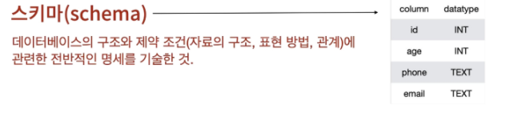

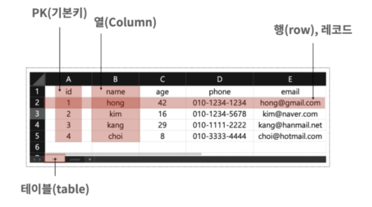


## ORM

- Object Relational Mapping 
- 객체 지향 프로그래밍 언어를 사용하여 호환되지 않는 유형의 시스템간에(Django- SQL) 데이터를 변환하는 프로그래밍 기술이다.
- 이것은 프로그래밍 언어에서 사용할 수 잇는 가상 객체 데이터 베이스를 만들어 사용한다.
- 장점
  - SQL을 잘 알지 못해도 DB 조작이 가능
  - SQL의 절차적 접근이 아닌 객체 지향적 접근으로 인한 높은 생산성
    - 현재 웹 프레임워크의 요점은 웹 개발의 속도를 높이는 것(생산성)
- 단점
  - ORM 만으로 완전한 서비스를 구현하기 어려운 경우가 있음

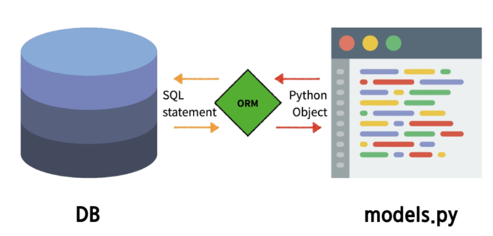

### ORM 내부의 데이터필드

- https://docs.djangoproject.com/en/3.1/ref/models/fields/


## Migrations

- django가 model에 생긴 변화(필드를 추가했다던가 모델을 삭제했다던가 등) 반영하는 방법

- Migration(이하 마이그레이션) 실행 및 DB 스키마를 다루기 위한 몇가지 명령어

  - makemigrations

    - mdoel을 변경한 것에 기반한 새로운 마이그레이션(like 설계도)을 만들 떄 사용

  - migrate

    - 마이그레이션을 DB에 반영하기 위해 사용(실제 적용단계)
    - 설계도를 실제 DB에 반영하는 과정
    - 모델에서의 변경 사항들과 DB의 스키마가 동기화를 이룸

  - sqlmigrate

    - 마이그레이션에 대한 SQL 구문을 보기 위해 사용
    - 마이그레이션이 SQL 문으로 어떻게 해석되어서 동작할지 미리 확인 할 수 있음

  - showmigrations

    - 프로젝트 전체의 마이그레이션 상태를 확인하기 위해 사용
    - migrate 됐는지 안됐는지 여부를 확인할 수 있음

    

## ORM 사용해보기

- 기억해야할 3단계
  1.  `model.py `
      - model 변경사항 발생
  2.  `python manage.py makemigrations`
      - migration 파일 생성
  3.  `python manage.py migrate`
      - DB 적용


### 1. `어플리케이션.models.py`

```python
from django.db import models

# Create your models here.
class Article(models.Model) : # models.Model 클래스를 상속받음
    ## 데이터 베이스의 구조 작성
    #  column 만들기 ( primary key인 id는 django가 알아서 생성함 )
    title = models.CharField(max_length=10)  # charField : 길이에 제한이 있는 textfield에 대해서 사용
    content = models.TextField()

```

### 2. console 창 - makemigrations

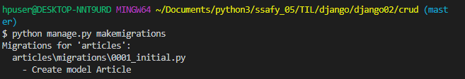

- `어플리케이션.migrations` 위치에 `0001_initial.py`가 생김

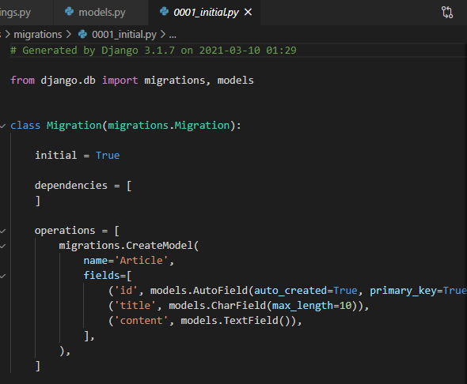
### 3. console - migrate 

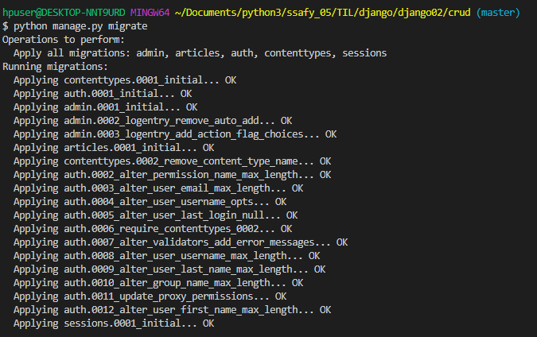

- VScode의 SQLite 확장프로그램 설치 후 확인 가능
  - 설치 이후 migrate로 만들었던 DB 확인해보기
  - `articles_articles` 가 생성된 것을 확인할 수 있음
    - `어플리케이션이름_테이블이름` 으로 이름이 지어짐

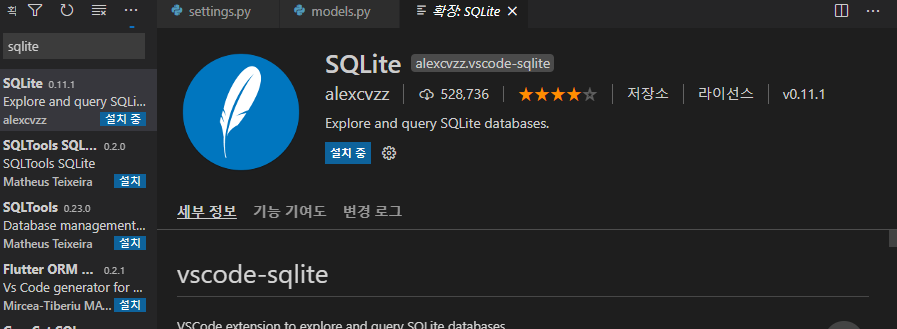

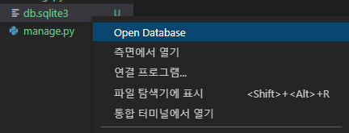

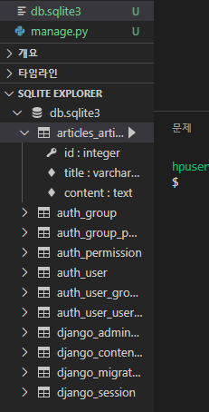

### (추가사항) sqlmitgrate

- sqlmigrate를 통해서 SQL 구문 확인해 보기
  - `python manage.py sqlmigrate 어플리케이션이름 테이블`

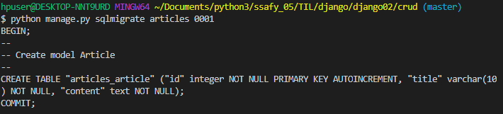

### (추가사항) showmigrations

- 각각의 migration이 migrate가 되었는지 확인할 수 있음
- X 표시는 안되었다는 것이 아니라 체크 되었다는 뜻임

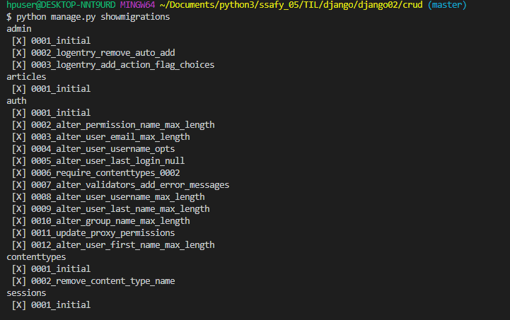


### 4. models 수정사항 만들기

- created_at 과 updated_at 추가

```python
from django.db import models

# Create your models here.
class Article(models.Model) : # models.Model 클래스를 상속받음
    ## 데이터 베이스의 구조 작성
    #  column 만들기 ( primary key인 id는 django가 알아서 생성함 )
    title = models.CharField(max_length=10)  # charField : 길이에 제한이 있는 textfield에 대해서 사용
    content = models.TextField()
    created_at = models.DateTimeField(auto_now_add=True) # auto_now_add = 작성일
    updated_at = models.DateTimeField(auto_now=True) # auto_now = 수정일


```


### 5. makemigrations

- 현재 테이블이 완성되어있는 상태에서 2개의 column을 추가하려다보니 추가된 column 들에 해당하는 값을 뭐를 넣어줄지 물어봄

  1. 디폴트 값을 알아서 주기(시간은 추가가 어려우니 이번엔 이걸 선택)

  2. 나가서 models.py 에 직접 추가

- `0002_블라블라` 의 migrations가 생김

  - 계속 migrations들이 쌓여감, Git 같이 버전관리가 된다고 생각하면 될듯

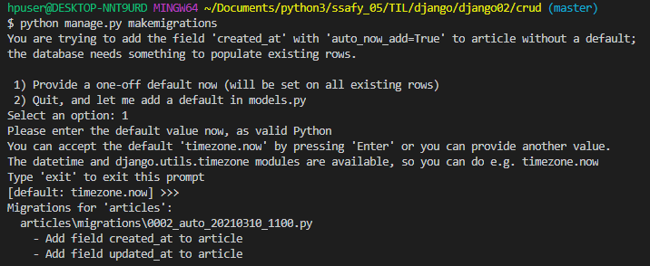


### 6.  migrate

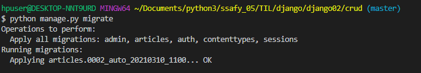


# Database API

- `DB`를 조작하기 위한 도구

- django가 기본적으로 ORM을 제공함에 따른 것으로 DB를 편하게 조작할 수 있도록 도와줌

- Model을 만들면 Django는 객체들을 만들고 읽고 수정하고 지울 수 있는 database-abstract API를 자동으로 만듦

- database-abstract API 혹은 database-access API 라고도 함

- DB API 구문

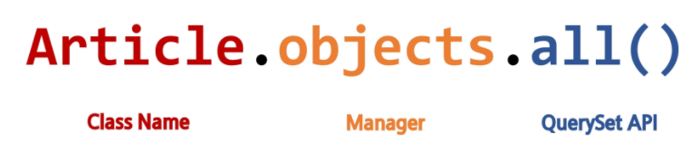

## DB API

- Manager
  - django모델에 데이터베이스 query 작업이 제공되는 인터페이스
  - 기본적으로 모든 django 모델 클래스에 objects라는 Manager를 추가
- QuerySet
  - 데이터베이스로부터 전달받는 객체 목록
  - queryset 안의 객체는 0개, 1개 혹은 여러 개일수도 있음
  - 데이터베이스로부터 조회, 필터, 정렬 등을 수행할 수 있음
  - https://docs.djangoproject.com/en/3.1/ref/models/querysets/


## django-extensions

- https://django-extensions.readthedocs.io/en/latest/installation_instructions.html
- pip install django-extensions
- 프로젝트에 적용하기 위해 `프로젝트.settings.py`에 추가

```python
INSTALLED_APPS = (
    ...
    'django_extensions',
)
```

- 하는이유
  - django에서 기본적으로 제공하는 shell은 불편
    - cmd > `python manage.py shell`
  - extension의 shell
    - cmd> `python manage.py shell_plus`
    - 기본적으로 작성한 모델, 등 여러가지가 자동으로 import 된 상태에서 시작됨


## CRUD

- 대부분의 컴퓨터 소프트웨어가 가지는 기본적인 데이터 처리 기능
- Create(생성), Read(읽기), Update(갱신), Delete(삭제)를 묶어서 일컫는 말

- 밑에 부터는 `python manage.py shell_plus`에서 진행됨
  - `save()`는 model의 인스턴스 메서드이다.


## CREATE

### shell_plus 잠깐 실습: 테이블에 자료 넣기1

1. Article 테이블이 있는지 확인

2. Article 테이블의 요소 전부다 가져오기 

   - 반환값이 리스트형임에 주목

3. article 에 Article 인스턴스를 담기

4. article 확인해보기

   - None 을 볼  수 있음 : pk 값임 - 아직 데이터베이스에 위치하지 않았음을 나타낸다고 보면됨

5. article의 title에 'first' 값 넣기

6. article.title 확인

7. 잘못써서 에러남

8. article의 content 에 'django!' 넣기

9. article.content 확인

10. article 확인

11. article.save() : db에 저장이 됨

12. article 확인 : None 자리에 번호가 생긴것을 확인할 수 있음

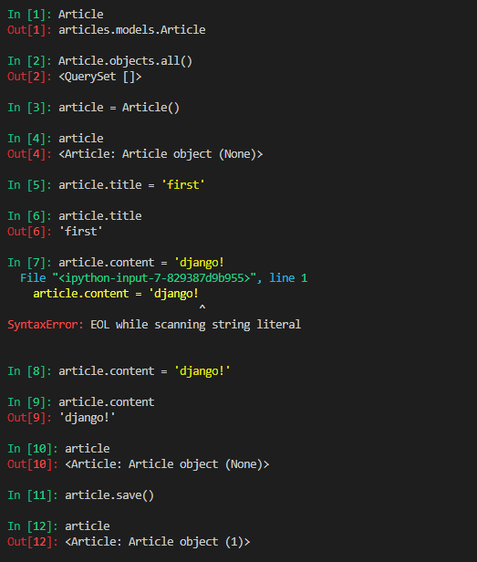


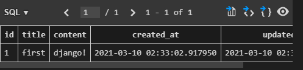


### 다른방식으로 테이블에 데이터 넣기- 2

1. article 인스턴스 생성시, 매개변수로 값들 넣어주기
2. 확인
3. save()로 테이블내에 저장
4. 확인

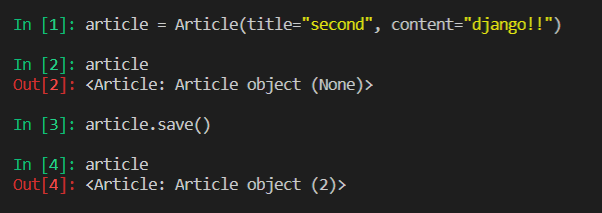

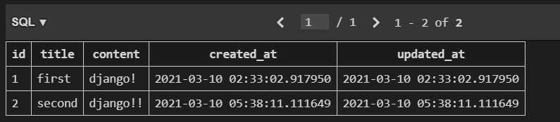

### 다른방식으로 테이블에 데이터 넣기 -3

1. `테이블.objects.create(매개변수)` 를 사용하여 인스턴스 생성 없이 바로 테이블 내에 데이터 저장

   save() 할 필요가 없음

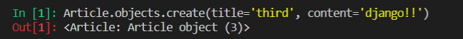


## READ

- QuerySet API method를 사용한 다양한 조회를 하는 것이 중요

- 크게 2가지로 분류

  1. Method that return new querysets
  2. Methods that do not return querysets

- Field lookups

  - https://docs.djangoproject.com/en/3.1/topics/db/queries/#field-lookups
  - 조회 시 특정한 조건을 적용시키기 위해 사용
  - Queryset Method 에 대한 키워드 인수로 사용됨
    - get
    - filter
    - exclude

- all()

  ```python
  Article.objects.all()
  # <QuerySet [<Article: Article object (1)>, <Article: Article object (2)>, <Article: Article object (3)>]>
  ```

- get()

  - 특정한 컬럼에 대해 특정값 인 경우 가져오기(하나만)
  - unique 하거나 NOT NULL 특징을 가지고 있는 경우에만 사용가능(보통 pk 에 대해서 사용)

  ```python
  article = Article.objects.get(pk=2)
  # <Article: Article object (2)>
  
  # 없는 pk에 대한 것 조회시 에러- DoesNotExist
  # 해당 컬럼에 대한 해당 값이 여러개가 있는 경우 에러 - MutipleObjectsReturned
  ```

- filter()

  - get과 비슷한데, 여러개 반환 가능
  - queryset으로 반환

```python
Article.objects.filter(content="django!!")
# <QuerySet [<Article: Article object (2)>, <Article: Article object (3)>]>
```

- 검색에 특정 조건 넣어주기

  - 테이블 뒤에 `__` 넣고 조건을 써줌

  - contains 이용 - 포함되어있는 것만

    ```python
    Article.objects.filter(content__contains="!")
    #<QuerySet [<Article: Article object (1)>, <Article: Article object (2)>, <Article: Article object (3)>]>
    ```

  - gt 이용 - 해당 값보다 큰것만

    ```python
    Article.objects.filter(pk__gt=1)
    #<QuerySet [<Article: Article object (2)>, <Article: Article object (3)>]>
    ```


## UPDATE

1. 바꿀 행을 가져옴
2. 확인
3. 바꿀 열에 대한 것을 선택하여 정보를 바꿈
4. 데이터베이스에 기록

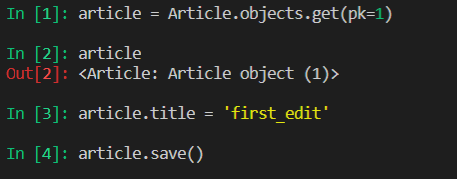


## DELETE

1. 바꿀 행 가져옴
2. 지우기 
   따로 저장하거나 하지 않아도 바로 테이블에서 지워짐

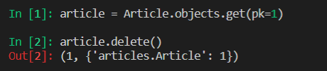


# Admin site

- Automatic admin interface
  - 사용자가 아닌 서버의 관리자가 활용하기 위한 페이지
  - Article class를 admin.py에 등록하고 관리
  - `django.contrib.auth` 모듈에서 제공
  - record 생성 여부 확인에 매우 유용하며 직접 record를 삽입할 수도 있음
  - https://docs.djangoproject.com/en/3.1/ref/contrib/admin/

## user 만들기

- `python manage.py createuser`를 통해서 admin/ admin 만들기
  - user가 만들어지면 `auth_user` 테이블에 관련 정보가 저장되게 됨
  - password는 자동으로 암호화 되서 저장됨

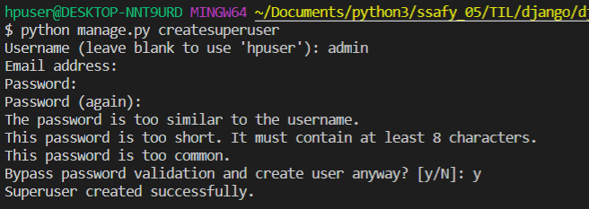

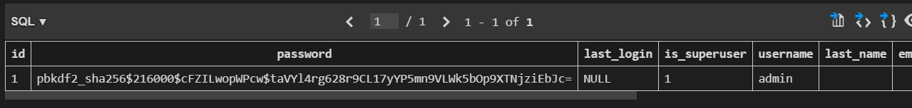


## admin 페이지에 접속하기

- 방금 만든 user 아이디와 패스워드로 로그인

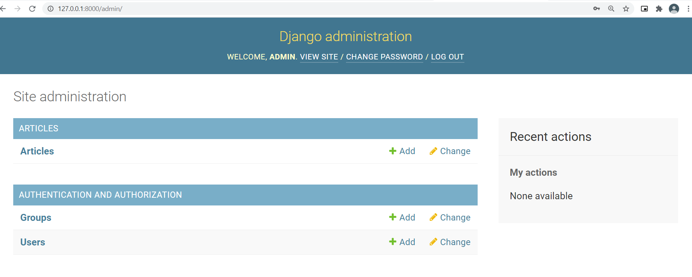

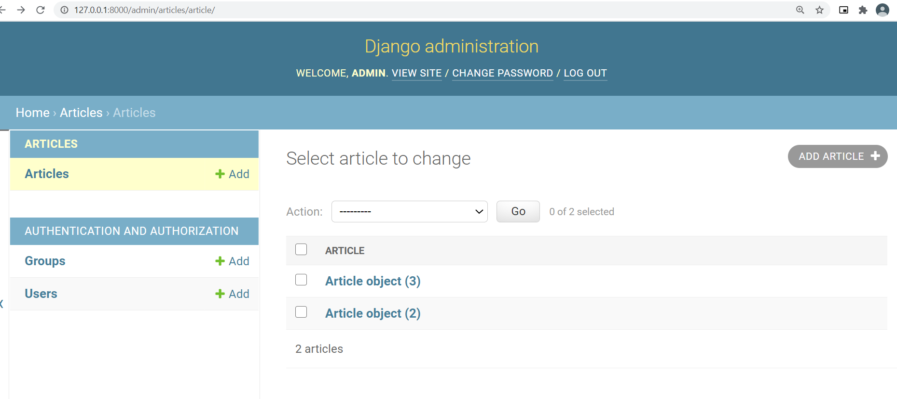

- 좀더 보기 쉽게 하기 위해

  - `어플리케이션.admin.py` 를 수정
  - 똑같은 페이지를 다시 확인해 보면 더 직관적으로 볼 수 있게 됨

  ```python
  from django.contrib import admin
  from .models import Article # 현재 모델에서 article 테이블 가져오기
  
  # Register your models here.
  class ArticleAdmin(admin.ModelAdmin) :
      list_display = ('pk', 'title', 'content', 'created_at', 'updated_at', ) # 현재 보일 column들을 tuple 혹은 list로 써주기
  
  
  # admin site에 Article과 ArticleAdmin 을 등록하겠다.
  admin.site.register(Article, ArticleAdmin) 
  ```

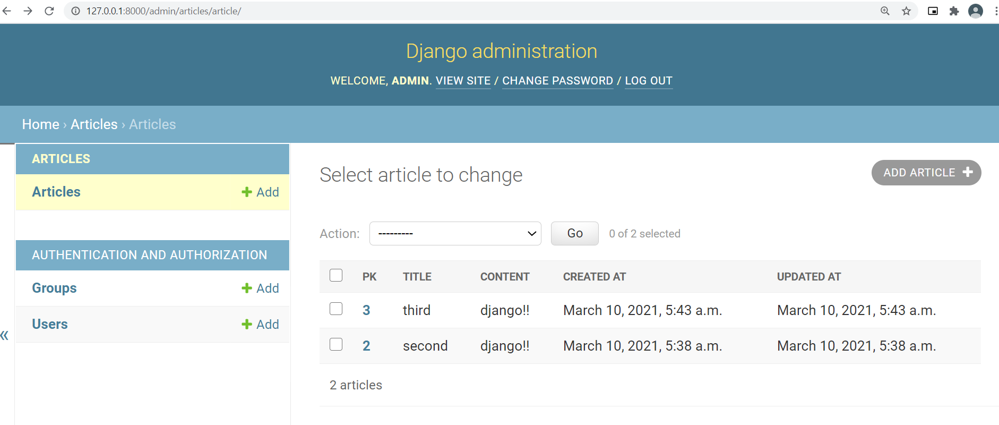