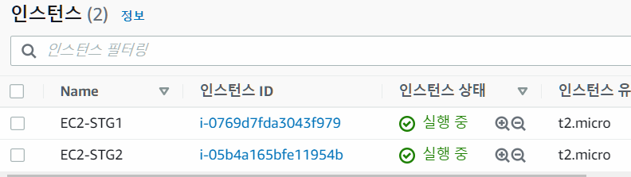
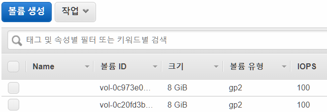
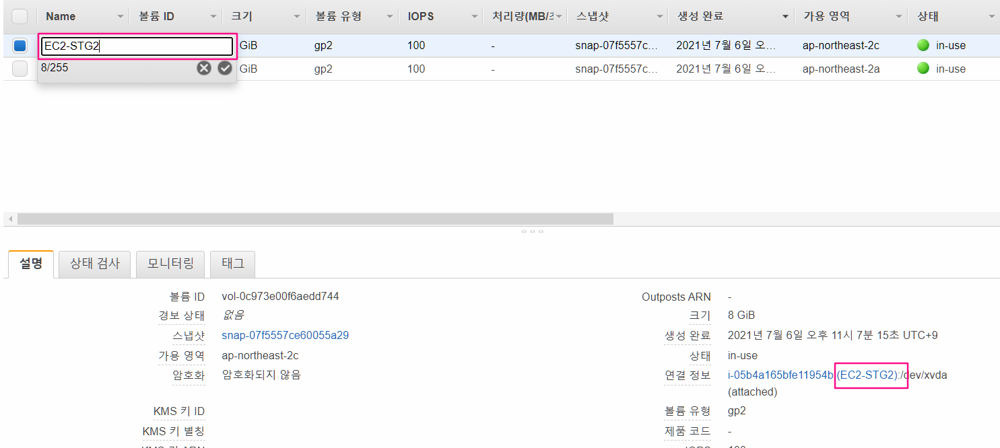
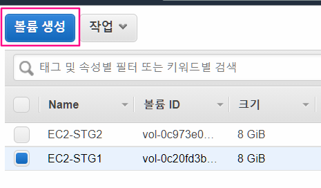
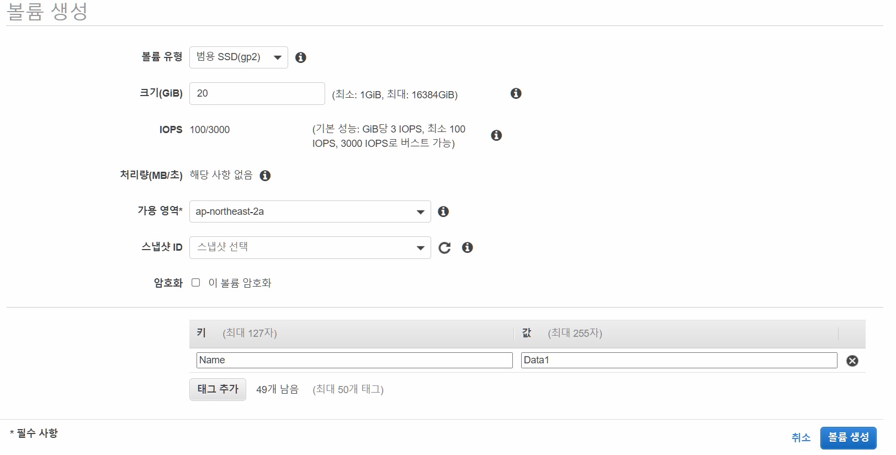
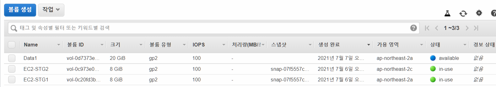
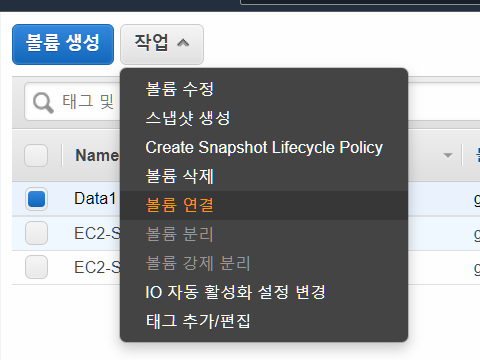
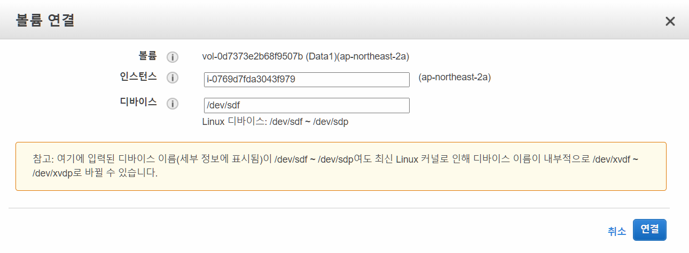
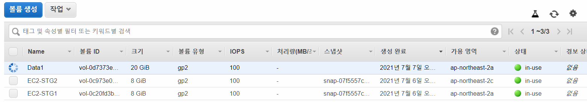
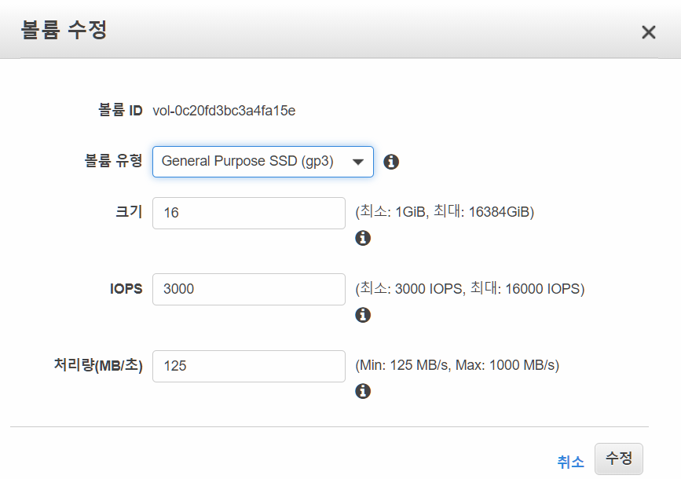

- 학습 목표
  - EBS를 생성
  - 생성한 EBS를 EC2 에 연결, mount 및 파일시스템 생성으로 사용할 수 있게 만들기
  - EC2 작동중인 상황에서 EBS 변경하고 적용하기(파티션 확장, 파일시스템 확장)
  
  
# 2. EBS






## 현재상황 확인

- 현재 상황
  - ap-northeast-2a 에 EC2-STG1
    -  8G gp2 볼륨(EBS) 하나 mount
  - ap-northeast-3a 에 EC2-STG2
    -  8G gp2 볼륨(EBS) 하나 mount


1. Xshell 에서 EC2 퍼블릭IP 로 접근하기(EC2-STG1)
2. EBS 볼륨 확인하기

```bash
# df(disk free) 디스크 여유 공간 출력
[root@ST1 ~]# df -hT /dev/xvda1
Filesystem     Type  Size  Used Avail Use% Mounted on
/dev/xvda1     xfs   8.0G  1.8G  6.3G  23% /

# lsblk 사용 가능한 디스크 디바이스와 마운트 포인트(해당하는 경우)를 출력
[root@ST1 ~]# lsblk
NAME    MAJ:MIN RM SIZE RO TYPE MOUNTPOINT
xvda    202:0    0   8G  0 disk 
└─xvda1 202:1    0   8G  0 part /

# file -s 볼륨에 파일 시스템이 있는지 확인, data만 출력 시 파일시스템이 없으므로 생성해야함
[root@ST1 ~]# file -s /dev/xvda
/dev/xvda: x86 boot sector; partition 1: ID=0xee, starthead 0, startsector 1, 16777215 sectors, extended partition table (last)\011, code offset 0x63

# 파일 시스템이 있으면 파일 시스템의 유형에 관한 정보를 출력
[root@ST1 ~]# file -s /dev/xvda1
/dev/xvda1: SGI XFS filesystem data (blksz 4096, inosz 512, v2 dirs)

# 디바이스의 UUID 찾기
[root@ST1 ~]# blkid
/dev/xvda1: LABEL="/" UUID="55da5202-8008-43e8-8ade-2572319d9185" TYPE="xfs" PARTLABEL="Linux" PARTUUID="591e81f0-99a2-498d-93ec-c9ec776ecf42"

# 디바이스의 탑재 지점 확인
[root@ST1 ~]# cat /etc/fstab
UUID=55da5202-8008-43e8-8ade-2572319d9185     /           xfs    defaults,noatime  1   1
```


## EBS 네이밍 변경 및 생성

1. EC2 > Elastic Block Store > 볼륨 
   - 현재는 이름이 지정이 안되어 있으니 어느 EC2에 연결되었는지 쉽게 알 수 있게 네이밍하기




2. EBS 볼륨 생성하기 버튼 클릭



3. 볼륨 생성
   - 볼륨 유형 : gp2
   - 크기 : 20 GiB
   - 가용영역 : ap-northeast-2a
     - 부착하려는 EC2 와 같은 가용영역을 사용해야함
   - 키-값 : Name : Data1





4. 만들어진 EBS는 상태가 사용가능으로 나오지만 아직 mount 되지 않아 상용할 수 없는 상태




5. EBS 볼륨 연결하기 
   - EBS와 같은 가용영역을 가지는 EC2만 표기되어지는 것을 확인할 수 있음







6. Xshell에서 확인하기
   - 조금 전에 추가한 20G 짜리 볼륨이 추가 된 것을 확인할 수 있음

```shell
# lsblk 사용 가능한 디스크 디바이스와 마운트 포인트(해당하는 경우)를 출력
[root@ST1 ~]# lsblk
NAME    MAJ:MIN RM SIZE RO TYPE MOUNTPOINT
xvda    202:0    0   8G  0 disk 
└─xvda1 202:1    0   8G  0 part /
xvdf    202:80   0  20G  0 disk 

```


7. Xshell에서 파일시스템 만들고 mount 하기

```shell
# 관리자 권한으로 변경
sudo su -

# file -s 볼륨에 파일 시스템이 있는지 확인, data만 출력 시 파일시스템이 없으므로 생성해야함 - 현재는 파일 시스템이 없음
[root@ST1 ~]# file -s /dev/xvdf
/dev/xvdf: data

# 볼륨을 포맷하여 파일시스템을 생성
[root@ST1 ~]# mkfs -t xfs /dev/xvdf
meta-data=/dev/xvdf              isize=512    agcount=4, agsize=1310720 blks
         =                       sectsz=512   attr=2, projid32bit=1
         =                       crc=1        finobt=1, sparse=0
data     =                       bsize=4096   blocks=5242880, imaxpct=25
         =                       sunit=0      swidth=0 blks
naming   =version 2              bsize=4096   ascii-ci=0 ftype=1
log      =internal log           bsize=4096   blocks=2560, version=2
         =                       sectsz=512   sunit=0 blks, lazy-count=1
realtime =none                   extsz=4096   blocks=0, rtextents=0

# 디렉터리를 생성 후 마운트(data 라는 위치에)
[root@ST1 ~]# mkdir /data
[root@ST1 ~]# mount /dev/xvdf /data

# 파일을 생성 후 확인
[root@ST1 ~]# echo "EBS Test" > /data/memo.txt
[root@ST1 ~]# cat /data/memo.txt
EBS Test

# 디바이스 확인
[root@ST1 ~]# lsblk
NAME    MAJ:MIN RM  SIZE RO TYPE MOUNTPOINT
xvda    202:0    0    8G  0 disk
└─xvda1 202:1    0    8G  0 part /
xvdf    202:80   0  100G  0 disk /data

[root@ST1 ~]# df -hT /dev/xvdf
Filesystem     Type  Size  Used Avail Use% Mounted on
/dev/xvdf      xfs   100G  135M  100G   1% /data
```


## EC2 재부팅시에도 자동 mount 되게 설정하기

- EC2-STG1 신규 볼륨 사용 설정시 재부팅 시에도 신규 볼륨을 자동 마운트

```shell
# 혹시 모르니 fstab 파일 백업
[root@ST1 ~]# cp /etc/fstab /etc/fstab.orig

# 재부팅이후에도 볼륨 자동 탑재를 위한 fstab 설정 (nofail:볼륨 없어도 부팅 가능)
[root@ST1 ~]# blkid
/dev/xvda1: LABEL="/" UUID="55da5202-8008-43e8-8ade-2572319d9185" TYPE="xfs" PARTLABEL="Linux" PARTUUID="591e81f0-99a2-498d-93ec-c9ec776ecf42"
/dev/xvdf: UUID="24c1a297-6d1f-4a69-8246-04643fcf58e9" TYPE="xfs"

echo "UUID=위blkid의자신의UUID입력  /data  xfs  defaults,nofail  0  2" >> /etc/fstab
[root@ST1 ~]# echo "UUID=999027bb-6f7a-4b22-866b-ca5e213720d0  /data  xfs  defaults,nofail  0  2" >> /etc/fstab

[root@ST1 ~]# cat /etc/fstab
UUID=55da5202-8008-43e8-8ade-2572319d9185     /           xfs    defaults,noatime  1   1
UUID=aebf131c-6957-451e-8d34-ec978d9581ae  /data  xfs  defaults,nofail  0  2

# 위 항목 설정이 잘 되었는지 확인을 위해서 탑재를 해제 후 다시 탑재합니다. 오류가 있을 시 문제를 출력합니다
[root@ST1 ~]# umount /data
[root@ST1 ~]# mount -a

# 재부팅 이후 자동으로 디바이스 탑재 및 생성한 파일 확인
[root@ST1 ~]# reboot
...
(재부팅 이후)
...

# 정상적으로 디스크 디바이스가 보이고 마운트 되어 있으며 생성한 파일을 확인 할 수 있다
[root@ip-172-31-0-26 ~]# lsblk
NAME    MAJ:MIN RM  SIZE RO TYPE MOUNTPOINT
xvda    202:0    0    8G  0 disk
└─xvda1 202:1    0    8G  0 part /
xvdf    202:80   0  100G  0 disk

[root@ip-172-31-0-26 ~]# cat /data/memo.txt
EBS Test
```


## 루트 볼륨 용량 변경하기

1. EBS > 볼륨 > 볼륨 수정
   - 유형 : gp3
   - 크기 : 16 Gib



2. XShell에서 확인하기
   - 루트 볼륨이 16G로 늘어난 것을 확인할 수 있음
   - 하지만,  xvda1 파티션 크기가 8G 이므로 파티션 확장이 필요

```shell
# lsblk 사용 가능한 디스크 디바이스와 마운트 포인트(해당하는 경우)를 출력
[root@ST1 ~]# lsblk
NAME    MAJ:MIN RM SIZE RO TYPE MOUNTPOINT
xvda    202:0    0  16G  0 disk 
└─xvda1 202:1    0   8G  0 part /
xvdf    202:80   0  20G  0 disk /data

```


3. 루트 볼륨만큼 파티션을 확장하기
   - 하지만, 아직 파일시스템은 확장이 안된상태

```shell
# growpart 명령어로 파티션을 늘린다
[root@ST1 ~]# growpart /dev/xvda 1
CHANGED: partition=1 start=4096 old: size=16773087 end=16777183 new: size=33550303 end=33554399

# 늘린 파티션으로 반영됨을 확인
[root@EC2-STG1 ~]# lsblk
NAME    MAJ:MIN RM SIZE RO TYPE MOUNTPOINT
xvda    202:0    0  16G  0 disk 
└─xvda1 202:1    0  16G  0 part /
xvdf    202:80   0  20G  0 disk /data

# 하지만 파일시스템은 아직 여전히 8G
[root@EC2-STG1 ~]# df -hT /dev/xvda1
Filesystem     Type  Size  Used Avail Use% Mounted on
/dev/xvda1     xfs   8.0G  1.8G  6.2G  23% /

```


4. 파일시스템도 확장시키기

```shell
# xfs_growfs 명령어로 볼륨의 파일 시스템을 확장한다
[root@EC2-STG1 ~]# xfs_growfs -d /
meta-data=/dev/xvda1             isize=512    agcount=4, agsize=524159 blks
         =                       sectsz=512   attr=2, projid32bit=1
         =                       crc=1        finobt=1 spinodes=0
data     =                       bsize=4096   blocks=2096635, imaxpct=25
         =                       sunit=0      swidth=0 blks
naming   =version 2              bsize=4096   ascii-ci=0 ftype=1
log      =internal               bsize=4096   blocks=2560, version=2
         =                       sectsz=512   sunit=0 blks, lazy-count=1
realtime =none                   extsz=4096   blocks=0, rtextents=0
data blocks changed from 2096635 to 4193787

# 최종적으로 파일시스템까지 16G 용량으로 확장되었다
[root@EC2-STG1 ~]# df -hT /dev/xvda1
Filesystem     Type  Size  Used Avail Use% Mounted on
/dev/xvda1     xfs    16G  1.9G   15G  12% /

------------(심화 메모)---------------
# ext4 볼륨의 경우 아래 명령어로 확장한다
resize2fs /dev/xvda1
```

