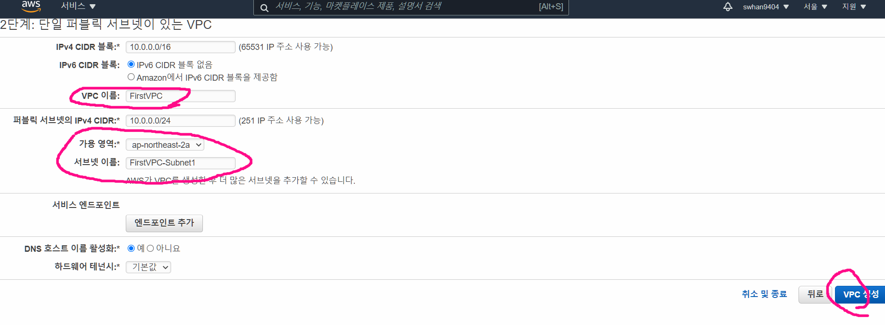

# 실습 전 준비

## SSH Client 프로그램

- XSHELL(무료라이센스)
  - https://www.netsarang.com/ko/xshell/
- 혹은 MobaXterm
  - https://mobaxterm.mobatek.net/
- 혹은 SecureCRT (유료)
  - https://www.vandyke.com/products/securecrt/
- 맥은 내장 SSH 사용으로 별도 툴 불필요


## SCP 프로그램

- WinSCP
  - https://winscp.net/eng/download.php
- 혹은 FileZilla Client
  - https://filezilla-project.org/download.php?platform=win64


## 신규 VPC 생성

- vpc 란?
  - 사용자의 AWS 계정 전용 가상 네트워크
- VPC 검색하면 들어와지는 VPC 대시보드
  - VPC 마법사 시작 > 버튼 클릭
  - 만들 VPC 내용
    - IPv4 CIDR 블록 : **10.20.0.0/16**
    -  VPC 이름 : **SecondVPC** 
    - 퍼블릭 서브넷의 IPv4 CIDR : **10.20.1.0/24** 
    - 가용 영역 : **ap-northeast-2a** 
    - 서브넷 이름 : **SecondVPC-Subnet1**





# 실습

- 실습 목표
  - EC2 배포(관리콘솔)
  - EC2 접속(SSH & SCP)
    - 웹 서비스 만들기
  - 퍼블릭 주소를 통해서 web 접속
  - cloudwatch를 통해 부하 발생 탐지
    - SNS 를 통해 개인 이메일로 알람

.png)


## EC2 만들기

- 단계1
  - Amazon Machine Image(AMI) 선택 → 'Amazon Linux 2 AMI : 64bit(x86)' 선택
- 단계2
  - 인스턴스 유형 선택 → 't2.micro vCPU(1) MEM(1GiB)' 선택 
- 단계3
  - 인스턴스 세부 정보 구성 →
    - 네트워크 : **SecondVPC**
    - 서브넷 : *'**SecondVPC**' 선택 시 자동으로 1개 있는 서브넷 선택됨'*
    - 퍼블릭 IP 자동할당 : 활성화
    - 고급 세부 정부 - 사용자 데이터 : 텍스트로 
      - 인스턴스 시작 시 명령 실행
        - host의 이름을 AFOS2-WebSrv 로 바꾸겠다
        - httpd 다운
        - 시스템이 재시작됬을 때에도 항상 httpd를 실행하도록
        - index.html 파일 만들기

```bash
#!/bin/bash
hostnamectl --static set-hostname AFOS2-WebSrv
yum install httpd -y
systemctl start httpd && systemctl enable httpd
echo "<h1>2번째 실습 ZandiLover</h1>" > /var/www/html/index.html
```

- 단계4 (스토리지)
  - 기본값 그대로
- 단계5 (태그 지정)
  - 키 : Name 
    - 값 : WebSrv
- 단계6 (보안그룹설정)
  - 보안그룹 할당
    - 새 보안그룹 생성
  - 보안그룹 이름 - SecondVPC-NewSG
  - 설명 - SecondVPC-NewSG
  - 유형
    - SSH - TCP 22 - 위치무관 - 0.0.0.0/0, ::/0
      - 나만 접근해도 되니 집IP로 해도 됨
    - HTTP - TCP 80 - 위치무관 - 0.0.0.0/0, ::/0
      - 외부에서도 접근 가능해야하니 위치무관으로 해야함
- 단계7 (시작하기 - 자신의 SSH 키페어 선택 - 1차시 시간에 등록한거)
  - 기존 키페어 선택
  - (선택)_선택한 프라이빗 키 파일에 액세스할 수 있음을 확인합니다. 이 파일이 없으면 내 인스턴스에 로그인할 수 없습니다. 


## EC2 생성 확인

- 인스턴스 요약
  - 퍼블릭 IPv4 주소
- 스토리지 정보
  - 루트 디바이스 이름
  - 루트 디바이스 유형


## Xschell 을 통한 EC2 접근

1. 도구 - 사용자 키관리자 -  가져오기

   - SSH 만들었던 pem 파일 넣기


2. 파일 - 새로만들기 

   - 연결
     - 이름 : EC2
     - 프로토콜 : SSH
     - 호스트 : 퍼블릭IPv4 주소 넣기
   - 사용자인증
     - 방법 - public Key
       - 설정 - 찾아보기 - 아까넣은 사용자키 선택

3. EC2 - 오른쪽 클릭 - 열기 - 수락 및 저장


### 맥의 경우

- 내장 터미널(terminal) 혹은 Xterm2 에서 SSH 접속 

```shell
# 키 파일 최소 권한으로 변경
chmod 400 'ssh키파일'

# ssh 로 접속
ssh -i 'ssh키파일' ec2-user@퍼블릭IP
예시) ssh -i gasida.pem ec2-user@50.1.1.1
```


## SCP를 이용한 파일 업로드

> FileZilla 사용

1. 파일 - 사이트 관리자 - New Site

   - 프로토콜 : SFTP
     - SFTP : SSH 키가 있으면 파일 생성이 가능해짐
   - 로그온 유형 - 키파일
   - 사용자 : ec2-user
   - 키파일 - SSH pem 파일 연동
   - 연결 하기


2. 파일 업로드 하기


3. 파일 재대로 들어왔는지 확인 
   - Xshell 에서
     - `ls -an `
       - 경로안에 모든 파일과 디렉토리 표시 및 파일 및 디렉토리 정보 출력시 UID, GID 사용


### 맥의 경우

- 인스턴스로 SCP로 접속하여 파일 업/다운로드 : 내장 SCP 툴 사용

```shell
# 아래는 맥 PC의 현재 디렉터리에 test.jpg 파일을 ⇒ EC2 /home/ec2-user 디렉터리에 복사 
예시) scp -i 'ssh키파일' test.jpg ec2-user@퍼블릭IP:/home/ec2-user/
      mv /home/ec2-user/test.jpg /var/www/html/

# 아래는 EC2 /tmp 디렉터리에 모든 파일(*)을 ⇒ 맥 PC의 현재 디렉터리(.)에 복사
예시) scp -i 'ssh키파일' ec2-user@퍼블릭IP:/tmp/* .
```


## EC2 서버 모니터링


### aws콘솔에서 하는 법

- EC2 - 인스턴스 - 모니터링


### SSH client에서 하는법

- XShell을 이용해 하기 - 리눅스 명령어 사용

```shell
# CPU 확인
cat /proc/cpuinfo
[root@ip-172-31-43-250 ~]# cat /proc/cpuinfo |egrep '(processor|name)'
processor	: 0
model name	: Intel(R) Xeon(R) CPU E5-2676 v3 @ 2.40GHz

# 메모리 확인 1GiB
[root@ip-172-31-43-250 ~]# cat /proc/meminfo |grep MemTotal
MemTotal:        1006900 kB

# 다양한 시스템 관련 부하 확인 툴 설치
# sudo 는 슈퍼유저의 권한으로 실행
[ec2-user@ip-172-31-46-223 ~]$ sudo yum -y install htop

# htop 으로 CPU Memory 등 시스템 자원 확인
[ec2-user@ip-172-31-46-223 ~]$ htop

# 프라이빗 IP 정보 확인
[ec2-user@ip-172-31-46-223 ~]$ ip -br -c addr show
lo               UNKNOWN        127.0.0.1/8 ::1/128
eth0             UP             172.31.46.223/20 fe80::880:baff:fe0f:2598/64

[ec2-user@ip-172-31-46-223 ~]$ ip a

# 퍼블릭 IP 정보 확인
[ec2-user@ip-172-31-46-223 ~]$ curl ipinfo.io

# 스토리지 확인 : 부트볼륨(EBS) 정보 확인
[ec2-user@ip-172-31-46-223 ~]$ lsblk
NAME    MAJ:MIN RM SIZE RO TYPE MOUNTPOINT
xvda    202:0    0   8G  0 disk
└─xvda1 202:1    0   8G  0 part /

[ec2-user@ip-172-31-46-223 ~]$ df -h
Filesystem      Size  Used Avail Use% Mounted on
devtmpfs        482M     0  482M   0% /dev
tmpfs           492M     0  492M   0% /dev/shm
tmpfs           492M  460K  492M   1% /run
tmpfs           492M     0  492M   0% /sys/fs/cgroup
/dev/xvda1      8.0G  1.4G  6.7G  18% /
tmpfs            99M     0   99M   0% /run/user/0
tmpfs            99M     0   99M   0% /run/user/1000

# 서비스 제공 확인(포트 Listen) : SSH(서버 서비스 중, TCP 22 포트 사용) , HTTP(서버 서비스 중, TCP 80 포트 사용)
# 예시) ss -t(TCP) -l(Listen) -n(숫자로 출력)
[ec2-user@ip-172-31-46-223 ~]$ ss -tl
State           Recv-Q           Send-Q                      Local Address:Port                       Peer Address:Port
LISTEN          0                128                               0.0.0.0:ssh                             0.0.0.0:*
LISTEN          0                128                                     *:http                                  *:*
...

[ec2-user@ip-172-31-46-223 ~]$ ss -tln
State           Recv-Q           Send-Q                      Local Address:Port                       Peer Address:Port
LISTEN          0                128                               0.0.0.0:22                              0.0.0.0:*
LISTEN          0                128                                     *:80                                    *:*
...
```


## cloudWatch 를 통한 cpu 사용량 알림

1. 경보 생성 클릭


2. 지표선택 
   - EC2 선택
   - 인스턴스별 지표 선택
   - `CPUUtilization` 검색


3. 기간 - 1분으로 변경
   - 5분이 기본값이고 무료, 그 이하로 바꾸게 되면 요금 발생 주의
   - 조건 - 임계값 50 으로 변경
   - 추가 구성
     - 누락된 데이터 처리 - 양호로 바꿈


4. 알림 설정
   - 경보 상태
   - 새 주제 생성
   - 주제 이름 짓기 - EC2_CPU_HIigth_Alarms_Topic
   - 알림받을 이메일 - 내꺼
   - 주제 생성 클릭
     - 해당 메일에 confirm 메일이 하나 날아오게 됨 - confirm 해줘야함


5. EC2 작업 - 경보가 울렸을 때 뭘 할지
   - 부하가 감지되면 재부팅되게 설정


6. 이름 및 설명 추가


## CPU 부하 주기

- CPU 모니터링 설치
  - `sudo yum install htop`
  - 실행 - `htop`
- CPU 부하 툴 설치

```shell
sudo amazon-linux-extras install -y epel
sudo yum install -y stress-ng
stress-ng -h
```

- CPU 부하 발생
  - `sudo stress-ng --cpu 1 --cpu-load 70% --timeout 10m --metrics --times --verify`


## 메일 오는 것 확인하기

- 조금 느림 


## 인스턴스 종료 및 알림 제거

- ec2 인스턴스 종료
- cloudwatch 삭제

