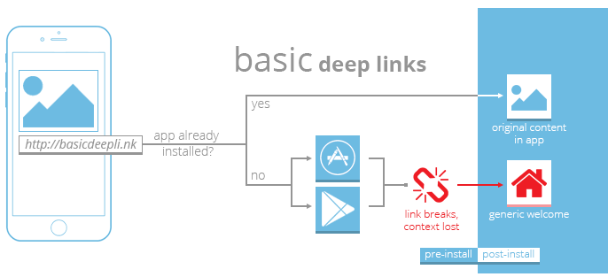
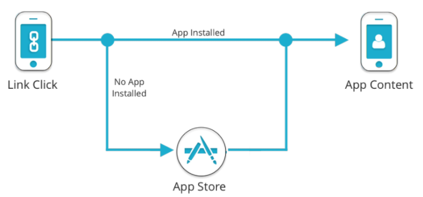
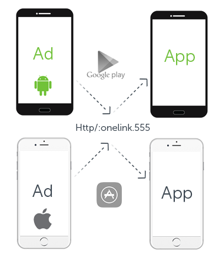
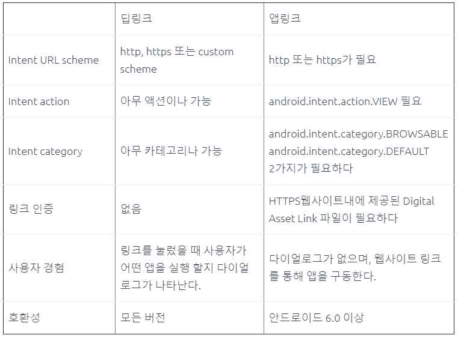
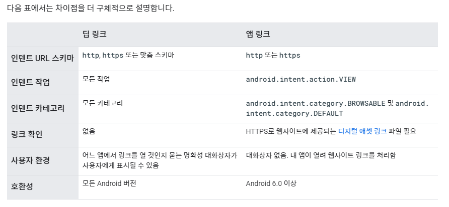

보통의 주소는 https://naver.com 이나 http://google.com 처럼 http나 https로 시작한다. 이 인터넷 주소들은 모두 특정 서비스의 웹페이지로 이동하는 역할을 해준다. 
하지만 youtube 나 특정 프로그램들을 사용하다보면 youtube:// 나 bugs:// 등의 요상한 주소를 볼 수도 있다. 이 주소들은 대체 뭘까? 웹(www) 어플리케이션이 http:// 나 https:// 프로토콜을 가지고 있는 것처럼,  어플리케이션도 각자의 프로토콜을 가질 수 있다. 위의 youtube:// 나 bugs://는 해당 어플리케이션을 호출하는 프로토콜이다. 이를 딥링크라고 부른다.
특히 모바일 쪽에서 youtube 링크를 크롬에서 켰는데, 자동으로 youtube 앱이 켜지면서 실행된다던가, 크롬에서 카카오톡 로그인을 하는데, 카카오톡이 켜지면서 인증이 진행된다던가 하는 일이 이 방식을 통해서 일어나게 된다. 윈도우 쪽에서는 크롬에서 어떤 작업을 할 때 갑자기 "어플리케이션을 연결하시겠습니까? " 라는 창이 뜨면서 확인을 누르면 윈도우에 설치된 어플리케이션이 실행되는 일도 있다.


# 딥링크의 발전과정

> 딥링크란 **'특정 페이지로 도달 할 수 있도록 하는 링크'**를 의미하며, 
> 모바일 딥링크는 **'앱(Application) 내 특정 페이지에 도달할 수 있도록 하는 링크'**를 의미

- 발전 순서

1. Direct Deep Link 

2. Deferred Deep Link

3. Dynamic Link or One Link 


## **1. Direct Deep Link(다이렉트 딥링크)**



- 작동방식
  - 기존에 앱이 설치된 유저 : 앱 내 특정 페이지로 이동
  - 앱 미설치 유저 : 각각의 앱 스토어로 이동
- 한계점
  - 기존에 앱을 설치한 유저의 경우, 앱 내 특정 페이지로 이동하는 것이 가능했지만, 
    미설치자의 경우 앱 스토어에서 앱을 설치하는 과정에서 모바일 딥링크가 유실


## 2. Deferred Deep Link(디퍼드 딥링크)


- 작동방식
  - 기존에 앱이 설치된 유저 : 앱 내 특정 페이지로 이동
  - 앱 미설치 유저 : 각각의 앱 스토어로 이동 후, 유저가 설치 및 실행하면 앱 내 특정 페이지로 이동
- Direct Deep Link 에 비해 개선된 부분
  -  앱 미설치 유저의 경우, 앱을 설치하고 실행한다해도, 그 정보가 유실이 되지 않아 앱 내 특정페이지로 이동할 수 있게 됨
- 한계점
  - 각각의 OS별로 딥링크를 구현해야함
    즉, ndroid에서는 Android에서만 사용할 수 있는 딥링크가, 
    iOS에서는 iOS에서만 사용할 수 있는 딥링크가 따로 존재


## 3. Dynamic Link(One Link)


- 작동방식
  - 기존에 앱이 설치된 유저 : 앱 내 특정 페이지로 이동
  - 앱 미설치 유저 : 각각의 앱 스토어로 이동 후, 유저가 설치 및 실행하면 앱 내 특정 페이지로 이동
- Deferred Deep Link 에 비해 개선된 부분
  - 단 하나의 URL로 각각의 OS에 맞게 자동으로 앱 내 특정페이지로 이동할 수 있게 해줍니다.


# 딥링크는 어떻게 구성되는가?

> 딥링크는 일반적으로 아래와 같이 `스키마(scheme)`와 `호스트(host) 및 경로(path)`의 두 부분으로 나뉘어져 있습니다.

```shell
{scheme}://{host_path}

# ex
기본 형식 : naversearchapp://inappbrowser?url=http%3A%2F%2Fm.naver.com&target=new&version=6
중계 페이지 : http://naverapp.naver.com/inappbrowser/?url=http%3A%2F%2Fm.naver.com&target=new&version=6
```

- 용어

  - url scheme
  - “http://”, “ftp://”, “market://”과 같은 문자열
  - 

- 딥링크의 종류

  1. URL schemes

  2. univeral link

     

## URL schemes

>  딥링크의 가장 초기 형태이다. url 스키마를 앱에 정의하는 방식으로 사용한다. `exapp://`

**단점**

- 스킴을 제약없이 설정이 가능하기 때문에, 고유한 딥링크를 점유할 수 없다.
  - 즉, **여러 앱에서 같은 이름의 스킴을 사용할 경우, 하이재킹(hijacking)**될 수도 있다.
  - 이러한 이유로 몇몇 브라우저에서는 URL schemes에 대해 경고메세지를 띄우거나 동작을 막곤한다.
- 작동 방식
  1. 웹페이지에서 하이퍼링크 클릭 시 url scheme이 system에 전달됨
  2. system에서 전달된 url scheme을 보고 실행 가능한 앱이 있는지 확인
  3. 해당 url scheme을 받을 수 있는 앱이 있다면 앱을 실행시키며 이 url을 함께 전달
  4. 앱이 실행되면서 url에 포함된 내용을 참조해서 특정 기능을 수행함
- URL schemes만으로 앱 설치 유무를 알 수 없다.
  - 앱이 설치되어있지 않을 경우에 대해 공식적인 지원이 없기 때문에
    앱 미설치 유저는 딥링크가 동작하지 않는다.


## Universal Link (웹 링크 형태)

- Univerasl Link 란?

  - URL schemes가 가진 문제점을 해결하기 위해 2015년 하반기에 iOS와 Android 플랫폼은 각각 새로운 딥링크를 개발하여 발표했다.

  - 개념적으로는 비슷한 형태의 딥링크이다.

    iOS는 Universal Link
    Android는 App Link

- 작동방식

  - 앱이 미설치 일 경우 대체 url로 이동된다.

- 특징

  - 표준 웹 링크 ([http://mydomain.com](http://mydomain.com/)) 이다.
  - HTTPS가 적용된 도메인을 딥링크로 사용한다. 보안문제를 해결하였다.
  - 특정 도메인이 딥링크로 사용되는 것이기 때문에, 고유성을 보장한다.
  - 대체 url(fallback url)을 공식 지원하기 때문에, 앱 미설치자의 OS에서 해당 link를 대체url로 판단하여서 웹사이트로 떨어트린다.

- 웹서버에서 Universal link(ios) 처리하는 흐름

  1. 기본적으로 유니버셜 링크는 웹 URL 형식이므로,
     해당 도메인에 연결되어있는 웹 서버에 1차적으로 요청이 들어간다.
  2. 해당 서비스가 조건 2개를 만족하면 웹사이트 대신 앱을 실행하라는 응답을 보낼 수 있다.
     - 유니버셜 링크를 지원한다는 설정이 되어있고,
     - 요청을 보낸 단말기에 특정 앱이 설치되어 있다면

- 단점

  - 사용자의 트리거에 의해서만 작동한다. 스크립트로 클릭을 유발할 경우에는 앱이 설치되어있음에도 대체URL로 작동한다.
  - 특정 앱에서는 동작하지 않도록 막고 있기도 하다. (핀터레스트, 페이스북 메신저, 텔레그램 ..)
  - 단점들때문에 URL 스킴과 복합적으로 사용하기도 한다.


## 앱링크는 뭔데?

```html
# 예시
<a id="applink" href="intent://qmenu=voicerecg&version=1#Intent;scheme=naversearchapp;action=android.intent.action.VIEW;category=android.intent.category.BROWSABLE;package=com.nhn.android.search;end">음성인식실행</a>
```


**딥링크**는 인텐트필터의 일종으로 사용자들이 직접적으로 안드로이드 앱내의 액티비티에 접근하는것을 허용합니다. 다른 앱에서 또는 웹브라우저에서의 링크를 클릭했을때 해당 링크의 scheme을 보고 앱을 실행하게 되며, 해당 링크를 처리하는 2개이상의 앱이 있다면 사용자에게 다이얼로그를 띄어 앱을 실행할 수 있도록 유도 합니다.

**앱링크**는 인증된 웹사이트 URL을 기반으로 하는 딥링크입니다. 링크 클릭시 앱이 설치되어있다면 즉시 열어서 보여주고 없다면 웹으로 이동합니다. 다이얼로그는 나타나지 않습니다. 



