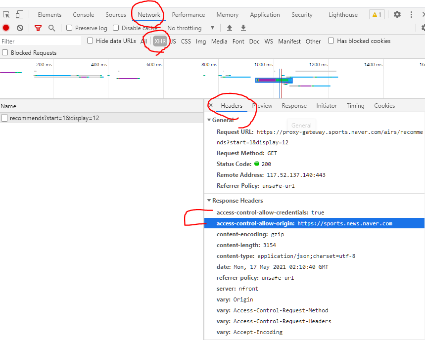
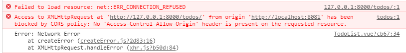

# 서버와 클라이언트

- server
  - 클라이언트에게 정보, 서비스를 제공하는 컴퓨터 시스템
    -  DB 와 통신하며 데이터를 CRUD
    - 요청을 보낸 Client에게 이러한 정보를 응답
  - 정보와 서비스
    - django를 통해 응답한 template
    - DRF 를 통해 응답한 JSON
- 클라이언트
  - 서버에게 그 서버가 맞는(서버가 제공하는) 서비스를 요청하고
  - 서비스 요청을 위해 필요한 인자를 서버가 원하는 방식에 맞게 제공
  - 서버로 부터 반환되는 응답을 사용자에게 적절한 방식으로 표현


# CORS

- Cross-origin Resource Sharing(CORS)
  -  교차 출처 리소스(자원) 공유
- **추가 HTTP header를 사용**하여, 특정 출처에서 실행중인 웹 애플리케이션이 **다른 출처의 자원에 접근할 수 있는 권한을 부여하도록 브라우저에게 알려주는 체제**
- CORS는 HTTP의 일부로, 어떤 호스트에서 자신의 컨텐츠를 불러갈 수 있는지 **서버에 지정할 수 있는 방법**
- 리소스가 자신의 출처(Domain, Protocol, Port)와 다른 교차 출처  HTTP 요청을 실행
- 보안 상의 이유로 브라우저는 교차 출처 HTTP 요청을 제한(SOP)
  - 예를 들어 XMLHttpRequest는 SOP를 따름
- 다른 출처의 리소스를 불러오려면 그 출처에서 올바른 CORS header 를 포함한 응답을 반환해야함
- CORS mdn
  - https://developer.mozilla.org/ko/docs/Web/HTTP/CORS
- 눈으로 확인할 수 있는 방법
  - f12 - Network - XHR - Headers - Response Headers 안에 들어있음 



## CORS의 반대 = SOP

- same-origin policy(SOP)
  - 동일 출처 정책
- 특정 출처(origin)에서 불러온 문서나 스크립트가 다른 출처에서 가져온 리소스와 상호작용 하는 것을 제한하는 **보안방식**
- 잠재적으로 해로울 수 있는 문서를 분리함으로써 공격받을 수 있는 경로를 줄임
- 정의
  - 두 URL의 Protocol, Port, Host가 모두 같아야 동일한 출처라고 함


## 왜 CORS를 사용하는가?

1. 브라우저  및 웹 애플리케이션의 보호
   - 악의적인 사이트의 데이터를 가져오지 않도록 사전 차단
   - 응답으로 받는 자원에 대한 최소한의 검증
   - 서버는 정상적으로 응답하지만 브라우저에서 차단
2. server 의 자원관리
   - 누가 해당 리소스에 접근할 수 있는지 관리 가능


##  CORS HTTP

- CORS 표준에 의해 추가된 **HTTP header**를 통해 이를 통제
- 예시
  -  Access-Control-Allow-Origin
  -  Access-Control-Allow-Credentials
  -  Access-Control-Allow-Headers
  -  Access-Control-Allow-Methods


### Access-Control-Allow-Origin

- 이 응답이 주어진 출처(Origin) 으로 부터 요청 코드와 공유 될수 있는지를 나타냄
- 예시
  -  `Access-Control-Allow-Origin: *`
    - 브라우저 리소스에 접근하는 임의의  origin 으로 부터 요청을 허용한다고 알리는 응답에 포함
    - '*' 는 모든 도메인에서 접근할 수 있음을 의미
    - '*'외에 특정 origin 하나를 명시할 수 있음


- CORS 시나리오 예시
  - 요청 헤더의 Origin 을 보면 localhost:8000으로 부터 요청이 왔다는 것을 알 수 있음
  - 서버는 이에 대한 응답으로 Access-Control-Allow-Origin 헤더를 다시 전송
  - 만약 서버의 리소스 소유자가 오직 localhost:8000의 요청만 리소스에 대한 접근을 허용하려는 경우 '*'가 아닌 'Access-Control-Allow-Origin : localhost:8000'을 전송해야함


  ## 우리가 하려는 시나리오

1. Vue.js 에서  A 서버로 요청
2.  A 서버는 Access-Conrol-Allow-Origin 에 특정한 origin을 포함시켜 응답
   - 서버는 CORS policy와 직접적인 연관이 없고 그저 요청에 응답함
3. 브라우저는 응답에 Access-Control-Allow-Origin를 확인 후 허용 여부를 결정
4. 프레임워크 별로 이를 지원하는 라이브러리가 존재
   - django 는  django-cors-headers 라이브러리를 통해 응답 헤더 및 추가 설정 가능


# CORS 실습하기

- CORS 설정을 하지 않았을 떄 뜨는 에러




## django 설정

- `python -m pip install django-cors-headers`

  - https://pypi.org/project/django-cors-headers/

  - `settings.py > INSTALLED_APPS` 에 `'corsheaders', `추가

  - `settings.py > MIDDLEWARE`에 두개 추가

    - `'corsheaders.middleware.CorsMiddleware',`
    - `'django.middleware.common.CommonMiddleware',`
    - corsheader 의 경우 가능한 위에 있어야함. MIDDLEWARE 같은 경우 순서가 중요함
    
  - 실제로 CORS 허용 옵션

    ```python
    # 1. 특정 Origin만 선택적으로 허용
    CORS_ALLOWED_ORIGINS = [
        "https://example.com",
        "https://sub.example.com",
        "http://localhost:8080",
        "http://127.0.0.1:9000"
    ]
    
    # 2. 모든 Origin 허용
    CORS_ALLOW_ALL_ORIGINS = True
    
    # 3. 정규표현식을 이용해서도 가능 - 밑은 내가 만든 local에서는 모든 port를 사용할 수 있는 정규식
    CORS_ALLOWED_ORIGIN_REGEXES = [
        r"(?:https?:\/\/)127.0.0.1:*",
        r"(?:https?:\/\/)localhost:*",
    ]
    ```

    
