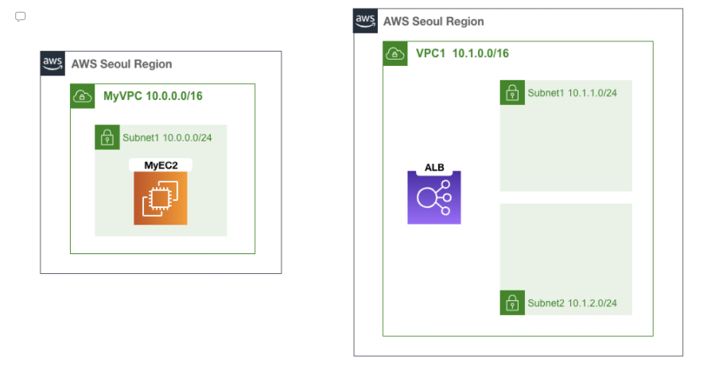
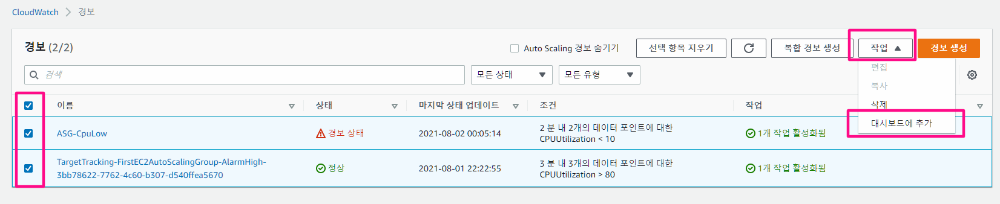
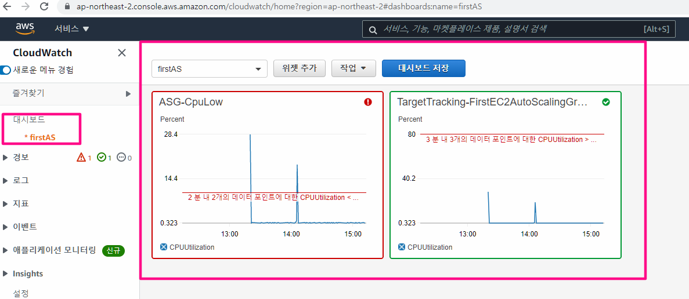
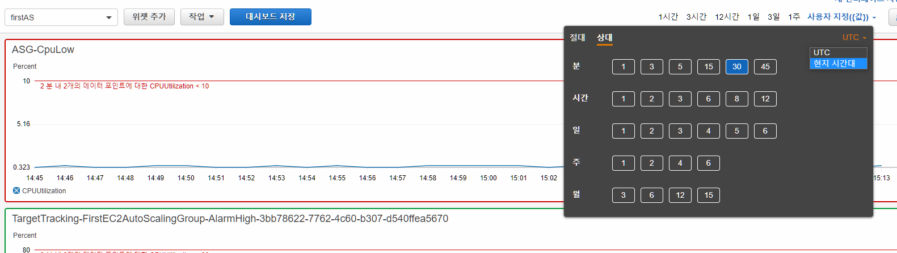
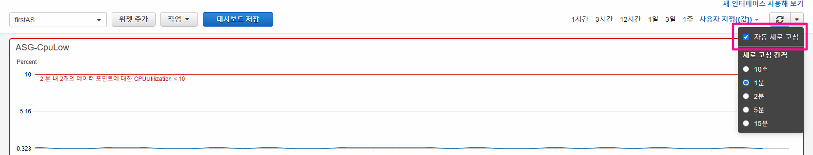
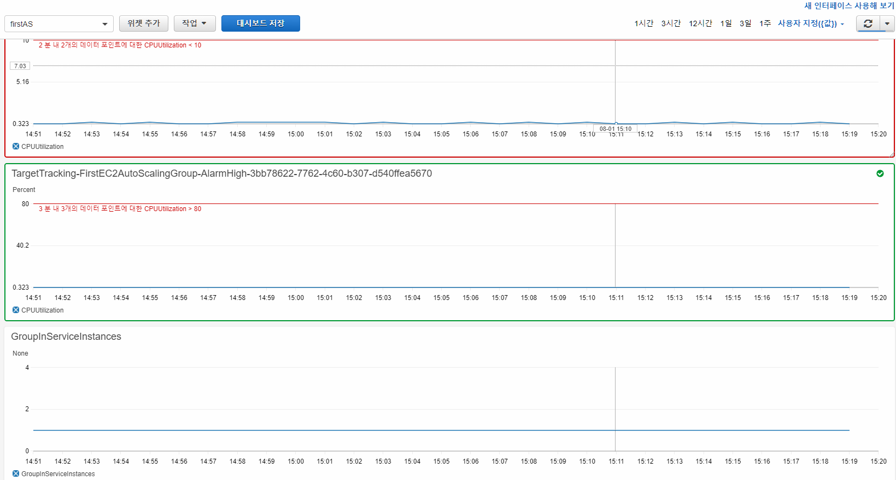
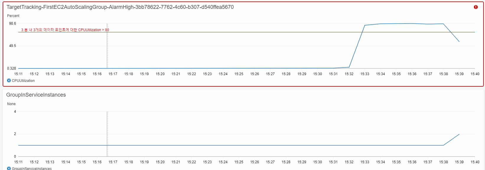
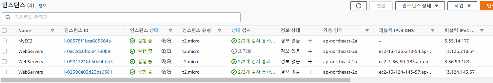
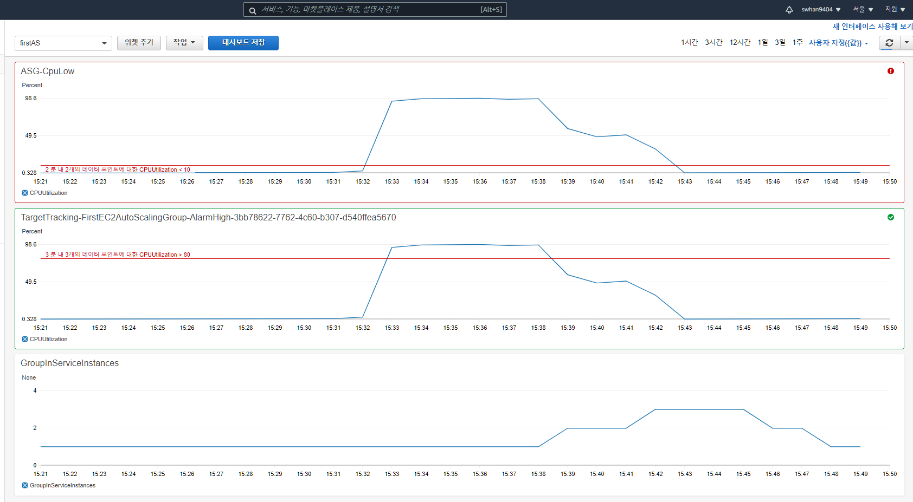

- 실습 내용
  - Auto Scaling 그룹 생성을 통한 오토스케일링 생성
  - Scale Up, down 정책 만들기
  - CPU 부하를 줘서 잘 작동하는지 테스트


# CloudFormation으로 환경 구성

- CloudFormation 스택 생성 - [링크](https://console.aws.amazon.com/cloudformation/home?region=ap-northeast-2#/stacks/new?stackName=AutoScalingLab&templateURL=https:%2F%2Fcloudneta-book.s3.ap-northeast-2.amazonaws.com%2Fchapter5%2Fautoscaling-AFOS.yaml) 클릭 후 템플릿 파일로 기본 환경 자동 배포 됩니다
- 배포 후 기본 환경 도식화





# MyEC2 확인

- 퍼블릭 IPv4를 통해 접속

```shell
# AWS CLI 버전 확인 
aws --version

# AWS ec2 설정 확인하기
aws ec2 describe-instances

# AWS ec2 설정 확인하기 - 정보를 필터링(id, 상태, privateIP)해서 텍스트로 출력하기
aws ec2 describe-instances --query 'Reservations[*].Instances[*].[InstanceId, State.Name, PrivateIpAddress]' --output text

# 반복(1초간격)해서 인스턴스 정보 확인 - 오토스케일링에 의해서 인스턴스가 증가하게 되면 그 정보를 확인하기 위해서
while true; do aws ec2 describe-instances --query 'Reservations[*].Instances[*].[InstanceId, State.Name, PrivateIpAddress]' --output text; date; sleep 1; done


--------------------------------------------------------
# ApachBench(부하테스트용) 확인 - 이미 설치되어있어서 사용가능함
ab -V

# ALB DNS 이름 변수 지정
ALB=ALB DNS 이름

# dig(도메인주소찾기)로 ALB 변수로 잘 들어갔는지 체크 - IP 주소 나옴
dig +short $ALB

# ALB로 요청보내보기 - ALB에 아무 인스턴스도 연결되어있지 않기떄문에 503이 반환됨
curl $ALB

--------------------------------------
(아래는 Auto Scaling 배포 후)
# 반복문으로 인스턴스 정보확인
while true; do aws ec2 describe-instances --filter "Name=tag:Lab,Values=ASLab" --query 'Reservations[*].Instances[*].[InstanceId, State.Name, PrivateIpAddress]' --output text; date; sleep 1; done

# 반복문으로 ALB에 요청 보내기
while true; do curl $ALB --silent --connect-timeout 1; date; echo "---[AutoScaling]---"; sleep 1; done
```


# 시작 템플릿 생성 및 auto Scaling 그룹 설정

1. EC2 > 인스턴스 > 시작템플릿 > 시작 템플릿 생성
2. 시작 템플릿 생성
   - 시작 템플릿 이름 : EC2LaunchTemplate
   - 설명 : EC2 Auto Scaling v1.0
   - Auto Scaling 지침 : 체크
   - AMI : Amazon Linux 2 AMI(HVM), SSD Volume Type - 아키텍처 : 64비트(x86)
   - 인스턴스 유형 : t2.micro
   - 키 페어 : *(각자 자신의 SSH 키페어 선택)*
   - 네트워킹 플랫폼 : VPC
   - 보안 그룹 : ###-VPC1SG-### 포함된것 선택
   - 리소스 태그 : 키(Lab) , 값(ASLab)
   - 고급 세부 정보 ← 클릭
     - 세부 CloudWatch 모니터링 : 활성화 ( 1분 단위 모니터링 )
     - 사용자 데이터 : 아래 내용 복붙!

```shell
#!/bin/bash
RZAZ=`curl http://169.254.169.254/latest/meta-data/placement/availability-zone-id`
IID=`curl 169.254.169.254/latest/meta-data/instance-id`
LIP=`curl 169.254.169.254/latest/meta-data/local-ipv4`
amazon-linux-extras install -y php7.2
yum install httpd htop tmux -y
systemctl start httpd && systemctl enable httpd
echo "<h1>RegionAz($RZAZ) : Instance ID($IID) : Private IP($LIP) : Web Server</h1>" > /var/www/html/index.html
echo "1" > /var/www/html/HealthCheck.txt
curl -o /var/www/html/load.php https://cloudneta-book.s3.ap-northeast-2.amazonaws.com/chapter5/load.php --silent
curl -o /var/www/html/cpuload.php https://cloudneta-book.s3.ap-northeast-2.amazonaws.com/chapter5/cpuload-aws.php --silent
```


3. EC2 > Auto Scaling > Auto Scaling 그룹 > 그룹생성
   - 1단계 : 시작 템플릿 또는 구성선택
     - Auto Scaling 그룹 이름 : FirstEC2AutoScalingGroup
     - 시작 템플릿 : EC2LaunchTemplate
   - 2단계 : 설정구성
     - 인스턴스 구매 옵션 : 시작 템플릿 준수 
     - 네트워크 - VPC : VPC1 
     - 네트워크 - 서브넷 : VPC1-Public-SN-1 , VPC1-Public-SN-2
   - 3단계 : 고급 옵션 구성
     - 로드 밸런싱 : 기존 로드 밸런서에 연결 
     - 로그 밸런서 대상 그룹에서 선택 : 선택 
     - 기존 로드 밸런서 대상 그룹 : ALB-TG 
     - 상태 확인 유형 : ELB (Check) 
     - 상태 확인 유예 기간 : 60초 
     - 모니터링 - CloudWatch 내에서 그룹 지표 수집 활성화 : 체크
   - 4단계 : 그룹 크기 및 조정 정책 구성
     - 원하는 용량 : 1 
       - 시작할 떄 만들어지는 갯수
     - 최소 용량 : 1 
     - 최대 용량 : 4 
     - 조정 정책 : 대상 추척 조정 정책 
     - 조정 정책 이름 : Scale Out Policy
     - 대상 값 : 80 → 3분 동안 3번 연속 CPU 80% 경우(1분 마다 기록) 
     - 인스턴스 요구 사항 : 60초 → 지표에 포함하기 전 워밍업 시간(초) 
     - 확대 정책만 생성하려면 축소 비활성화 : Check → 축소는 직접 정책 추가 예정 
     - 인스턴스 축소 보호 활성화 : UnCheck
   - 5단계 : 알림추가 : default
   - 6단계 : 태그추가
     - 키(Name) , 값(WebServers) 
   - 7단계 : 검토 > Auto Scaling 그룹 생성


4. 생성된 Auto Scaling 그룹 클릭 → 세부 정보 → 하단 고급 구성 편집 클릭 → 업데이트

   - 종료 정책 : Newest Instance → 기본 Default 는 제거 

     및 Newest Instance 선택

     - 축소를 어떤 기준으로 선택해서 할것인지 정하는 것
     - Newest Instance 의 경우 최근에 만들어진 것을 제거
     - Oldest Instance 의 경우 버전업할 떄 무중단 서비스로 옛날 인스턴스 삭제할 때 사용
     - Closet To Nest Instance Hour : 과금이 1시간 단위이기 때문에 1시간 종료시점에 가장 근접한 인스턴스를 삭제하여 비용효율을 최대한으로

   - 기본 휴지 기간 : 180초


5. 축소 조정 정책을 추가 : 생성된 Auto Scaling 그룹 클릭 → 자동 조정 → 정책 추가 클릭

   - 정책 유형 : 단순 조정
   - 조정 정책 이름 : Scale In Policy
   - CloudWatch 경보 - 경보 생성( CPU 사용량이 10보다 작은게 2번 반복되면 경보)
     - 지표 선택 - EC2 > Auto Scaling 그룹별 > CPU Utilization
     - 기간 : 1분
     - 조건 (임계값 유형) - 정적
     - 보다 작음 (< 임계값)
     - ... 보다 : 10
     - 추가구성
       - 경보를 알릴 테이터 포인트 2/2
     - 작업구성 : 알림설정 - 제거
     - 경보이름 : ASG-CpuLow
   - 작업수행
     - 제거 - 1 - 용량단위
   - 그런 다음 대기 - 60초

   

( 내용 요약 )

- 스케일 업
  - 3분이상  CPU 사용량 평균 80% 이상
- 스케일 다운
  - 2분이상 CPU 사용량 10% 미만


# 대시보드 구성하기

1. CloudWatch > 경보




2. 새로생성 으로 이름 만들어 준 후 체크 클릭

   위젯 유형 - 행

   대시보드에 추가 하기




3. 시간 표현 - 사용자 지정값으로 변경
   - 30분 단위
   - 현지시간대




4. 자동 새로고침도 체크




## 인스턴스 갯수 확인 위젯 추가

- 위젯 추가 > 행 > 지표 > 
  - Auto Scaling > 그룹지표 > GroupServiceInstances
- 그래프로 표시된 지표
  - 기간 : 1분 단위로 변경
- 그래프 옵션
  - 왼쪽 Y축 
    - 한도 최소 : 0
    - 한도 최대 : 4




# CPU 부하주기

1. EC2 >  WebServers 의 public IP로 Xshell 접근

```shell
# 관리자 권한으로 변경
sudo su - 

# 인스턴스 상태확인 모니터링 ( 터미널 1 )
htop

```


2. EC2 > MyEC2 의 public IP로 Xshell 접근

```shell
# 웹 접속 테스트 (리전, 인스턴스ID, Private IP)
ALB=ALB-TEST-1723846256.ap-northeast-2.elb.amazonaws.com

# 접속 시 마다 CPU 부하 발생
curl $ALB/load.php;echo

# 접속 시 마다 현재 CPU 부하 출력 
curl $ALB/cpuload.php;echo

# 1개 요청(풀)로 총합 500번 요청 진행
ab -n 500 -c 1 http://$ALB/load.php

---------정보확인
# 현재 인스턴스 정보 확인
while true; do aws ec2 describe-instances --filter "Name=tag:Lab,Values=ASLab" --query 'Reservations[*].Instances[*].[InstanceId, State.Name, PrivateIpAddress]' --output text; date; sleep 1; done

# ALB 부하분산 접속 확인
while true; do curl $ALB --silent --connect-timeout 1; date; echo "---[AutoScaling]---"; sleep 1; done

# 접속 되는 EC2 마다 현재 CPU 부하 출력
while true; do curl $ALB/cpuload.php --silent --connect-timeout 1; date; echo "---[AutoScaling]---"; sleep 1; done

# EC2 증가 이후 증감 확인
for i in {1..100}; do curl $ALB --silent ; done | sort | uniq -c | sort -nr
```










3. 로그확인하기

   - Auto Scaling > 내가만든그룹선택 > 활동 

     여기서 작업 로그를 확인할 수 있음


# 자원삭제

1. CloudWatch 삭제
   - 대시보드에 추가된 지표 Metric 삭제 > 대시보드 삭제
2. EC2 Auto Scaling Group 삭제
3. EC2 시작 템플릿(Launch Templates) 삭제
4. CloudFormation 템플릿 스택 삭제

