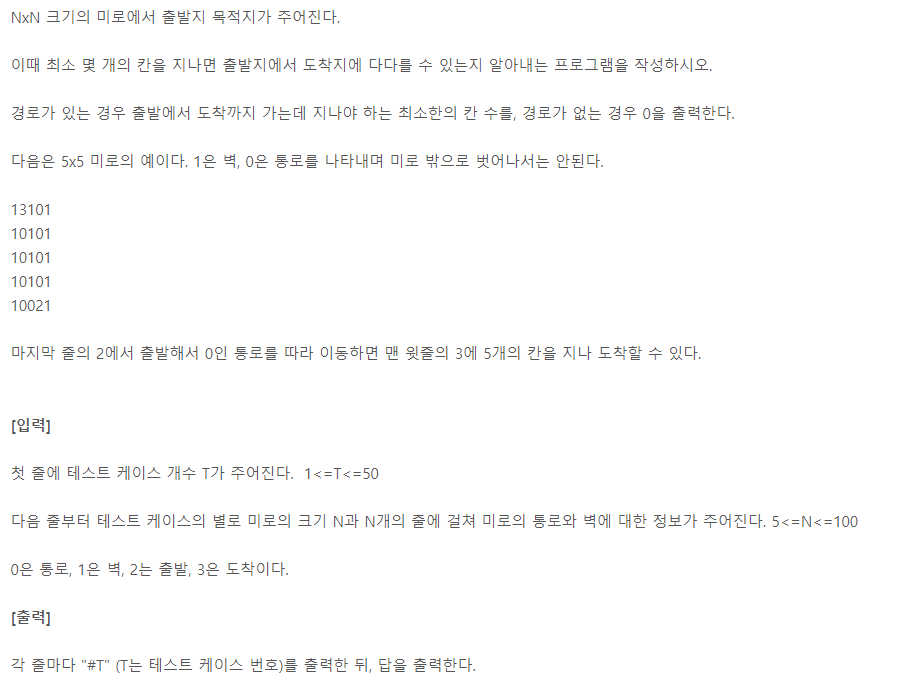

https://swexpertacademy.com/main/learn/course/subjectDetail.do?courseId=AVuPDN86AAXw5UW6&subjectId=AWOVIoJqqfYDFAWg#

코스에서 미로의거리


# 1. BFS 를 이용한 풀이(distance 변수사용)
- 시작점을 찾고
- 큐에 시작점을 넣고 
- 반복
  - 큐에서 꺼냄
  - 도착 지점이면 끝냄
  - 길 이면서, 방문하지 않은 곳일 경우
    - 방문처리하고
    - 거리 1 늘리고
    - 4방향을 0<= <N 만 확인한다음 큐에다 다시 넣음

```python
import sys
sys.stdin = open("input.txt")

from collections import deque


T = int(input())

def find_start() :
    for y in range(N) :
        for x in range(N) :
            if miro[y][x] == '2' :
                return x, y

def func(start_x, start_y) :
    queue = deque([(start_x, start_y, 0)]) # 시작x, y, 시작점과의거리
    visited = [[0] * N for _ in range(N)]

    move_x = [1,-1,0,0] # 오른쪽, 왼쪽, 위, 아래
    move_y = [0,0,-1,1]
    while queue : # 큐가 빌때 까지
        now_x, now_y, distance = queue.popleft()
        if miro[now_y][now_x]=='3' :
            return distance-1 # 도착지점은 길이에 포함 안되네..
        if miro[now_y][now_x] in ['0','2'] and visited[now_y][now_x] == 0 : # 길이고, 방문하지 않은 경우
            visited[now_y][now_x] = 1
            distance += 1
            for i in range(4) :
                next_x = now_x + move_x[i]
                next_y = now_y + move_y[i]
                if 0<=next_x<N and 0<=next_y<N :
                    queue.append((next_x, next_y, distance))


# BFS - 최소경로 / 실행시간 :실행 시간 : 0.15346s
for tc in range(1, T+1):


    N = int(input()) # 미로 크기
    miro = [input() for _ in range(N)]
    start_x, start_y = find_start()
    result = func(start_x, start_y)
    if result == None :
        result =0

    print("#{} {}".format(tc, result))

```

# 1-1 번외 : list를 이용한 BFS 구현
- 왠지 모르게 deque로 구현한 BFS보다 빠름 (뭐지?????)

```python
import sys
sys.stdin = open("input.txt")


T = int(input())

def find_start() :
    for y in range(N) :
        for x in range(N) :
            if miro[y][x] == '2' :
                return x, y

def func(start_x, start_y) :
    ####################차이#####################
    queue = [(start_x, start_y, 0)] # 시작x, y, 시작점과의거리
    ############################################
    visited = [[0] * N for _ in range(N)]

    move_x = [1,-1,0,0] # 오른쪽, 왼쪽, 위, 아래
    move_y = [0,0,-1,1]
    while queue : # 큐가 빌때 까지
        now_x, now_y, distance = queue.pop(0)
        if miro[now_y][now_x]=='3' :
            return distance-1 # 도착지점은 길이에 포함 안되네..
        if miro[now_y][now_x] in ['0','2'] and visited[now_y][now_x] == 0 : # 길이고, 방문하지 않은 경우
            visited[now_y][now_x] = 1
            distance += 1
            for i in range(4) :
                next_x = now_x + move_x[i]
                next_y = now_y + move_y[i]
                if 0<=next_x<N and 0<=next_y<N :
                    queue.append((next_x, next_y, distance))

# BFS - 최소경로 list로 구현 / 실행시간 :실행 시간 : 0.12844s
for tc in range(1, T+1):


    N = int(input()) # 미로 크기
    miro = [input() for _ in range(N)]
    start_x, start_y = find_start()
    result = func(start_x, start_y)
    if result == None :
        result =0

    print("#{} {}".format(tc, result))

```

# 1-2 번외  :visited를 거리로 사용

- visited 를 거리로 사용

```python
import sys
sys.stdin = open("input.txt")

from collections import deque


T = int(input())

def find_start() :
    for y in range(N) :
        for x in range(N) :
            if miro[y][x] == '2' :
                return x, y

####################차이#####################
def func(start_x, start_y) :
    queue = deque([(start_x, start_y)]) # 시작x, y, 시작점과의거리
    visited = [[0] * N for _ in range(N)]

    move_x = [1,-1,0,0] # 오른쪽, 왼쪽, 위, 아래
    move_y = [0,0,-1,1]
    while queue : # 큐가 빌때 까지
        now_x, now_y = queue.popleft()
        if miro[now_y][now_x]=='3' :
            return visited[now_y][now_x]-1 # 도착지점은 길이에 포함 안되네..

        for i in range(4) :
            next_x = now_x + move_x[i]
            next_y = now_y + move_y[i]
            if 0<=next_x<N and 0<=next_y<N and (miro[next_y][next_x] in ['0','3']) and visited[next_y][next_x] == 0:
                visited[next_y][next_x] = visited[now_y][now_x] +1
                queue.append((next_x, next_y))
#########################################


# BFS - 최소경로/ visited 거리로 이용 / 실행시간 :실행 시간 : 0.15346s
for tc in range(1, T+1):


    N = int(input()) # 미로 크기
    miro = [input() for _ in range(N)]
    start_x, start_y = find_start()
    result = func(start_x, start_y)
    if result == None :
        result =0

    print("#{} {}".format(tc, result))


```

# 1-3 번외  : 길이를 측정해서 다음 스탭으로 넘어갔는지를 체크해서 거리구하기

- 스탭마다 큐의 사이즈를 구함
  - 같은 단계에 있는 queue만 담김

- 큐 사이즈 만큼 루프를 돌고 끝나면 distance를 증가시키고, 다시 큐의 사이즈를 구함

```python
from collections import deque


T = int(input())

def find_start() :
    for y in range(N) :
        for x in range(N) :
            if miro[y][x] == '2' :
                return x, y

def func(start_x, start_y) :
    queue = deque() # 큐 생성
    queue.append([start_x, start_y]) # 시작x, y, 시작점과의거리
    visited = [[0] * N for _ in range(N)]

    move_x = [1,-1,0,0] # 오른쪽, 왼쪽, 위, 아래
    move_y = [0,0,-1,1]
    ###########################차이점############################
    distance =0
    while queue : # 큐가 빌때 까지
        size = len(queue)
        for i in range(size) :
            now_x, now_y = queue.popleft()
            if miro[now_y][now_x] == '3':
                return distance - 1  # 도착지점은 길이에 포함 안되네..

            elif miro[now_y][now_x] in ['0', '2'] and visited[now_y][now_x] == 0:  # 길이고, 방문하지 않은 경우
                visited[now_y][now_x] = 1

                for i in range(4):
                    next_x = now_x + move_x[i]
                    next_y = now_y + move_y[i]
                    if 0 <= next_x < N and 0 <= next_y < N:
                        queue.append((next_x, next_y))
        distance+=1
    ###############################################################


# BFS - 최소경로 / 실행시간 :실행 시간 : 0.15346s
for tc in range(1, T+1):


    N = int(input()) # 미로 크기
    miro = [input() for _ in range(N)]
    start_x, start_y = find_start()
    result = func(start_x, start_y)
    if result == None :
        result =0

    print("#{} {}".format(tc, result))


```


# 2. DFS 를 이용한 풀이

- 도착지점에 도착해도 도착지점을 visit에 넣지 않고 다양한 방법으로 거리를 찾음
- 여러 군데로 도착하는 거리 중에 가장 작은 거리를 최단거리로
- 생각해본 결과 : 이 방식으로 하면 최단거리가 안구해질 수도 있음 
  - 안되는 경우 : 최단경로 거리와 중간 경로가 겹칠 경우
```python
import sys
sys.stdin = open("input.txt")

T = int(input())

def find_start() :
    for y in range(N) :
        for x in range(N) :
            if miro[y][x] == '2' :
                return x, y

move_x = [1,-1,0,0] # 오른쪽, 왼쪽, 위, 아래
move_y = [0,0,-1,1]
####################차이#####################
def func(now_x, now_y, distance) :
    global result
    if miro[now_y][now_x] == '3' : # 도착하면 지금까지 구한 거리랑 비교
        if (distance-1) < result :
            result = distance-1
        return

    if miro[now_y][now_x] in ['0', '2'] and visited[now_y][now_x] == 0:  # 길이고, 방문하지 않은 경우
        visited[now_y][now_x] = 1
        distance += 1
        for i in range(4):
            next_x = now_x + move_x[i]
            next_y = now_y + move_y[i]
            if 0 <= next_x < N and 0 <= next_y < N:
                func(next_x, next_y, distance)
#############################################

# DFS 로 모든 경로 구하고 최소값으로 구하기 / 실행 시간 : 0.12835s
for tc in range(1, T+1):
    N = int(input())  # 미로 크기
    miro = [input() for _ in range(N)]
    start_x, start_y = find_start()

    visited = [[0] * N for _ in range(N)]
    result = N ** 2
    func(start_x, start_y, 0)

    if result == N**2: # 초기값에서 변화가 없을 경우 도착 못한것
        result = 0
    
    print("#{} {}".format(tc, result))

```

# 2-1.  DFS 응용 완전탐색으로 모든 경로 찾기
- 모든 경로를 탐색(DFS 응용 >> 백트래킹까지 응용하면 될듯)
- 도착점에 도착하는 경로는 이전에 구한 도착경로랑 비교해서 더 작을 경우 최소거리로 기억
```python
import sys

sys.stdin = open("input.txt")

T = int(input())


def find_start():
    for y in range(N):
        for x in range(N):
            if miro[y][x] == '2':
                return x, y


move_x = [1, -1, 0, 0]  # 오른쪽, 왼쪽, 위, 아래
move_y = [0, 0, -1, 1]


def func(now_x, now_y, distance):
    global result
    if miro[now_y][now_x] == '3':  # 도착하면 지금까지 구한 거리랑 비교
        if (distance - 1) < result:
            result = distance - 1
        return

    distance += 1
    for i in range(4):
        next_x = now_x + move_x[i]
        next_y = now_y + move_y[i]
        if 0 <= next_x < N and 0 <= next_y < N and miro[next_y][next_x] in ['0', '3'] and visited[next_y][next_x] == 0:  # 길이고, 방문하지 않은 경우:
            visited[next_y][next_x] = 1
            func(next_x, next_y, distance)
            ####################차이#####################
            visited[next_y][next_x] = 0
            ############################################


# 모든 경로 구하고 최소값으로 구하기 / 실행 시간 : 0.13294s
for tc in range(1, T + 1):
    N = int(input())  # 미로 크기
    miro = [input() for _ in range(N)]
    start_x, start_y = find_start()

    visited = [[0] * N for _ in range(N)]
    result = N ** 2
    func(start_x, start_y, 0)

    if result == N ** 2:  # 초기값에서 변화가 없을 경우 도착 못한것
        result = 0

    print("#{} {}".format(tc, result))

```


# 3. 백트래킹(DFS + 중단조건 추가)

- DFS를 하는데 이전에 구한 최단거리보다 긴 거리의 탐색은 하지 않음
- 생각해본 결과 : 이 방식으로 하면 최단거리가 안구해질 수도 있음 
  - 안되는 경우 : 최단경로 거리와 중간 경로가 겹칠 경우
```python
import sys

sys.stdin = open("input.txt")

T = int(input())


def find_start():
    for y in range(N):
        for x in range(N):
            if miro[y][x] == '2':
                return x, y

move_x = [1, -1, 0, 0]  # 오른쪽, 왼쪽, 위, 아래
move_y = [0, 0, -1, 1]

def func(now_x, now_y, distance):
    global result

    if miro[now_y][now_x] == '3':  # 도착하면 지금까지 구한 거리랑 비교
        if (distance - 1) < result:
            result = distance - 1
        return
    ####################차이#####################
    elif (distance-1) > result : # 거리가 result보다 커서 더이상 판단할 필요가 없는 경우 끝내기
        return
    ############################################

    if miro[now_y][now_x] in ['0', '2'] and visited[now_y][now_x] == 0:  # 길이고, 방문하지 않은 경우
        visited[now_y][now_x] = 1
        distance += 1
        for i in range(4):
            next_x = now_x + move_x[i]
            next_y = now_y + move_y[i]
            if 0 <= next_x < N and 0 <= next_y < N:
                func(next_x, next_y, distance)

# 백트래킹(DFS + 조건)로 모든 경로 구하고 최소값으로 구하기 / 실행 시간 : 0.12167s
for tc in range(1, T + 1):
    N = int(input())  # 미로 크기
    miro = [input() for _ in range(N)]
    start_x, start_y = find_start()

    visited = [[0] * N for _ in range(N)]
    result = N ** 2
    func(start_x, start_y, 0)

    if result == N ** 2:  # 초기값에서 변화가 없을 경우 도착 못한것
        result = 0

    print("#{} {}".format(tc, result))

```

# 3-1 백트래킹 활용 경로탐색

```python
import sys

sys.stdin = open("input.txt")

T = int(input())


def find_start():
    for y in range(N):
        for x in range(N):
            if miro[y][x] == '2':
                return x, y


move_x = [1, -1, 0, 0]  # 오른쪽, 왼쪽, 위, 아래
move_y = [0, 0, -1, 1]


def func(now_x, now_y, distance):
    global result
    if miro[now_y][now_x] == '3':  # 도착하면 지금까지 구한 거리랑 비교
        if (distance - 1) < result:
            result = distance - 1
        return
    ####################차이#####################
    elif (distance-1) > result : # 중단 조건 추가
        return
    ############################################

    distance += 1
    for i in range(4):
        next_x = now_x + move_x[i]
        next_y = now_y + move_y[i]
        if 0 <= next_x < N and 0 <= next_y < N and miro[next_y][next_x] in ['0', '3'] and visited[next_y][next_x] == 0:  # 길이고, 방문하지 않은 경우:
            visited[next_y][next_x] = 1
            func(next_x, next_y, distance)
            visited[next_y][next_x] = 0


# 백트래킹 활용 경로탐색 / 실행 시간 : 0.12256s
for tc in range(1, T + 1):
    N = int(input())  # 미로 크기
    miro = [input() for _ in range(N)]
    start_x, start_y = find_start()

    visited = [[0] * N for _ in range(N)]
    result = N ** 2
    func(start_x, start_y, 0)

    if result == N ** 2:  # 초기값에서 변화가 없을 경우 도착 못한것
        result = 0

    print("#{} {}".format(tc, result))


```


# 하면서 알게된 유의사항
- 최단 거리를 DFS 개념을 이용해서 구현할 시에, python 최대 재귀 깊이로 인하여 런타임 에러가 날 수 있다. 그래서 BFS가 더 선호된다.