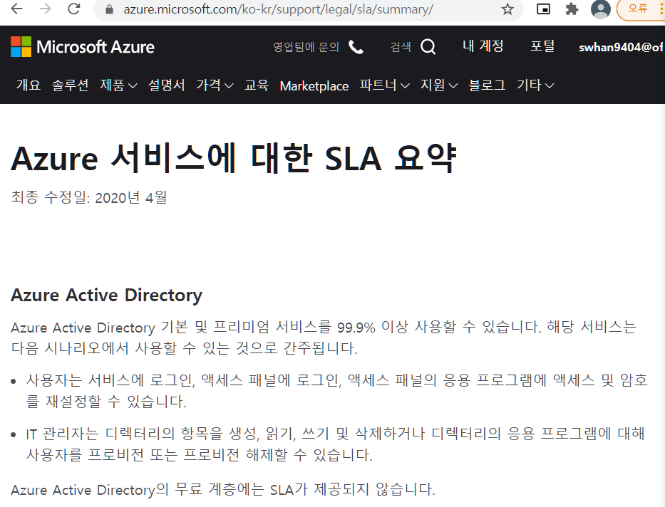

- Microsoft 클라우드 서비스의 보안성을 평가하는데 사용할 수 있는 곳들에 대해 알아보자

- SLA 
  - **S**ervice-**L**evel **A**greement
  - 1분 1초가 중요한 사이트들의 경우 단 1초만 끊기더라도 큰 피해를 입을 수 있다. 예를 들어 [G마켓과 같은 쇼핑 사이트가 1분간 마비될 경우 그 1분 사이에 클릭한 사용자들이 다른 사이트에서 구매를 하게 될 수도 있다. 따라서 호스팅 업체는 어느 정도의 서비스를 제공할지를 정하고 계약이 깨졌을때 어느 정도의 보상을 할지 등을 합의하여 계약을 맺는다

# 1. 보안센터 액세스

1. [https://docs.microsoft.com/ko-kr/compliance/regulatory/offering-home](https://docs.microsoft.com/ko-kr/compliance/regulatory/offering-home?WT.mc_id=AI-MVP-5003937)
   - ①② 브라우저에서 [Microsoft Microsoft 규정 준수 제품](https://docs.microsoft.com/ko-kr/microsoft-365/compliance/offering-home/?wt.mc_id=AID2463800_QSG_SCL_361864&ocid=AID2463800_QSG_SCL_361864&utm_medium=Owned %26 Operated&utm_campaign=FY20_APAC_Dev Community_CFT_Internal Social)에 액세스(보안센터)
   - ③④⑤⑥ 오퍼링은 **전역**, **미국 정부**, **산업**, **국가별**로 그룹화
     - Docs 형태의 정리자료가 나옴

2.  전역 > ISO 27001 선택

   - ISO 27001 : 정보 보안 관리 표준페이지는 일반적으로 우리가 제공하는 불만 정보 유형
   - 메뉴
     - [Microsoft 범위 내 클라우드 서비스](https://docs.microsoft.com/ko-kr/compliance/regulatory/offering-iso-27001#microsoft-in-scope-cloud-services)
     - [감사, 보고서 및 인증서](https://docs.microsoft.com/ko-kr/compliance/regulatory/offering-iso-27001#audits-reports-and-certificates)
     - [평가 및 보고서](https://docs.microsoft.com/ko-kr/compliance/regulatory/offering-iso-27001#assessments-and-reports)
     - [자주하는 질문](https://docs.microsoft.com/ko-kr/compliance/regulatory/offering-iso-27001#frequently-asked-questions)

   

   

# 2. 서비스 신뢰 포털(STP) 액세스

1. https://servicetrust.microsoft.com/
   - Microsoft 클라우드 서비스에 대한 독립적인 감사 보고서를 확인할 수 있다.

# 3. 준수 관리자(Compliance Manager)에 액세스

- https://servicetrust.microsoft.com/ComplianceManager

  - 준수 관리자를 이용하여, Microsoft 클라우드 서비스에 대한 위험 평가를 쉽게 수행 할 수 있습니다. 

    
    
# 4. 가용성 확인하기
1. https://azure.microsoft.com/ko-kr/support/legal/sla/summary/

2. Azure Active Directoryt B2C 가용성 99.9% 확인해보기

3. **응용프로그램의 복합 SLA 가용성 계산**

  응용프로그램을 구성하는 서비스를 사용할 수 없는 경우 사용자가 응용프로그램을 언활하게 사용할 수 없습니다. 따라서 응용프로그램의 총 가동 시간은 다음과 같이 구성됩니다.

  **App Service % 가용성** X **Azure AD B2C % 가용성** X **Azure Application Gateway % 가용성** X **Azure SQL Database % 가용성** = **Total % 가용성**

  백분율로 표시하면 다음과 같습니다.

  **99.95%** X **99.9%** X **99.95%** X **99.99%** = **99.79%**

  현재의 서비스와 아키텍처로 응용프로그램이 달성할 수 있는 가동 시간의 백분율은   **99.79%**입니다.

