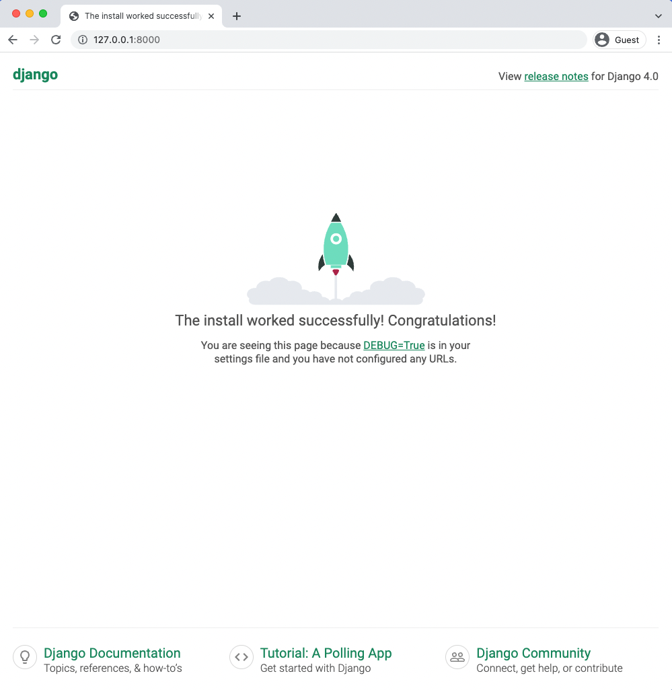
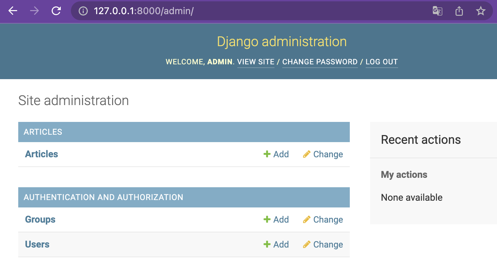
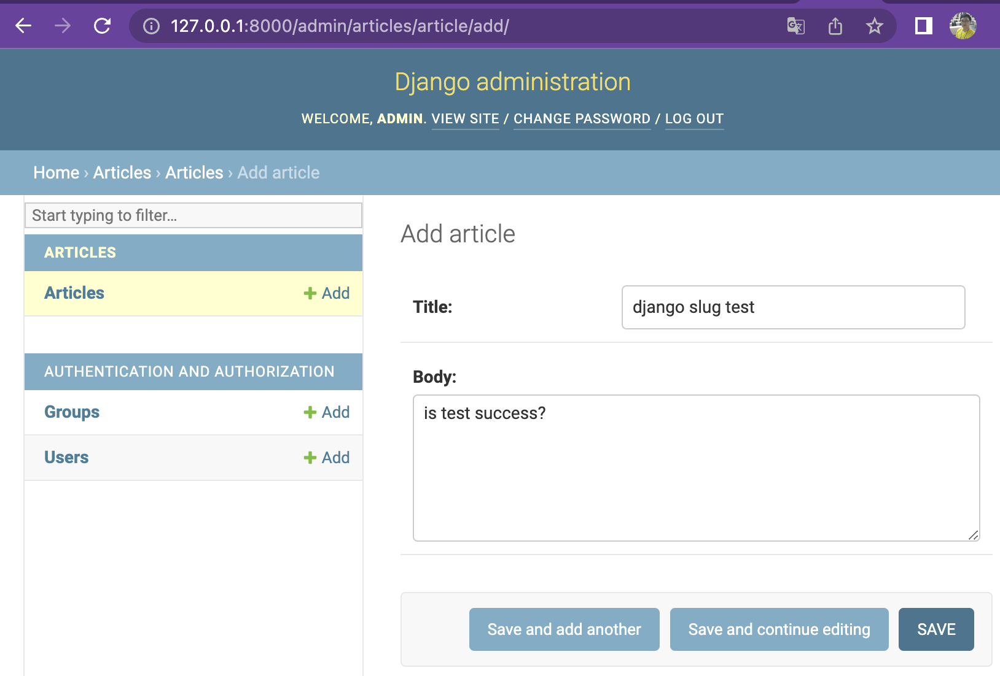
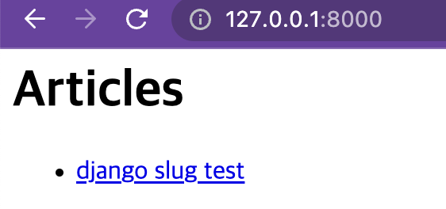
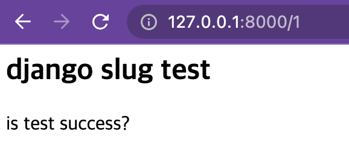
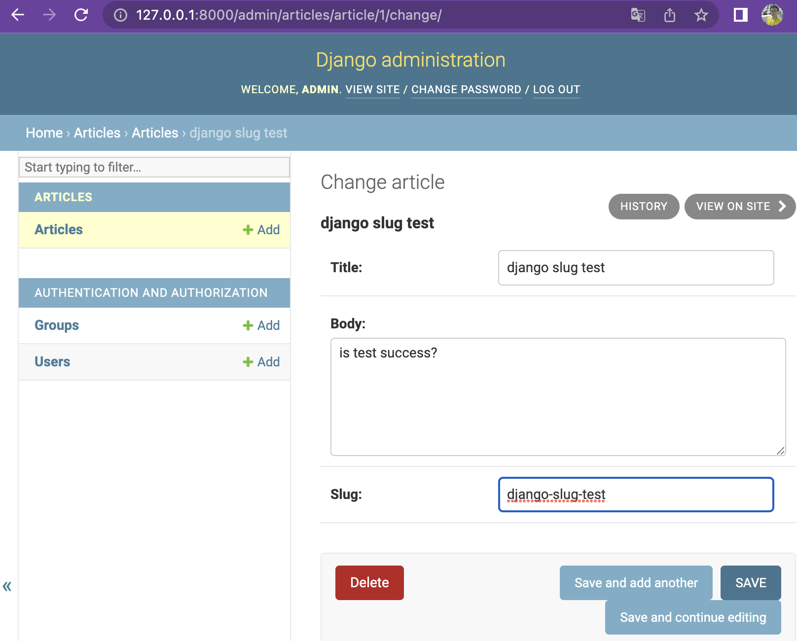
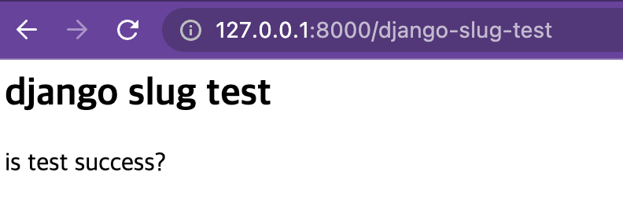
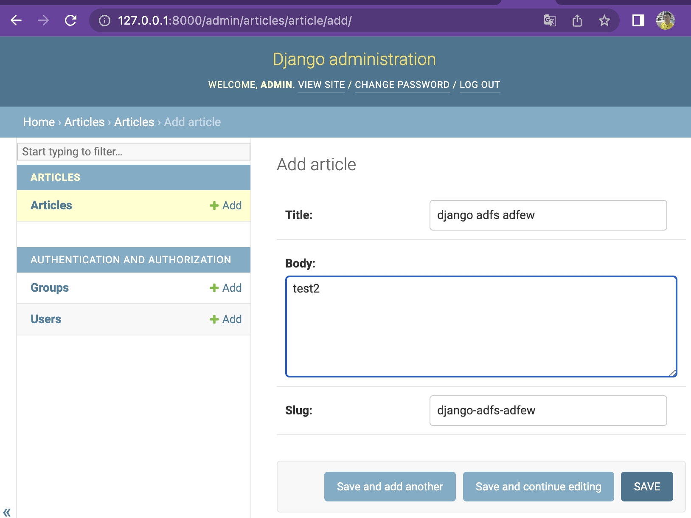

# Slug란 무엇인가?

- 본래의 의미 - 신문 용어
  - 신문이나 잡지 등에서 제목을 쓸 때, 중요한 의미를 포함하는 단어만을 이용해 제목을 작성하는 방법
- 신문이나 잡지에서는 어떤 방식으로 행하는가?
  - 조사나 전치사 등을 빼고 핵심 의미를 담고 있는 단어를 조합해서 긴 제목을 간단 명료하게 표현

- 개발에서는 어떻게 활용이 되는가?
  - 조건 : 무언가가 만들어지면 (페이지나 포스트의 제목을 쓰면), 슬러그(slug)를 자동을 생성
  - 역할 : slug는 그것을 찾아낼 수 있는 키 역할(Unique함은 보장하지 않음)을 하게 됨.(URL에서)
    - 예시로 워드프레스에서는 검색엔진최적화(Search Engine Optimization)에 유용하게 사용
      - 페이지의 주소(url)이 의미를 담고 있는 키워드를 사용하면, 검색엔진에서 더 빨리 페이지를찾아주고 정확한 검색결과를 뿌려주는데 도움
  - 어떤 방식으로? ( 예시 : 워드프레스 )
    - 보통 짧은 라벨로서, 문자, 숫자, 밑줄 또는 하이픈만을 포함
      - 띄어쓰기는 하이픈(-)으로 대체
      - 쉼표나 마침표 등 기호를 자동으로 없앰
    - 즉, 페이지나 포스트를 설명하는 몇개 단어의 집합으로 구성됨
  - 장점
    - 사람이 이해하기 좋다. 
      - 예시로 url에 `post/1`로 적혀있는 것보다는 `post/what-is-slug` 라고 써져 있는게 더 사람이 이해하기 편하다
    - 제목과 URL을 동일하게 맞춰 검색엔진 최적화(SEO)에 도움이 된다.


# 활용 예시

>  Django 를 이용하여 예시

```xml
# 글에 대한 meta 정보 를 이렇게 구성할 것이다.

<title> The 46 Year Old Virgin </title>
<content> A silly comedy movie </content>
<slug> the-46-year-old-virgin </slug>

```


## Django에서 Slug 실습하기

- 실습 목표
  - admin 을 통해 Article 작성
  - Article Field 에 slug Field 추가하기
  - url에 slug 적용하기

- 실습 순서 
  1. python 환경 구축하기
  2. Django Project 생성
  3. Article App 만들기 (model, url 구성, View 작성, Template 작성)
  4. Django admin에서 글 작성하기
  5. 작동확인 
  6. Article 에 slug Field 추가
  7. slug Field 직접입력으로 admin에서 Article 작성해보기
  8. ModelAdmin의 prepoluated_fields 를 통해서 작동으로 slug Field가 작성되도록 하기
  9. ModelAdmin을 사용하지 않고, slug field를 저장하는 방식 구현

- 주의사항
  - `SlugField` 로 필드를 정한다고 자동으로 그 필드가 slug로 채워지는 것이 아님
    - slugfield 입력이나, model이 처음 만들어 질 때 들어갈 수 있도록 설정을 해주어야함
      - 무엇을 기준으로 slug를 만들지 등..

### python 환경 구축하기

>  pyenv 와 virtualenv 가 설치된 상태에서 테스트를 위한 가상환경을 구축한다.

```bash
pyenv install 3.8.10
pyenv virtualenv 3.8.10 slug-test
```


### Django Project 생성하기

```bash
mkdir slug-test
cd slug-test
pyenv local slug-test 
```

- 이 후에 console에서는 `(slug-test)` 표시가 보이면서 가상환경이 활성되어 있어야한다.

```bash
python3 -m pip install django~=4.0.0
django-admin startproject django_project .
python3 manage.py migrate
python3 manage.py runserver
 
```

-  http://127.0.0.1:8000/ 로 접속하면 밑의 화면이 보여야한다.




### Article App 구성하기

```bash
python manage.py startapp articles
```


- settings 에서 articles import 시켜주기

```python
# django_project/settings.py
INSTALLED_APPS = [
    ...
    "articles",  # new
]
```


- Article 모델 만들기

```python
from django.db import models
from django.urls import reverse

class Article(models.Model):
    title = models.CharField(max_length=255)
    body = models.TextField()

    def __str__(self):
        return self.title

    def get_absolute_url(self):
        return reverse("article_detail", args=[str(self.id)])
```


- Article 모델 migration 해주기

```bash
python manage.py makemigrations articles
python manage.py migrate
```


- article template 구성하기

```bash
mkdir articles/templates

cat <<EOF> articles/templates/article_list.html
<h1>Articles</h1>

  <ul>
    <li><a href="{{ article.get_absolute_url }}">{{ article.title }}</a></li>
  </ul>

EOF

cat <<EOF> articles/templates/article_detail.html
<div>
  <h2>{{ object.title }}</h2>
  <p>{{ object.body }}</p>
</div>
EOF
```


- article view 구성하기

```python
# articles/views.py
from django.views.generic import ListView, DetailView

from .models import Article

class ArticleListView(ListView):
    model = Article
    template_name = "article_list.html"


class ArticleDetailView(DetailView):
    model = Article
    template_name = "article_detail.html"
```


- article url 구성하기

```python
from django.urls import path

from .views import ArticleListView, ArticleDetailView

urlpatterns = [
    path("<int:pk>", ArticleDetailView.as_view(), name="article_detail"),
    path("", ArticleListView.as_view(), name="article_list"),
]
```


- django-project url에 article url 추가해주기

```python
# django_project/urls.py
from django.contrib import admin
from django.urls import path, include  # new

urlpatterns = [
    path("admin/", admin.site.urls),
    path("", include("articles.urls")),  # new
]
```


### Django Admin에서 글작성하기

- admin으로 로그인 할 superuser 만들기

```bash
python manage.py createsuperuser
```


- Admin에서 Article을 작성할 수 있도록 변경

```python
# articles/admin.py
from django.contrib import admin

from .models import Article

class ArticleAdmin(admin.ModelAdmin):
    list_display = ("title", "body",)

admin.site.register(Article, ArticleAdmin)
```


- http://127.0.0.1:8000/admin 으로 로그인 후 Article 작성하기






-  `http://127.0.0.1:8000` 로 들어가서 글 확인하기





### slug Field 추가해보기

```python
# articles/models.py
from django.db import models
from django.urls import reverse


class Article(models.Model):
    title = models.CharField(max_length=255)
    body = models.TextField()
    slug = models.SlugField()  # new

    def __str__(self):
        return self.title

    def get_absolute_url(self):
        return reverse("article_detail", kwargs={"slug": self.slug})  # new
```


- Aritlce Field 가 변했으니 migration 해주기

```bash
python manage.py makemigrations articles

# 하지만, 이미 만들어져있는 django slug test 글에는 slug 필드가 존재하지 않아, 이것에 대하여 어떻게 처리할 것인지에 대한 에러가 발생되게됨

You are trying to add a non-nullable field 'slug' to article without a default; we can't do that (the database needs something to populate existing rows).
Please select a fix:
 1) Provide a one-off default now (will be set on all existing rows with a null value for this column)
 2) Quit, and let me add a default in models.py
```


- 해결방법
  1. slugField에 null = True로 지정해주기 - 간단하게 이것으로 처리할 것임
  2. slugField에 기본값 만들어주기

```python
# articles/models.py
from django.db import models
from django.urls import reverse


class Article(models.Model):
    title = models.CharField(max_length=255)
    body = models.TextField()
    slug = models.SlugField(null=True)  # new

    def __str__(self):
        return self.title

    def get_absolute_url(self):
        return reverse("article_detail", kwargs={"slug": self.slug})
```


- 다시 migration

```bash
python manage.py makemigrations articles
python manage.py migrate
```


- Admin에 다시 Article slug 값 수정을 위해 이동
  - slug에 `django-slug-test` 입력 후 저장




- url 을 slug 로 작동할 수 있도록 변경

```python
# articles/urls.py
from django.urls import path

from .views import ArticleListView, ArticleDetailView

urlpatterns = [
    path("<slug:slug>", ArticleDetailView.as_view(), name="article_detail"),  # new
    path("", ArticleListView.as_view(), name="article_list"),
]
```



- Slug Field null=True 제거 및 unique로 변경

```python
# articles/models.py
from django.db import models
from django.urls import reverse


class Article(models.Model):
    title = models.CharField(max_length=255)
    body = models.TextField()
    slug = models.SlugField(null=False, unique=True)  # new

    def __str__(self):
        return self.title

    def get_absolute_url(self):
        return reverse("article_detail", kwargs={"slug": self.slug})
```

- Article model 이 변경되었으니 migration
  - makemigration 시도시 또 에러 발생할텐데 2번을 골라서 ignore 해줌 

```python
python manage.py makemigrations articles
python manage.py migrate
```


### AdminModel에 Prepulated Field 적용하기

- 글을 쓸 때마다 수동으로 slug 값을 작성해야한다면 굉장히 불편함
  - 그래서, prepulated Field  를 이용하여 자동으로 작성되도록 변경

```python
# articles/admin.py
from django.contrib import admin

from .models import Article

class ArticleAdmin(admin.ModelAdmin):
    list_display = ("title", "body",)
    prepopulated_fields = {"slug": ("title",)}  # new

admin.site.register(Article, ArticleAdmin)
```


- Admin 가서 Article 작성해보기
  - title 을 작성하면 자동으로 slug가 작성되고 있는 것을 확인할 수 있음




### ModelAdmin을 사용하지 않고, slug field를 저장하는 방식 구현

- 일반적인 상황에서는 admin에서 글을 작성하지 않고, 사용자가 글을 작성하게 될 것임.

  - 그렇기 때문에 Django의 slugify 라는 내장도구를 이용해서 자동으로 필드가 채워지도록 재구성할 것임
    - slugify 문서 : https://docs.djangoproject.com/en/4.0/ref/utils/#django.utils.text.slugify

  - Model의  save 메소드를 오버라이딩 하여 구현할 것임
    - model method overriding 문서 : https://docs.djangoproject.com/en/4.0/topics/db/models/#overriding-model-methods

```python
from django.db import models
from django.template.defaultfilters import slugify  # new
from django.urls import reverse

class Article(models.Model):
    title = models.CharField(max_length=255)
    body = models.TextField()
    slug = models.SlugField(null=False, unique=True)

    def __str__(self):
        return self.title

    def get_absolute_url(self):
        return reverse("article_detail", kwargs={"slug": self.slug})

    def save(self, *args, **kwargs):  # new
        if not self.slug:
            self.slug = slugify(self.title)
        return super().save(*args, **kwargs)

```


## Django Model 에서 slug 사용시 좋은 옵션들

- Django 의 Slug field 에 대한 Docs
  - https://docs.djangoproject.com/en/4.0/ref/models/fields/#slugfield
  - 주요 매개변수
    - max_length=40 : 최대 길이 ( URL의 최대길이는 2083자이기 떄문에 고려해야함 )
    - db_index=False : True 로 설정시 해당 필드를 인덱스 열로 지정할 수 있음
    - unique=True : 
    - allow_unicode=True : 영문을 제외한 다른 언어도 사용할 수 있게 됨 ( 즉, 한글 사용 가능해짐 )
  - Meta 에 고려해 볼 것
    - index_together = [[' 필드1 ', '필드2', ...]]   : 멀티 컬럼 index 를 지원하게 함

```python
class Article(models.Model):
    title = models.CharField(max_length=100)
    content = models.TextField(max_length=1000)
    slug = models.SlugField(max_length=40)
    
    class Meta:
      	# index_together = [['id', 'slug']]

```


# Velog의 Slug

velog의 포스트 url은 slug를 이용하여 만들어져있다.

실제로 글을 작성해보고, 어떻게 작동하는지 확인해보았다.


## 테스트 해보기

1. 글을 작성해보자

   https://velog.io/@swhan9404/클린코드를-위한-Guard-Clause

   - 글 제목 : 클린코드를 위한 Guard Clause
     - 띄어쓰기는 `-` 로 바뀐다.
     - 영어 대소문자와 한글은 그대로 유지된다

2. 똑같은 제목의 글을 작성해보자

   https://velog.io/@swhan9404/클린코드를-위한-Guard-Clause-73bfzfea

   - 글 제목 : 클린코드를 위한 Guard Clause
     - 글제목을 url로 변환하는 과정에서 생긴 중복 url 은 뒤에 `-해쉬값` 을 붙여서 해결한다.
     - 즉 slug가 unique하게 작동할 수 있도록 hash값을 붙인다는 것을 생각해볼 수 있다.

3. 글 제목을 수정했을 때 글 링크는 변화가 없다

4. https://velog.io/@swhan9404/1234567891234567891.23-45

   - 글 제목 : `(1)2<3>4/5'6"7[8]9\1!2@3#4$5%6^7&8*9,1.2_3-4+5=`
     - 대부분의 특수문자가 제거되고,
     - 살아남은 특수문자
       - `.` : 그대로유지
       - `-` : 그대로 유지