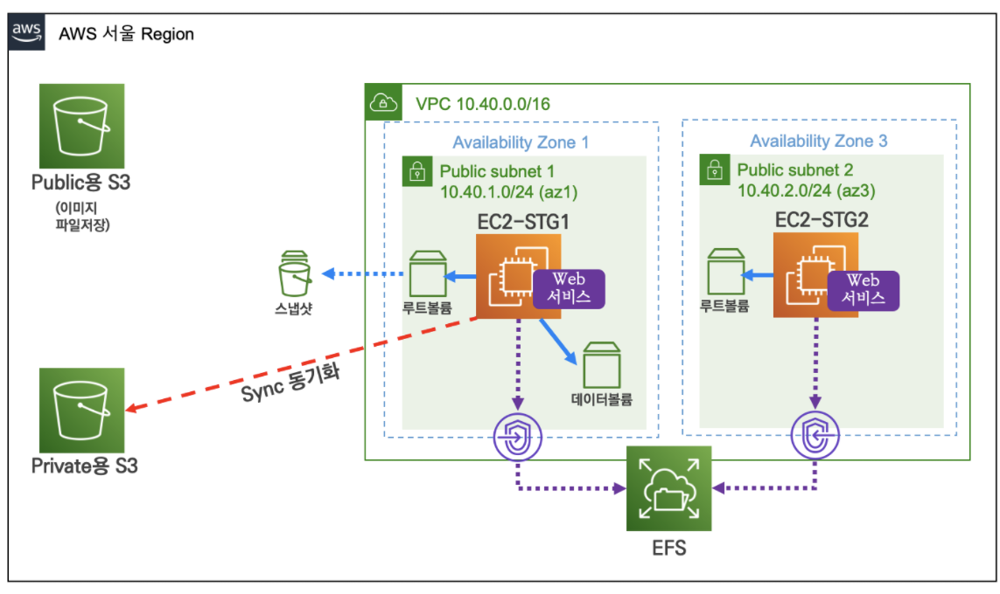
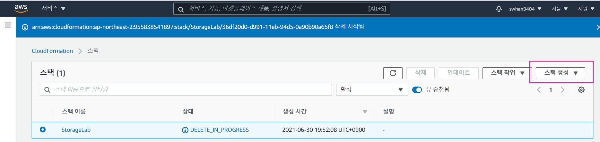
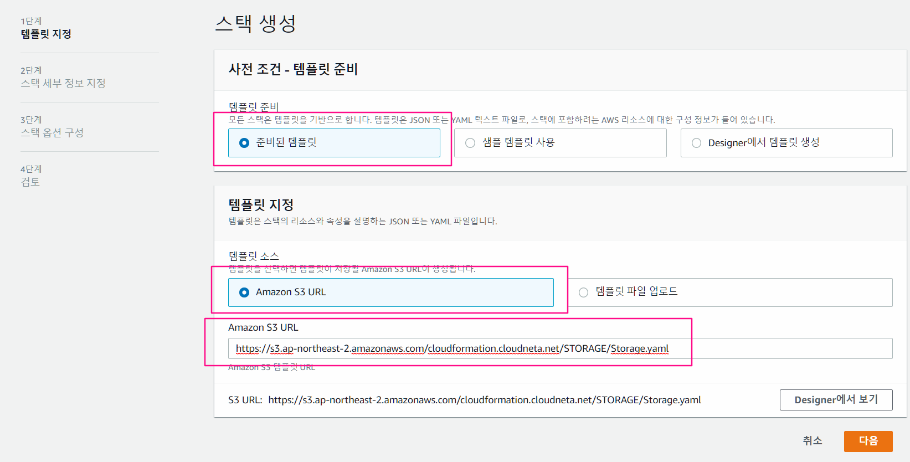
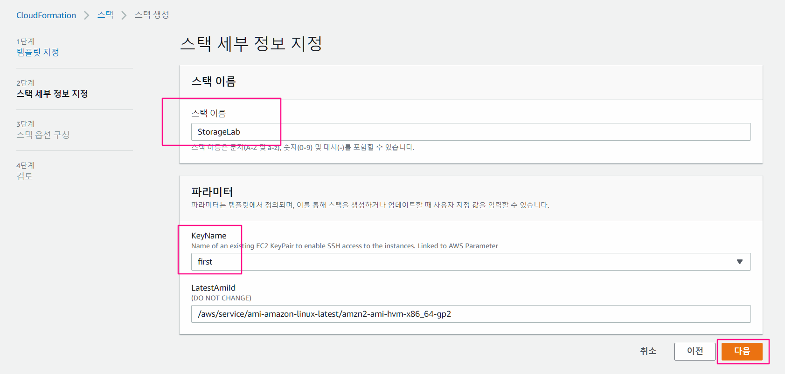
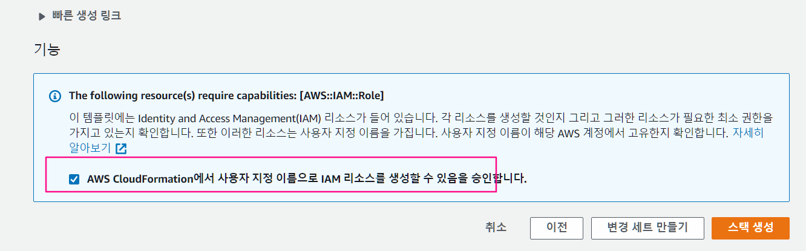
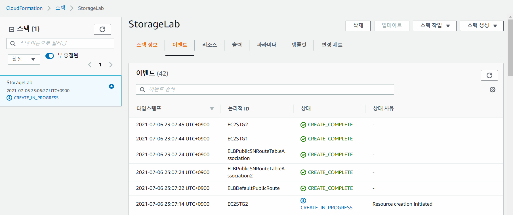

- 실습 목표

  - CloudFormation을 통해 템플릿 파일로 기본 환경 자동 배포
  
  
# 1. CloudFormation으로 환경배포

1. CloudFormation 검색 > 스택생성 > 새 리소스 생성





2. 템플릿 등록하기
   - 준비된 템플릿 선택
   - 템플릿 소스 : Amazon S3 URL
   - 파일 주소 : `<https://s3.ap-northeast-2.amazonaws.com/cloudformation.cloudneta.net/STORAGE/Storage.yaml>`




3. 스택 세부 정보 지정
   - 스택이름 : StorageLab
   - 파라미터 : SSH key 연결




4. 스택 옵션 구성 - 기본값으로 함
5. 검토
   - **AWS CloudFormation에서 사용자 지정 이름으로 IAM 리소스를 생성할 수 있음을 승인** 체크 하기
     - 선택하지 않으면 스택생성이 중간에 되다가 롤백됨




6. 약간의 시간이 걸리고 배포 완료




## 템플릿 내용

- Storage.yaml
- EC2를 배포하는데 SSH Key 를 파라미터로 가져옴
- 만들어진 것
  - IAM
  - VPC
  - 서브넷 2개
  - 각각 서브넷에 EC2 한개씩

```yaml
Parameters:
  KeyName:
    Description: Name of an existing EC2 KeyPair to enable SSH access to the instances. Linked to AWS Parameter
    Type: 'AWS::EC2::KeyPair::KeyName'
    ConstraintDescription: must be the name of an existing EC2 KeyPair.
  LatestAmiId:
    Description: (DO NOT CHANGE)
    Type: 'AWS::SSM::Parameter::Value<AWS::EC2::Image::Id>'
    Default: '/aws/service/ami-amazon-linux-latest/amzn2-ami-hvm-x86_64-gp2'
    AllowedValues:
      - /aws/service/ami-amazon-linux-latest/amzn2-ami-hvm-x86_64-gp2

Resources:
# IAM Role Instance Profile
  STGLabInstanceRole:
    Type: AWS::IAM::Role
    Properties:
      RoleName: STGLabInstanceRole
      AssumeRolePolicyDocument:
        Version: 2012-10-17
        Statement:
          -
            Effect: Allow
            Principal:
              Service:
                - ec2.amazonaws.com
            Action:
              - sts:AssumeRole
      Path: /
      ManagedPolicyArns:
        - arn:aws:iam::aws:policy/AmazonSSMManagedInstanceCore
        - arn:aws:iam::aws:policy/AmazonS3FullAccess

  STGLabRoleForInstanceProfile:
    Type: AWS::IAM::InstanceProfile
    Properties:
      InstanceProfileName: STGLabRoleForInstances
      Path: /
      Roles:
        - !Ref STGLabInstanceRole

# VPC
  ELBVPC:
    Type: AWS::EC2::VPC
    Properties:
     CidrBlock: 10.40.0.0/16
     EnableDnsSupport: true
     EnableDnsHostnames: true
     Tags:
        - Key: Name
          Value: ELB-VPC

  ELBIGW:
    Type: AWS::EC2::InternetGateway
    Properties:
      Tags:
        - Key: Name
          Value: ELB-IGW

  ELBIGWAttachment:
    Type: AWS::EC2::VPCGatewayAttachment
    Properties:
      InternetGatewayId: !Ref ELBIGW
      VpcId: !Ref ELBVPC

  ELBPublicRT:
    Type: AWS::EC2::RouteTable
    Properties:
      VpcId: !Ref ELBVPC
      Tags:
        - Key: Name
          Value: ELB-Public-RT

  ELBDefaultPublicRoute:
    Type: AWS::EC2::Route
    DependsOn: ELBIGWAttachment
    Properties:
      RouteTableId: !Ref ELBPublicRT
      DestinationCidrBlock: 0.0.0.0/0
      GatewayId: !Ref ELBIGW

  ELBPublicSN1:
    Type: AWS::EC2::Subnet
    Properties:
      VpcId: !Ref ELBVPC
      AvailabilityZone: !Select [ 0, !GetAZs '' ]
      CidrBlock: 10.40.1.0/24
      Tags:
        - Key: Name
          Value: ELB-Public-SN-1

  ELBPublicSN2:
    Type: AWS::EC2::Subnet
    Properties:
      VpcId: !Ref ELBVPC
      AvailabilityZone: !Select [ 2, !GetAZs '' ]
      CidrBlock: 10.40.2.0/24
      Tags:
        - Key: Name
          Value: ELB-Public-SN-2

  ELBPublicSNRouteTableAssociation:
    Type: AWS::EC2::SubnetRouteTableAssociation
    Properties:
      RouteTableId: !Ref ELBPublicRT
      SubnetId: !Ref ELBPublicSN1

  ELBPublicSNRouteTableAssociation2:
    Type: AWS::EC2::SubnetRouteTableAssociation
    Properties:
      RouteTableId: !Ref ELBPublicRT
      SubnetId: !Ref ELBPublicSN2

# Security Group
  ELBSG:
    Type: AWS::EC2::SecurityGroup
    Properties:
      GroupDescription: Enable 
      VpcId: !Ref ELBVPC
      Tags:
        - Key: Name
          Value: ELBSG
      SecurityGroupIngress:
      - IpProtocol: tcp
        FromPort: '80'
        ToPort: '80'
        CidrIp: 0.0.0.0/0
      - IpProtocol: tcp
        FromPort: '2049'
        ToPort: '2049'
        CidrIp: 10.40.0.0/16
      - IpProtocol: tcp
        FromPort: '22'
        ToPort: '22'
        CidrIp: 0.0.0.0/0
      - IpProtocol: icmp
        FromPort: -1
        ToPort: -1
        CidrIp: 0.0.0.0/0

# EC2 Instance
  EC2STG1:
    Type: AWS::EC2::Instance
    Properties:
      InstanceType: t2.micro
      ImageId: !Ref LatestAmiId
      IamInstanceProfile: STGLabRoleForInstances
      KeyName: !Ref KeyName
      Tags:
        - Key: Name
          Value: EC2-STG1
      NetworkInterfaces:
        - DeviceIndex: 0
          SubnetId: !Ref ELBPublicSN1
          GroupSet:
          - !Ref ELBSG
          AssociatePublicIpAddress: true
          PrivateIpAddress: 10.40.1.10
      UserData:
        Fn::Base64:
          !Sub |
            #!/bin/bash
            hostnamectl --static set-hostname EC2-STG1
            yum install httpd tree tmux amazon-efs-utils -y
            systemctl start httpd && systemctl enable httpd
            echo "<html><h1>AFOS Study - Web Server 1</h1></html>" > /var/www/html/index.html
            curl "<https://awscli.amazonaws.com/awscli-exe-linux-x86_64.zip>" -o "awscliv2.zip"
            unzip awscliv2.zip
            ./aws/install --bin-dir /usr/bin --install-dir /usr/bin --update

  EC2STG2:
    Type: AWS::EC2::Instance
    Properties:
      InstanceType: t2.micro
      ImageId: !Ref LatestAmiId
      IamInstanceProfile: STGLabRoleForInstances
      KeyName: !Ref KeyName
      Tags:
        - Key: Name
          Value: EC2-STG2
      NetworkInterfaces:
        - DeviceIndex: 0
          SubnetId: !Ref ELBPublicSN2
          GroupSet:
          - !Ref ELBSG
          AssociatePublicIpAddress: true
          PrivateIpAddress: 10.40.2.10
      UserData:
        Fn::Base64:
          !Sub |
            #!/bin/bash
            hostnamectl --static set-hostname EC2-STG2
            yum install httpd tree tmux amazon-efs-utils -y
            systemctl start httpd && systemctl enable httpd
            echo "<html><h1>AFOS Study - Web Server 2</h1></html>" > /var/www/html/index.html
            curl "<https://awscli.amazonaws.com/awscli-exe-linux-x86_64.zip>" -o "awscliv2.zip"
            unzip awscliv2.zip
            ./aws/install --bin-dir /usr/bin --install-dir /usr/bin --update
```

