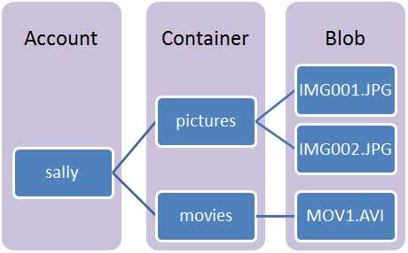
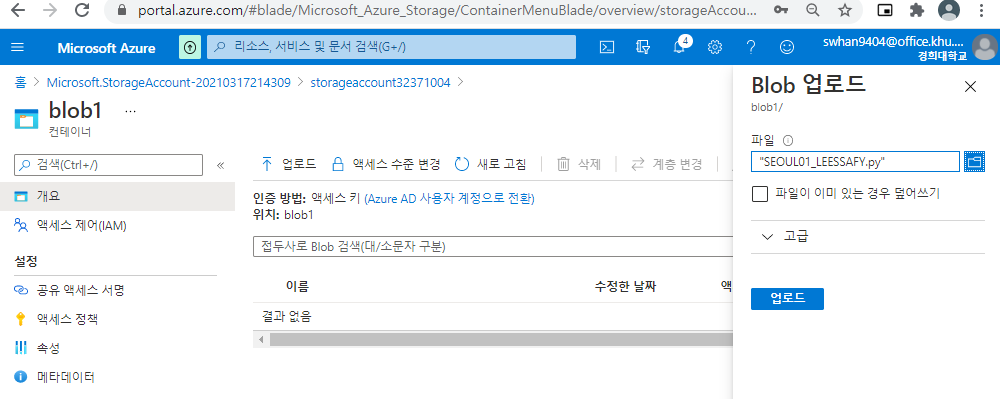
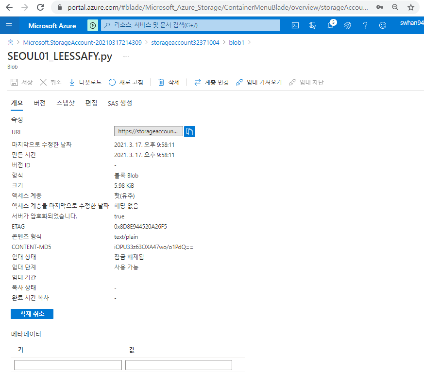

- 데이터 베이스와 스토리지의 차이

  - 데이터 베이스
    - 조직화된 데이터가 저장된 논리적 저장소
    - 데이터베이스는 ID, record, 거래정보와 같은 구조적 또는 반구조적 데이터가 저장된다.
  - 스토리지
    - 파일 또는 물리적 저장소
    - 스토리지는 텍스트파일, 이미지, 영상 등 다양한 종류의 데이터가 저장될 수 있다.

- Blob 이란?

  -  데이터베이스 시스템에서 많이 사용되는 용어로 이미지, 영상, 음악, 실행 파일 등의 같은 바이너리 데이터 형식을 블랍(BLOB) 데이터 형식이라고 합니다. 

- Blob Storage 서비스 

  - 블랍(BLOB) 저장소는 많은 구조화 되어지지 않은 데이터를 저장하고 어디에서나 http나 https를 통해서 접근할 수 있는 서비스
  - 블랍(BLOB) 저장소는 회사 내부 시스템의 저장소로나 데이터를 외부로 공개하기 위한 용도로 사용할 수 있습니다.

- Blob Storage 역할

  - 브라우저에 이미지 또는 문서 직접 제공
  - 분산 액세스용 파일 저장
  - 동영상 및 오디오 스트리밍
  - 로그 파일에 쓰기
  - 백업/복원, 재해 복구 및 보관용 데이터 저장
  - 온-프레미스 또는 Azure 호스티드 서비스에 의한 분석용 데이터 저장

- 서비스의 구성

  - 계정
    - Windows Azure의 저장소로의 모든 접근은 저장소 계정을 통하여 이루어지며 블랍(BLOB)들의 최상위 네임스페이스입니다. 저장소 계정에는 컨테이너를 제한 없이 생성할 수 있습니다. 단 저장소 계정당 100 TB(테라바이트)를 초과할 수 없습니다.
  - 컨테이너
    - 컨테이너는 여러 개의 블랍(BLOB)을 하나로 묶을 수 있도록 해줍니다. 블랍(BLOB)은 반드시 컨테이너(container)에 포함되어야 합니다. 저장소 계정에서 설명되었듯이 하나에 계정에 무제한으로 컨테이너를 만들 수 있습니다. 그리고, 컨테이너 안에 제한 없이 블랍(BLOB)을 넣을 수 있습니다.

# 1. Blob Storage 만들기

1. `스토리지 계정` 검색

2. 스토리지 계정 만들기 - 기본사항
   - 구독 - 무료
   - 리소스 그룹 - 새로만들기 - myRGStorage
   - 스토리지 계정 이름 - storageaccount1215
   - 위치 - 동남아시아
   - 성능 - 표준
   - 계정종류 - StorageV2(범용v2)
   - 복제 - LRS(로컬 중복 스토리지)
     - LRS - 기본 지역의 단일 물리적 위치 내에서 데이터를 동기적으로 세 번 복사합니다. LRS는 가장 저렴한 복제 옵션이지만 고가용성이 필요한 응용 프로그램에는 권장되지 않습니다.
     - ZRS - 기본 지역에 있는 3개의 Azure 가용성 영역에서 데이터를 동기적으로 복사합니다. 고가용성이 필요한 응용 프로그램의 경우 Microsoft는 기본 지역에서 ZRS를 사용하고 보조 지역에도 복제하는 것을 권장합니다.
     - GRS -  LRS를 사용하여 기본 지역의 단일 물리적 위치 내에서 데이터를 동기적으로 세 번 복사합니다. 그런 다음 보조 지역의 단일 물리적 위치에 데이터를 비동기적으로 복사합니다. 보조 지역 내에서 LRS를 사용 하 여 데이터를 동기적으로 세 번 복사 합니다.
3. 계정만들기 - 고급
   - Blob 액세스 계층(기본값) - 핫

4. 검토+만들기 -> 만들기

# 2. 스토리지 확인해보기

- Storage Explorer 
  - 표 형태로 저장된 데이터 확인
- 컨테이너 
  - 비정형 데이터를 위한 확장 가능한 비용 효율적인 스토리지
- 파일공유
  - 서버리스 SMB 및 NFS 파일 공유
- 테이블
  - 테이블 형식 데이터 스토리지
- 큐
  - 트래픽에 따라 효과적으로 앱 스케일링

# 3. 컨테이너 만들기

1. 개요 - 컨테이너 - 만들기
   - 이름 - blob1
   - 공용 액세스 수준 - 프랄이빗(익명 액세스 없음)
2. 만들어진 `blob1` 컨테이너 클릭

3. 파일 아무거나 업로드해보기

4. 올린 파일 열어보기

