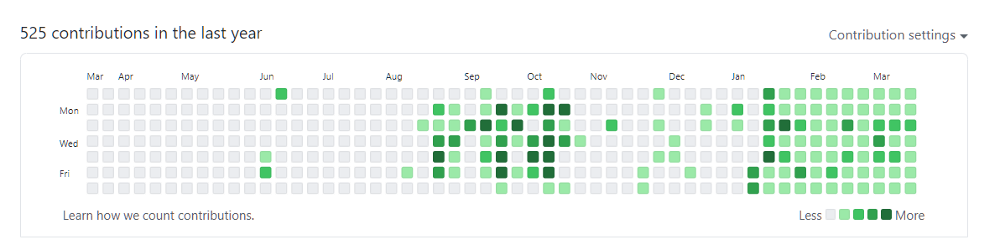

## 시작과 현재까지의 기간
- SSAFY 적성검사 : 11.21(토) 17:00~11.23(월) 09:00
- SSAFY 인터뷰 평가 : 12월 11일(금) 오전 9시 35분 * 예상 소요시간 2시간 내외
- SSAFY 스타트 캠프 : 2021.01.05(화) ~ 01.15(금) (온라인으로 진행)
- 사전학습일 : 2020.12.30(수) ~ 2021.01.15(금)
- python 학습 : 2021.01.18(월) ~ 2021.01.29(금)
- HTML/CSS 학습 : 2021.02.01(월) ~ 2021.02.05(금)
- 알고리즘 1차 : 2021.02.08(월) ~ 2021.03.05(금)
- Django 학습 : 2021.03.16(월) ~ 2021.04.02(금) -> django 학습이 거의 끝나가는 현재

## SSAFY에 들어오고 있었던 일

### 광주 원룸
- SSAFY 합격되자마자 오프라인 등교를 위해서 광주에 원룸을 구했는데, 1월동안 코로나 상황이 굴러가는 상황을 보고, 답이 없다고 생각해서 더 비용을 소모하기 전에 실제로 방에 한번도 들어가보지도 않고 해지를 하게 되었다.덕분에, 월세 1달치(30만원) + 중도계약해지비용(60만원) + 부동산수수료(12만), 총 102만원에 방을 구하러 왔다갔다하는 비용까지 계산하면 약 120만원에 해당하는 비용을 허공에 분해시켰다.

### 나의 포트폴리오
- SSAFY 스타트 캠프 때 들은 정보들로, 포트폴리오에 대해서 여러가지로 생각을 하게 되었고, 그 덕분에 GitHub 매일매일 잔디심기, 기술블로그 작성 시작, notion을 통한 포트폴리오만들기를 하게 되었다. 
  - GitHub는 1월 15일 이후 현재까지 하루도 쉬지 않고, 지금까지 꾸준히 꾸며가고 있다. 주로 현재 채우는 것은 TIL과 SSAFY에서 가져온 정보 정리같은 것인데, 역동적인 웹페이지 만들기 + 개인프로젝트도 간간히 하고 있긴 한데 생각보다 나만의 코드를 만드는 것은 쉬운 일이 아니라는 것을 세삼깨달아가고 있다. 그리고 진짜로 이제는 하루를 온전히 쉬면서 체력을 회복하자라고 생각해도 반나절이 지나가면 코드 치고싶어서 손이 근질거리게 되었다.
  
  - 기술블로그는 1월 말쯤에 GitHub로 만들려고 하면서 부터 시작되었는데, 글을 하나 작성하는 것이 너무 복잡하기도 하고, 관리가 까다로워서 블로그에 올릴 글들만 저축해둔 채로 제대로 운영을 못한태로 시간이 2월 중반까지 흘렀다. 이 때, 더 이상 이런 상황이 지속되면 안될 것 같아 방법을 강구하다가 velog로 오게 되었다. 정확히 2월 24일날 velog가 개설되었고, 이제 약 한달정도 시간이 지났는데, 현재 글이 80개정도로 폭풍성장을 하고 있다. 하지만, 이 블로그를 꾸밀 때 다른 블로그처럼 알고리즘문제 풀어놓고 그것을 개재하는 무의미한 글채우기는 하고싶지 않다는 생각이 있었다. 그래서, 알고리즘 문제를 풀더라도, 정말 내가 무언가를 느끼고 배울 수 있었던 것만 쓰고, 알고리즘 이론에 대해서 더 집중해서 쓰고 있다. 그리고 Azure, 인공지능 관련, python 관련 등 내 사고를 확장할 수 있는 좀 가치있고, 각 글마다 어느정도 분량도 있다고 생각되는 것들을 쓰고 있다. 근데, 정말 블로그를 하면서 다시 한번 자신의 생각을 정리할 기회도 얻게 되고, 정리하면서 내가 놓쳤던 부분을 보충하는 시간을 가질 수 있고, 맨날 내 블로그에 다시 와서 내가 정리한 것을 찾아보면서 계속 기억을 되살리는 과정을 거치고 있다. 지금하고 있는 어떤 일보다 시간이 많이들긴하지만, 그만큼 얻는게 많은 행동인 것 같다고 생각하고 있다.
  - notion을 통한 포트폴리오 만들기는 사실 아직 완성되지 않았다. 대충 70% 만들어놓고, 살짝 지금 손을 놓고 있는 상태인데 가장 큰 이유가 내가 한 일중에 가장 큰 일인 Spring과 Android로 만든 프로젝트를 살리지 못하고 있다는 것이다. 이게, 이번에 느낀 가장 큰 문제인데, 저 프로젝트를 끝나고 컴퓨터를 한번 포맷시켜서 그것을 구성하는 환경이 완전히 날아간 상태이고, 저것을 만들때는 markdown의 존재조차 모르고 있어서 readme를 작성한다는 것은 생각도 하지 못했다. 덕분에 저 환경을 구성하는 것들의 요소들을 시간이 지나 세팅하는 법을 까먹은 상태여서 부활시키는데 애를 먹고 있다. 살린다하더라도 readme를 작성하는 시간도 필요해서 해야하는데.. 해야하는데.. 하면서 매일 시간이 흘러가고만 있다. 진짜 빨리 완성시켜야하는데, 머리는 알면서도 세팅하는데 무의미한 시간을 보내야하는 것때문에 몸이 잘 움직이지 않는다..
  

### SSAFY 내에서 있었던 일
- SSAFYcial(SSAFY 기자단)에 신청했지만, 탈락하였다.
- 일타싸피 대회에서 반 대표로 선발되었다. 그리고 방송으로 흥미로운 대전으로 선발되어, 반에서 한 결승전이 송출되었다.
- SSAFY 온라인멘토링 간담회 참여자로 선발되어 간담회를 진행하였고, 가장 열심히 참여하고 칭찬도 받았다고 서울사무국에서 후기작성을 부탁받았다.
- Samsung SW 모의 역량평가 A형에서 두 문제를 각각 78점, 100점으로 A등급을 받았다. IM등급도 통과되었다.

### 외부 이벤트 참가
- SW마에스트로 2차까지 합격하고, 최종면접만 남았다. 물론, 최종면접에 갈 생각은 없다.
- Startup Cording Festival에 참여하여 1차를 통과하여 최종 1000인에 들었고, 2차는 망했다.

### 방향성의 변화
- 사실, SSAFY에 온 목적은 인공지능을 공부할 시간을 벌기 위해서였다. 하지만, 공부를 할수록 내가 성과를 내기 힘들어서 도망나온 수학과 비슷하게 느껴졌다. 그리고 하면 할수록 내가 원하는 것은 인공지능을 이용해서 생활에서 이용할 수 있는 제품을 생산해내는 것인데, 왜 내가 모델링을 하고 있지? 라는 생각이 강해졌다. 그리고 최근 활발하게 시장이 커지고 있는 one-click 인공지능 생성 플랫폼과 같은 인공지능을 더 편하게 만들기 위한 플랫폼들을 보면서 내가 과연 이런 사이트들보다 물론 정확도는 살짝 더 높을지 몰라도 저 사이트들보다 가성비를 만족시킬 수 있는 사람이 될 수 있을까?? 라는 의문이 들었다.
- 이런 생각 속에서 그럼 무엇을 내가 해야할까? 라는 의문에 빠져들게 되었고 다시 나의 방향성에 대한 고민에 빠지게 되었다. 그리고 나의 방향성을 정할 기준들을 정했다.
  - 단순히 업무가 아니라 나 자신에게 도움이 될 수 있는 프로그램을 만들어 낼 수 있는 가장 실용적인 분야에서 활동을 하고 싶다.
  - 눈으로 성과가 보일 수 있는 분야에서 일을 하고 싶다.
  - 머리 회전이 빠를 수록 큰 장점이 될 수 있는 분야로 가고 싶다.
  - 플랫폼이나 인공지능으로 절대 대체될 수 없는 일이면서, 가능하면 인공지능과 연관된 일을 해보고 싶다.
- 이런 기준들 속에서 몇 가지는 걸러지고, 몇 가지가 걸렸다.
  - 데이터 사이언스 걸러짐 : 일단 통계학 자체를 별로 좋아하지도 않고, 학부생이라는 현실 속에서 가장 경쟁력을 가질 수 있는 것은 데이터 시각화부분이나 데이터 정제 및 관리 쪽인데 개인적으로 이런 일은 하고싶지 않았다.
  - DevOps 시작 : DevOps 엔지니어는 배포, 유지, 관리 및 업데이트에 이르는 소프트웨어 개발 사이클 전반에 걸쳐 요구 사항 간의 균형을 맞추는 일을 한다. 배포라는 최전방 분야에서 일을 하기도 하고, 프로그램의 전반을 이해하면서 작업을 할 수도 있고, 이런 작업방식을 최적화 시켜서 일의 능률을 올리는 일을 할 수 있다. 너무 내가 원하는 일이었음을 알 수 있었다. 그래서 현재 DevOps 개발자를 최우선 목표로 설정하여 움직이고 있다.
  - MLOps, AutoML 관심: 인공지능을 만드는 작업을 자동화하는 일을 한다. 데이터 수집, 전처리부터 시작해서 모델, 피처, 데이터관리를 위한 시스템 개발 등 인공지능을 만드는 작업을 하는데 필요한 환경을 구성하는 작업을 하는 일이다. DevOps의 일을 좀더 인공지능쪽에 특화시킨 분야라고 보면 된다. 현재 이 분야도 굉장히 관심이 있긴 하지만, 일단은 이 분야보다 좀더 범용적인 DevOps를 준비하는 것이 더 좋다고 판단하여 후순위에 있다.
  - 풀스택 개발자 : 현재 django와 Spring의 백엔드, javascript 로 구성된 프론트엔드의 분야를 어느정도 맛보면서 처음에는 웹개발자라는 것에 대해 별 생각이 없었는데, 적당히 할만하면서 할것도 많다고 생각이 되었다. 가장 현실과 맞닿아 있는 분야이기도 하면서 사회가 요구하는 개발자의 숫자에 비해 프론트엔드 개발자의 상급레벨의 사람이 별로 존재하지 않는 다는 것에 어느정도 경쟁력이 있을 거라고 판단이 되었다. 그래서 일단은 DevOps와 더불어 1.5순위 정도의 포지션에서 동시에 준비를 진행중에 있다. 
  
### 서류를 낸 곳
- Samsung에 전혀 지원할 생각이 없었는데, Samsung DS부문 DIT 센터에서 SSAFY에 기업설명회를 온 것을 들었는데 혹 해서 지원을 했다. 선택한 이유는 인공지능과 더불어 정말 다양한 분야를 경험해 볼 수 있어서이다. 

  
## 최종 후기
### SSAFY에 대해서
- SSAFY는 가만히 있으면 알아서 해주는 그런 곳이 아니다. 특히나 이번에 1학기부터 온라인 진행은 처음으로 하는 일이라 오프라인으로 진행하면 어떤 느낌인지는 나는 모르지만 현재로써는 각자도생의 느낌이 굉장히 강하다. 
- 특히, 배우는 내용의 깊이가 못하는 사람도 따라올 수 있도록 배려해야하는 상황이라 그렇게 깊지가 않다. 물론 국비학원들보다야 상세하긴 하지만, 그건 국비학원들이 너무 수박겉핥기식으로 배우는 것이지 SSAFY가 깊게 배우는 것은 아니다. 그리고 숙제나 배우는 분량자체가 개인적으로 굉장히 느슨하다고 말할 정도까지는 아니지만, 평범한 수준이다. 그리고 숙제에 대한 분량도 적다. 아마 이는 SSAFY에 올인하기보다도 부가적으로 자기가 원하는 자신의 분야를 스스로 갈고 닦을 시간을 준다고 생각을 하고 있다. 하지만, 온라인 상황에서 프로그래밍을 처음 SSAFY와서 겪어보는 사람도 있는데 이런 방목은 위험할 수 있다고 생각한다.
- 월 100만원 꽂히는 것은 너무 좋다. 이 100만원으로 세로 모니터, 수비드 기계, 빵자동으로 굽는 기계, 갤럭시 액티브2, 손안마기, 각종 식재료를 사면서 오랜만에 풍요로운 생활을 보내고 있다.
- 나의 방향성을 확실하게 잡는다면 도와줄 사람이 많다. 매일 만나는 실습코치, 취업을 도와주는 취업컨설턴트, 각종 멘토링, 여러 취업자료들 정말 도움되는 정보가 많이 존재한다. 아마 이 정도롤 정보와 환경을 갖추고 있는 것은 국내에 SSAFY가 유일하지 않을까 싶다. 그래서 방향성을 어느정도 확실하게 잡은 나는 정말 도움 된다.
- 한 때 AI 부스트캠프에서 배우는 내용들을 바라보며, 왜 SSAFY는 저 정도의 분량과 깊이를 가르쳐주지 않는 것일까? 에 대한 회의도 잠시 했었다. 하지만, 지금은 그런 후회는 하지 않는다. SSAFY는 부스트캠프처럼 단일 주제에 대해 매몰되어 있지 않고 폭이 굉장히 넓다. 그래서 개인적으로 시야를 더 크게 볼 수 있다고 생각한다. 아마 AI 부스트캠프에 내가 갔더라면 너무 좁혀진 시야로 방향성을 잃고 헤매고 있었을지도 모른다는 생각을 한다.

