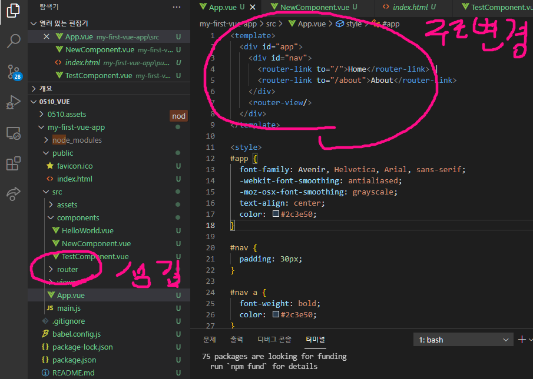
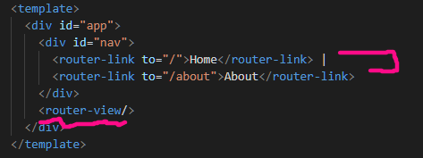

# Vue Router

- Vue.js의 공식 라우터

- 중첩된 라우트/ 뷰 매핑 모듈화 된, 컴포넌트 기반의 라우터 설정 등

  SPA 상에서 라우팅을 쉽게 개발 할 수 있는 기능을 제공

- 설치방법

  - https://router.vuejs.org/installation.html
  - `vue add router`
    - vue CLI 에서 플러그인 형식으로 존재
    - (주의)App.vue를 덮어 쓰므로 프로젝트 내에서 다음 명령을 실행하기 전에 파일을 백업해야함

- 설치하면 변경되는 내용

  - App.vue의 template 부분 바뀜
  - router 와 views 폴더가 생김




## Vue Router

- router-link
  - index.js 파일에 정의한 경로에 등록한 특정한 컴포넌트와 매핑
  - HTML5 히스토리 모드에서, router-link는 클릭 이벤트를 차단하여 브라우저가 페이지를 다시 로드하지 않도록 함
  - a 태그지만 우리가 알고 잇는 GET 요청을 보내는 a태그와 조금 다르게 기본 GET 요청을 보내는 이벤트를 제거한 형태로 구성
- router-view
  - 실제 component가 DOM에 부착되어 보이는 자리를 의미
  - router-link를 클릭하면 해당 경로와 연결되어 있는 index.js에 정의한 컴포넌트가 위치





## components와 reviews

- 컴포넌트를 만들어 갈 때 정해진 구조가 있는 것은 아님
- 주로 아래와 같이 구조화 하여 사용
  - App.vue
    - 최상위 컴포넌트
  - views/
    - router(index.js)에 매핑되는 컴포넌트를 모아두는 폴더
    - ex) App 컴포넌트 내부에 About & Home 컴포넌트 등록
  - components
    - router에 매핑된 컴포넌트 내부에 작성하는 컴포넌트를 모아두는 폴더
    - ex) Home 컴포넌트 내부에 HelloWorld 컴포넌트 등록


## History mode

- HTML history API를 사용하여 router를 구현한 것
  - 이 기능으로 뒤로가기 / 앞으로가기 가 가능함
- 브라우저의 히스토리는 남기지만 실제 페이지는 이동하지 않는 기능을 지원


## Vue Router가 필요한 이유

1. SPA 등장 이전
   - 서버가 모든 라우팅을 통제
   - 요청 경로에 맞는 HTML을 제공
2. SPA 등장 이후
   - 서버는 index.html 하나만 제공
   - 이후 모든 처리는 HTML 위에서 JS 코드를 활용해 진행
   - 즉, 요청에 대한 처리를 더 이상 서버가 하지 않음(할 필요가 없어짐)
3. 라우팅 처리 차이
   - SSR
     - 라우팅에 대한 결정권을 서버가 가짐
   - CSR
     - 클라이언트는 더 이상 서버로 요청을 보내지 않고 응답 받은 HTML 문서 안에서 주소가 변경되면 특정 주소에 맞는 컴포넌트를 랜더링
     - 라우팅에 대한 결정권을 클라이언트가 가짐
   - Vue Router는 라우팅의 결정권을 가진 Vue.js에서 라우팅을 편리하게할 수 있는 Tool을 제공해주는 라이브러리


# 실습해보기

## About.vue 만들어보기

1. `router > index.js`

   ```js
   import About from '../views/About.vue' // 추가
   
   const routes = [
     {
       path: '/',
       name: 'Home',
       component: Home
     },
     {
       path: '/about',
       name: 'About',
       component : About, // 추가
     }
   ]
   ```

   

2. views > About.vue

   - component 를 불러올 때 경로를 상대경로로 치면 복잡하기 때문에 `@` 사용
     - @ == /src

   ```vue
   <template>
     <div>
       <h1>this is about page</h1>
       <NewComponent/>
     </div>
   </template>
   
   <script>
   //import NewComponent from '../components/NewComponent.vue' // 경로 너무 복잡해
   import NewComponent from '@/components/NewComponent.vue' 
   // @ == /src
   //'@/components/NewComponent.vue' === '/src/components/NewComponent.vue'
   
   export default {
     name : 'About',
     components : {
       NewComponent
     }
   }
   </script>
   ```

   

## router의 route name 사용하기

1. `router > index.js` 에서 name 설정

   ```js
   const routes = [
     {
       path: '/',
       name: 'Home', // 이름
       component: Home
     },
     {
       path: '/about',
       name: 'About', // 이름
       component : About, 
     }
   ]
   ```

2. App.vue

   - `:to="{ name : 이름 }"` 꼴로 써줌 

   ```vue
   <template>
     <div id="app">
       <div id="nav">
         <!-- <router-link to="/">Home</router-link> | -->
         <router-link :to="{name : 'Home'}">Home</router-link>
         <!-- <router-link to="/about">About</router-link> -->
         <router-link :to="{name : 'About'}">Home</router-link>
       </div>
       <router-view/>
     </div>
   </template>
   ```


