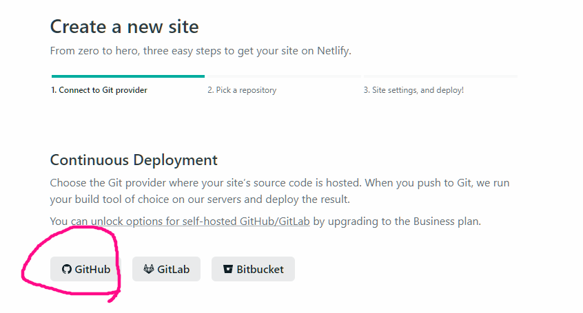
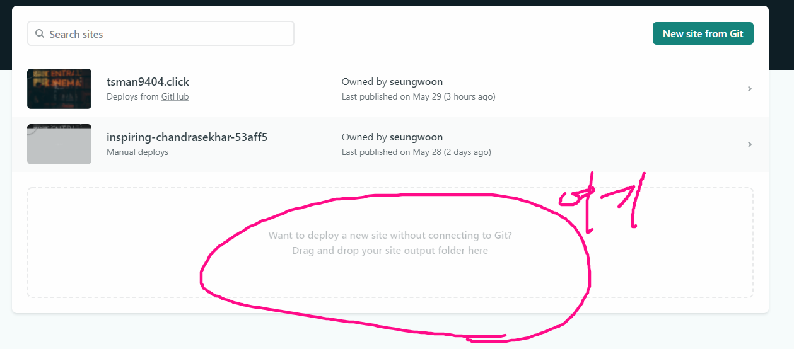
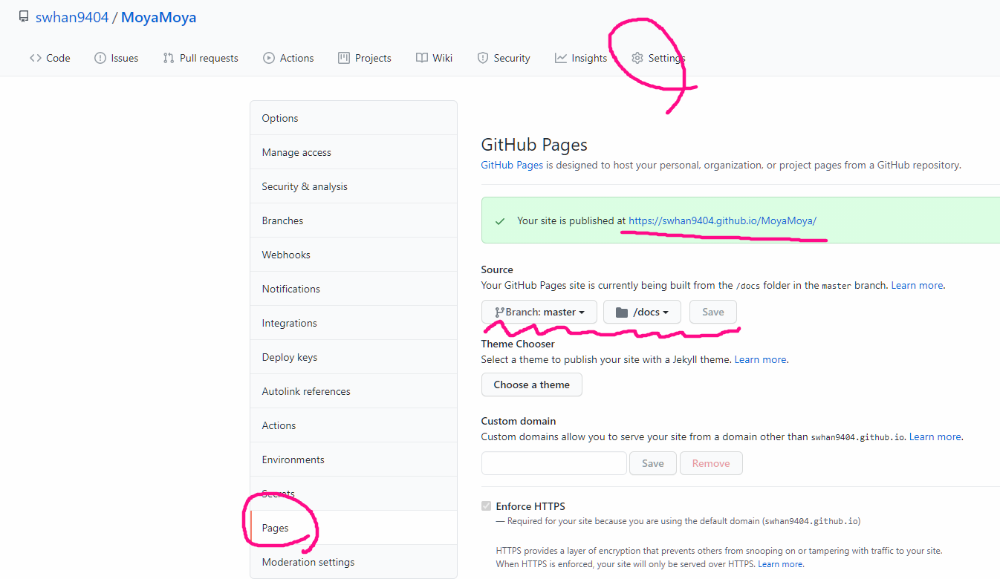

# Netlify

- https://www.netlify.com/
   - 로그인 및 회원가입
   
- `npm run build`
    - Vue 의 src 폴더 내에 있는 것들을 하나의 script 코드로 만들어주는 역할
    - 완료되면 dist 라는 폴더가 생김
        - 전부 `/` 를 기준으로 작성되기 때문에 로컬에서 제대로 작동을 하지 않음
    
- 배포하는 방법 2가지
    1. git을 활용한 방법
       - dist 폴더를 git repo에 올리고 연동시키면 됨
    

    
    2. 파일을 직접 올리기 - dist 폴더를 그대로 넣으면됨


# gitPage 로 Vue 배포하기

## 1. npm run build 의 설정하기

- package.json 이 있는 위치에서 `vue.config.js` 파일을 생성

```js
// vue.config.js
module.exports = {
    publicPath: '/레포지토리이름',
    outputDir: 'docs' // build 저장 파일 위치
}
```


## 2. git에 올리기

1. `npm run build`
2. git add  > commit > push 과정 
3. git 에서 page 설정하기



4. 5~10분 배포가 끝날때 까지 기다린 후 접속하기!


# 404 에러

- 어떤 문제인가?

  - 메인 페이지에서 접근하는 것은 문제 없이 작동하나 

    - 주소를 주소창에 붙여넣어서 이동할 때

      404에러가 발생한다

- 왜 문제가 발생했는가?

  - **github.io/detail/1** 처럼 주소창에 뭔가 입력하는건 서버에게 “/detail/1 페이지 주세요”~ 라는 요청을 하는 행위기 때문
  - 이것을 해결하기 위해서는서버에서 **“누군가 어쩌구.github.io/어쩌구 로 접속하면 Vue 메인페이지로 보내주세요~”** 라고 개발을 해야함

- 그럼 github page에서는 해결할 수 없는거 아니야?

  - vue router hash 모드를 사용하면 해결가능
    - 그렇기 때문에 처음부터 router 코드를 굉장히 잘 짜야함

