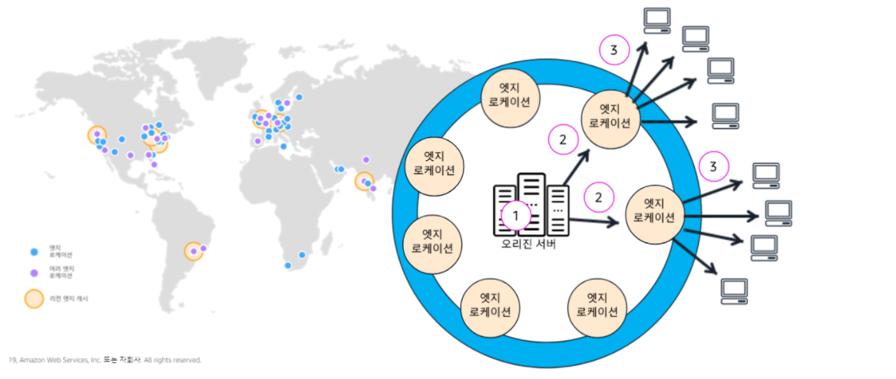
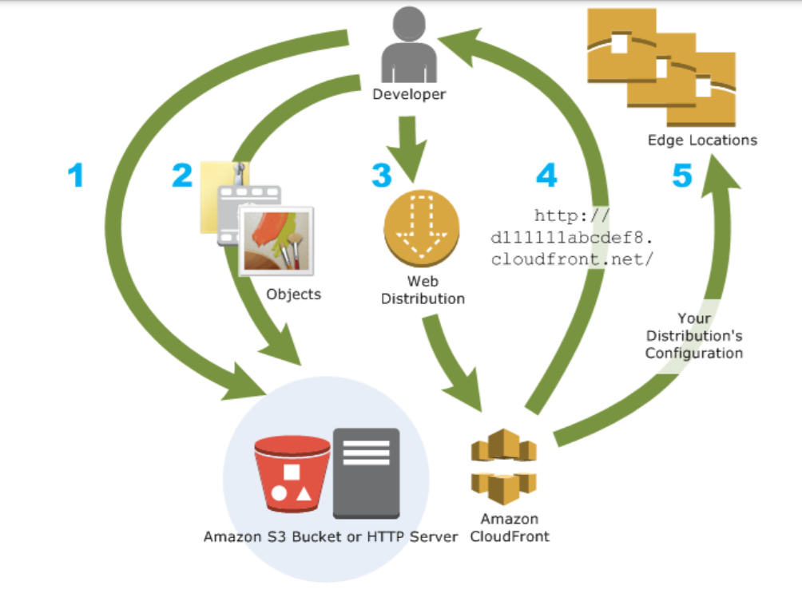
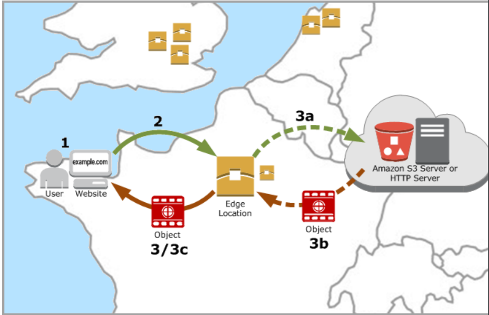

# CloudFront

>  .HTML, .CSS, .JS 및 이미지 파일과 같은 정적 및 동적 웹 콘텐츠를 사용자에게 더 빨리 배포하도록 지원하는 웹 서비스입니다.
>  CloudFront 는 CDN 서비스와 기본 보안 기능(Anti-DDoS)을 제공합니다

## CDN

> **CDN(Content Delivery Network or Content Distribution Network, 콘텐츠 전송 네트워크**)

- CDN이 뭐야?
  - **콘텐츠를 효율적으로 전달**하기 위해 **여러 노드를 가진 네트워크에 데이터를 저장하여 제공**하는 시스템
- 왜 쓰는거야?
  - **인터넷 서비스 제공자(ISP,Internet Service Provider)**에 **직접 연결**되어 데이터를 전송하므로, **콘텐츠 병목**을 피할 수 있는 장점이 있음
- cloudFront도 CDN의 일종이라고 생각할 수 있다.

### cloudFront이 CDN으로 제공해주는 컨텐츠

- Downlad Distribution : HTTP 프로토콜을 이용해서 다운로드할 수 있는 일반적인 이미지 혹은 정적 파일을 제공받을 수 있습니다.

- Streaming Distribution : 스트리밍을 위해 사용할 수 있는 HTTP Proressive DownLoad 방식이나 RTSP(Real Time Streaming Protocol)을 지원하는 동영상 콘텐츠를 서비스받을 수 있습니다.

## CloudFront의 특징

- 엣지 로케이션
  - 의미 - AWS가 CDN 을 제공하기 위해서 만든 서비스인 CloudFront의 캐시 서버(데이터 센터의 전 세계 네트워크)
  - cloudFront 서비스는 엣지 로케이션을 통해 콘텐츠를 제공합니다.
  - CloudFront를 통해 서비스하는 콘텐츠를 사용자가 요청하면 **지연 시간이 가장 낮은 엣지 로케이션으로 라우팅**되므로 콘텐츠 전송 성능이 뛰어납니다.
  - 콘텐츠가 **이미 지연 시간이 가장 낮은 엣지 로케이션에 있는 경우 CloudFront가 콘텐츠를 즉시 제공**합니다.

- 콘텐츠의 전달
  - 콘텐츠가 **엣지 로케이션에 없는 경우** CloudFront는 **콘텐츠의 최종 버전에 대한 소스로 지정된 오리진(Amazon S3 버킷, MediaPackge 채널, HTTP 서버(예 : 웹 서버)등) 에서 콘텐츠를 검**색합니다.
  - **AWS 백본 네트워크**를 통해 콘텐츠를 **가장 효과적으로 서비스할 수 있는 엣지**로 각 사용자 요청을 라우팅하여 **콘텐츠 배포 속도를 높입니다.** 일반적으로 **CloudFront 엣지가 최종 사용자에게 가장 빨리 제공**합니다.
- cloudFront의 장점
  - AWS 네트워크를 사용하면 사용자의 요청이 반드시 통과해야 하는 네트워크의 수가 줄어들어 성능이 향상됩니다. **파일의 첫 바이트를 로드하는 데 걸리는 지연 시간이 줄어들고 데이터 전송 속도가 빨라집니다.**
  - **파일(객체)**의 사본이 전 세계 여러 **엣지 로케이션에 유지(또는 캐시)**되므로 **안정성과 가용성이 향상**됩니다.
  - 보안성 향상
    - 오리진 서버에 대한 종단 간 연결의 보안이 보장됨(https)
    - 서명된 URL 및 쿠키 사용 옵션으로 자체 사용자 지정 오리진에서 프라이빗 콘텐츠를 제공하도록 할 수 있음

### Edge Server 의 cache

- 기본적으로 한번 발생한 요청에 대해서는 Edge Server에 캐싱된 상태로 저장됩니다.

- Edge Server의 기본 TTL은 24시간이고 사용자의 설정에 따라 변경이 가능합니다. (TTL 수정 시 Edge Server에 반영되는 시간이 한 시간 가량 소요됩니다.)

- 이러한 캐시의 설정 후 반영 시간 때문에 전체 데이터에 대한 TTL을 수정하는 게 아닌 각 개별 데이터에 대해서 invalidation API(특정 파일을 캐시에서 삭제하는 기능)을 통해 삭제할 수 있습니다.

- Invalidation API는 동시에 최대 3개의 요청을 발생시킬 수 있으며, 각 요청은 최대 1000개까지 가능합니다.

- Invalidation API는 Edge Node에 반영되기까지 5~10분 정도의 시간이 소요됩니다.

## cloudFront 구성방법

1. Amazon S3 버킷 또는 고유 HTTP 서버와 같은 *오리진 서버*를 지정하고, CloudFront는 이로부터 파일을 가져온 다음 전 세계 CloudFront 엣지 로케이션에 배포합니다.
   - 오리진 서버는 객체의 최종 원본 버전을 저장합니다. 
     HTTP를 통해 콘텐츠를 서비스하는 경우 오리진 서버가 Amazon S3 버킷 또는 웹 서버 같은 HTTP 서버입니다. 
     HTTP 서버는 Amazon Elastic Compute Cloud(Amazon EC2) 인스턴스나 사용자가 관리하는 서버에서 실행할 수 있습니다. 이 서버를 *사용자 지정 오리진*이라고도 합니다.

2. 오리진 서버에 파일을 업로드합니다. 객체라고도 하는 파일은 일반적으로 웹 페이지, 이미지 및 미디어 파일을 포함하지만 HTTP를 통해 제공될 수 있는 모든 항목이 될 수 있습니다.

   - Amazon S3 버킷을 오리진 서버로 사용할 경우 버킷에 있는 객체를 공개적으로 읽을 수 있는 상태로 만들 수 있으므로 객체의 CloudFront URL을 아는 사람이라면 누구나 액세스할 수 있습니다. 
     - 객체를 비공개로 유지하고 액세스할 수 있는 사용자를 제어할 수 있는 옵션도 있습니다. [서명된 URL과 서명된 쿠키를 사용하여 프라이빗 콘텐츠 제공](https://docs.aws.amazon.com/ko_kr/AmazonCloudFront/latest/DeveloperGuide/PrivateContent.html)을(를) 참조하세요
3. 사용자가 웹 사이트나 애플리케이션을 통해 파일을 요청할 경우 응답할 때 어떤 오리진 서버에서 파일을 가져올지 알려 주는 CloudFront *배포*를 만듭니다. 동시에 CloudFront에서 모든 요청을 기록할지, 배포를 만들자마자 활성화할지 여부와 같은 세부 사항을 지정합니다.
4. CloudFront는 새 배포에 도메인 이름을 할당하고, 이는 CloudFront 콘솔에서 볼 수 있습니다. 또는 API 요청 등과 같은 프로그램 요청에 대한 응답으로 반환됩니다. 원하는 경우 대신 사용할 대체 도메인 이름을 추가할 수 있습니다.
5. CloudFront에서는 배포의 구성(사용자의 콘텐츠가 아님)을 모든 해당 *엣지 로케이션* 또는 CloudFront가 파일의 사본을 캐싱하는 지리적으로 분산된 데이터 센터의 *POP(Point of Presence)* 서버 모음으로 보냅니다.

## 데이터 전달과정

1. 클라이언트로부터 Edge Server로의 요청이 발생한다.

2. Edge Server는 요청이 발생한 데이터에 대하여 캐싱 여부를 확인합니다.
3. 사용자의 근거리에 위치한 Edge Server 중 캐싱 데이터가 존재한다면 사용자의 요청에 맞는 데이터를 응답합니다.
   사용자의 요청에 적합한 데이터가 캐싱되어 있지 않은 경우 Origin Server로 요청이 포워딩됩니다.

4. 요청받은 데이터에 대해 Origin Server에서 획득한 후 Edge Server에 캐싱 데이터를 생성하고, 클라이언트로 응답이 발생합니다.

