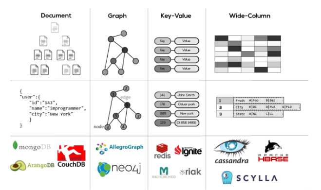

# SQL 과 NoSQL 비교

**장점**

- SQL 장점
  - 명확하게 정의 된 스키마, 데이터 무결성 보장
  - 관계는 각 데이터를 중복없이 한번만 저장됩니다.
- NoSQL의 장점
  - 스키마가 없기때문에, 훨씬 더 유연합니다. 즉, 언제든지 저장된 데이터를 조정하고 새로운 "필드"를 추가 할 수 있습니다.
  - 데이터는 애플리케이션이 필요로 하는 형식으로 저장됩니다. 이렇게 하면 데이터를 읽어오는 속도가 빨라집니다.
  - 수직 및 수평 확장이 가능하므로 데이터베이스가 애플리케이션에서 발생시키는 모든 읽기 / 쓰기 요청을 처리 할 수 있습니다.

**단점**

- SQL 단점
  - 상대적으로 덜 유연합니다. 데이터 스키마는 사전에 계획되고 알려져야 합니다. (나중에 수정하기가 번거롭거나 불가능 할 수 도 있습니다.)
  - 관계를 맺고 있기 때문에, JOIN문이 많은 매우 복잡한 쿼리가 만들어 질 수 있습니다.
  - 수평적 확장이 어렵고, 대체로 수직적 확장만 가능합니다. 즉 어떤 시점에서 (처리 할 수 있는 처리량과 관련하여) 성장 한계에 직면하게 됩니다.
- NoSQL 단점
  - 유연성 때문에, 데이터 구조 결정을 하지 못하고 미루게 될 수 있습니다.
  - 데이터 중복은 여러 컬렉션과 문서가 (SQL 세계에서 처럼 하나의 테이블에 하나의 레코드가 아니라) 여러 개의 레코드가 변경된 경우 업데이트를 해야 합니다.
  - 데이터가 여러 컬렉션에 중복되어 있기 때문에, 수정(update)를 해야 하는 경우 모든 컬렉션에서 수행해야 함을 의미합니다. (SQL 세계에서는 중복된 데이터가 없기 때문에 한번만 수행하면 됩니다.)

**언제 사용하는것이 좋을까?**

- SQL의 경우
  - 관계를 맺고 있는 데이터가 자주 변경(수정)되는 애플리케이션일 경우 (NoSQL에서라면 여러 컬렉션을 모두 수정해줘야만 합니다.)
  - 변경될 여지가 없고, 명확한 스키마가 사용자와 데이터에게 중요한 경우
- NoSQL의 경우
  - 정확한 데이터 구조를 알 수 없거나 변경 / 확장 될 수 있는 경우
  - 읽기(read)처리를 자주하지만, 데이터를 자주 변경(update)하지 않는 경우 (즉, 한번의 변경으로 수십 개의 문서를 업데이트 할 필요가 없는 경우)
  - 데이터베이스를 수평으로 확장해야 하는 경우 ( 즉, 막대한 양의 데이터를 다뤄야 하는 경우)

# NoSQL의 여러 종류

## key-value

> 키와 값으로 이루어진, **저장과 조회**라는 가장 간단한 원칙에 충실한 데이터베이스.

**특징**

- 기본적인 패턴으로 Key,value가 하나의 묶음으로 저장되는 구조로 단순한 구조이기에 속도가 빠르며 분산 저장 시 용이
- Key 안에 (Column, Value) 형태로 된 여러개의 필드를 갖습니다.
  - key는 unique한 고유값으로 유지되어야한다
- 값에 모든 데이터 타입을 허용하며, 그래서 개발자들이 데이터 입력 단계에서 검증 로직을 제대로 구현하는 것이 중요
- 테이블간 조인을 고려하지 않으므로 RDB(Relational Database)에서 관리하는 외부키나, 컬럼별 constraints등이 필요 없다.

**언제 사용하는게 좋을까?**

1. 성능 향상을 위해 관계형 데이터베이스에서 데이터 캐싱
2. 장바구니 같은 웹 애플리케이션에서 일시적인 속성 추적
3. 모바일 애플리케이션용 사용자 데이터 정보와 구성 정보 저장
4. 이미지나 오디오 파일 같은 대용량 객체 저장

**종류**

- Redis
- Riak
- Oracle Berkely
- AWS DynamoDB

## Document

**특징**

- XML, JSON, BSON - 계층적 트리 데이터 방식으로 저장
- _id : PK, RowID 를 가진다
- **집합적 데이터 모델 :** 관계형 DB에서의 여러개 테이블 데이터를 하나의 Document에 모아둘 수 있음 
  - 조회시 한번의 조회로 필요한 데이터 획득. Join 기능을 대체 
- 컬럼 없음 → Schema 없음
- Document 내에 Field를 정의함 ( Key : Value )
  - Key에 대한 값은 Document가 될 수 있음 ( Embedded Document )
- key-value Type과의 차이는 Database에 값을 문서로 저장한다는 점
- 트랜지션이 원자적으로 이루어짐
- 데이터를 여러 서버에 분산 저장이 가능하고, 복제와 회복이 가능한 형태이다. 장애가 발생하더라도 대응에 유리

**언제 사용하는게 좋을까?**

1. 대용량 데이터를 읽고 쓰는 웹 사이트용 백엔드 지원
2. 제품처럼 다양한 속성이 있는 데이터 관리
3. 다양한 유형의 메타데이터 추적
4. JSON 데이터 구조를 사요하는 애플리케이션
5. 비정규화된 중첩 구조의 데이터를 사용하는 애플리케이션

**종류**

- MongoDB
- Azure Cosmos DB
- CouchDB
- MarkLogic
- OrientDB

### Replica Set

> 자동 장애 극복 지원. **Master** **장애시 Slave가 Master로 역할 전환** 

- mongoDB에서는 primary, secondary라고 부름
- 쓰기는 Master로, 읽기는 Master, slave 모두 가능 

## Wide Column

**특징**

- 행마다 키와 해당값을 저장할 때마다 각각 다른값의 다른 수의 스키마를 가질 수 있습니다.
  - 사용자 이름(Key)에 해당하는 값에 스키마들이 각각 다르다
- Wide Column Database는 대량의 데이터의 압축, 분산처리, 집계 처리(sum, count, avg 등) 및 쿼리 동작 속도 그리고 확장성이 뛰어나다

**종류**

- Cassandra
- HBase
- Google BigTable
- Vertica
- Druid
- Accumulo
- HyperTable

## graph

**특징**

- 데이터를 노드로 표현하며, 노드 사이의 관계를 엣지로 표현
- RDBMS 보다 Performance가 좋고 유연하며 유지보수에 용이한것이 특징
- Social networks, Network diagrams 등에 사용

**종류**

- Neo4j
- Blazegraph
- OrientDB 
- AgensGraph(국내솔루션)