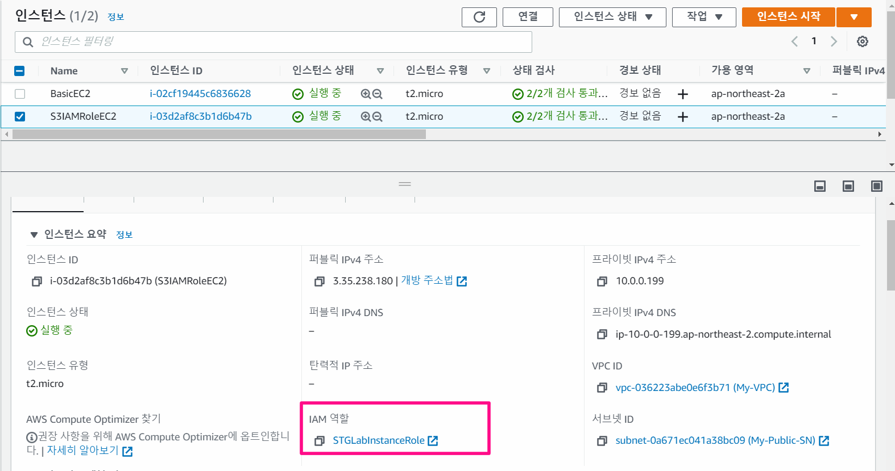

- 실습 목표

  - IAM Role 을 이용하여 ec2에 사용자 대신 권한을 주어 행동을 할 수 있도록 한다

    (여기서 EC2에 준 권한은 S3 풀 액세스 권한)


# CloudFormation을 통한 환경배포

- 템플릿 지정 - 기본값
- 스택세부 정보 지정
  - keyName에 나의 SSH 키 연동
- 스택옵션 구성 - 기본값
- 검토 
  - **AWS CloudFormation에서 사용자 지정 이름으로 IAM 리소스를 생성할 수 있음을 승인** - 활성


## yaml 파일 내용

- BasicEC2 배포
- S3IAMRoleEC2 배포 → STGLabInstanceRole 적용

- STGLabInstanceRole IAM Role 생성
  - S3 Full Access 권한을 부여한 EC2 이미지

```yaml
STGLabInstanceRole:
    Type: AWS::IAM::Role
    Properties:
      RoleName: STGLabInstanceRole
      AssumeRolePolicyDocument:
        Version: 2012-10-17
        Statement:
          -
            Effect: Allow
            Principal:
              Service:
                - ec2.amazonaws.com
            Action:
              - sts:AssumeRole
      Path: /
      ManagedPolicyArns:
        - arn:aws:iam::aws:policy/AmazonS3FullAccess
```





# EC2 

- Xshell을 통해서 ec2 접근하기


## IAM Role 있는 EC2

```bash
# 현재 EC2에 적용된 IAM Role(EC2 Profile) 정보 확인 - ACCESS ID, key, token, token유효기간 확인가능
curl http://169.254.169.254/latest/meta-data/iam/security-credentials/STGLabInstanceRole

# S3 버킷 조회
aws s3 ls

# S3 버킷 생성
aws s3 mb s3://버킷(유일한 이름) --region ap-northeast-2

# S3 버킷 삭제
aws s3 rm s3://버킷

# VPC 정보 확인
$ aws ec2 describe-vpcs
```


## 권한 없는 EC2

```bash
# S3 버킷 조회 - 권한 없음으로 실패함
aws s3 ls

# VPC 정보 확인 - 권한 없음으로 실패함
$ aws ec2 describe-vpcs


----------------------[옵션]---------------------
# aws cli 사용을 위한 자격 증명 설정 (admin)
$ aws configure
AWS Access Key ID [None]: AKIAIOSFODNN7EX####
AWS Secret Access Key [None]: wJalrXUtnFEMI/K7MD####
Default region name [None]: ap-northeast-2
Default output format [None]: table

# 자격 증명 List 확인
$ aws configure list

# VPC 정보 확인
$ aws ec2 describe-vpcs

# ec2 조회
aws ec2 describe-instances
aws ec2 describe-instances --query 'Reservations[*].Instances[*].{Instance:InstanceId,Name:Tags[?Key==`Name`]|[0].Value}' --output text
aws ec2 describe-instances --query 'Reservations[*].Instances[*].{Instance:PrivateIpAddress,Name:Tags[?Key==`Name`]|[0].Value}' --output text

# S3IAMRoleEC2 재시작
aws ec2 reboot-instances --instance-ids 'S3IAMRoleEC2'
ping 'S3IAMRoleEC2'
```


