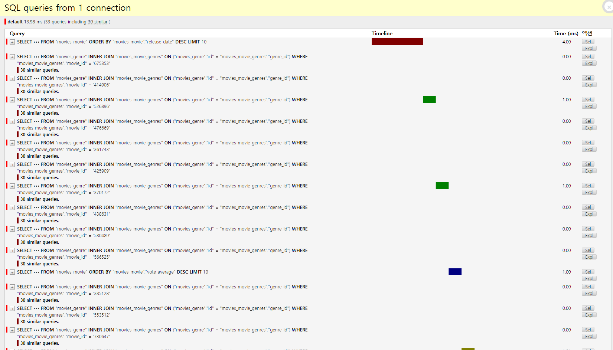
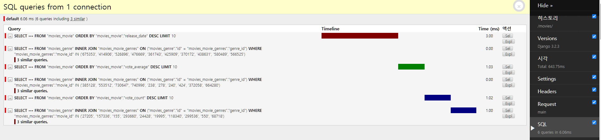
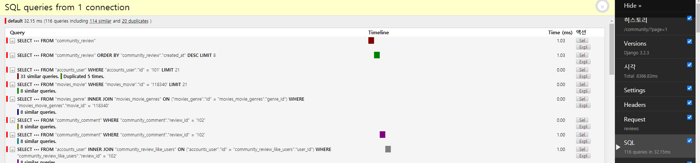
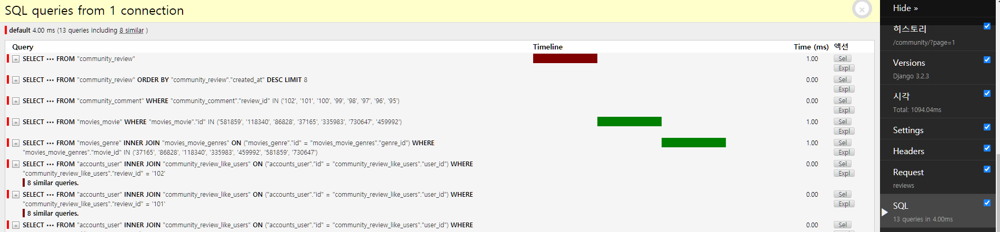

# 어디가 느린가?
- 백엔드에서 프론트로 오는 응답시간(4초 이상걸림)

    - 여러 영화 포스터가 뜨는 Main 페이지 

    - 리뷰 목록을 보여주는 Community 페이지
    
- 다른페이지는 적어도 2초 안에는 응답이 오는데, 이 두 페이지만 유독 느림


# 상황 분석

- Heroku 서버가 미국에 있기 때문에, 통신지연과 성능이 그렇게 좋지 않은 무료 인스턴스를 사용하고 있기 때문에 느릴 수 밖에 없다.

- 하지만, 다른 페이지가 2초 안에 응답이 오기 때문에, 저 두개의 페이지도 응답시간 2초 이내로 줄일 방법이 있을 것이다.

- Main 페이지
  - Movie 모델의 3가지 다른 정렬방법으로 QuerySet을 받아온다.
  - Movie 모델은 Genre 모델과 ManyToMany Field를 가지고 있다.
  - Serializer로 Movie를 field 전체를 직렬화한다.
- Community 페이지
  - Review 모델 리스트를 가져온다.
    - User 모델과 Movie 모델을 Foreign key로 가짐
    - like_reviews, funny_reviews, helpful_reviews 로 User와 ManyToMany Field를 3개를 가지고 있다.
    - Comment 모델이 review를 Foreign Key로 가진다.
  - 실제로 필요한 컬럼들은 무엇인가?
    - Review의 Foreign Key인 Movie 테이블 내부의 poster_path
    - 해당 Review에 댓글이 몇개 달렸는지
    - 해당 Review에 좋아요가 몇개인지?
    - Review 제목과 글내용, 해당영화에 평가가 긍정적인지
    
    
 # ORM 최적화 하기
 
 ## N+1 쿼리 문제

- 발생 하는 곳

  - ForeignField 나 ManyToManyField 를 사용하는 테이블을 Serializer에서 JSON 형태로 바꿔서 넘겨줄 때 

    - 각 요소마다 serializer는 foreign key에 해당하는 테이블을 다시 select문으로 서칭하게 됨.

      (orm은 lazy하기 때문에 필요하기 전까지 데이터를 가져오지 않은 상태라)

    - 그래서 요소만큼 부가적으로 반복되게 됨

  - 발생장소

    - movies 메인페이지
    - community 리스트 페이지




### 해결방법

- Eager-Loading
  - select_related 
    - foreign-key , one-to-one 처럼 single-valued relationships에서만 사용이 가능하다. 
    - SQL의 JOIN을 사용하는 방법
  - prefetch_related
    - foreign-key , one-to-one 뿐만 아니라 many-to-many , many-to-one 등 모든 relationships에서 사용 가능하다. 
    - SQL의 WHERE … IN 구문을 사용하는 방법
- 수정 사항
  - prefetch_related를 사용

```python
# main 페이지 고친 부분
@api_view(['GET'])
def main(request) :
    #### 수정부분#####
    # latest_movies = Movie.objects.order_by('-release_date')[:10] 
    latest_movies = Movie.objects.order_by('-release_date').prefetch_related('genres')[:10]
    # highscore_movies = Movie.objects.order_by('-vote_average')[:10]
    highscore_movies = Movie.objects.order_by('-vote_average').prefetch_related('genres')[:10]
    # like_movies = Movie.objects.order_by('-vote_count')[:10]
    like_movies = Movie.objects.order_by('-vote_count').prefetch_related('genres')[:10]
	################
    
    latest_serializer = MovieSerializer(data=latest_movies, many=True)
    highscore_serializer = MovieSerializer(data=highscore_movies, many=True)
    like_serializer = MovieSerializer(data=like_movies, many=True)

    print(latest_serializer.is_valid() , highscore_serializer.is_valid() , like_serializer.is_valid())
    
    context={
        'latest_movies' : latest_serializer.data,
        'highscore_movies' : highscore_serializer.data,
        'like_movies' : like_serializer.data,
    }
    return Response(context)
```


### 결과

- 13.08ms > 6.06ms 으로



- 커뮤니티 부분

  - 116쿼리(32.15ms) > 79쿼리(24.14)

  - 줄어들긴 했으나, CommunityDetail의 Serializer와 동일한 Serializer 사용으로 

    쓸대없는 내용이 너무 많이 들어가있어 쓰지 않는 내용부터 처낼 필요성이 있음.





### Serializer 개편 -community

- 116쿼리(32.15ms) > 13쿼리(4.00ms)
  - 1/10 로 대기시간 감소

```python
# 완성된 serializer 모습
class ReviewListSerializer(serializers.ModelSerializer):
    movie = MovieDetailSerializer(read_only=True)
    comment_count = serializers.IntegerField(source='comment_set.count', read_only=True)
    like_users_count = serializers.IntegerField(source='like_users.count', read_only=True)


    class Meta : 
        model = Review
        exclude =('user','like_users','funny_users','helpful_users')
        # exclude = ('like_users','funny_users','helpful_users')
        read_only_fields =('movie',)
```



