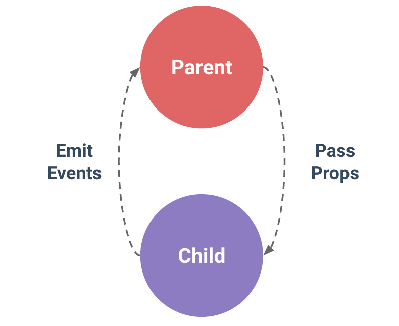

# 컴포넌트 간의 통신

- 컴포넌트는 부모 - 자식 관계에서 가장 일반적으로 함께 사용하기 위함

- 부모는 자식에게 데이터를 전달(Pass props)하며,

  자식은 자신에게 일어난 일을 부모에게 알림(Emit event)

  - 부모와 자식이 명확하게 정의된 인터페이스를 통해 격리된 상태로 유지할 수 있음
  
- props는 아래로, events는 위로

- 부모는 props를 통해 자식에게 데이터를 전달하고, 자식은 events를 통해 부모에게 메시지를 보냄

- 단방향 데이터 흐름

  - 하위 컴포넌트가 실수로 부모의 상태를 변경하여 앱의 데이터 흐름을 추론하기 더 어렵게 만드는 것을 **방지할 수** 있음
  
  - https://kr.vuejs.org/v2/guide/components.html#%EB%8B%A8%EB%B0%A9%ED%96%A5-%EB%8D%B0%EC%9D%B4%ED%84%B0-%ED%9D%90%EB%A6%84




- 주의사항
  - 하위 컴포넌트의 템플리셍서 상위 데이터를 직접 참조할 수 없음
  
- 이름 컨벤션
  - in HTML
    - kebab-case
  - in script
    - camelCase
  
- 사용순서

  1. 부모 컴포넌트에서 자식 컴포넌트로 전달

     `<자식컴포넌트 :전달변수명(kebab-case)="전달할변수"/>`

  2. 자식컴포넌트에서 props로 전달받음


### 단방향 데이터 흐름

- 모든 props는 하위 속성과 상위 속성 사이의 단방향 바인딩을 형성
- 부모의 속성이 변경되며 자식 속성에게 전달되지만, 반대 방향으로는 안됨
  - 자식 요소가 의도치 않게 부모 요소의 상태를 변경함으로써 앱의 데이터 흐름을 이해하기 어렵게 만드는 일을 막기 위함
- 부모 컴포넌트가 업데이트 될 때마다 자식 요소의 모든 prop들이 최신 값으로 업데이트 됨


### 사용방법

```vue
// 자식 컴포넌트
<template>
  <h1>{{ myMessage }}</h1>
</template>

<script>
export default {
  name : 'TestComponent',
  props : { // props는 자세하게 작성해야한다. - 부모에게서 전달받을 내용
    myMessage : {
    	type : String,
        requried : true,
    }
  }
}
</script>
```

```vue
// 부모 컴포넌트
<template>
  <div id="app">
    
    <HelloWorld :my-message="한승운"/> <!-- 3. 쓴다. html에서는 kebab-case -->
    <!-- :전달이름="전달값" 으로 전달하기  -->
  </div>
</template>

<script>
import TestComponent from './components/TestComponent.vue' // 1. 불러오고

export default { // 2. components 등록하고
  name: 'App',
  components: { 
    TestComponent,
  }
}
</script>
```


## Emit Events

- `$emit(event)`

  - 현재 인스턴스에서 이벤트를 트리거
  - 추가 인자는 리스너의 콜백 함수로 전달

- 부모 컴포넌트는 자식 컴포넌트가 사용되는 템플릿에서 v-on을 사용하여

  자식 컴포넌트가 보낸 이벤트를 청취(v-on을 이용한 사용자 지정 이벤트)
  
- 사용방법

  1. 자식 컴포넌트에서 이벤트 발생시킬 함수 만들고 안에

     `this.$emit('이벤트명(kebab-case)', 넘겨줄변수)`

  2. 부모 컴포넌트에서 v-on으로 이벤트 정취

     `<자식컴포넌트 @이벤트명(kebab-case)="실행할함수명"/>`


###  event이름

- 컴포넌트 및 props와 달리 ,이벤트는 자동 대소문자 변환을 제공하지 않음
- HTML의 대소문자 구분을 위해 DOM 템플릿의 v-on 이벤트 리스너는 항상 자동으로 소문자 변환되기 때문에 v-on:myEvent는 자동으로 v-on:myevent로 변환
- 이러한 이유로 이벤트 이름에는 kebab-case를 사용하는 것을 권장


### 사용방법

- 특이사항

  - data 부분

    - https://kr.vuejs.org/v2/guide/components.html#data-%EB%8A%94-%EB%B0%98%EB%93%9C%EC%8B%9C-%ED%95%A8%EC%88%98%EC%97%AC%EC%95%BC%ED%95%A9%EB%8B%88%EB%8B%A4

    - data는 반드시 함수여야함
    - 함수가 아니면, 각 컴포넌트에 대해 같은 객체 참조를 반환하여 모든 컴포넌트들이 객체를 공유하게 됨
    - 함수로 만들어 데이터 객체를 반환하는 것으로 이 문제를 해결

```vue
// 자식
<template> <!-- vue 하고 tap -->
  <div>
    <input @keyup.enter="childInputChange" v-model="childInputData" type="text">
  </div>
</template>

<script>
export default {
  name : 'MyNewComponent', // Vue 탭에 뜨는 이름을 의미함
  // data : { // 이렇게 하면 모든 vue에서 값을 공유하게 되기 때문에 x
  //   childInputData : '', 
  // },
  data : function(){
    return {
      childInputData : '',
    }
  },

  props : {
    message : String,
    msg : String,
  }, 
  methods : {
    childInputChange : function(event){
      this.$emit('child-input-change', event.target.value) // emit 과 데이터 보내줌
    }
  }

}
</script>
```

```vue
// 부모
<template>
  <div id="app">
    <MyNewComponent @child-input-change="parentGetChange" /> 
    <!-- 자식의 이벤트를 청취하고, 이벤트의 반환값을 부모의 method가 받음 --> 
  </div>
</template>

<script>
import MyNewComponent from './components/NewComponent.vue'

export default { // 2. components 등록하고
  name: 'App',
  components: {
    MyNewComponent,
  },
  methods : {
    parentGetChange : function(inputText){ // 자식의 이벤트를 받는 메서드
      console.log(inputText)
    }
  }
}
</script>
```


