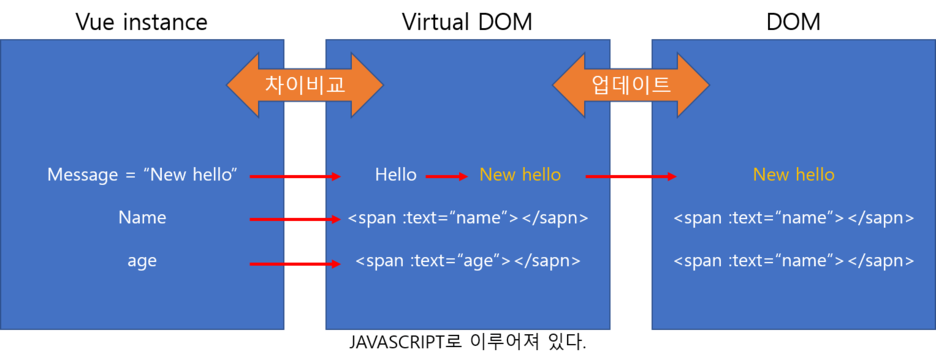

# 가상 dom의 이해

- DOM이란?
  -  **Document Object Model**
  -  다큐먼트(웹페이지)를 객체로 표현하는 모델
    -  javascript가 이용할 수 있는 (메모리에 보관할 수 있는) 객체
  - 즉. DOM은 HTML과 스크립트언어(Javascript)를 서로 연결해주는 역할


## 브라우저가 DOM을 랜더링하는 순서

> 요약 :  스타일-> 레이아웃 -> 페인트 -> 합성

1. 브라우저는 html태그를 파싱 하여 **돔 트리를** 구성
   - 동시에 스타일시트에서 css를 파싱 하여 **스타일 규칙**들을 만들어낸다.
2. 돔 트리와 스타일 규칙 두 가지가 합쳐져서 **렌더 트리를** 만들어낸다.
   - 렌더 트리는 화면에 반영되는 것만 가지고 있기에 HTML의 모든 정보를 표현하는 돔 트리와 일대일 관계는 성립되지 않는다. 
     - 즉, 렌더 트리에 없어도 돔 트리에는 있을 수 있는 것


## DOM 변경의 단점

> 기존에는 화면의 변경사항을 돔을 직접 조작하여 브라우저에 반영

- 돔 트리가 수정될 때마다 렌더 트리가 계속해서 실시간으로 갱신된다는 점
  - 즉, 화면에서 10개의 수정사항이 발생하면 수정할 때마다 새로운 랜더 트리가 10번 수정되면서 새롭게 만들어지게 되는 것
  - 불필요한 랜더링이 더 많은 부하와 속도 저하를 가져오게 됨
- 메모리 누수
  - 만일 개발자가 h1 태그를 찾는 코드를 변수에 저장하지 않고 매번 h1에 관련된 접근 메서드를 사용한다면 매단계마다 저 수많은 document 객체들을 전부 훑으며 찾는 현상이 발생되고 이것은 곧 메모리 누수로 이어진다.


## 가상DOM

- DOM 변경의 단점을 해결하기 위해 만들어진 것

  - 실제 DOM을 조작하는 대신, 이것을 추상화 시킨 자바스크립트 객체인 가상DOM을 사용

- 실제 DOM의 가벼운 사본 같은 개념

  

## 가상DOM 의 변경사항 반영절차

1. 변화가 일어났다. 변화된 버전을 가상돔으로 바꾸자.
   - 데이터가 업데이트 되면 전체 UI를 가상돔에 리렌더링한다.

2. 가상돔끼리 비교하자.
   - 변화 전의 가상돔과 변화된 가상돔을 비교한다.
3. 바뀐 부분만 적용하자.
   - 바뀐 부분만 실제 돔에 적용을 함으로서 레이아웃 계산은 한 번만 이행된다.
     (ex. 네비게이션(컴포넌트)을 열었을 때 특정 영역(컴포넌트)이 빨갛게 변하면서 위치가 변경되는 경우의 레이아웃 계산이 일괄로 단 한 번만 이행)



## 라이프사이클

- mounted
  - DOM이 메모리에 생성되고 렌더링 된 이후에 실행,  전체 랜더링 상태를 보장하지 못함
  - `vm.$nextTick`을 사용하면, 전체 렌더링 상태를 보장할 수 있음
    - 비동기, setTimeout과 비슷한 역할
  - mounted 순서 주의
    - child가 있을 경우, **child 컴포넌트의 mounted를 기다린 후에, 부모 컴포넌트의 mounted가 실행됨** 

- updated
  - 모든 child 컴포넌트들의 렌더링 상태를 보장하지 않음.
  - `mounted`와 마찬가지로, `vm.$nextTick`를 사용 시에 전체 렌더링 상태를 보장할 수 있음.


# ref

- 가상 DOM을 조작하는 함수

  - 기존 `getElementsById`  `getElementsByClassName`  `Document.creatElement()` 을 통해 직접 DOM에 접근해서 조작하는 함수를 대신해 사용됨
    -  Vue에서는 이런 메서드의 사용을 피하라고 권고
    - 웹 브라우저 단에서는 DOM에 변화가 일어나면 웹 브라우저가 CSS를 다시 연산/레이아웃/구성하며 페이지 리페인트를 하기 때문에 시간 로스가 심해지기 때문

- 사용처

  1. JavaScript로 Props&Event 거치지않고 자식컴포넌트 직접 접근
     - 부모에서 자식 ref에 바로 접근 가능함

  2. DOM조작 메서드 없이 엘리먼트 조작

- 주의사항

  - ref 속성은 **컴포넌트가 랜더링이 된 이후 적용**되기 때문에 반응형으로 구성하기 위한 computed 나 template 에서 사용하면 안됨


## 사용 방법

1. 사용하려는 태그에 ref 속성을 달아줌

```vue
<input ref="input">
```


2. script에서 접근
   - 자식의 ref 접근할때도 `this.$refs.자식ref` 로 하면 됨

```javascript
methods: {
  // Used to focus the input from the parent
  focus: function () {
    const target = this.$refs.input
    target.focus()
  }
}
```

