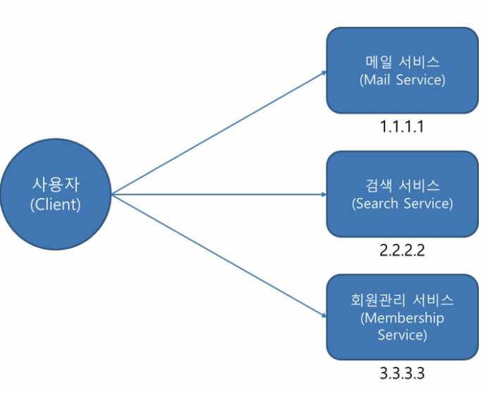

# MSA 에서의 API gateway란?
> SOA의 핵심 인프라라고 할 수 있는 ESB(Enterprise Service Bus) 에서 많은 부분이 계승됨
- 정의
  - 서버 최앞단에 위치하여 모든 API의 호출을 받는 컴포넌트
  - 받은 API 호출을 인증한 후, 적절한 서비스들에 메시지를 전달될 수 있도록 합니다.
- 역할
  - 모든 클라이언트 요청에 대한 엔드 포인트(End point)를 통합하는 서버 ( 마치 프록시 서버 처럼 기능 )
  - 인증 및 권한, 모니터링, 로깅 등 추가적인 기능을 수행

# 무엇을 해결하기 위함인가?
  
## 문제점 
> 클라이언트의 직접 서비스 호출로 인하여 생기는 문제점

이렇게 클라이언트에서 직접 서비스를 호출하는 형태시 발생하는 문제점
- 각각의 서비스마다 인증/인가 등 공통된 로직을 구현해야하는 번거로움 발생
- 수많은 API 호출을 기록하고 관리하기가 어려움
- 클라이언트에서 여러 마이크로서비스에 대한 번거로운 호출을 해야함
- 내부의 비지니스 로직이 드러나게 되어 취약해짐

## 엔드포인트 통합
MSA는 도메인 별 데이터를 저장하고 도메인 별로 하나 이상의 서버가 따로 존재 
    - 이 서비스를 사용하는 클라이언트 입장에서는 다수의 엔트 포인트가 생기게 됨
    - 다수의 엔드포인트는 변경이 일어났을 경우 관리가 힘듬
    - API Gateway는 클라이언트 입장에서 다수의 엔트포인트를 하나의 엔드포인트로 통합하여 관리를 쉽게 함

## 해결

### 1. 인증 및 인가 ( Authentication And Authorization )
- 문제
  - 마이크로서비스 아키텍처에서 각각의 서비스에 API 호출에 대한 인증 및 인가를 하는 것은, 같은 소스코드를 서비스 인스턴스들마다 심어주어야한다는 것을 의미
  - 소스의 중복이 심하여 유지 관리가 어려워짐은 물론, 로깅 및 모니터링을 관리하는 것도 힘들어짐
- API Gateway 사용시 장점
  - 인증서관리, 인증, SSL, 프로토콜 변환과 같은 기능들을 API Gateway에서 처리하게 함으로, 각각의 서비스의 부담을 줄일 수 있음
  - 코드의 중복이 적어져, 서비스 관리 및 업그레이드를 보다 쉽게 할 수 있음

### 2. 요청 절차의 단순화
- 문제점
  - 여러 마이크로 서비스를 대상으로하는 기능을 이용하려 할 떄, 만약 API Gateway가 없다면 클라이언트에서 여러 서비스들에 대한 요청을 따로따로 진행해야함
- API Gateway 사용시 장점
  - API Gateway는 여러 클라이언트의 요청을 단일 클라이언트 요청으로 대체가능하도록 함
  - 이로 인하여, 클라이언트와 백엔드 간의 API 통신량을 줄여 대기시간을 줄이고 효율성을 높일 수 있음

### 3. 라우팅 및 로드벨런싱
클라이언트로부터 접수된 메시지에 따라, API 호출을 적절한 서비스에 라우팅할 수 있기 때문에 서비스 인스턴스들에 대한 부하분산 수행도 가능함

## 추가적으로 얻을 수 있는 기능들
### 1. 서비스 오케스트레이션
- 개념 : 서비스 오케스트레이션
  - 여러개의 마이크로 서비스를 묶어 새로운 서비스를 만드는 개념
  - (추가필요)
- 주의할 점
  - 오케스트레이션 로직을 과도하게 넣는 것은, API Gateway의 부담을 늘리는 것임
    - 즉, Gateway의 특성이 아닌 시스템 통합을 위한 역할이 늘어나게 되는 것임(가벼운 로직이 아닌 무거운 로직이 늘어남)
  - 따라서 성능 저하를 일으킬 수 있기 때문에, MSA와 API Gateway 에 대한 높은 수준의 기술적 이해를 바탕으로 진행해야함

### 2. 서비스 디스커버리
- 개념 : 서비스 디스커버리
  - 서비스의 위치(IP 주소와 포트번호)를 찾는 것을 Service Discovery 라고 함
- 문제
  - API Gateway는 각 서비스를 호출하기 위해, 서비스마다의 IP주소와 포트번호를 알고 있어야함.
    - lagacy 환경에서는 고정적인 IP 주소를 가지고 있기 떄문에 크게 문제될 것은 없지만, 클라우드 환경에서는 동적인 환경에서 배포되기 때문에 서비스의 위치를 찾는 것은 어려움
- 해결
  - API Gateway에서는 서버사이드나, 클라이언트 사이드 기준으로 하여 서비스 디스커버리를 구현 할 수 있음

# 고려할 사항들
- API Gateway가 Scale-out 적용이 유연하게 일어나지 않을 경우, API Gateway가 병목지점이 되어 어플리케이션의 성능저하를 일으킬 수 있음
- API GAateway라는 추가적인 계층이 만들어지는 것이기 떄문에, 그만큼 네트워크 latency가 증가하게 됨

