# 📌 경사하강법(Gradient Descent)

------

## 📄 미분(Differentiation) 은 무엇인가요?

- 미분은 **변수의 움직임에 따른 함수값의 변화를 측정하기 위한 도구** (변화율{기울기}에 극한)
- 최적화에서 제일 많이 사용하는 방법이다.
- 최근엔 `sympy` 모듈 를 가지고 미분을 쉽게 계산할 수 있다.

$$
f^{'}(x) = \lim_{h \to 0} \frac{f(x+h)-f(x)}{h}
$$
```python
  # abs 대신 norm
  while(norm(grad) > eps):
      var = var - lr * grad
      grad = gradient(var)
```
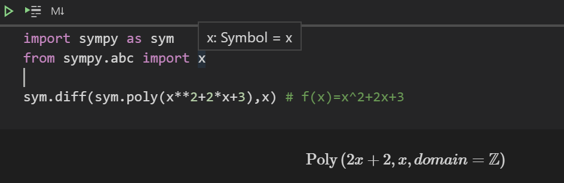

------

## 📄 미분은 우리에게 어떤 의미를 주나요?

- 미분은 함수 *f*의 주어진 점 (*x*,*f*(*x*)) 에서의 **접선의 기울기** 이다. 
- **한 점에서 접선의 기울기를 알면 어느 방향을 점을 움직여야 함수값이 증가/감소 하는지 알 수 있다.**

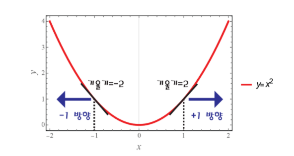

*y*=*x*2 을 통해 그 의미를 파악해보면 **기울기가 2인경우 양의 방향으로 점을 움직일시 함수값이 증가/ 반대방향으로 움직일시 감소** 하며, **기울기가 -2인 경우 음의 방향으로 점을 움직일시 함수값이 증가/ 반대방향으로 움직일시 감소** 한다.

- 미분값을 더하면 경사상승법(gradient ascent)이라 하며 함수의 극대값의 위치를 구할 때 사용합니다.
- 미분값을 빼면 경사하강법(gradient descent)이라 하며 함수의 극소값의 위치를 구할 때 사용합니다.

------

## 📄 그래서 경사하강법이 무엇인가요?

- 즉, **경사하강법이란 미분값의 반대방향으로 (함수값이 감소하는 방향) 으로 움직여 함수의 극솟값을 찾는 방법** 이며
- 추가적으로 **경사상승법이란 미분값의 정방향으로 (함수값이 증가하는방향) 으로 움직여 함수의 극댓값을 찾는 방법** 이다. 
- 결론적으로 경사하강법이란 **극값에선 미분값이 0이므로 목적함수가 더이상 업데이트가 되지 않을때까지(loss 를 줄일수 있을때까지) 최적의 값을 찾는 방법이다.**

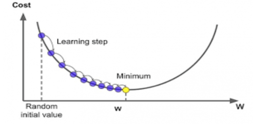

```python
  # gradient: 미분 계산 함수
  # eps: 알고리즘 종료 조건 (컴퓨터 계산 시 미분이 정확히 0이 되는 것이 불가능하기 때문에 설정하는 작은 수)
        
  var = init
  grad = gradient(var)
  while(abs(grad) > eps):
      var = var - lr * grad
      grad = gradient(var)
```


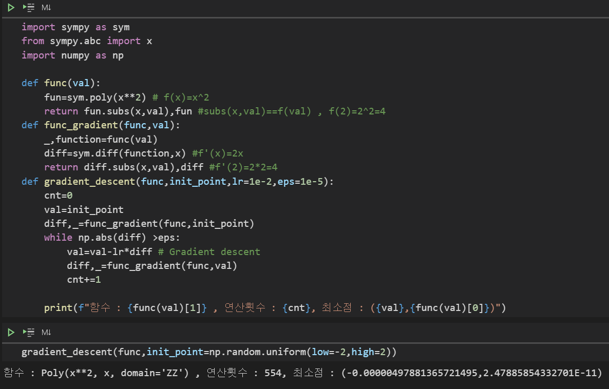

------

## 📄 독립변수가 여러 개면 어떻게 하나요?(벡터)

- 벡터가 입력인 다변수 함수의 경우 **편미분(partial differentiaion)** 을 사용
- 하며 **각 변수별로 편미분한 그레디언트 벡터(Gradient vector) ∇f를 이용한다.**

$$
\partial_{x_{i}} f(x) = \lim_{h \to 0} \frac{f(x+he_{i})-f(x)}{h} \\ f(x,y) = x^{2}+2xy + cos(x+2y) \\ \Rightarrow \partial_{x}f(x,y) = 2x + 2y - sin(x+2y) \\ \Rightarrow\bigtriangledown f = (\partial_{x_{1}}f, \partial_{x_{2}}f, ..., \partial_{x_{d}}f)
$$


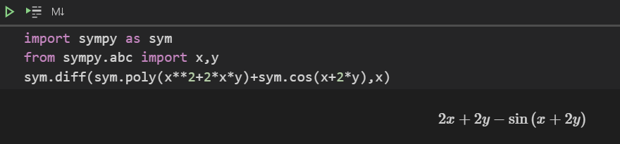

------

## 📄 경사하강법으로 선형회귀 계수를 어떻게 구하나요?

- 선형회귀의 목적식은 ∥y − Xβ∥2이고 이를 최소화하는 β를 찾아야 합니다.

- 이제 목적식을 최소화하는 β를 구하는 경사하강법 알고리즘은 다음과 같습니다.
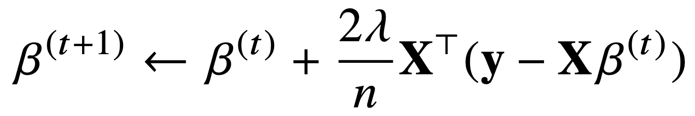

- 경사하강법 알고리즘에서 중요한 hyperparameter

  - learning rate
  - 학습횟수 (T)

- 경사하강법 기반 선형회귀 알고리즘

  ```python
  # norm: L2-노름을 계산하는 함수
  # lr: 학습률
  # T: 학습횟수
  for t in range(T):
  	error = y - X @ beta
      grad = - transpose(X) @ error
      beta = beta - lr * grad
  ```

  

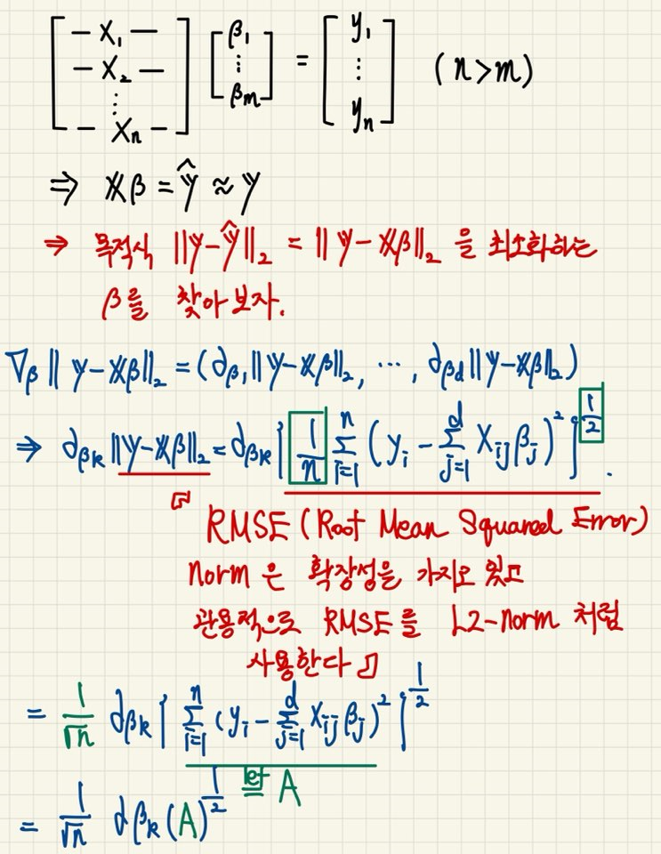

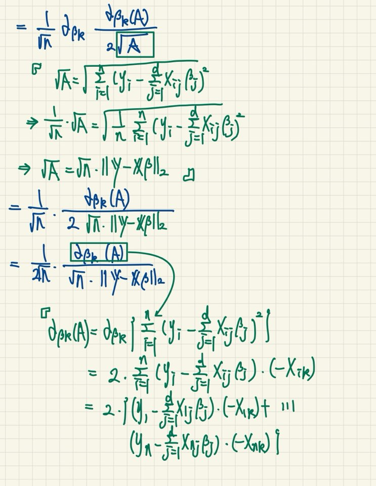

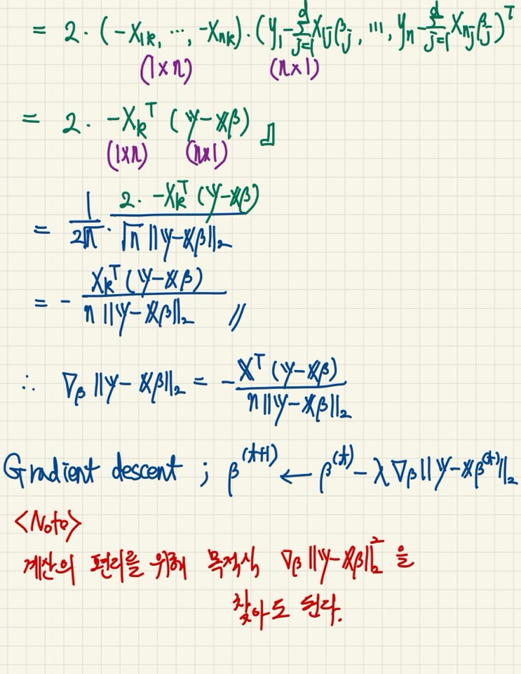

------

## 📄 경사하강법은 만능인가요?

- 이론적으로 **경사하강법은 미분가능하고 볼록(convex)한 함수에 대해선 적절한 학습률과 학습횟수를 선택했을때 수렴이 보장되어 있다.** 
- 특히 선형회귀의 경우 목적식 ∥**y**−**X**β∥2은 **회귀계수 β에 대해 볼록함수이기때문에 수렴이 보장된다.** 
- 하지만 **비선형회귀의 경우 목적식이 볼록하지 않을 수 있으므로 수렴이 항상 보장되지는 않는다.**

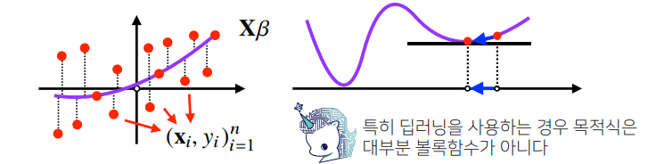

------

# 📌 확률적 경사하강법(Stochastic Gradient Descent)

------

## 📄 배치(Batch) vs 미니배치(Mini-Batch)

| 배치                                                         | 미니배치                                                     |
| ------------------------------------------------------------ | ------------------------------------------------------------ |
| **모델을 학습할 때 한번에 처리하는 데이터의 묶음으로 한 iteration 당 사용되는 데이터 셋의 모임이다.** | **전체 학습데이터를 배치 사이즈로 등분된 데이터셋의 모임이다.** |

------

## 📄 배치 경사하강법(Batch Gradient Descent)

이름에 들어가는 `batch` 때문에 혼동스러울수 있겠지만, 여기서 말하는 **`batch`는 전체 학습 데이터셋** 을 의미한다. 따라서 **BGD(Batch Gradient Descent)는 전체 학습데이터를 하나의 배치로 묶어 학습시키는 경사하강법이다.** 다음은 BGD가 가지는 특징이다.

- 전체 데이터를 통해 학습시키기 때문에 모델 파라미터 업데이트 횟수가 적다(1 Epoch 당 1회 업데이트). 하지만 한 스텝에 모든 학습데이터를 사용하기 때문에 학습이 오래걸린다.

- 전체 데이터를 모두 한번에 처리하기 때문에, 메모리가 가장 많이 필요하다.

- 항상 같은 데이터(전체 데이터)에 대해 경사를 구하기 때문에, 수렴이 안정적이다.

- 그러나 local minima 상태가 되면 빠져 나오기 힘들다.

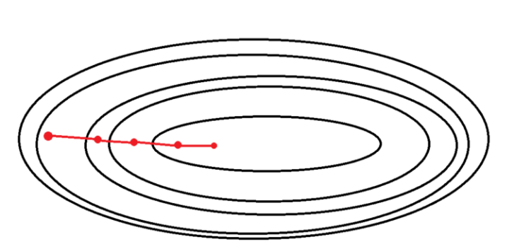

## 📄 확률적 경사하강법

**SGD(Stochastic Gradient Descent) 는 전체데이터 중 랜덤하게 선택된 단 하나의 데이터(배치사이즈=1)를 이용하여 학습시키는 경사하강법이다.** 다음은 SGD가 가지는 특징이다.

- BGD에 비해 적은 데이터로 학습할 수가 있고, 속도가 빠른 장점이 있다.
- 데이터를 한개씩 처리하기 때문에 GPU의 성능을 전부 활용할 수 없다.
- 수렴속도는 빠르지만 각 데이터에 대한 손실값의 기울기는 약간씩 다르기 때문에 shooting 이 발생한다.
- shooting은 local minima 에 빠질 확률을 줄여준다.
- 보편적으로 전체 학습데이터에 대한 좋은 값을 내는 방향으로 수렴하나 global minima에 수렴하기 어렵다.

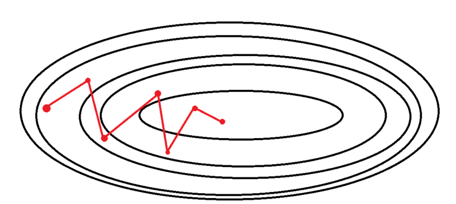

### ✏️ 미니배치 확률적 경사하강법(Mini-Batch Stochastic Gradient Descent)

SGD 와 BGD의 절충안으로 **전체데이터를 배치 사이즈(사용자가 지정)만큼 나눠 미니배치로 학습시키는 경사하강법이다.**

예를들어, 전체데이터가 100개인 데이터를 학습시킬때, 배치사이즈가 10이라면 전체 100개를 총 10묶음의 미니 배치로 나누어 1Epoch 당 10번 학습을 진행한다. 다음은 MSGD가 가지는 특징이다.

- 한 배치의 손실값의 평균으로 학습하기 때문에 SGD 보다 shooting 이 적다.
- local minima 에 빠질 리스크가 적다.
- SGD 보다 GPU 병렬 연산에 유리하다.
- 배치사이즈를 설정해야 한다. 보통 2의 제곱수를 이용하는데, 본인의 GPU 에 따른 Out of memory가 발생하지 않도록 정해줘야 한다.
- 배치사이즈는 학습데이터 갯수에 나누어 떨어지도록 지정하는 것을 권장한다. 만약 마지막 남은 배치가 다른 사이즈면 해당 배치의 데이터가 학습에 더 큰 비중을 갖게 되기 때문이다.

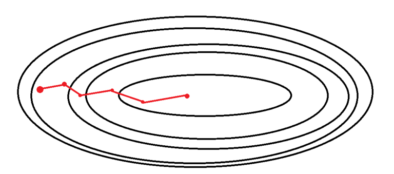

------

## 📄 너무 복잡한데, 한번 정리해 볼까?

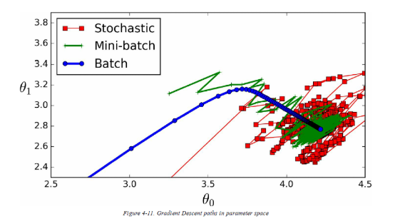

| 배치사이즈                   | 경사하강법 |
| ---------------------------- | ---------- |
| 전체 학습데이터              | BGD        |
| 1                            | SGD        |
| 사용자 지정, 보통 2의 제곱수 | MSGD       |

```null
<참고>
엄밀히 따지면 MSGD 와 SGD는 다른 알고리즘이지만 요즘엔 MSGD를 SGD라고 혼용하여 부르기도 한다.
```