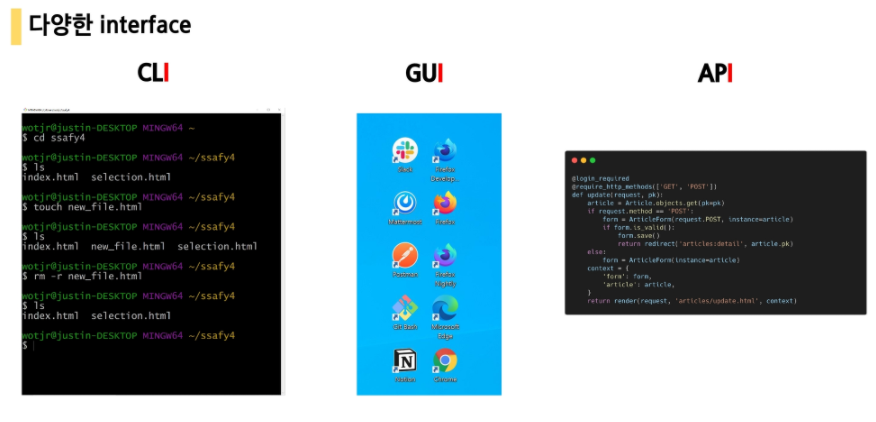
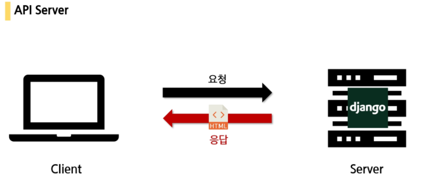
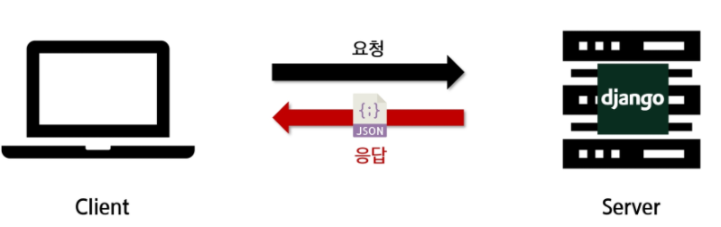
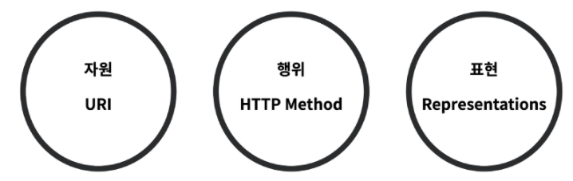
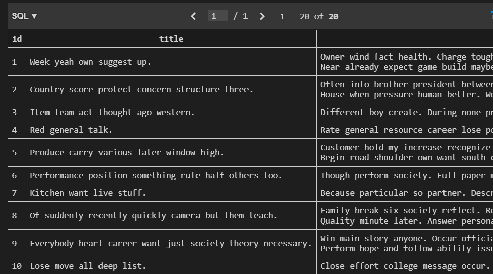
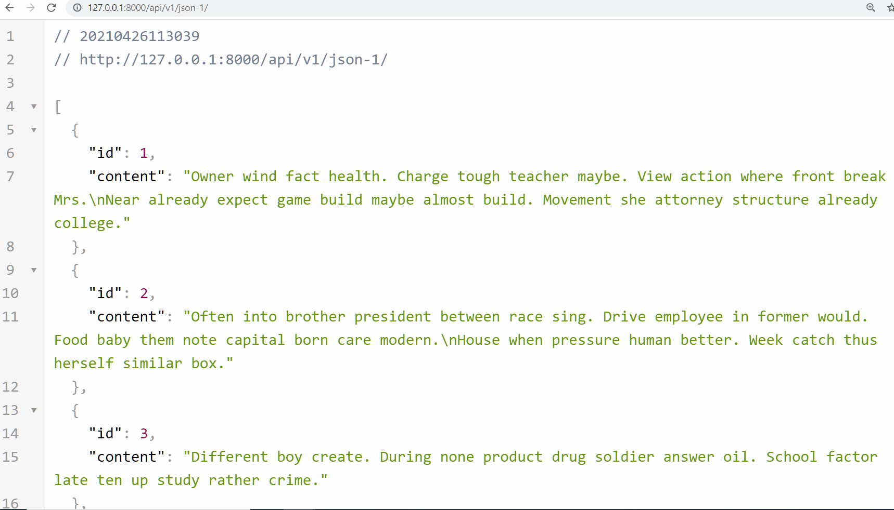
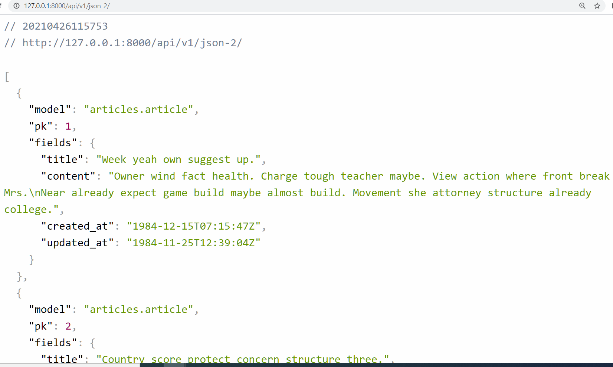
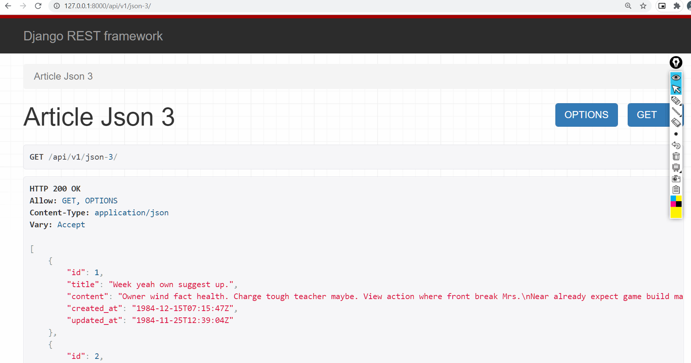
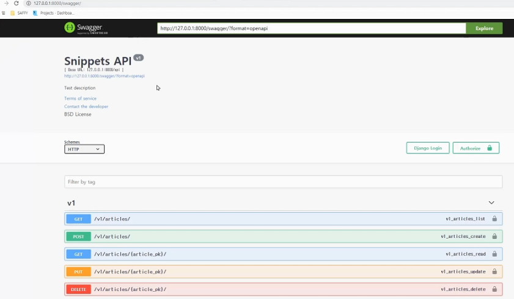
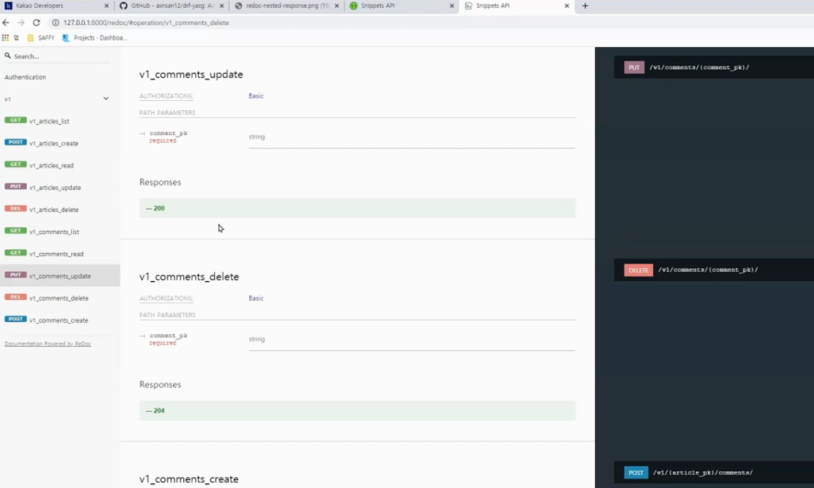

# API

- API(Application Programming Interface)

  - 프로그래밍 언어가 제공하는 기능을 수행할 수 있게 만든 인터페이스

    - 어플리케이션과 프로그래밍으로 소통하는 방법

  - 프로그래밍을 활용해서 할 수 있는 어떤 것

  - CLI, GUI는 각각 명령줄과 그래픽(아이콘)을 통해서 특정 기능을 수행하는 것이며, 

    API는 프로그래밍을 통해 그 일을 수행할 수 있음




## Web API

- 웹 어플리케이션 개발에서 다른 서비스에 요청을 보내고 응답을 받기 위해 정의된 명세
- 현재 웹 개발은 추가로 직접 모든 것을 하지 않고 여러 Open API를 가져와서 활용하는 추세
  - 구글, 카카오지도 API / 우편번호, 도로명, 지번 소 검색 API 등 


### API Server







# REST

- Representational State Transfer
- 웹 설계 상의 장점을 최대한 활용 할 수 있는 아키텍처 방법론
- 네트워크 아키텍처 원리의 모음
  - 자원을 정의
  - 자원에 대한 주소를 지정하는 방법
- REST 원리를 따르는 시스템 혹은 API를 RESTful API라고 하기도 함.
- REST 구성 3요소
  - URI
  - HTTP method
  - Representations




## URI

- URI(Uniform Resource Identifier)

  - 통합 자원 식별자

  - 인터넷의 자원을 나타내는 유일한 주소

  - 인터넷에서 자원을 식별하거나 이름을 지정하는데 사용되는 간단한 문자열

  - URI이란, **웹 서버가 리소스를 고유하게 식별할 수 있도록 하는 것**으로써, URL과 URN 두 가지가 있는데 일반적으로 URL을 사용합니다.

    - URL은 특정 서버의 한 리소스에 대해 구체적인 위치를 서술합니다.
    - URN은 리소스가 어디에 위치해 있든 찾을 수 있는 방식을 말합니다. 

  - 모든  URL 은 URI 다. (URI가 더 포괄적인 개념)

    하지만 모든 URI 가 URL은 아니다.

- URL(Uniform Resource Locator)

  - 통합 자원 위치
  - 네트워크 상에 자원(리소스 - HTML, CSS, 이미지 등)이 어디있는지(주소)를 알려주기 위한 약속
  - 웹 주소, 링크라고도 불림

- URN(Uniform Resource Name)

  - 통합 자원 이름
  - URL과 달리 자원의 위치에 영향을 받지 않은 유일한 이름 역할을 함(독립적 이름)
  - 자원의 이름이 변하지 않는 한 자원의 위치를 이곳저곳 옮겨도 문제없이 동작


### URI 구조


- **스킴 ( scheme )**

- - 사용할 프로토콜을 말하며, 리소스에 어떻게 요청, 접근할 것인지를 명시합니다.

  - 웹에서 주로 HTTP 프로토콜을 사용합니다.

  - - 그 밖에 ftp, mailto(이메일), rtsp(스트리밍)과 같은 프로토콜을 사용할 수도 있습니다.

- **사용자 이름과 비밀번호**

- - 어떤 서버들은 자신이 가지고 있는 데이터에 접근하기 위해서 사용자의 이름과 비밀번호를 요구합니다.

  - - ex) ftp://**victolee:12345**@호스트/asd.xls

  - 만약 웹 서버에서 사용자이름과 비밀번호를 요구하는 URL 스킴을 사용함에도 클라이언트가 이를 명시하지 않고 URL에 접근한다면, 기본값으로 "사용자 이름 : anonumous , 비밀번호는 브라우저에서 제공하는 기본 값"을 따르게 됩니다.

- **호스트와 포트**

- - 하나의 Host( 컴퓨터 )에는 여러 개의 Process( 프로그램 )이 각각의 Socket( 소켓 )을 사용하여 데이터 통신을 하고 있기 때문에, 각각의 소켓을 구분할 필요가 있습니다.

  - 이 때 소켓을 구분하는 역할을 하는 것이 Port( 포트 )입니다.

  - - 톰캣을 다뤄보셨다면, 로컬에서 개발을 했을 때 접근하는 URL은 localhost:8080 일 것입니다.

- - - 이처럼 서버에는 포트에 따라 소켓이 연결되어 있고, 포트 번호에 따라 다른 프로토콜이 사용될 수 있습니다.

  - HTTP 프로토콜에서 포트 번호를 명시하지 않으면, 80번 포트를 기본 값으로 사용합니다. ( Well-known port - [링크](https://ko.wikipedia.org/wiki/TCP/UDP의_포트_목록) )

  - - ex) http://www.google.com**:80**

- **경로**

- - 호스트에서 제공하는 자원의 경로를 의미합니다.
  - ex) https://movie.naver.com/**movie/running/current.nhn**

------

여기서부터는 URL 이 아닌 URI

- **질의**

- - Query String( **쿼리 스트링** )이라고도 합니다.

  - 클라이언트가 자원을 GET 방식으로 요청할 때, 필요한 데이터를 함께 넘겨 줄 목적으로 사용합니다.

  - - 개발할 때 함수를 호출하면 파라미터를 던져주는데, 이와 비슷하다고 보면 됩니다.
    - ex) http://localhost:3000/index?**id=3&page=1**

- **프래그먼트**

- - HTML에는 각각의 요소에 id 속성을 부여할 수 있는데요, URL에 프래그먼트를 전달하면 페이지가 해당 id가 있는 곳으로 스크롤이 이동하게 됩니다.

  - 이 글의 URL에 프래그먼트를 추가하면, 가장 마지막으로 이동할 것입니다.

  - - ex) http://victorydntmd.tistory.com/287**#bottom**


### 설계 주의 사항

- 밑줄(_) 이 아닌 하이픈(-)을 사용
  - URI의 가독성
- 소문자 사용
  - 대소문자에 따라 다른 자원으로 인식하게 됨
- 파일 확장자는 포함시키지 않음


## HTTP(HyperText Transfer Protocol)

- 클라이언트 - 서버 프로토콜(규칙, 약속)
  - 요청(requests) - 클라이언트(브라우저)에 의해 전송되는 메시지
  - 응답(response) - 서버에서 응답으로 전송되는 메시지
- 특징
  - 비연결지향(connectionless)
    - 서버는 응답 후 접속을 끊음
  - 무상태(stateless)
    - 접속이 끊어지면 클라이언트와 서버 간의 통신이 끝나며 상태를 저장
- HTTP method 종류
  - GET - 특정자언의 표시를 요청하며, 오직 데이터를 받기만 함
  - POST - 서버로 데이터를 전송하며, 서버에 변경사항을 만듦
  - PUT - 요청한 주소의 자원을 수정
  - DELETE - 지정한 자원을 삭제


## JSON

- JavaScripts Object Notation
  - lightweight data-interchange format
  - 자바스크립트 객체 문법을 따르며, 구조화된 데이터를 표현하기 위한 문자 기반 데이터 포맷
  - 일반적으로 웹 어플리케이션에서 클라이언트로 데이터를 전송할 때 사용
- 특징
  - 사람이 읽고 쓰기 쉽고, 기계가 파싱(해석 & 분석)하고 만들어내기 쉬움
    - 파이썬의 dictionary, 자바스크립트의 object처럼 C계열의 언어가 가지고 있는 자료구조로 쉽게 변환할 수 있는 key-value 구조로 되어 있음
  - 자바스크립트가 아니더라도 JSON을 읽고 쓸 수 있는 다양한 프로그래밍 언어 환경에서 지원됨


# Django REST Framework

- https://www.django-rest-framework.org/
- Web API 구축을 위한 강력한 toolkit 제공
- REST framework 개발에 필요한 다양한 기능을 제공


## 직렬화(Serialization)

- 데이터 구조나 객체 상태를 동일하게 다른 컴퓨터 환경에 저장하고 나중에 재구성할 수 있는 포맷으로 변환하는 과정
- 예를 들어 DRF의 Serializer는 Django의 Queryset및 Model Instance와 같은 복잡한 데이터를 JSON, XML 등의 유형으로 쉽게 변환 할 수 있는 Python 데이터 타입으로 만들어 줌
- DRF의 Serializer는 Django의 Form 및 ModelForm 클래스와 매우 유사하게 작동 


### ModelSerializer

- https://www.django-rest-framework.org/api-guide/serializers/#modelserializer

- Serializer 폴더 만들고 > Model 만들듯이 Serializer 만듬


## 실습하기

### 세팅

- django seed 설치

  - https://github.com/Brobin/django-seed
  - 더미데이터를 한번에 넣어주는 역할
  - pip install django-seed
  - settings.py > INSTALLED_APPS 에 `'django_seed' `추가

- DRF 설치

  - https://www.django-rest-framework.org/#installation

  - pip install djangorestframework
  - settings.py > INSTALLED_APPS 에  `'rest_framework',` 추가

- python manage.py makemigrations 

  python manage.py migrate

- 더미 데이터 넣기

  - python manage.py seed 앱이름 --number=갯수




### JSON 주고 받기-1 JsonResponse

1. `articles > urls.py ` 

   - `path('json-1/', views.article_json_1),`

2. `articles > views.py`

   ```python
   from django.http.response import JsonResponse
   
   def article_json_1(request) :
       articles = Article.objects.all()
       aritcles_json = []
   
       for article in articles :
           aritcles_json.append(
               {
                   'id': article.pk,
                   'content': article.content
               }
           )
       return JsonResponse(aritcles_json, safe=False) # safe는 dictionary가 아닌 타입이 JsonResponse의 매개변수로 들어갈 시에 false로 바꿔줘야함
   ```

   


### JSON 반환하기 -2 serializers

1. `articles > urls.py ` 

   - `path('json-2/', views.article_json_2),`

2. `articles > views.py`

   ```python
   from django.http.response import HttpResponse
   from django.core import serializers
   
   def article_json_2(request) :
       articles = Article.objects.all()
       data = serializers.serialize('json', articles)
       return HttpResponse(data, content_type="application/json") # response header에 명시되는 content-type 써주기
   ```

 


### JSON 반환하기 -3 DRF의 serializer

1. `articles > urls.py ` 

   - `path('json-3/', views.article_json_3),`

2. `articles > serializers.py` 만들기

   ```python
   from rest_framework import serializers
   from .models import Article
   
   class ArticleSerializers(serializers.ModelSerializers) :
       class Meta :
           model = Article
           fields = '__all__'
   ```

   

3. `articles > views.py`

   ```python
   from rest_framework.response import Response
   from rest_framework.decorators import api_views
   
   from .serializers import ArticleSerializers
   
   @api_view(['GET', 'POST'])
   def article_json_3(request) :
       articles = Article.objects.all()
       serializer = ArticleSerializers(articles, many=True) # many는 복수객체 이냐 단일객체 이냐를 나타냄. 복수라서 True
       return Response(serializer.data)
   ```

 


# 기타

## Django 레거시 데이터베이스 연동

- https://docs.djangoproject.com/ko/3.2/howto/legacy-databases/


## SQLite 이외에 데이터 베이스 사용하기

- setting.py 에서  DTATBASES 부분 고치기
- https://docs.djangoproject.com/en/3.2/ref/databases/ 


## API 명세서 만들기 - drf yasg

- https://github.com/axnsan12/drf-yasg

- 설치 방법

  - `pip install -U drf-yasg`

  - `settings.py > INSTALLED_APPS`  에 추가

    ```python
       'django.contrib.staticfiles',  # required for serving swagger ui's css/js files
       'drf_yasg',
    ```

- 사용방법

  - `urls.py` 에 

    ```python
    ...
    from django.urls import re_path
    from rest_framework import permissions
    from drf_yasg.views import get_schema_view
    from drf_yasg import openapi
    
    ...
    
    schema_view = get_schema_view(
       openapi.Info(
          title="Snippets API",
          default_version='v1',
          description="Test description",
          terms_of_service="https://www.google.com/policies/terms/",
          contact=openapi.Contact(email="contact@snippets.local"),
          license=openapi.License(name="BSD License"),
       ),
       public=True,
       permission_classes=[permissions.AllowAny],
    )
    
    urlpatterns = [
        # 정규표현식
       re_path('^swagger(?P<format>\.json|\.yaml)$', schema_view.without_ui(cache_timeout=0), name='schema-json'),
       re_path('^swagger/$', schema_view.with_ui('swagger', cache_timeout=0), name='schema-swagger-ui'),
       re_path('^redoc/$', schema_view.with_ui('redoc', cache_timeout=0), name='schema-redoc'),
       ...
    ]
    ```

    

- `127.0.0.1:8000/swagger/` 로 접속 - api 테스트용



```python
# POST 방식으로 보내는 것들은 이거 처리 안하면 에러남

from drf_yasg.utils import swagger_auto_schema

@swagger_auto_schema(method=['POST'], request_body=CommentSerializer)
@api_view(['GET', 'POST'])
def article_list(request) : 
    if request.method=="GET" : 
        articles = get_list_or_404(Article)
        serializer = ArticleListSerializer(articles, many=True)
        return Response(serializer.data)
    elif request.method=="POST" :
        # 생성 - modelForm 으로 하는 것과 매우 유사 
        serializer = ArticleSerializer(data=request.data)
        if serializer.is_valid(raise_exception=True) : # raise_exception=True를 통해 밑에 저장 실패 부분을 대신할 수 있음
            serializer.save() # 데이터베이스에 저장
            return Response(serializer.data, status=status.HTTP_201_CREATED) # 저장성공을 알림
        # return Response(serializer.error, status = status.HTTP_400_BAD_REQUEST) # 저장 실패를 알림
```


- `127.0.0.1:8000/redoc/` 로 접속 - doc 자동으로 만들어지는 용도



