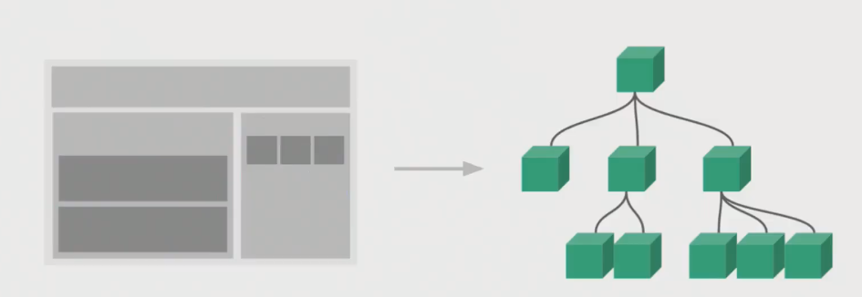
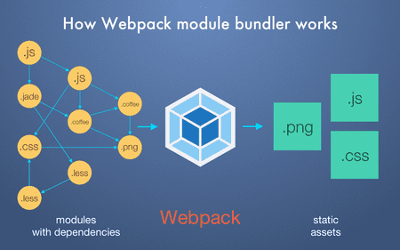
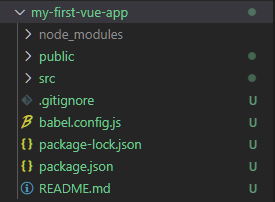

# SFC

## Compnent(컴포넌트)

- 기본 HTML 엘리먼트를 확장하여 재사용 가능한 코드를 캡슐화 하는데 도움을 줌
- CS에서는 다시 사용할 수 있는 범용성을 위해 개발된 소프트웨어 구성 요소를 의미
- 즉, 컴포넌트는 개발을 함에 있어 유지보수를 쉽게 만들어 줄 뿐만 아니라, 재사용성의 측면에서도 매우 강력한 기능을 제공
- Vue 컴포넌트 === Vue 인스턴스





## SFC란

- Single File Component 
- Vue 의 컴포넌트 기반 개발의 핵심 특징
- 하나의 컴포넌트는 .vue라는 하나의 파일 안에서 작성되는 코드의 결과물
- 화면의 특정 영역에 대한 HTML, CSS, JavaScript 코드를 하나의 파일(.vue)에서 관리
- 즉, vue확장자를 가진 싱글 파일 컴포넌트를 통해 개발하는 방식
- Vue 컴포넌트 === Vue 인스턴스 === .vue 파일


# Vue CLI

- Command Line Interface
- Vue.js 개발을 위한 표준 도구
- 프로젝트의 구성을 도와주는 역할을 하며 Vue 개발 생태계에서 표준 tool 기준을 목표로 함
- 확장 플러그인, GUI, ES2015 구성요소 제공 등 다양한 tool 제공
- https://cli.vuejs.org/


## Node.js

- 자바스크립트를 브라우저가 아닌 환경에서도 구동할 수 있또록 하는 자바스크립트 런타인 환경
  - 브라우저 밖을 벗어날 수 없던 자바스크립트 언어의 태생적 한계를 해결
- Chrome V8 엔진을 제공하여 여러 OS 환경에서 실행할 수 있는 환경을 제공
- 즉, 단순히 브라우저만 조작할 수 있던 자바스크립트를 SSR에서도 사용가능하도록 함
- https://nodejs.org/ko/


## NPM

- Node Package Manage

- 자바스크립트 언어를 위한 패키지 관리자
  - python의 pip이 있다면 Node.js에는 NPM
  - pip 과 마찬가지로 다양한 의존성 패키지를 관리
- Node.js의 기본 패키지 관리자
- Node.js와 함께 자동으로 설치됨


## Vue CLI 설치

- vue-cli 설치
  - `$ npm install -g @vue/cli`
- 버전확인
  - `$ vue --version`
- 프로젝트 생성
  - `$ vue create my-first-vue-app`
- run server
  - `$ npm run serve`


## Babel

- JavaScript Trans-compiler
- 자바스크립트의 신버전 코드를 구버전으로 번역/변환 해주는 도구
- 자바스크립트 역사에 있어서 파편화와 표준화의 영향으로 작성된 코드의 스펙트럼이 매우 다양
  - 최신 문법을 사용해도 브라우저의 버전별로 동작하지 않는 상황이 발생
  - 같은 의미의 다른 코드를 작성하는 등의 대응이 필요해졌고 이러한 문제를 해결하기 위한 도구
- 원시 코드(최신버전)을 목적 코드(구버전)으로 옮기는 번역기가 등장하면서 개발자는 더이상 내 코드가 특정 브라우저에서 동작하지 않는 상황에 대해 크게 고민하지 않을 수 있음


## webpack

- static module bundler
- 모듈 간의 의존성 문제를 해결하기 위한 도구


### Module

- 모듈은 단지 파일 하나를 의미( ex. 스크립트 하나 === 모듈 하나 )

- 배경

  - 브라우저만 조작할 수 있었던 시기의 자바스크립트는 모듈 관련 문법 없이 사용 되어짐

  - 하지만 자바스크립트와 애플리케이션이 복잡해지고 크기가 커지자 

    전역 스코프를 공유하는 형태의 기존 개발 방식의 한계점이 드러남

  - 그래서 라이브러리를 만들어 필요한 모듈을 언제든지 불러오거나 

    코드를 모듈 단위로 작성하는 드으이 다양한 시도가 이루어짐

- 과거 모듈 시스템

  - AMD, CommonJS, UMD

- 모듈 시스템 2015년 표준으로 등재되어 있으며 현재는 대부분의 브라우저와 Node.js가 모듈시스템을 지원


### Module 의존성문제

- 모듈의 수가 많아지고 라이브러리 혹은 모듈 간의 의존성(연결성)이 깊어지면서 특정한 곳에서 발생한 문제가 어떤 모듈 간의 문제인지 파악하기 어려워짐(의존성 문제)
- Webpack은 모듈 간의 의존성 문제를 해결하기 위해 존재하는 도구


### Bundler

- 모듈 의존성 문제를 해결해주는 작업이 Bundling이고 이러한 일을 해주는 도구가 Bundler 이다.

  Webpack은 다양한 Bundler 중 하나

- 모듈들을 하나로 묶어주고 묶인 파일을 하나(혹은 여러개)로 만들어짐

- Bundling 된 결과물은 더 이상 서-순에 영향을 받지 않고 동작하게 됨

- Bundling 과정에서 문제가 해결되지 않으면 최종 결과물을 만들어 낼 수 없기 때문에 유지 & 보수의 측면에서도 매우 편리해짐

  - snowpack. parcel, rollup.js 등의 webpack 이외에도 다양한 모듈 번들러 존재

- VueCLI는 이러한 Babel, Webpack에 대한 초기 설정이 자동으로 되어 있음




# Vue project 구성요소 살펴보기




- node_modules
  - node.js의 여러 의존성 module이 설치되어있음.
  - webpack이나 babel도 여기 들어있음
- public
  - favicon.ico
    - 브라우저 탭에 뜨는 아이콘
  - index.html
    - vue app의 뼈대가 되는 html
    - main.js에서 mount 되는 대상이 됨
    - 실제로 npm run build를 했을 때 열리는 문서다.
- src
  - assets
    - 정적인 파일들의 위치(이미지, 기타 멀티미디어 등 파일)
  - components
    - App.vue의 하위 컴포넌트들을 넣어두는 곳
    - components의 이름들은 파스칼케이스로 네이밍
      - ComponentName <- 이렇게
  - App.vue
    - 최상위 컴포넌트
  - main.js
    - webpack이 build를 시작할 때 가장먼저 시작하는 시작점
    - vue instance를 생성하는 역할
    - vue 전역에서 사용하는 모듈들을 등록할 수 있음
- package-lock.json 과 package.json
  - node_modules에 설치되는 모듈과 관련해서 모든 의존성을 설정 및 관리
    - 약간 python 가상환경에서 requirements.txt 와 비슷한 역할
    - 팀원 및 배포환경에서 정확히 동일한 종속성을 설치하도록 보장하는 표현
    - 사용할 패키지의 버전을 고정
    - 개발 과정 간의 의존성 패키지 충돌 방지
  - scripts 
    - 사용할 명령어
  - dependencies
    - 개발환경 + 배포환경에 필요한 모듈들
  - devDependencies
    - 개발환경에서 사용하는 모듈들


## vue 파일 구조

- `vue` 쓰고 tap키 누르면 기본 형태 만들어짐

```vue
<template>
</template>

<script>
</script>

<style>
</style>
```


### App.vue

- 자식의 컴포넌트를 불러오고 - > components에 등록하고 -> 사용

```vue
<template>
  <div id="app">
    
    <MyNewComponent msg="Welcome to Your Vue.js App"/> <!-- 3. 쓴다.-->
</template>

<script>
import MyNewComponent from './components/NewComponent.vue' // 1. 불러오고

export default { // 2. components 등록하고
  name: 'App',
  components: {
    MyNewComponent,
  },
}
</script>

<style>
#app {
  font-family: Avenir, Helvetica, Arial, sans-serif;
  -webkit-font-smoothing: antialiased;
  -moz-osx-font-smoothing: grayscale;
  text-align: center;
  color: #2c3e50;
  margin-top: 60px;
}
</style>

```


### 하위 컴포넌트

- 하나의 파일 안에는 여러개의 컴포넌트를 넣을 수 없음
  - 여러개의 컴포넌트를 사용하고 싶다면 상위 컴포넌트를 하나 만들고 그 안에 집어넣는 형태를 취해야함

```vue
<template> <!-- vue 하고 tap -->
  
  <!-- <h1>This is New componenet</h1> -->
  <!-- <h1>This is New componenet</h1>  -->
  <!-- 하나의 파일 = 하나의 vue = 하나의 컴포넌트 / 그래서 컴포넌트가 여러개 있으면 에러-->

  <!-- 만약 여러개를 쓰고 싶다면 / 이런식으로 div 안에 넣어야함-->
  <div>
    <h1>This is New componenet</h1>
    <h1>This is New componenet</h1>
    <h1>{{ msg }}</h1>
  </div>
</template>

<script>
export default {
  name : 'MyNewComponent', // Vue 탭에 뜨는 이름을 의미함
  props : {
    msg : String,
  }, 
}
</script>

<style>

</style>
```