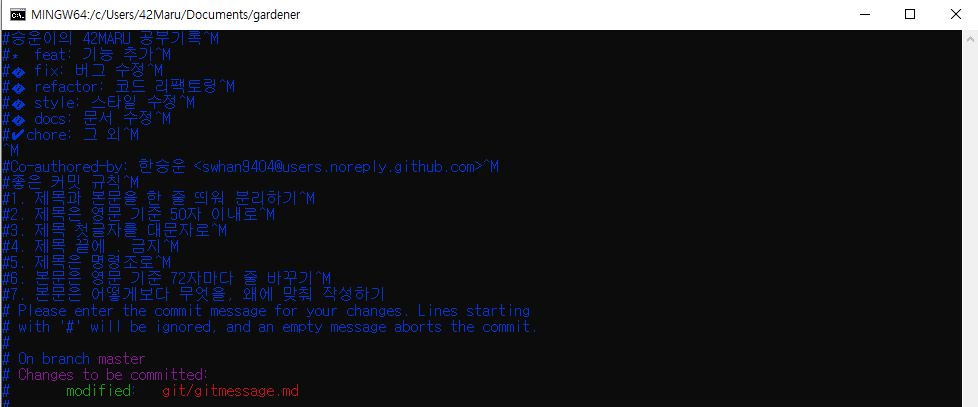

# git message Template

- global 하게 적용될 git message template을 만들어보자


## 1. 템플릿 파일 만들기

- 커밋 메시지 템플릿을 저장할 `~/.gitmessage.txt` 파일을 만들어 준다.

```bash
touch ~/.gitmessage.txt
```


## 2. 커밋 템플릿 저장

- 사용하는 에디터(e.g. `code ~/.gitmessage.txt`)로 `.gitmessage.txt`파일을 연 후 커밋 템플릿 저장한다.

```bash
#승운이의 commit 템플릿
#⭐️ feat: 기능 추가
#💥 fix: 버그 수정
#🔧 refactor: 코드 리팩토링
#💈 style: 스타일 수정
#📝 docs: 문서 수정
#✅ test: 테스트 관련
#✔️ chore: 그 외

#좋은 커밋 규칙
#1. 제목과 본문을 한 줄 띄워 분리하기
#2. 제목은 영문 기준 50자 이내로
#3. 제목 첫글자를 대문자로
#4. 제목 끝에 . 금지
#5. 제목은 명령조로
#6. 본문은 영문 기준 72자마다 줄 바꾸기
#7. 본문은 어떻게보다 무엇을, 왜에 맞춰 작성하기
```


## 3. git config 에 설정하기

`.gitconfig`파일의 commit 템플릿 기본값으로 `~/.gitmessage`를 설정해준다.

```bash
git config --global commit.template ~/.gitmessage.txt
```


## 4. git commit 해보기

이제 `git commit` 명령어 입력 시 커밋 메시지 템플릿을 확인하면서 작성할 수 있다.




# 만약 레포마다 다르게 설정하고 싶다면?

1. git 폴더가 있는 root 디렉토리에, `.gitmessage` 파일을 만든다.

2. `git config commit.template .gitmessage`

   를 입력하여, 현재 디렉토리에 있는 gitmessage를 commit template 으로 등록한다.

   이에 대한 정보는  `path/to/project/.git/config` 파일에 설정 파일에 저장된다.
   
   
# git commit emoji

https://gist.github.com/parmentf/035de27d6ed1dce0b36a

| Commit type                | Emoji                                            |
| -------------------------- | ------------------------------------------------ |
| Initial commit             | 🎉 `:tada:`                                       |
| Version tag                | 🔖 `:bookmark:`                                   |
| New feature                | ✨ `:sparkles:`                                   |
| Bugfix                     | 🐛 `:bug:`                                        |
| Metadata                   | 📇 `:card_index:`                                 |
| Documentation              | 📚 `:books:`                                      |
| Documenting source code    | 💡 `:bulb:`                                       |
| Performance                | 🐎 `:racehorse:`                                  |
| Cosmetic                   | 💄 `:lipstick:`                                   |
| Tests                      | 🚨 `:rotating_light:`                             |
| Adding a test              | ✅ `:white_check_mark:`                           |
| Make a test pass           | ✔️ `:heavy_check_mark:`                           |
| General update             | ⚡ `:zap:`                                        |
| Improve format/structure   | 🎨 `:art:`                                        |
| Refactor code              | 🔨 `:hammer:`                                     |
| Removing code/files        | 🔥 `:fire:`                                       |
| Continuous Integration     | 💚 `:green_heart:`                                |
| Security                   | 🔒 `:lock:`                                       |
| Upgrading dependencies     | ⬆️ `:arrow_up:`                                   |
| Downgrading dependencies   | ⬇️ `:arrow_down:`                                 |
| Lint                       | 👕 `:shirt:`                                      |
| Translation                | 👽 `:alien:`                                      |
| Text                       | 📝 `:pencil:`                                     |
| Critical hotfix            | 🚑 `:ambulance:`                                  |
| Deploying stuff            | 🚀 `:rocket:`                                     |
| Fixing on MacOS            | 🍎 `:apple:`                                      |
| Fixing on Linux            | 🐧 `:penguin:`                                    |
| Fixing on Windows          | 🏁 `:checkered_flag:`                             |
| Work in progress           | 🚧 `:construction:`                               |
| Adding CI build system     | 👷 `:construction_worker:`                        |
| Analytics or tracking code | 📈 `:chart_with_upwards_trend:`                   |
| Removing a dependency      | ➖ `:heavy_minus_sign:`                           |
| Adding a dependency        | ➕ `:heavy_plus_sign:`                            |
| Docker                     | 🐳 `:whale:`                                      |
| Configuration files        | 🔧 `:wrench:`                                     |
| Package.json in JS         | 📦 `:package:`                                    |
| Merging branches           | 🔀 `:twisted_rightwards_arrows:`                  |
| Bad code / need improv.    | 💩 `:hankey:`                                     |
| Reverting changes          | ⏪ `:rewind:`                                     |
| Breaking changes           | 💥 `:boom:`                                       |
| Code review changes        | 👌 `:ok_hand:`                                    |
| Accessibility              | ♿ `:wheelchair:`                                 |
| Move/rename repository     | 🚚 `:truck:`                                      |
| Other                      | [Be creative](http://www.emoji-cheat-sheet.com/) |

