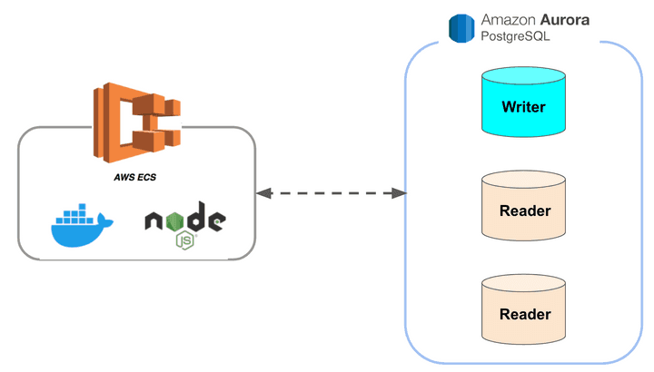
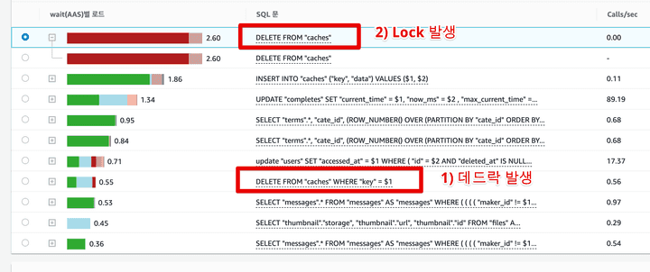
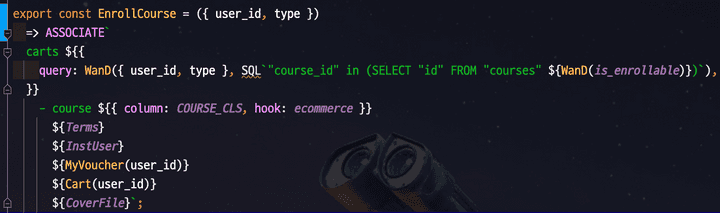
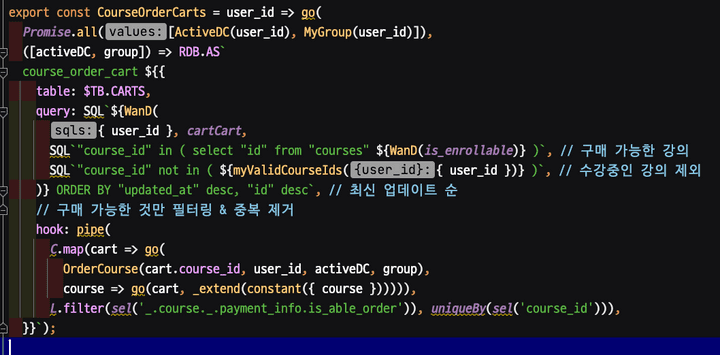

https://tech.inflab.com/202201-event-postmortem/

글을 읽다가 장애를 어떤 방식으로 파악하고, 어떻게 파훼해나가는지를 볼 수 있는 너무 좋은 글이라 생각되어 글을 읽으면서 내 방식대로 다시 글을 정리하고, 모르는 내용이 있으면 찾아서 추가해보았다.

# 인프런 서버의 구성

- 서버 : 모놀리틱 NodeJS 프로젝트 구성
  - ECS Fargate 에 10~30대 트래픽에 따라 유지
    - ECS Fargate 란?
      - AWS에서 제공하는 오케스트레이션 서비인 ECS(Elastic Container Service) 를 기반으로 EC2와 같은 별도의 컴퓨팅 자원에 의존하지 않고 컨테이너를 독립적으로 실행하는 서비스
      - 마치, AWS Lambda와 같이 컴퓨팅 자원에 추가적인 관리 없이 어플리케이션을 실행하는 것이 가능해짐.
- DB : AWS Aurora PostgreSQL 10.16
  - 클러스터링 
    - 1대의 Master : 쓰기
    - 2~7대의 Replication : 읽기
  - 특징
    - 서비스별로 각자의 DB를 가지고 있지 않은 상태이기 때문에, 한 서비스의 장애는 전체 서비스의 장애로 확장될 수 밖에 없는 구조

# 장애 분석

## 1월 3일 장애 - 슬로우 쿼리

- 장애 시간 : 오후 8시 30분 ~ 오후 10시 ( 1시간 30분 )
- 장애 원인 : 강의 페이지의 관심회사 조회 기능(해당 강의를 어떤 회사직원들이 듣고 있는지 정보보기)에서 발생한 대량의 슬로우 쿼리
  - 해당 조회 API가 실시간 가공으로 처리하는 로직이다보니, 인덱스 적용이 안된 경우 성능 부하를 줄 수 있음
- 장애 전파 과정
  1. 관심회사 조회 기능으로 인한 슬로우 쿼리 발생
  2. 쿼리 지연으로 인해 빠르게 Node 프로세스 커넥션이 고갈됨
  3. Node 프로세스 커넥션이 고갈된 이후 요청은 모두 대기 상태로 빠지게 됨
  4. 대기 상태로 요청들이 빠진 후 일정시간 대기 이후 Node 프로세스를 강제 종료되는 현상이 발생
  5. ECS 설정을 통해 빠진 프로세스 만큼 다시 프로세스가 추가되지만, 관심회사 조회 API 외에도 처리하던 다른 쿼리도 Node 프로세스의 종료로 전부 취소되어 서비스가 전체적으로 사용이 불가능한 상태가 되어버림
- 장애 확인 방법
  - 로그와 실행 계획 을 통해 확인
    - 관심 회사 조회 API의 쿼리 중 일부가 인덱스가 적용이 안된 것을 확인
- 장애 대응 방법
  - 쿼리 중에 인덱스 적용이 안된 부분 인덱스를 추가하여 문제 해결

## 1월 3일 - 쓰기 DB cpu 사용량 90% 이상

- 장애 시간 : 1월 3일 오후 11:30분부터 1월 4일 새벽 01:30까지

- 장애 원인

  - Redis 부하를 낮추기 위해 DB 로 분산시킨 캐시용 데이터
    - 캐시 데이터 설계가 잘못되어 1개의 JSON에서 모든 캐시데이터를 관리하도록 함
      - 즉, 1개의 Row에 보관할 모든 캐시 데이터를 저장하도록 구성되어 있음
      - 적재된 고용량의 캐시 row 1건은 캐시 초기화/ 캐시 재생성등의 행위가 발생할 때마다 쓰기 DB에게 큰 부하를 주게 됨( 모든 캐시 데이터가 해당 1건에 다 담겨 있기 때문에 )
  - 쓰기 DB에서 호출되던 조회용 쿼리

- CPU 부하요인 

  - 근본원인: 사용자 수의 증가로 캐시 초기화 & 재생성이 빈번하게 발생

  1. 1개의 Row로 구성된 캐시을 초기화/ 캐시 재생성할 때마다 DB에게 큰부하
  2. 1개의 Row 에 대한 요청이 겹쳐서 데드락 발생
  3. 아직 읽기 DB로 전환하지 못했던 조회용 쿼리들이 쓰기 DB에서 처리되어 DB 부하 가중화

- 장애 확인 방법

- 장애 대응 방법(임시방편)

  - 캐시 초기화 & 재생성 주기 변경
  - 쓰기 DB에 부하를 준 조회용 쿼리들만 먼저 읽기 DB로 전환

- 장애 대응 근본적 해결방법

  - 캐시 데이터 해제

## 1월 4일 - 슬로우 쿼리

- 장애 시간 : 1월 4일 오전9시부터 12시

- 장애 원인

  - 강의 테이블 조회 관련 슬로우 쿼리
    - 실제 강의 검색
    - 추천형 기능(비슷한 사람들이 수강한 강의, 내가 학생한 BackEnd 분야 인기 강의) 등이 전부 강의 테이블 기반으로 작동

- 장애 대응 방법(임시방편1)

  - r5.8xlarge 8대로 데이베이스를 임시로 확장(DB 사용값만 월 4천만원에 해당하는 비용)
  - 이렇게 처리한 이유 - 슬로우 쿼리의 종류가 워낙 다양하여, 한번에 모든 쿼리를 수정하기는 힘들다고 판단하여 일단 시간 벌기용

- 장애 대응 방법(임시방편2)

  1. 비효율적인 실행 계획 대응

    - 테이블의 컬럼 변조(`lower("컬럼명") = lower(쿼리파라미터)`) 하거나 부정조건(`!=`, `NOT IN` ) 등 인덱스르 사용할 수 없는 쿼리사용 -> 테이블 풀 스캔 쿼리가 동시에 수십~수백개 발생할 수 밖에 없음
    - 대응 내용 - 조회 쿼리 개선
      - 인덱스를 추가하거나 쿼리르 변경해서 인덱스를 사용하도록 개선
      - 개선이 안되는 쿼리라면 차라리 기능 OFF

  2. 불필요한 조회항목들 제거

    - `select *` 로 되어있어 사용여부와 관계없이 모든 컬럼을 조회 -> 사용하지 않는 대용량의 컬럼들도 함께 조회됨(강의소개 컬럼 과 같은 - 컬럼 1개의 값이 10KB 정도 된다고 함)
    - 대응 내용
      - 실제 기능에서 사용되지 않던 고용량 컬럼 같이 조회되는 부분 제거

### 수정 지연 요소

- 문제 발견에 소요된 시간 : 30분
  - 모니터링과 슬로우쿼리 알람을 통해 문제가 되는 쿼리 조사하는데 드는 시간
- 실제 해결까지 : 3시간
  - 이유 : 무분별한 쿼리 추상화

- 해결까지 오래걸린 이유

1. 실제 프로젝트에 사용된 쿼리들

  - 모든 쿼리가 함수 / Hook / 커스텀 이벤틀르 사용하여 구성하다보니 해당 쿼리의 실제 코드를 찾는데 오래 걸림

2. 기존 프로젝트가 타입이 없고, 테스트 코드가 없음 
   - 안정감있게 조회 쿼리르 변경하기가 부담스러움
   - 로컬에서 충분한 수동 테스트를 하고 나서야 실제 배포를 할 수 있었고, 그로 인해 실제 장애 시간이 더 길어지게 됨

## 1월 7일 - 슬로우 쿼리

- 장애 시간 : 1월 7일 저녁 9시부터
- 장애 원인
  - `where id in (ID) `에 포함되는 ID의 개수가 100개를 초과해서 인덱스를 사용하지 못하고 테이블 풀 스캔을 하는 쿼리의 문제
- 장애 전파 과정
  1. `where id in (ID)` 가 포함되는 장바구니, 구매완료, 결제 페이지 등에서 강의들을 가져오는데, 125개의 강의를 100% 할인을 해서 해당 모든 강의를 유저가 장바구니에 담고 일괄결제 함
- 장애 해결 방법
  - 한번에 담는 강의 수 제한 보다는 IN 절에 담는 ID를 20개씩 끊어서 Promise.all로 분할처리 하도록 구성
    - 따라서 다시 IN 절을 통한 인덱스 효과를 사용할 수 있게 됨

## 1월 17일 

- 장애 시간 : 1월 17일 10시 ~

- 핵심 문제점 : 성능 테스트를 할 수 없음

  - 인프런 대부분의 페이지가 트래픽이 몰리면 언제든 장애가 날 수 있는 시한폭탄과 같아서
  - 가장 예상되는 지점이 강의 테이블인 것은 알지만, 수많은 기능들이 강의테이블과 JOIN, SubQuery로 되어있어 별도의 데이터베이스로 분리하는 작업을 일주일안에 할 수 없음

- 보편적인 성능 개선 작업

  1. PostgreSQL 버전 업데이트 (10.16 -> 11.13)

    - B Tree Index 성능 개선 및 B Tree Index 커버링 인덱스 효과를 위해

  2. 쿼리 타임아웃 설정 (5초)

    - 5초이상 수행되는 쿼리라면 강제종료하여 Long Query 사전 차단

  3. Max Connection 증설
  4. 현재 2초 이상 수행되는 쿼리들에 대한 성능 개선

- 문제의 실마리
  - 1만건도 되지 않은 강의 테이블만 탐색하는 쿼리에도 슬로우가 발생
    - 10억건도 넘는 테이블에서도 인덱스 설계를 통해 1~2초 쿼리가 수행되었는데, 1만건도 안되는 단일 테이블만 조회하는 쿼리에서도 슬로우 발생하는 것은 이해가 안됨
  - 쓰기 DB 테이블 Tuple 정보 확인
    - 강의 테이블의 Dead Tuple 이 99% 가 된 것을 확인할 수 있었음
      - `autovacuum` 이 강의 테이블에서 수행중
    - 용어 설명
      -  Dead Tuple : PostgreSQL에서 모든 데이터는 tuple 형태로 저장됨. 모든 tuple은 live tuple, dead tuple로 나뉘는데, 더 이상 사용되지 않는 tuple은 dead tuple 이라고 부름
         -  Dead Tuple 의 발생 원인 - MVCC(Multiversion concurrency control)를 구현한 방법으로 인해 발생 (즉, update/ delete 트랜잭션이 일어날 떄 dead tuple을 남기게 됨)
            1. FSM(Free Space Map)에 여유가 있는지 확인. 없으면 FSM을 추가적으로 확보
            2. FSM의 빈 공간에 업데이트 될 데이터를 기록, 이 때 새로운 tuple이 추가됨
            3. 기록이 완료되면, 기존 column(혹은 row)를 가리키는 포인터를 새로 기록된 tuple로 변경함
            4. 업데이트 이전 정보가 기록된 공간은 더 이상 참조가 되지 않게 함. 이 참조가 되지 않은 tuple을 dead tuple 이라 부릅니다.
       -  `autovacuum` 
          - PostgreSQL의 MVCC 구현체는 update/delete 트랜잭션이 일어날 떄 dead tuple을 남기게 되는데, 이 dead tuple 을 정리하기 위해 `Full Vacuum` 이라는 task 가 만들어짐
          - `Full Vacuum`은 수동으로 구동되는데, Full Vacuum이 수행중일 때 해당 테이블은 lock이 걸리며, 모든 트랜잭션이 거부됨
          - 위와 같은 이유로 lock을 걸지 않으면서 dead tuple을 정리해주는 `Vacuum` 명령어가 나오게 됨
          - 이 Vaccum 명령어를 정기적으로 ,그리고 자동으로 vacuuming을 수행하는 것이 `Autovacuum`
 - Dead Tuple Rate 모니터링
   1. 수동으로 vacuum을 수행하여 Dead Tuple 처리
   2. Dead Tuple Rate 를 모니터링 한 후 강의 테이블에서 엄청나게 빠른 주기로 Dead Tuple Rate 가 증가하는 것을 확인
   3. 발생 되는 이유 Query 체크
      - 강의 테이블에서는 수강생 수를 컬럼으로 관리하고 있는데 수강생이 강의를 등록하면 수강생 수 항목을 +1 시키는 Update 쿼리가 수강 신청이벤트가 발생시 항상 수행 됨
      - PostgreSQL은 MVCC 때문에 기존 RDBMS 처럼 해당 데이터가 UPDATE, DELETE 한다고 해서 실제 데이터를 수정하거나 삭제하지 않음
      - 수정 이벤트 발생시 기존 데이터는 변경되었다는 표시를 남기고, 새로운 데이터를 기록하게 됨
      - 기존 데이터를 변경하지 않고 보관하는 방식을 택하다보니 UPDATE, DELETE, Transaction 이벤트가 많아질 수록 Dead Tuple 발생에 따른 디스크 I/O 성능저하를 일으키게 됨
      - 특히, 강의 테이블은 고용량을 가진(강의 소개 컬럼의 HTML 코드) 컬럼들로 인해 Dead Tuple 하나 하나의 용량이 높아 잦은 업데이트 쿼리는 고용량의 Dead Tuple 생산으로 이어지게 됨
      - Dead Tuple 폭발적인 증가로 모든 강의 테이블 쿼리들에서 변목 현상

- 문제의 해결
  - 고용량의 컬럼과 수강생수 업데이트를 분리
    - 기존의 다른 기능들의 영향도를 파악해서 수강생수 컬럼을 분리하기보다는, 강의 소개 컬럼(고용량 컬럼)을 분리하는 것을 선택함

# 많이 남아있는 개발팀 숙제

- 모든 영역에서의 높은 장애 민감도
- 한 테이블의 장애가 전체 서비스의 장애로 확장 되는 구조
- 성능 개선이 쉽지 않은 테이블, 캐시 구조
- 직관적이지 않은 SQL 코드
- 안정감을 주지 못하는 코드 (Typeless, 테스트코드의 부재 등)
- 안정적인 Batch 환경의 부재
- 아직 밝혀지지 않은 수많은 숨겨진 장애 포인트

## MSA 구조로 왜 바꾸지 않는가?

- 조직의 구조와 성숙도가 충분히 갖춰지지 않은 상태에서 MSA 전환을 하면 독이 됨
- MSA 도입은 높은 복잡도로 인해 더 큰 문제가 발생되기 떄문

## 그럼 앞으로의 방향성은?

- 적정선의 모놀리틱을 유지하면서 장애 전파율이 높은 일부 도메인을 별도로 분리해서 조직의 구성에 맞게 적정 수준에서 경계를 두고 조절