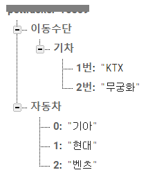

# 데이터 베이스에 저장할 것
- 어떤 사람이 코로나 정보를 받을 것인지(유저 정보)
- 새로운 코로나 정보임을 알기 위해 이전 코로나의 정보

# 필요한 데이터 베이스의 요건
- 나의 로컬 컴퓨터가 켜져 있지 않더라도 작동할 수 있도록 클라우드 베이스의 데이터베이스이어야한다.
- 돈을 들이지 않고 구축하고 싶다.

## Firebase realtime database
- 데이터가 로컬에 유지되고 오프라인일 때도 실시간 이벤트가 계속 발생하므로 최종 사용자에게 원활한 환경이 제공됩니다. 기기가 다시 연결되면 클라이언트가 오프라인일 때 발생한 원격 업데이트와 로컬 데이터 변경이 동기화되고 모든 충돌이 자동으로 해결됩니다.
- NoSQL 데이터베이스
- 오로지 작업 실행 속도를 위주로 설계되었으므로 수백만 사용자가 실시간으로 쾌적하고 원활하게 이용할 수 있는 탁월한 실시간 환경을 구축할 수 있습니다.
- 저장 : 1GB / 통신용량 : 월 10GB / 동시연결수 : 100개 까지 무료
> 내가 원하는 여건의 다른 데이터베이스도 많았지만, 접근성이 다른 것들보다 용이해서 Firebase로 데이터베이스를 사용해 보기로 했다.


# Firebase 이용하기
## pip install
```bash
pip install firebase_admin
```

## firebase 가입

1. 가입
2. 프로젝트 설정 > 서비스 계정 > Python > 새 비공개 키 생성

## firebase Realtime Database 생성

1. database 생성 - 보안 규칙을 테스트 모드로

2.  규칙 변경(바로 접속확인을 가능하게 하기 위해)

   ```json
   {
     "rules": {
       ".read": true, 
       ".write": true,  
     }
   }
   ```

## 파이썬을 이용한 데이터 베이스 접속

```python
import firebase_admin
from firebase_admin import credentials
from firebase_admin import db

cred = credentials.Certificate("./asset/covid-patient-d2452-firebase-adminsdk-키-값들.json") # 키 파일
firebase_admin.initialize_app(cred, {
    'databaseURL' : 'https://covid-patient-d2452-default-rtdb.firebaseio.com/' #데이터베이스 주소 입력
})

dir = db.reference() # 기본위치 지정
dir.update({
    '테스트 ' : 'success'
})
```

이렇게 하면 관련 정보가 json 형식으로 데이터베이스에 저장되는 것을 확인할 수 있음.

## 1.5 Realtime DataBase 문법

https://firebase.google.com/docs/reference/admin/python?hl=ko

```python
# reference : 기본위치 변경
dir = db.reference() 
# 값 등록
dir.update({
    '자동차' : ['기아', '현대', '벤츠'] # 리스트로 저장하면 key값은 0,1,2.. 순으로 매겨짐
})
# 값 조회
dir = db.reference()
print(dir.get()) # {'이동수단': {'기차': {'1번': 'KTX', '2번': '무궁화'}}, '자동차': ['기아', '현대', '벤츠']}
dir = db.reference('이동수단/기차/1번')
print(dir.get()) # KTX
```



이로써 DB 이용 준비는 끝났다.