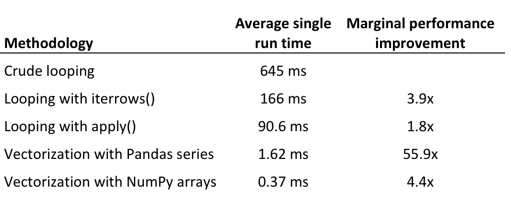

# 📌판다스 효율적 사용

판다스 데이터 프레임에 함수를 적용하는 몇 가지 방법론의 효율성을 가장 느린 속도부터 가장 빠른 속도까지 나열하며 검토하겠습니다.

1. 색인을 사용하여 데이터 프레임 행을 반복하는 방법
2. iterrows()를 사용한 반복
3. apply()를 사용한 반복
4. 판다스 시리즈를 사용한 벡터화
5. 넘파이 배열을 사용한 벡터화

### ✏️ 판다스에서 단순 반복, 절대 하지 말아야 할 일

- 이 접근법의 장점은 다른 반복 가능한 파이썬 객체와 상호 작용하는 방식, 예컨대 리스트나 튜플에 대해 반복하는 방식과 동일하다는 점입니다.
- 반대로 단점은 판다스의 단순 반복이 아무 짝에 쓸데없는 가장 느린 방법이라는 점입니다.
- 아래에서 논의할 접근법과 달리 판다스의 단순 반복은 내장된 최적화를 이용하지 않기 때문에 극히 비효율적(그리고 종종 읽기도 쉽지 않습니다)입니다.

```python
# 모든 행을 수동으로 반복하며 일련의 거리를 반환하는 함수를 정의함
def haversine_looping(df):
    distance_list = []
    for i in range(0, len(df)):
        d = haversine(40.671, -73.985, df.iloc[i]['latitude'], df.iloc[i]['longitude'])
        distance_list.append(d)
    return distance_list
```


### ✏️ iterrows()를 사용한 반복

- iterrows()는 데이터 프레임의 행을 반복하며 행 자체를 포함하는 객체에 덧붙여 각 행의 색인을 반환하는 제너레이터입니다.
- iterrows()는 판다스 데이터 프레임과 함께 작동하게끔 최적화되어 있으며 표준 함수 대부분을 실행하는 데 가장 효율적인 방법은 아니지만(나중에 자세히 설명) 단순 반복보다는 상당히 개선되어 있습니다.

```python
# 반복을 통해 행에 적용되는 Haversine 함수
haversine_series = []
for index, row in df.iterrows():
    haversine_series.append(haversine(40.671, -73.985, row['latitude'], row['longitude']))
df['distance'] = haversine_series
```


### ✏️apply 메서드를 사용한 더 나은 반복

- apply()는 본질적으로 행을 반복하지만 Cython에서 이터레이터를 사용하는 것 같이 내부 최적화를 다양하게 활용하므로 iterrows()보다 훨씬 효율적입니다.

```python
df['distance'] = df.apply(lambda row: haversine(40.671, -73.985, row['latitude'], row['longitude']), axis=1)
```


### ✏️판다스 시리즈를 사용한 벡터화

- 판다스는 수학 연산에서 집계 및 문자열 함수에 이르기까지 다양한 벡터화 함수를 포함하고 있습니다.
- 내장 함수는 판다스 시리즈와 데이터 프레임에서 작동하게끔 최적화되어있습니다.
- 결과적으로 벡터화 판다스 함수를 사용하는 건 비슷한 목적을 위해 손수 반복시키는 방법보다 거의 항상 바람직합니다.

```python
df['distance'] = haversine(40.671, -73.985, df['latitude'], df['longitude'])
```


### ✏️넘파이 배열을 사용한 벡터화

- 넘파이 라이브러리는 “과학 계산을 위한 파이썬 기본 패키지”를 표방하며 내부가 최적화된, 사전 컴파일된 C 코드로 작업을 수행합니다.
- 판다스와 마찬가지로 넘파이는 배열 객체(ndarrays라고 함) 상에서 작동합니다.
- 그러나 색인, 데이터 유형 확인 등과 같이 판다스 시리즈 작업으로 인한 오버헤드가 많이 발생하지 않습니다.
- 결과적으로 넘파이 배열에 대한 작업은 판다스 시리즈에 대한 작업보다 훨씬 빠릅니다.

```python
df['distance'] = haversine(40.671, -73.985, df['latitude'].values, df['longitude'].values)
```


### 결론



## 📄  결론

판다스 코드 최적화에 관해 몇 가지 기본적인 결론을 내릴 수 있습니다.

1. 반복을 피해야합니다. 사용 사례 대부분의 경우 반복은 느리고 불필요합니다.
2. 반복해야 하는 경우 반복 함수가 아닌 apply()를 사용해야합니다.
3. 보통은 벡터화가 스칼라 연산보다 낫습니다. 대부분의 판다스 작업은 벡터화시킬 수 있습니다.
4. 넘파이 배열에서의 벡터 연산은 판다스 시리즈에서 수행하는 것보다 효율적입니다.