# 📌 Vector

------

## 📄 벡터는 무엇인가요?

- 벡터는 **크기** 와 **방향** 을 가지는 **n-차원 공간에서의 한점** 이다. 
- 일반적으로 벡터는 **열벡터(Column vector)** 로 표현된다.
- 벡터는 **크기** 와 **방향** 을 가지고 있기 때문에 **원점 기준의 상대적 위치** 또는 **다른 벡터로 부터의 상대적 위치 이동** 을 표현할 수 있다.
- 스칼라곱 시 방향은 그대로, 길이만 변함

$$
[x= \begin{bmatrix} x_{1} \\ x_{2} \\ x_{3} \\ ... \\ x_{n} \end{bmatrix} (Column \;vector), \\ x^{T}=\begin{bmatrix} x_{1} & x_{2} & ... & x_{n} \end{bmatrix} (Row\;vetor)
$$


------

## 📄 벡터의 기본 연산은 어떻게 하나요?

1. **성분곱(Hadamard product)**
$$
   x= \begin{bmatrix} x_{1} \\ x_{2} \\ x_{3} \\ ... \\ x_{n} \end{bmatrix} , y= \begin{bmatrix} y_{1} \\ y_{2} \\ y_{3} \\ ... \\ y_{n} \end{bmatrix} , x\odot y = \begin{bmatrix} x_{1}y_{1} \\ x_{2}y_{2} \\ x_{3}y_{3} \\ ... \\ x_{n}y_{n} \end{bmatrix}
$$

1. **덧셈**

$$
x= \begin{bmatrix} x_{1} \\ x_{2} \\ x_{3} \\ ... \\ x_{n} \end{bmatrix} , y= \begin{bmatrix} y_{1} \\ y_{2} \\ y_{3} \\ ... \\ y_{n} \end{bmatrix} , x+ y = \begin{bmatrix} x_{1}+y_{1} \\ x_{2}+y_{2} \\ x_{3}+y_{3} \\ ... \\ x_{n}+y_{n} \end{bmatrix}
$$

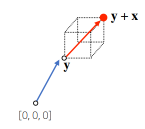

3. **뺄셈**

$$
x= \begin{bmatrix} x_{1} \\ x_{2} \\ x_{3} \\ ... \\ x_{n} \end{bmatrix} , y= \begin{bmatrix} y_{1} \\ y_{2} \\ y_{3} \\ ... \\ y_{n} \end{bmatrix} , x- y = \begin{bmatrix} x_{1}-y_{1} \\ x_{2}-y_{2} \\ x_{3}-y_{3} \\ ... \\ x_{n}-y_{n} \end{bmatrix}
$$

   

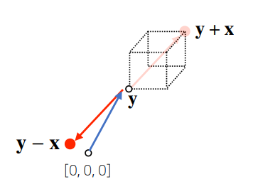

1. 스칼라곱

   $$
   x= \begin{bmatrix} x_{1} \\ x_{2} \\ x_{3} \\ ... \\ x_{n} \end{bmatrix} , ax = \begin{bmatrix} ax_{1} \\ ax_{2} \\ ax_{3} \\ ... \\ ax_{n} \end{bmatrix}
   $$
   

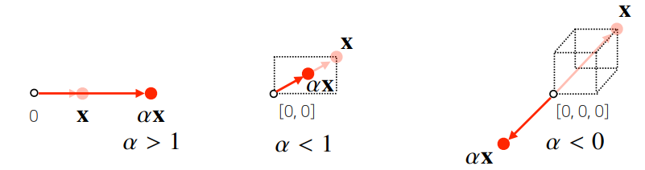

------

## 📄 노름(Norm) 은 무엇인가요?

벡터의 노름(Norm)은 **원점에서부터의 거리** 를 말한다. 벡터의 노름 정의방법은 여러가지가 있지만 여기에선 대표적으로 **L1-norm** 과 **L2-norm** 를 살펴본다.

1. **L1-norm**
   - 각 성분의 **변화량의 절대값** 을 모두 더한다.
   - 각 성분의 변화량의 절대값의 합
   - robust 학습, lasso 회귀

$$
\left \| x \right \|_{1} = \sum_{i=1}^{n}\left | x_{i} \right |
$$

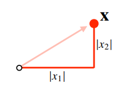

2. **L2-norm**
- 피타고라스 정리 이용해 **유클리드 거리**를 계산한다.
   - laplace 근사, ridge 회귀

$$
\left \| x \right \|_{2} =\sqrt{\sum_{i=1}^{n}\left | x_{i} \right |^{2} }
$$

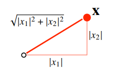

위에서 다른 노름을 살펴본 이유는 노름의 종류에 따라 **기하학적 성질** 이 달라지는데, 머신러닝에선 각 성질들이 필요할 때가 있으므로 둘 다 사용한다.

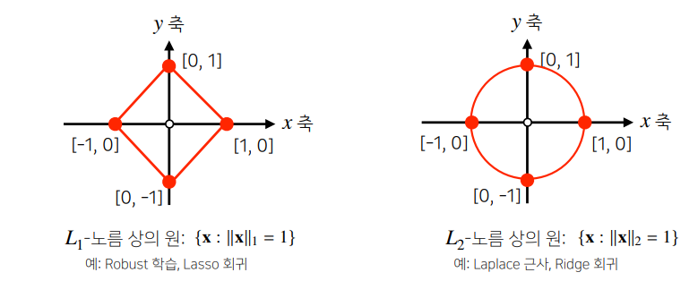


## 📄 벡터 사이의 거리는 어떻게 구하나요?

두 벡터 사이의 거리는 **벡터의 뺄셈** 을 이용하며 **노름 정의 에 따라 달라질 수 있다.**

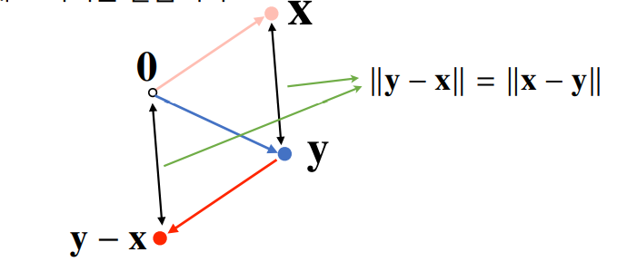

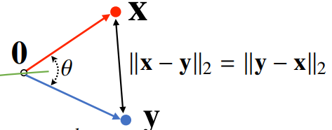

------

## 📄 두 벡터 사이의 각도는 어떻게 구하나요?

**제 2 코사인법칙** 으로 두 벡터 사이의 각도를 계산할 수 있다. **주의할것은 L1-norm에서는 각도를 계산할 수 없다.**

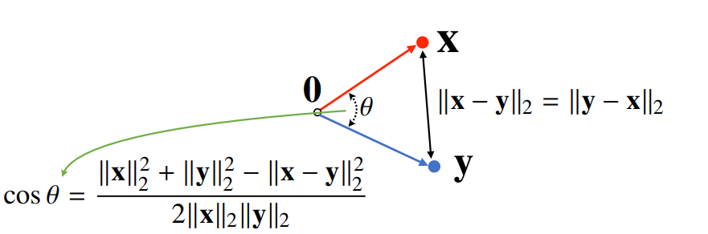

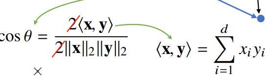

------

## 📄 내적은 무엇인가요?

**크기가 같은 벡터에 대한 연산으로 연산의 결과는 스칼라 이다.**

$$
\left \langle x, y \right \rangle = \sum_{i=1}^{d}x_{i}y_{i}
$$


------

## 📄 내적은 어떤 의미를 줄까요?

- 내적은 **정사영(Orthogonal projection) 된 벡터의 길이**와 관련 있다. 
- 즉, **Proj(x)** 는 벡터 **y** 로 정사영된 벡터 **x**의 그림자를 의미하며 그 그림자의 길이는 ∥**x**∥*c**o**s*Θ 이다.
- 두 벡터의 유사도(similarity) 측정에 사용 가능하다

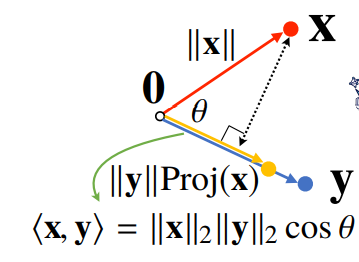

------

# 📌 Matrix

------

## 📄 행렬은 무엇인가요?

- 행렬은 **행벡터(Row vector)** 와 **열벡터(Column vector)** 로 이루어진 2차원 배열이다.
- numpy에서는 row가 기본단위(행벡터가 기본)

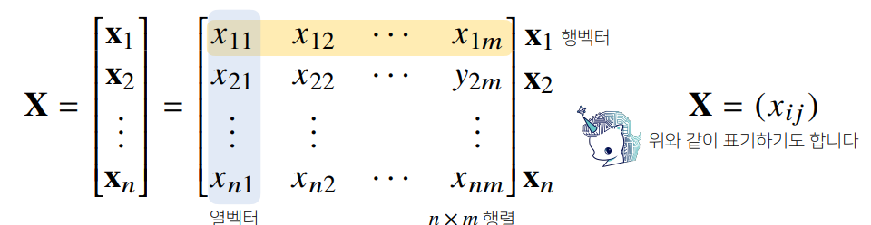

------

## 📄 행렬의 기본연산은 어떻게 하나요?

1. **성분곱(Hadamard product)**

   $$
   X = \begin{bmatrix} x_{11} & x_{12} & ... & x_{1m}\\ x_{21} & x_{22} & ... & x_{2m}\\ ... & ... & ... & ...\\ x_{n1} & x_{n2} & ... & x_{nm} \end{bmatrix} , Y = \begin{bmatrix} y_{11} & y_{12} & ... & y_{1m}\\ y_{21} & y_{22} & ... & y_{2m}\\ ... & ... & ... & ...\\ y_{n1} & y_{n2} & ... & y_{nm} \end{bmatrix} , X \odot Y = \begin{bmatrix} x_{11}y_{11} & x_{12}y_{12} & ... & x_{1m}y_{1m}\\ x_{21}y_{21} & x_{22}y_{22} & ... & x_{2m}y_{2m}\\ ... & ... & ... & ...\\ x_{n1}y_{n1} & x_{n2}y_{n2} & ... & x_{nm}y_{nm} \end{bmatrix}
   $$
   
1. **덧셈**
   $$
   X = \begin{bmatrix} x_{11} & x_{12} & ... & x_{1m}\\ x_{21} & x_{22} & ... & x_{2m}\\ ... & ... & ... & ...\\ x_{n1} & x_{n2} & ... & x_{nm} \end{bmatrix} , Y = \begin{bmatrix} y_{11} & y_{12} & ... & y_{1m}\\ y_{21} & y_{22} & ... & y_{2m}\\ ... & ... & ... & ...\\ y_{n1} & y_{n2} & ... & y_{nm} \end{bmatrix} , X+Y = \begin{bmatrix} x_{11}+y_{11} & x_{12}+y_{12} & ... & x_{1m}+y_{1m}\\ x_{21}+y_{21} & x_{22}+y_{22} & ... & x_{2m}+y_{2m}\\ ... & ... & ... & ...\\ x_{n1}+y_{n1} & x_{n2}+y_{n2} & ... & x_{nm}+y_{nm} \end{bmatrix}
   $$
   
1. **뺄셈**

   $$
   X = \begin{bmatrix} x_{11} & x_{12} & ... & x_{1m}\\ x_{21} & x_{22} & ... & x_{2m}\\ ... & ... & ... & ...\\ x_{n1} & x_{n2} & ... & x_{nm} \end{bmatrix} , Y = \begin{bmatrix} y_{11} & y_{12} & ... & y_{1m}\\ y_{21} & y_{22} & ... & y_{2m}\\ ... & ... & ... & ...\\ y_{n1} & y_{n2} & ... & y_{nm} \end{bmatrix} , X-Y = \begin{bmatrix} x_{11}-y_{11} & x_{12}-y_{12} & ... & x_{1m}-y_{1m}\\ x_{21}-y_{21} & x_{22}-y_{22} & ... & x_{2m}-y_{2m}\\ ... & ... & ... & ...\\ x_{n1}-y_{n1} & x_{n2}-y_{n2} & ... & x_{nm}-y_{nm} \end{bmatrix} 
   $$
   
1. 스칼라곱

   $$
   X = \begin{bmatrix} x_{11} & x_{12} & ... & x_{1m}\\ x_{21} & x_{22} & ... & x_{2m}\\ ... & ... & ... & ...\\ x_{n1} & x_{n2} & ... & x_{nm} \end{bmatrix} , aX = \begin{bmatrix} ax_{11} & ax_{12} & ... & ax_{1m}\\ ax_{21} & ax_{22} & ... & ax_{2m}\\ ... & ... & ... & ...\\ ax_{n1} & ax_{n2} & ... & ax_{nm} \end{bmatrix} 
   $$
   
1. **곱셈**

   **i번째 행벡터와 j번째 열벡터 사이의 내적** 을 성분으로 가지는 행렬이다.

  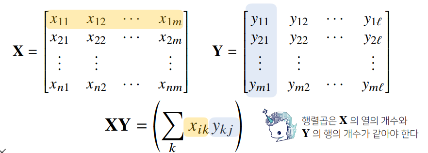

numpy의 `@` 연산을 사용하여 계산할수 있다.

```python
x=np.array([[1,2],

      [3,4]])


y=np.array([[-1,-2],

      [-3,-4]])

x@y # x.dot(y)
# array([[ -7, -10],
#       [-15, -22]])

# np.inner() :넘파이의 np.inner는 i번째 행벡터와 j번째 행벡터 사이의 내적을 성분으로 가지는 행렬을 계산
V1 = np.array([1,2,3])
V2 = np.array([1,2,3]) 
np.inner(V1, V2) # 14 이렇게 1열 1열 일경우에는 dot랑 연산결과같음
```

------

## 📄 행렬은 어떤 의미를 줄까요?

1. **데이터**

   벡터가 공간에서 한점을 나타냈다면, **행렬은 여러점들을 나타낸다.**

   즉, 행렬의 행벡터 $ x_{i} $ 는 i번째 데이터** 를 의미하며, 행렬의 $ x_{ij} $는 i번째 데이터의 j번째 변수의 값 을 의미한다.

   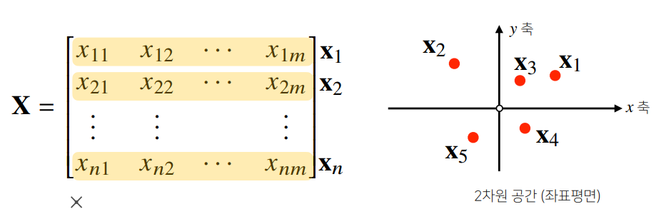

2. **연산자(Operator)**

   **행렬의 곱은 벡터공간에서 사용되는 연산자([선형변환](https://angeloyeo.github.io/2019/07/15/Matrix_as_Linear_Transformation.html))로 이해할수 있다.** 행렬 곱을 통해 벡터를 **다른 차원의 공간으로 변환**, **패턴 추출**, **데이터 압축** 등 여러 연산을 시행할 수 있다.

   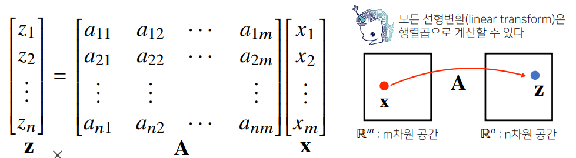

1. **함수(Function)**

   행렬과 벡터의 곱은 **열벡터의 선형결합** 으로 변환되므로 **입력된 벡터를 새로운 벡터로 출력하는 하나의 함수이다.**

   $$
   x = \begin{bmatrix}\alpha \\ \beta \end{bmatrix} , f= \begin{bmatrix} 2 & 4\\ 1 & 2 \end{bmatrix} , \\ f(x)=\begin{bmatrix} 2 & 4\\ 1 & 2 \end{bmatrix}\begin{bmatrix}\alpha \\ \beta \end{bmatrix}= \alpha\begin{bmatrix}2 \\ 1 \end{bmatrix} + \beta\begin{bmatrix}4 \\ 2 \end{bmatrix} 
   $$
   

------

## 📄 역행렬(Inverse matrix)은 무엇인가요?

어떤 행렬 **A** 의 연산을 거꾸로 되돌리는 행렬을 역행렬이라 부르고 **A**−1 라 표기한다. 주목해야할것은 행과 열 사이즈가 같고 행렬식(Determinant)이 0이 아닌 경우에만 계산할 수 있다.

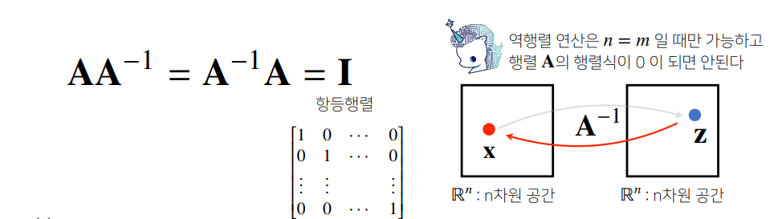

------

## 📄 역행렬은 어떻게 구하나요?

- 다음과 같이 **가우스 소거법(Gauss Elimination)** 과 **가우스-조던 소거법(Gauss-Jordan Elimination)** 을 이용하여 구할수 있다.
- numpy 에서는 `np.linalg.inv()` 를 통해 구할수 있다.

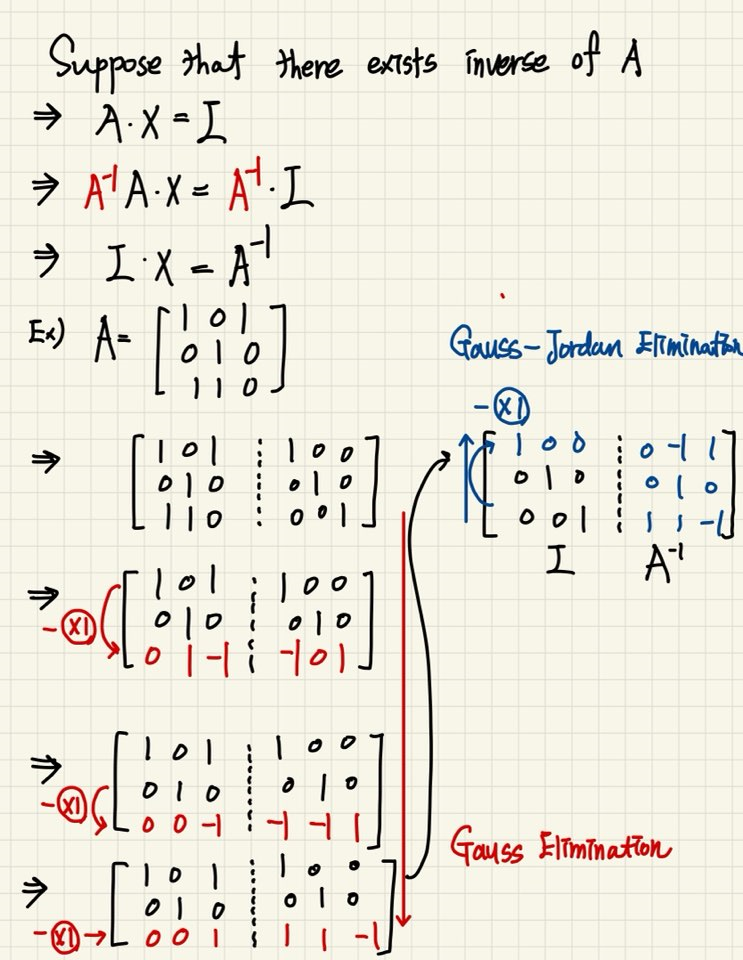


```python
x=np.array([[1,2],
            [3,4]])
inverse_x=np.linalg.inv(x)         
inverse_x   
#array([[-2. ,  1. ],
#       [ 1.5, -0.5]])
x@inverse_x # Identity matrix
#array([[1.00000000e+00, 1.11022302e-16],
#       [0.00000000e+00, 1.00000000e+00]]
```

## 📄 역행렬을 계산할수 없다면 어떻게 할까요?

실제로 부딪히는 대부분의 문제는 n>m(데이터의 개수가 변수개수 보다 많은 경우,[Overdetermined system](https://en.wikipedia.org/wiki/Overdetermined_system)) 인 경우로 *A***x**=**b** 를 만족하는 해도 A의 역행렬도 존재하지 않는다. 이럴 경우에는 **A의 pseudo inverse(Moore-Penrose inverse, 무어-펜로즈 역행렬) 를 이용하여 \**x\** 를 근사적으로 구하여 \**b\** 에 근접하는 \**b\** 을 구한다.**

또한 n<m(데이터의 개수가 변수 개수보다 작은경우,[Underdetermined system](https://en.wikipedia.org/wiki/Underdetermined_system)) 인경우 무어-펜로즈 역행렬을 이용하여 해를 하나 구할 수 있다.

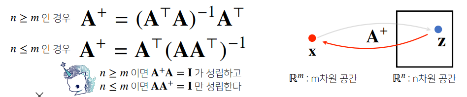

- **n>m**

  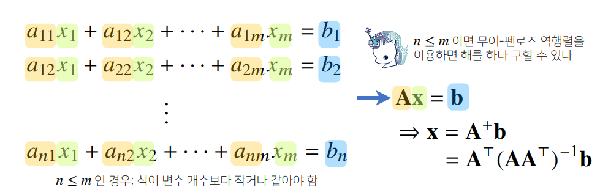

- **n<m**

  - np.linalg.pinv를 이용하면 데이터를 선형모델(linear model)로 해석하는 선형회귀식을 찾을 수 있다.
  - sklearn의 LinearRegression 과 같은 결과를 가져올 수 있다.
  
  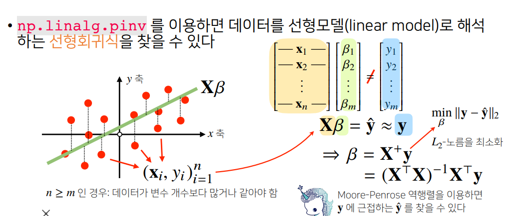