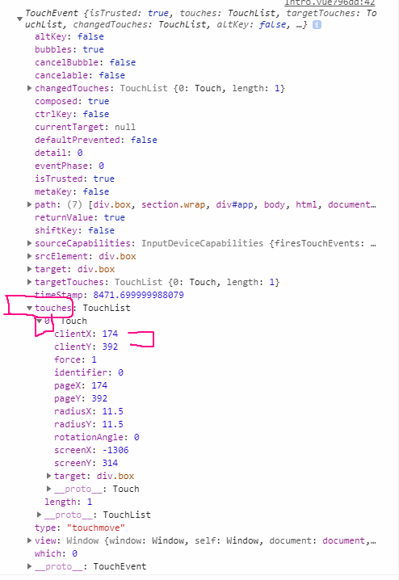
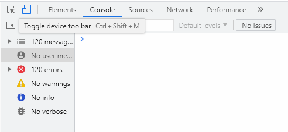

# 문제상황

- intro 페이지에 mousemove 이벤트로 돋보기를 구현해놨는데, 배포 이후 모바일 사용자들이 불편을 호소함.
- 모바일로 확인해보니 모바일은 mousemove 이벤트가 발생하지 않기떄문에 마치 작동을 안하는 페이지처럼 보임


## 해결방법 touch 이벤트

- touch 이벤트

| **이벤트종류** | **설명**                             |
| -------------- | ------------------------------------ |
| **touchstart** | 손가락 표면이 닿을때 발생            |
| **touchmove**  | 표면에 움직이는 이벤트를 보낼때 발생 |
| **touchend**   | 표면에 이벤트가 없어질때 발생        |

- mousemove 와의 차이
  - touch는 여러곳이 한번에 될 수 있기 때문에 좌표를 받는 방식이 mousemove와 다름
    - touches로 터치된 곳 정보가 list로 반환됨

- touchEvent 객체의 속성

| 속성       | 설명                    |
| ---------- | ----------------------- |
| clientX    | 뷰포트의 상대적인 X좌표 |
| clientY    | 뷰포트의 상대적인 Y좌표 |
| identifier | 터치객체의 고유식별자   |
| pageX      | 페이지좌표에서의 X좌표  |
| pageY      | 페이지좌표에서의 Y좌표  |
| screenX    | 화면좌표에서의 X좌표    |
| screenY    | 화면좌표에서의 Y좌표    |
| target     | 터치된 객체             |


- console.log로 touch event  찍어보기





## touch event 사용방법

```js
html.addEventListener("touchmove", function(e) {    
  e.preventDefault();  // 이거 안해주면 제대로 작동 안함
  html.style.setProperty('--x', e.touches[0].clientX + 'px')
  html.style.setProperty('--y', e.touches[0].clientY + 'px')
})
```


## 디버깅방법

- 크롬 - f12 - Toggle device toolbar로 모바일 형태로 변형 후 확인해보기



