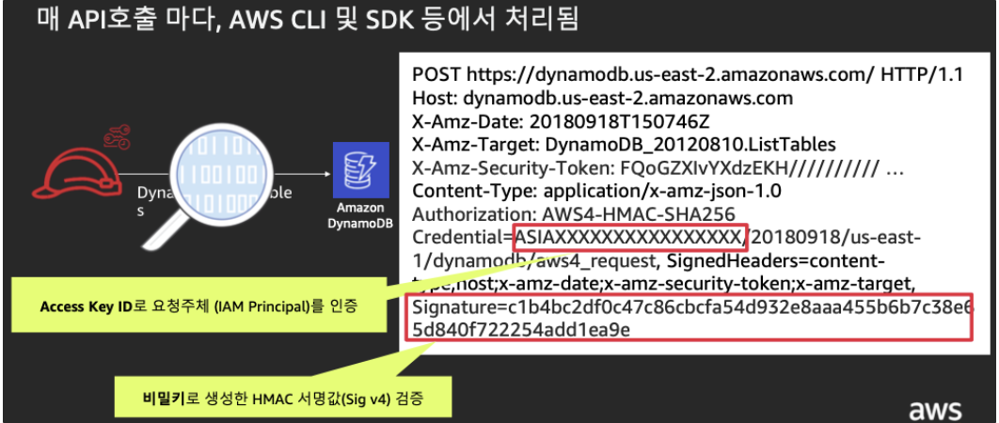
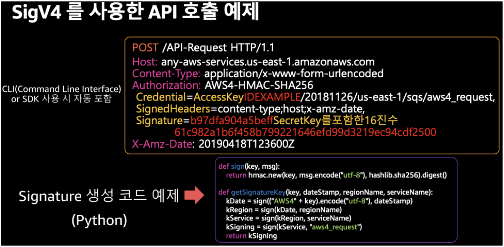
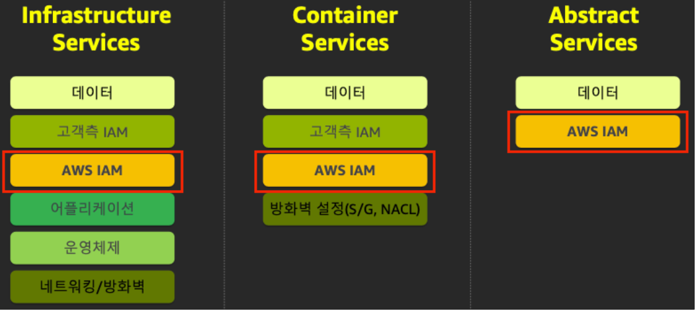
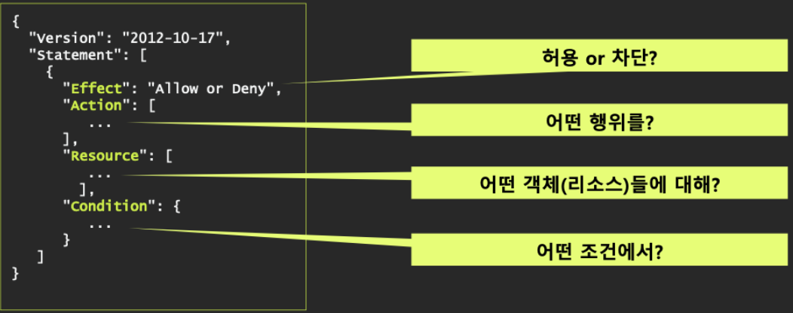
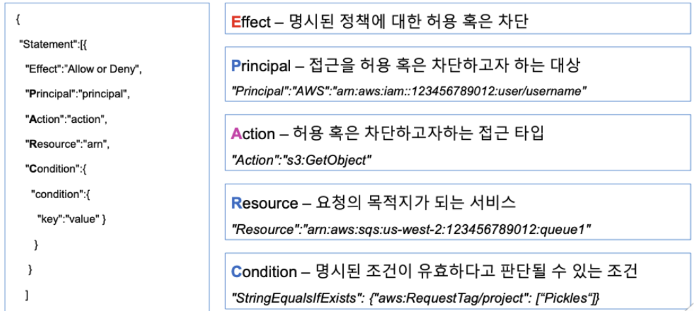

# AWS 에서의 보안

- AWS 보안은 처음부터 끝까지가 IAM(인증, 인가)이며, AWS 사용 할 경우에는 피할 수 없다

- AWS 을 이용하는 방법

  1. AWS  Web Console

     - 쉽게 시작할 수 있다
     - 반복 작업에 적합하지 않다
     - 시간이 오래 걸린다

  2. CLI(Command Line Interface) : 코드형태의 명령형 인프라, SDK이용

     - AWS  CloudShell을 통해 체험해 볼 수 있음
       - 한국은 아직 서비스 미출시, 일본꺼로 실습함

     - 반복작업에 적합하다
     - 원하는 항목에 대한 수정이 용이하다
     - 리소스의 준비 상태 확인이 어렵다
     - 문제 발생 시 복원이 어렵다

  3. 코드로서의 선언저 인프라 

     - AWS CloudFormation template. HashiCorp Configuration Language(HCL)
     - 자동화 구현에 용이하다
     - 반복작업에 적합하다
     - 에러 발생시 원복이 쉽다
     - 최초 구현이 복잡하다

  4. AWS CDK ( DOM 모델 기반)

     - AWS CDK(Cloud Development Kit)
     - AWS CDK는 익숙한 프로그래밍 언어를 사용하여 클라우드 애플리케이션 리소스를 모델링 및 프로비저닝  할 수 있는 오픈 소스 소프트웨어 개발 프레임워크
     - 친숙한 개발 언어로 작성
     - 단일 생성자를 기반으로 많은 aws 리소스를 생성
     - 생성자는 간단한 클래스로 각각의 스택을 구성
     - 여전히 선언적이지만, 생성과 업데이트를 처리할 필요가 없음

- AWS 계정의 활동 모니터링 및 감사
  - AWS CloudTrail - API 로깅, 감사 활동의 핵심
  - AWS IAM Access analyzer - 외부 엔터티와 공유되는 리소스 식별
  - Amazon GuardDuty - 위협탐지  서비스
  - AWS Security Hub - 통합 대쉬보드


## AWS 에서의 API 인증

- 자격 증명 필요 
  - 요청값 : Access Key ID
  - 인증주체 : IAM Principal
- 서명값 검증
  - 요청 값 : 비밀키로 생성한 HMAC 서명값
  - 인증주체 : Sig v4






## AWS의 shared responsibility model

- 어떤  환경을 사용하더라도 AWS IAM 필요하고 관리 주체와 책임은 고객!




# IAM

- Identify and Access Management

  - AWS Identify and Access Management (IAM) : AWS 전체의 권한 통제 시스템 
    - 인증(identity) : 너 누구냐?
    - 인가(Access Management) : 너 권한있니?

- AWS 유저의 종류

  1. root user

     - 워낙 많은 권한을 가지고 있음
     - IAM 계정 생성 권한을 가지고 있음

  2. IAM User

     - 권한이 제한된 유저의 계정

- User(사용자) vs IAM Group(그룹)

  - IAM Group 
    - 동일한 권한을 가진 IAM User에게 권한 설정 하는 것을 편리하게 하기 위함
    - IAM Group은 보안의 주체가 될 수 없음
  - IAM User는 최대 10개의 Group 에 속할 수 있음

- 요청의 성공 조건

  - 인증 + 인가
    - IAM 보안 주체의 적법한 서명값이 포함되어 있고(인증),
    - 정책(Policy)에 의해 해당 요청이 정확하게 인가 되어야함

  

## IAM Role

- 정의된 권한 범위 내 AWS API 를 사용할 수 있는 임시자격증명
  - 코드에 하드 코딩하지 않고 실행시 임시(Token, 일정 시간 이후 만료됨) 자격 증명에 사용
    - 이를 Assume 이라고 함
- IAM Role 을 사용하면 사용자 권한을 공유하거나 매번 필요한 권한 부여 불필요
- IAM Role 활용
  - ec2 서버가 사용자 대신 권한을 가지고 행동을 할 수 있도록 만들어 줄 수 있음
  - 외부 사용자에게 임시 자격증명을 주고 IAM 역할을 부여시킬 수 있음


## 인가

- 모든 AWS 서비스는 접근제어 정책(AM - Access Manager) 을 기반으로 인가됨

- 매 API 호출시, 적용된 정책을 통해 인가 수행

- 정책은 IAM 역할/ 사용자/ 그룹, AWS 리소스, 임시 자격증명 세션, OU 등에 적용할 수 있음

- AWS Root 어카운트는 기본적으로 AWS 리소스에 대한 모든 권한을 가짐

- AWS 정책은 기본 디폴트가 Deny 이고,

  명시적 Allow < 명시적 Deny 가 우선순위를 가짐


## 개념의 확장

1. User based Access Control

   - 사용자에게 권한을 직접 부여하는 방법

     - userA 는 뭘 할 수 있다
     - userB 는 뭘 할 수 없다

   - 한계

     - 사용자가 적을 떄는 관리가 용이할 수 있지만,

       사용자가 많아질 수록 권한 관리에 많은 시간을 요하게 되고, 실수가 일어날 확률이 높아져서

       구조적으로 관리할 수단이 필요해짐

2. Group based Access Control

   - 사용자에게 직접 권한을 주지않고, 그룹에 권한을 주고 사용자를 그룹에 넣는 방식
   - 한계
     - 권한이 다양하게 존재하면 그룹도 점점 복잡해짐
     - 그룹이 많아지고, A권한을 가진 그룹이 여러개가 생겨나게 되면 권한 검사가 힘들어짐
       - 예를 들면, `권한 a`가 가능한 그룹에 `그룹A, 그룹C, 그룹D`가 있는데 ‘어느 그룹 소속이냐’ 이런식으로 권한을 검사하기는 어려워 짐

3. Role based Access Control - RBAC

   - 그룹에다가 구너한을 바로 주는 대신에 권한의 논리적 집합으로써 역할을 만들고, 역할을 그룹이나 사용자에게 연결

     - Group은 UserGroup으로 주로 사용
     - Role은 권한의 Group으로 사용하는 것

   - 특징

     - 권한 검사를 할 때, Group에 대해서 조건을 거는 것보다, 좀 더 보안적인 측면에 가까운 Role에 대해서 규칙을 설정하는 것이 쉬움
       - 그래서 AWS의 많은 서비스에서 권한을 설정할 때 IAM Group은 사용되지 않고, IAM Role을 지정하는 부분이 많음
     - Group은 울타리, Role은 포스트잇 에 가까움 - 밑의 방식으로 사용하면 좋음
       - 그룹
         - 관리자 그룹
         - 사용자 그룹
         - 게스트 그룹
       - 역할
         - a할 수 있는 역할
         - b할 수 있는 역할

   - 한계 

     - 같은 그룹에 속한 사용자에 따라서 서로 다른 역할을 조건적으로 부여하는 것은 불가능함

     - 이럴경우, RBAC 상에서는 User에게  직접 역할을 부여하는 방식으로밖에 할 수 없음

     - 예시

```
원래 7내무반 그룹에는 병기관리 역할만 있었는데, 새로 탄약관리 역할을 추가하려고 합니다.

여기서 김진호 중사는 간부라서 탄약고 개방이 허용되고, 김한국 일병은 병사라서 탄약고 개방이 불허됩니다.

그러면 접근 제어 리스트를 어떻게 구성할 수 있을까요?

기존 그룹을 건드리면 안 된다.
소속을 나타내는 7내무반 외에 다른 그룹을 만들어서 할당하면 안 된다.
이 제약 조건에 따르면, 현재 가능한 유일한 방법은 그룹을 우회해서, 김진호 중사에게 직접 탄약 관리 역할을 할당하는 것
```

       

4. Attribute Based Access Control ( ABAC)

   - Role based Access Control 해결하지 못한 조건적, 동적 권한 부여를 사용자가 가진 속성(attribute)를 통해 하는 방법
   - 권한을 정책(Policy)으로 바꿔서, 술어논리(Predicate Logic)을 사용해서 동적이면서, 조건적으로 권하을 부여할 수 있게 함 = IAM Policy
     - 기존 RBAC 구조를 그대로 유지하면서, 권한을 부여하는 형식으로서 Policy라는 개념이 추가된 것

   


## AWS IAM 정책(Policy)의 JSON 구조

- IAM Policy 는 AWS 서비스와 리소스에 대한 인가 기능을 제공

- IAM 은 정의한 Policy를 기반으로  AWS 요청을 검사/평가 하게 되며 최종적으로 허용 혹은 차단을 결정

- 속성

  1. Effect

     - enum : `Allow` | `Deny`
     - 허용한다는 규칙인지, 불허한다는 규칙인지 구분
     - 보통 Allow 가 많이 쓰임

  2. Action

     - `String` | `Array<String>`
     - 하나 혹은 여러개의 Action을 지정할 수 있음
     - [AWS 서비스에 사용되는 작업, 리소스 및 조건 키](https://docs.aws.amazon.com/ko_kr/IAM/latest/UserGuide/reference_policies_actions-resources-contextkeys.html)
       - 각 서비스별로 고유의 서비스 접두사(예: DynamoDB는 `dynamodb`)가 있습니다.
       - 위 설명서에서 각 서비스를 선택해서 들어가면 **XX에서 정의한 작업**이라는 단락에 작업 목록이 있습니다.
       - Action은 `(서비스접두사):(작업)` 형식으로 작성
         - 예시) `dynamodb:Deleteitem`, `s3:GetObject`

  3.  Resource

      - Statement의 주제가 되는 리소스를 한정(qualify)함

      - 서비스에 따라서 이렇게 해당 서비스에 속한 하부 리소스 단위까지 한정할 수 있음

        (DynamoDB의 테이블 수준까지 한정)

      - 리소스를 특정할 수 없는 일부 서비스에서는, Resource를 비워두는 대신 `*`를 입력함

  4.  Principal

      - object(Principal)
      - 리소스 기반 정책에서, 보안 주체를 지정해야함

  5.  Sid

      - String
      - StatementID
      - 각 요소에 Unique ID를 붙이고 싶을 떄 사용






## IAM 정책의 종류

- IAM  의 종류가 나눠지는 법
  - 연결 대상이 어디인가에 따라
    - 자격 증명 주체(User, Group, Role)에
      - **자격증명-기반 정책(Id-Based Policy)**
    - 리소스에
      - **리소스-기반 정책(Resource-Based Policy)**
    - Role의 신뢰 관계
      - **신뢰 정책** (사실 Role을 리소스로 본다면, 특별한 의미의 리소스-기반 정책이라고 할 수 있음)
  - 누가 만들었냐에 따라
    - 내가
      - **고객 관리 정책**
    - AWS가 만든 빌트인 정책
      - **AWS 관리 정책**
      - **직무 기반 정책**
  - IAM Role에 인라인으로 선언되었으면
    - **인라인 정책**
- 완전한 정책이 되기 위해서는?
  - **“(어떤 Principal이) (어떤 Condition을 만족할 때,) 어떤 Resource에 대해서 어떤 Action을 할 수 있게 허용/불허(Effect)한다.”**


- Identity-based 정책과 Resource-based 정책

  - **Identity-based** 정책  (자격증명-기반 정책)

    - 요청하는 주체에게 연결 → 접근을 하기 위한 정책
    - IAM 메뉴의 정책 리스트에 나오는 정책은 모두 자격증명기반정책

  - Resource-based (리소스-기반 정책)

    - 정책은 요청을 받는 리소스에게 연결(예. S3 버킷 Policy) → 접근을 받기 위한 정책

    - Principal 필수 구문 추가 : 해당 리소스에 요청을 전달할 수 있는 보안주체를 기술

  - Identity-based 과 Resource-based 정책 적용 범위는 

    In-Account  vs Cross-Account 에  따라 다름

    - 정책이 겹칠 경우 **In-Account** 에는 합집합으로 요청 검사
    - 정책이 겹칠 경우 **Cross-Account** 에는 공집합으로 요청 검사

| 정책                         | 설명                                                         | 포맷 | 정의 및 관리                     |
| ---------------------------- | ------------------------------------------------------------ | ---- | -------------------------------- |
| Identitiy-based 정책         | IAM보안 주체(IAM 사용자, IAM 그룹의 사용자 집합, IAM 역할)에 할당되어 해당 주체의 권한을 규정 | JSON | IAM - 보안주체가 될 수 있는 대상 |
| Resource-based 정책          | 정책이 할당될 리소스 기준으로 어떤 보안 주체가 할 수 있는(혹은 없는) 작업을 규정 | JSON | 개별 서비스들 (리소스)           |
| IAM Permission Boundary 정책 | IAM 보안 주체별로 획득할 수 있는 권한의 최대치를 규정        | JSON | IAM                              |
| Organization SCP             | Organization의 OU 또는 개별 어카운트 별로 권한의 최대치를 규정<br /> 주로 Root 어카운트의 권한을 제한 시킬 때 사용 | JSON | Organization                     |
| Session 정책                 | 임시 자격증명의 기존 퍼미션을 해당 세션에 대해서만 제한할 때 사용<br />AssumeRole, GetFederationTokenAPI의 파라메터로 전달됨 | JSON | STS                              |
| ACL정책                      | 리소스 기준으로 정의하며, 주로 Cross-Account 간의 리소스 공유시, 보안 주체에 대한 접근을 규정 | XML  | 개별 서비스들                    |
| Endpoint 정책                | VPC G/W Endpoint에 적용되는 접근제어 정책, 일종의 Resource-based 정책임 | JSON | VPC                              |

|           | 자격증명-기반 정책(Id-Based Policy)                          | 리소스-기반 정책(Resource-Based Policy)                      |
| :-------: | :----------------------------------------------------------- | :----------------------------------------------------------- |
| 연결 대상 | 사용자, 그룹, 역할 등 보안주체(Principal)가 될 수 있는 대상  | 리소스                                                       |
|   의미    | ( 이 정책이 연결된 보안주체는 ) ( 특정 조건(Condition) 하에 ) 이 리소스(Resource)에 대한 특정 행동(Action)을 허용/불허(Effect) | ( 특정 조건(Condtion)하에 ) 이 리소스(Resource)에 대한 특정 행동(Action)을 특정 보안주체(들)(Principal)에게 허용/불허(Effect) |
|   특징1   | Principal 속성이 안 들어감                                   | Principal 속성이 들어감                                      |
|   특징2   | IAM Policy 메뉴에서 관리 (혹은 IAM Role에 인라인으로)        | 일부 AWS 서비스의 리소스에서 자체 관리 (대표적으로 S3, SQS 등) |
|   특징3   | 모든 AWS 서비스에 연관                                       | 일부 공유 자원 성격을 가진 서비스에서 사용 (대표적으로 S3, SQS 등) |


## ARN 읽는 방법

- `arn:aws:(서비스 Prefix):(AWS 리전 이름):(AWS 계정):(리소스 한정자)`

  - 여기서 `(AWS 리전 이름)`, `(AWS 계정)`은 암묵적으로 생략해서 쓰기도 함

- 얘시를 해석해보기

  - `arn:aws:iam::cloudfront:user/CloudFront Origin Access Identity E36E6CTWWW86E5`
    - CloudFront는 글로벌 서비스이기 때문에 리전 구분이 없습니다.
    - aws 계정이 들어갈 자리에 `cloudFront`가 들어가 있음 - 특별히 예약된 규칙
      -  CloudFront를 위해서 별도의 보안주체를 관리하는 리소스 그룹(user)이 있다는 것을 말해줌
    - S3에 접근하는 `E36E6CTWWW86E5`라는 CloudFront 전용 보안주체를 가리킴 (S3와 CloudFront는 밀접한 관계)

  - `arn:aws:s3:::mcas.musma.net/*`
    - 서비스 식별자가 `s3`
    - `S3`의 경우 리소스 한정자는 곧 버킷으로 나타남
      - 리소스 한정자 사용되는 리소스 그룹은 서비스마다 다름
      - [AWS 서비스에 사용되는 작업, 리소스 및 조건 키](https://docs.aws.amazon.com/ko_kr/IAM/latest/UserGuide/reference_policies_actions-resources-contextkeys.html)
        - 여기에서 해당 서비스에서 사용할 수 잇는 리소스 그룹(유형)을 볼 수 있음
    - `mcas.musma.net` 버킷에 있는 모든 오브젝트를 말함

```JSON
{
    "Principal": {
        "AWS": "arn:aws:iam::cloudfront:user/CloudFront Origin Access Identity E36E6CTWWW86E5"
    },
    "Action": "s3:GetObject",
    "Resource": "arn:aws:s3:::mcas.musma.net/*"
}

=> S3 버킷 mcas.musma.net에 업로드된 모든 오브젝트를 읽을 권한(s3:GetObject)를 CloudFront Origin Access Identity E36E6CTWWW86E5에 부여한다.
```


# IAM 잘 사용하기

- 루트를 쓰지 말자.
  - 계정의 루트는 소유자로 모든 자원에 대한 접근이 가능하기 때문에 제어가 힘듬
  - 루트의 액세스 키를 발급받아 쓰거나 X.509 인증서를 통한 로그인도 없어야한다
  - 루트 계정을 사용할 경우는 2 가지 경우만 있다
    - 계정 최조 생성시
    - 첫번째 IAM User 생성시
- MFA를 사용하자. 모바일, OTP 등등. 특히 루트 계정에는 반드시 MFA가 설정되어 있어야 한다
- 권한은 무조건 최소한만 부여
  - 필요한 권한만 추가해서 사용하기
- 권한을 조직 or 역할 등 group 단위로 관리
- 권한 공유는 role에 의해서만 하자
  - role은 사람에만 쓸 수 있는 것이 아니다. EC2도 role 기반으로 관리


## 퀴즈

```JSON
{
  "Version": "2012-10-17",
  "Statement": [
    {
      "Effect": "Allow",
      "Action": "s3:ListAllMyBuckets",
      "Resource": "*"
    },
    {
      "Effect": "Allow",
      "Action": [
        "s3:ListBucket",
        "s3:GetBucketLocation"
       ],
      "Resource": "arn:aws:s3:::mcas.musma.net"
    },
    {
      "Effect": "Allow",
      "Action": [
        "s3:GetObject",
        "s3:PutObject",
        "s3:DeleteObject"
      ],
      "Resource": "arn:aws:s3:::mcas.musma.net/*"
    }
  ]
}
```


### 1. 자격증명-기반 정책과 리소스-기반 정책 중 어떤 정책 유형인지 답하고 그 근거를 논하시오

- 자격증명-기반 정책입니다.

  각 Statement 마다 Principal 속성이 존재하지 않으므로 리소스-기반 정책이 아닙니다.


### 2. 동일한 서비스에 대해서 여러 Statement로 나누어서 선언한 이유를 논하시오.

- 각 서비스마다 고유의 리소스가 있습니다. 예를 들면 S3에서 특정할 수 있는 리소스는 버킷과 객체가 있습니다. 그리고 서비스의 액션 마다 대응하는 리소스 수준 권한이 다릅니다.

  - 예를 들면 s3:GetObject, s3:PutObject, s3:DeleteObject는 객체에 대한 Action입니다. 따라서 대응하는 리소스의 수준도 객체 수준이어야 합니다. Resource 한정자로 arn:aws:s3:::mcas.musma.net/* (mcas.musma.net 버킷의 모든 객체)를 특정하고 있습니다.

  - s3:ListBucket, s3:GetBucketLocation은 버킷에 대한 Action입니다. 그래서 Resource 한정자로 mcas.mumsa.net 버킷을 가리키고 있습니다.
  - 마지막으로, s3:ListAllMyBuckets는 S3에 딸린 특정 리소스를 한정하지 않는 서비스 수준의 Action입니다. 따라서 Resource를 "*"로 하였습니다.


- 정말 많은 참고가 된 자료
  - https://musma.github.io/2019/11/05/about-aws-iam-policy.html