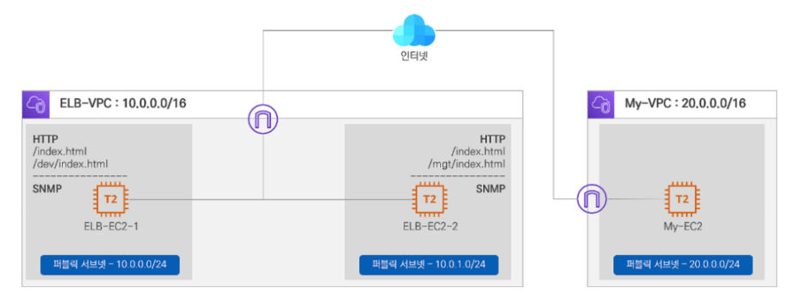
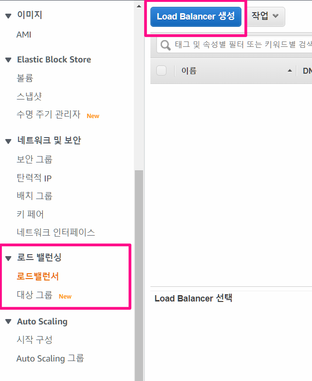
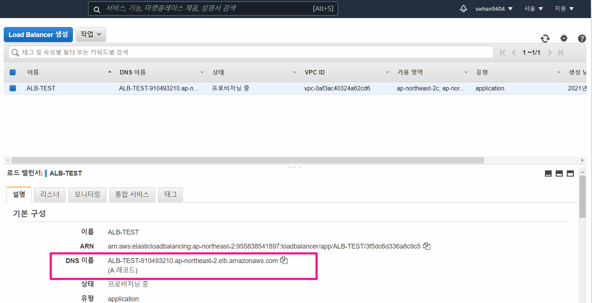
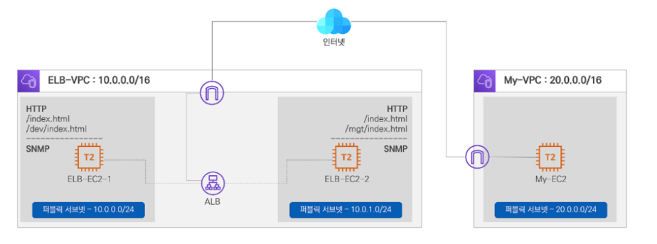
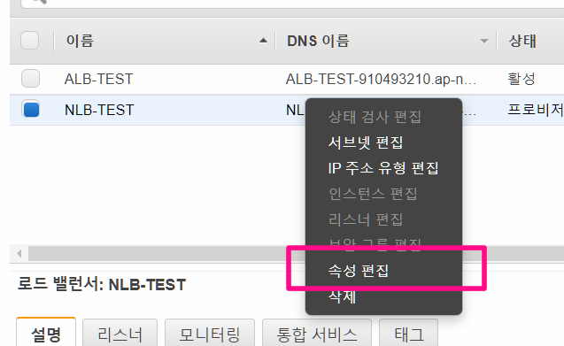
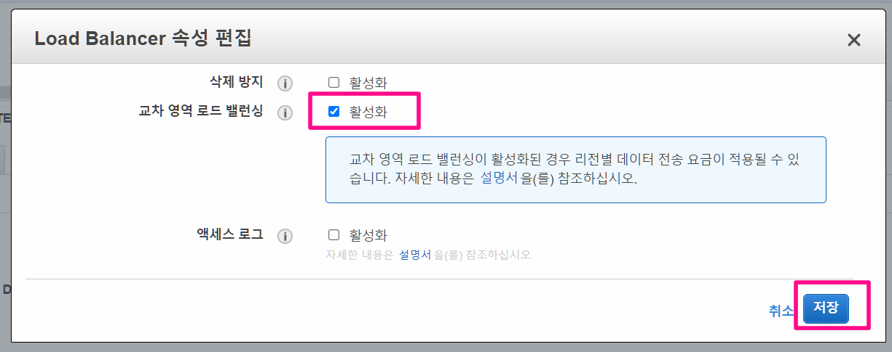

- 실습 목적
  1. ALB 생성
     - DNS 주소로 접근 후 어느 EC2 와 연결되는지 확인
       (번갈아가면서 라운드로빈 방식으로 연결됨)
  2. NLB 생성
     - 교차영역 로드 밸런싱 적용


# CloudFormation에서 배포

- 주소 
  - https://console.aws.amazon.com/cloudformation/home?region=ap-northeast-2#/stacks/new?stackName=ELBLab&templateURL=https:%2F%2Fcloudneta-book.s3.ap-northeast-2.amazonaws.com%2Fchapter5%2F5_lab1-AFOS.yaml

- EC2
  - My-EC2
  - ELB-EC2-1
  - ELB-EC2-2
    - ELB-EC2-1 과 2 에는 HTTP 와 SNMP 데몬(모니터링용)이 이미 설정되어 있음




# 기본 화면 검증

- 목표
  - My-EC2 에서 ELB-EC2-1 와 ELB-EC2-로 HTTP 서비스와 SNMP서비스를 확인

- SNMP
  - Simple Network Mangement Protocol 의 약자로 네트워크를 관리하기 위한 규약
  - OID( Object Identifier )라는 값을 호출하여 디바이스에 대한 정보를 파악할 수 있음
- ELB-EC-1 은 mgt 라는 경로를 가지고
  ELB-EC-2 은 dev 라는 경로를 가지고 있다.


```shell
# ELB-EC2-1

# 관리자 권한으로 세팅
sudo su -

# 디렉토리(폴더) 트리 구조 출력
[root@ELB-EC2-2 ~]# tree /var/www/html
/var/www/html
├── index.html
├── mgt
│   └── index.html
└── xff.php

1 directory, 3 files


# xff 파일 확인하기
cat /var/www/html/xff.php
```

 

- xff 파일의 내용
  - 시간 출력
  - CPU 부하도 출력
  - IP 주소 출력

```php
<?php
date_default_timezone_set("Asia/Seoul");
Print(date(DATE_RFC822));
echo "\n";
echo "\n";
$idleCpu = exec('vmstat 1 2 | awk \'{ for (i=1; i<=NF; i++) if ($i=="id") { getline; getline; print $i }}\'');
echo "Current CPU Load:";
echo 100-$idleCpu;
echo "%";
echo "\n";
echo "\n";
header('Content-Type: text/plain');
echo "Last Client IP: ".$_SERVER['REMOTE_ADDR'];
echo "\nServer Public IP = ".$_SERVER['HTTP_HOST'];
echo "\nServer Private IP: ".$_SERVER['SERVER_ADDR'];
echo "\nX-Forwarded-for: ".$_SERVER['HTTP_X_FORWARDED_FOR'];
#echo "\nDNS name used by client = ".$_SERVER['SERVER_NAME'];
?>
```


# 기본구성내용 확인

```shell
# 관리자 권한으로 세팅
sudo su -

# ELB-EC2-1 ELB-EC2-2 퍼블릭IP를 변수에 지정
EC21=3.36.72.41
EC22=13.125.58.86

# 변수 잘 들어갔는지 확인
echo $EC21
echo $EC22

# ELB-EC2-1 서비스 확인 = curl : http 요청 보내기
curl $EC21

# ELB-EC2-1dml xff 파일 실행하기
curl $EC21/xff.php
# 출력내용
Mon, 26 Jul 21 23:53:42 +0900

Current CPU Load:1%

Last Client IP: 13.125.184.198 # 클라이언트 IP
Server Public IP = 3.36.72.41 # ELB-EC2-1 의 퍼블릭 IP
Server Private IP: 10.0.0.140 # ELB-EC2-1 의 프라이빗 IP
X-Forwarded-for:

# 자신의 IP 확인 = 클라이언트IP
curl ipinfo.io

# sysName은 사용자가 장비에 설정한 장비명(Linux의 Hostname)
snmpget -v2c -c public $EC21 1.3.6.1.2.1.1.5.0
# 출력내용
SNMPv2-MIB::sysName.0 = STRING: ELB-EC2-1

# sysUpTimeInstance(sysUpTime)값은 장비가 부팅되어 현재까지 동작한 milli-second 값이며, 쿼리 시 업데이트 되는 정보
# 아래 값의 경우 부팅 후 2분 10초가 경과된 정보이다
[root@MyEC2 ~]# snmpget -v2c -c public $EC22 1.3.6.1.2.1.1.3.0
DISMAN-EVENT-MIB::sysUpTimeInstance = Timeticks: (13098) 0:02:10.98


# ELB-EC2-1 서비스 확인
curl $EC21
curl $EC21/xff.php;echo
curl $EC21/dev/
snmpget -v2c -c public $EC21 1.3.6.1.2.1.1.5.0
snmpget -v2c -c public $EC21 1.3.6.1.2.1.1.3.0


# ELB-EC2-2 서비스 확인
curl $EC22
curl $EC22/xff.php;echo
curl $EC22/mgt/
snmpget -v2c -c public $EC22 1.3.6.1.2.1.1.5.0
snmpget -v2c -c public $EC22 1.3.6.1.2.1.1.3.0
```


# 로드밸런서 생성-ALB

1. EC2 > 로드밸런싱 > 로드밸런서 > Load Balancer 생성

   

2. Application Load Balancer 생성

3. Load Balancer 구성

   - 이름 : ALB-TEST
   - 체계 : 인터넷 경계
     - 로드밸런서의 접근을 외부에서 가능하도록 설정
   - IP 주소 유형 : ipv4
   - 리스너 
     - HTTP, 80포트
   - 가용영역 : ELB-VPC
     - **ap-northeast-2a**
     - **ap-northeast-2c** 둘다 선택

4. 보안 설정구성

   - HTTPS 를 사용하지 않는다고 경고 뜨는데 무시

5. 보안그룹구성

   - ELB-SG 선택

6. 라우팅 구성

   - 이름 : ALB-TG
   - 대상유형 : 이스턴스
   - 프로토콜 : HTTP
   - 프로토콜 버전 : HTTP1
   - 고급 상태 검사 설정
     - 포트 : 트래픽 포트
     - 정상 임계값 :3 
       - 서버가 정상인지 확인이 3번 돌아오면 정상으로 인식
     - 비정상 임계값 : 2
       - 서버가 비정상이라고 2번이상 들어오면 비정상으로 인식
     - 제한시간 : 5
     - 간격 : 10
       - 서버 정상 비정상 체크 간격
     - 성공코드 : 200

7. 대상 등록

   - ELB-EC-1
   - ELB-EC-2 둘다 선택 후 등록된 항목에 추가 버튼을 눌러야함!(실수 주의)

8. 검토 후 생성

 







# ALB 검증

- X-Forwarded-For를 쓰는 이유
  - ALB를 사용하게 되면 Last Client IP가 ALB의 IP가 출력되기 때문에 Last Client IP로는 누가 접근했는지 알 수 없는 문제가 발생하게 됨
  - HTTP header에 X-Forwarded-For  의 정보를 넣어서 관리하여 이것을 해결
  - 어떨 떄 필요한가?
    1. 보안 감사 시 안걸리기 위해서
    2. 사용자 IP 기반으로 비지니스 데이터 분석에 활용
    3. 공격자의 IP 추출 및 대응을 하기 위해서

```shell
# ALB DNS 이름을 변수로 지정 
ALB=ALB-TEST-910493210.ap-northeast-2.elb.amazonaws.com

# ALB 변수 지정 확인
echo $ALB

# curl 접속 테스트 - ALB 는 기본 라운드 로빈 방식으로 대상 분산 되는 것을 확인할 수 있음
dig $ALB +short
while true; do dig $ALB +short && echo

# 접속 테스트 - 1:1 비율로 바꿔가며 Ec1과 ec2 반응을 하는 것을 볼 수 있음
curl $ALB
curl $ALB
for i in {1..20}; do curl $ALB --silent ; done | sort | uniq -c | sort -nr
for i in {1..100}; do curl $ALB --silent ; done | sort | uniq -c | sort -nr

## 출력내용 - 50:50 으로 ELB-EC2-1, ELB-EC2-2 반응
[ec2-user@MyEC2 ~]$ for i in {1..100}; do curl $ALB --silent ; done | sort | uniq -c | sort -nr
     50 <h1>ELB-EC2-2 Web Server</h1>
     50 <h1>ELB-EC2-1 Web Server</h1>

# xff 실행으로 ip 주소 보기
curl $ALB/xff.php ;echo

## 출력내용 - Last Client IP 와 X-Forwarded-for 가 어떻게 바뀌었는지 위와 비교해볼것 (중요)
Tue, 27 Jul 21 00:44:14 +0900

Current CPU Load:0%

Last Client IP: 10.0.1.145 # ALB의 IP
Server Public IP = alb-test-910493210.ap-northeast-2.elb.amazonaws.com
Server Private IP: 10.0.1.91
X-Forwarded-for: 13.125.184.198 # 접속한 사람의 주소 

```


## Apache2 웹서버에서 클라이언트 IP 로그 확인

- ALB 에서 X-Forwarded-For(=XFF)에 Clinet IP 정보(220.117.X.X)를 담아 서버에서 확인 가능

```shell
# ELB-EC2-1/2
tail -f /var/log/httpd/access_log
## 출력결과 - health check 들이 대부분 보이게 됨 ( ALB 생성할 떄 서버의 health check 설정 기억하기)

# health check를 제외하고 로그 출력하기
tail -f /var/log/httpd/access_log |grep -v "ELB-HealthChecker/2.0"

# Apache 기본 로그 설정 정보 확인
grep -n LogFormat /etc/httpd/conf/httpd.conf

# Apache 기본 로그 설정 변경 : 196번째 줄에 %{X-Forwarded-For}i 추가 > ctrl+x > y > enter
nano /etc/httpd/conf/httpd.conf
 LogFormat "%{X-Forwarded-For}i %h %l %u %t \"%r\" %>s %b \"%{Referer}i\" \"%{User-Agent}i\"" combined

 
# HTTP 다시 로드(시스템 다시 시작)
systemctl reload httpd

# 실시간 로그 출력 후 외부에서 접속 시도
tail -f /var/log/httpd/access_log |grep -v "ELB-HealthChecker/2.0"
```


### reload와 restart 의 차이

- **restart** 
  - 명령어는 해당 서비스를 stop하고 start해주는 작업
  - 그런데 현재 접속 상태에 따라서 이 과정이 빠르게 끝날 수도 있고 그렇지 않을 수도 있어서 경우에 따라서는 몇십초 가량 시간이 소요될 수도 있습니다. 이 시간동안에는 접속이 안되거나 이상현상이 발생할 수 있습니다.
- **reload**
  - 서버를 종료하지 않은채 conf 설정 파일들만 새로 갱신해준다는 차이점
  - 때문에 기존 접속자들은 과거의 설정대로 접속을 유지한채 새롭게 연결되는 접속부터 서버의 변경점이 적용됩니다. 현업에서는 최대한 reload 로 적용을 하고 reload 로 적용이 불가능 할 경우 restart 사용을 하자!


### XFF IP가 여러개가 존재 한다면?

- 웹 애플리케이션이 client IP를 추출하기 위해서 Http request header를 다음과 같은 순서로 뒤짐
  1. Proxy-Client-IP : 특정 웹 어플리케이션에서 사용 (예. WebLogic Connector - mod_wl)
  2. WL-Proxy-Client-IP : 특정 웹 어플리케이션에서 사용 (예. WebLogic Connector - mod_wl)
  3. **X-Forwarded-For : HTTP RFC 표준에는 없지만 사실상 표준!!!**
  4. request.getRemoteAddr()
  5. CLIENT_IP
- XFF IP가 여러개 존재할 경우
  - 상황 
    - 3번 X-Forwarded-For: <client>, <proxy1>, <proxy2> 요청이 여러 프록시를 거치는 경우 
  - 이유 
    - X-Forwarded-For 요청 헤더의 clientIPAddress 다음에는 로드 밸런서에 도달하기 전에 요청이 통과하는 각 연속 프록시의 IP주소가 온다. 
  - 그렇다면 의미는?
    - 가장 오른쪽의 IP 주소는 가장 최근의 프록시의 IP주소 
    - **가장 왼쪽의 IP 주소는 원래 클라이언트의 IP 주소**


# NLB 생성

1. EC2 > 로드밸런싱 > 로드밸런서 > Load Balancer 생성
2. Network Load Balancer 선택
3. Load Balancer 구성
   - 이름 :  NLB-TEST
   - 체계 : 인터넷 경계
     - 로드밸런서의 접근을 외부에서 가능하도록 설정
   - IP 주소 유형 : ipv4
   - 리스너 
     - HTTP, 80포트
   - 가용영역 : ELB-VPC
     - **ap-northeast-2a**
     - **ap-northeast-2c** 둘다 선택
   - 리스너와 라우팅
     - UDP 161 - NLB-TG
       - 타겟 그룹 만들어주기 클릭
         - 타겟 타입 : 인스턴스
         - 타겟 그룹 이름 : NLB-TG
         - UDP : 161
         - VPC : ELB-VPC
         - Health check - HTTP ( 원래는 NLB에서 HTTP는 사용할 수 없지만, ALB에서 HTTP를 활성화 했기 떄문에 사용)
           - 인터벌만 10 으로 변경
         - 대상등록
           - ELB-EC-1
           - ELB-EC-2 둘다 선택 후 등록된 항목에 추가 버튼을 눌러야함!(실수 주의)

4. 검토 후 생성


## 교차영역 로드 밸런싱 적용

- 기본적으로 NLB는 교차 영역 로드밸런싱이 비활성화 되어있음







# 자원삭제

1. 로드 밸런서 삭제 (EC2 → 로드 밸런싱 → 로드 밸런서 → 작업 → 삭제)

2. 대상 그룹 삭제 (EC2 → 로드 밸런싱 → 대상 그룹 → 작업 → 삭제)

3. CloudFormation 스택 삭제 (CloudFormation → 스택 → 스택 삭제)