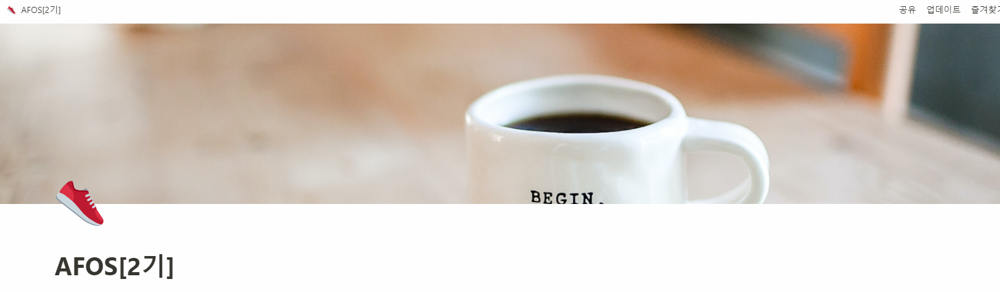

- 스터디 내용 상세 링크
(내용비공개)

- 스터디 기간
  - 6월 9일 ~ 8월 11일( 10주간 매주 수요일 오후 7시~9시)
- 스터디 목표
   - AWS 입문 스터디
   - 개인목표
     - AWS 기반을 다져서 좀더 높은 퀄리티의 배포를 할 수 있는 상태를 만들기
- 스터디 진행팀 
   - CloudNet@ 팀 
   - 김석필(beas) , 서종호(가시다), '따라하며 배우는 AWS 네트워크' 책 출판
- 스터디 커리큘럼
 (내용비공개)

    → 스터디 상황에 따라 일부 내용은 수정될 수 있습
