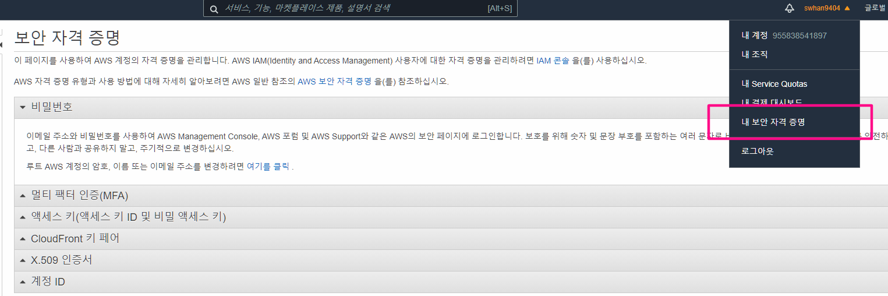
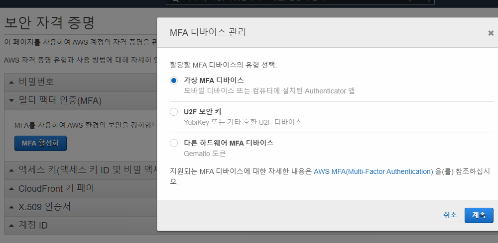
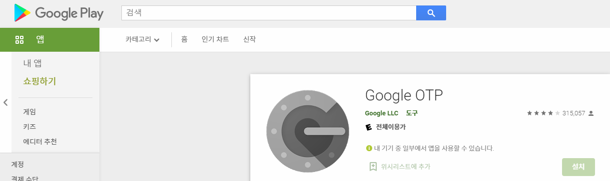

# MFA 란?

- MFA 란? "Multi Factor Authentication" 의 약자 입니다. 
- 역할
  - 은행 로그인 할 때 보안을 강화하기 위해 OTP(One Time Password) 단말기를 쓰는 것과 동일합니다. 
  - 예전에는 보안카드 라는 것을 발급했지만, 이것은 탈취당하기 쉬운 정보이죠. 그렇기 때문에 "초단위 또는 분단위로 바뀌는 숫자"로 인증번호를 대체하여 보안을 강화하는 방법 입니다. 이러한 MFA는 하드웨어만 있는게 아니고 스마트폰에 앱을 설치하여 동일한 효과를 낼 수 있습니다.
- 혹시나 있을지 모를 계정 탈취로 인한 비용청구를 막자!

# 적용하기

1. 로그인 후 - 보안자격증명 들어가기

2. MFA 활성화

3. 핸드폰에 GoogleAuthenticator(Google OTP) 설치

4. QR 코드 스캔으로 연동하기

5. 연속으로 나타나는 MFA 6자리 비밀번호 2개를 입력해서 마무리

6. 이제 로그인마다 MFA 인증코드를 입력해야함

