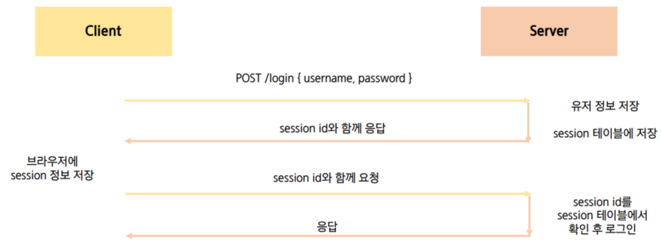
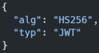
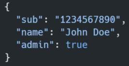
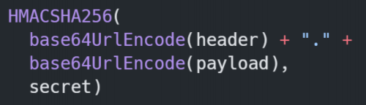
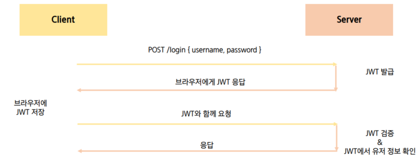
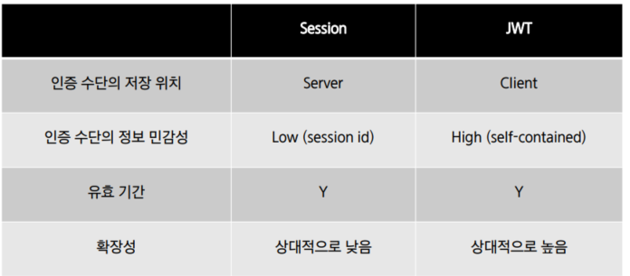
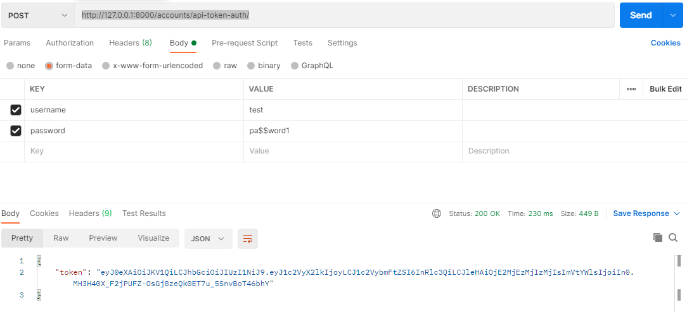
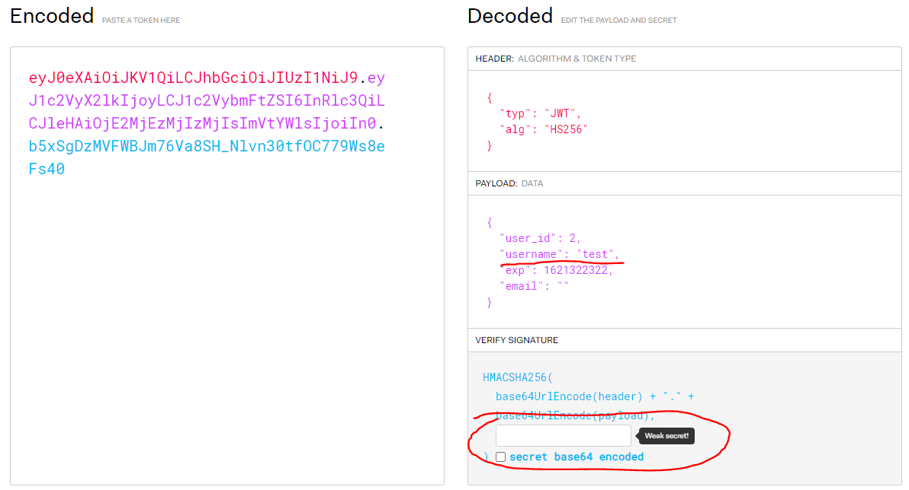
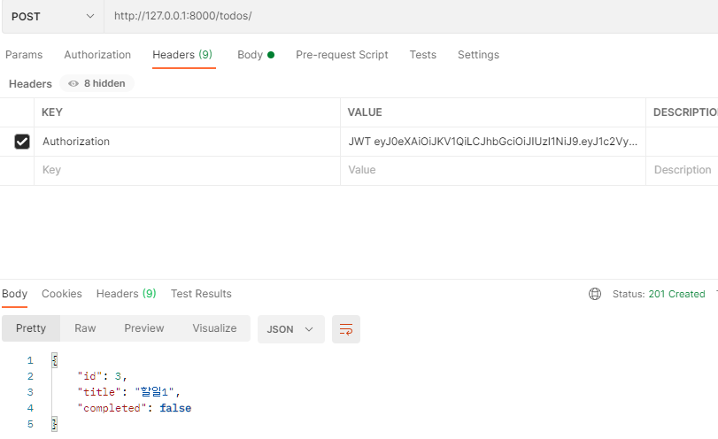

# 인증, 권한부여

- Authentication(인증)
  - **자신이라고 주장하는 사용자가 누구인지 확인하는 행위**
  - 모든 보안 프로세스의 첫번째 단계(가장 기본요소)
  - 401 Unauthorized
    - 비록 HTTP 표준에서는 미승인(unauthorized)을 하고 있지만, 의미상 이 응답은 비인증(unauthenticated)를 의미
- Authorization(권한부여, 허가)
  - 사용자에게 특정 리소스 또는 기능에 대한 액세스 권한을 부여하는 과정(절차)
  - **유저가 자원에 접근할 수 있는지 여부를 확인**
  - 보안환경에서는 권한부여는 항상 인증을 따라야함
    - 예를 들어, 사용자는 조직에 대한 액세스 권한을 부여받기 전에 먼저 자신의 ID가 진짜인지 먼저 확인해야함
  - 서류의 등급, 웹페이지에서 글을 조회 & 삭제 & 수정 할 수 잇는 방법, 제한 구역
    - 인증이 되어있어도 모든 권한을 부여받는 것은 아님
  - 403 Forbidden
    - 401과 다른 점은 서버는 클라이언트가 누구인지 알고 있음, 하지만 권한이 없음
- 여러 인증방식
  - 세션
  - 토큰
    - JWT
  - 제3자(플랫폼) 사용
    - Auth0, Okta, ...


## Session Based

- 작동 과정
  1. username 과 password 가 담긴 쿠키를 client -> server 로 보냄
  2. 서버가 확인을 하고 sessionid를 발급
  3. client는 sessionid를 받아 cookie에 저장
  4. 그리고 매 요청을 보낼 떄 sessionid가 들어있는 cookie를 같이 보냄 - 로그인을 유지하기 위해서




# JWT(JSON Web Token)

- JSON 포맷을 활용하여 요소 간 안전하게 정보를 교환하기 위한 표준 포맷
- 암호화 알고리즘에 의한 디지털 서명이 되어 있기 때문에 자체로 검증 가능하고 신뢰할 수있는 정보 교환 체계
- JWT 자체가 필요한 정보를 모두 갖기 때문에(self-contained) 이를 검증하기 위한 다른 검증 수단이 필요 없음
  - session은 session을 검증하기 위해 session 테이블에 존재했었음
- 사용처
  - Authentication, Information Exchange


## JWT 활용 이유

1. Session에 비해 상대적으로 HTML, HTTP 환경에서 사용하기 용이
   - Session은 유저의 session 정보를 server에 보관해야함
   - 하지만 JWT 는 client side 에 토큰 정보를 저장하고 필요한 요청에 (유요한 토큰을) 같이 넣어 보내면 그 자체가 인증 수단이 됨
2. 높은 보안 수준
3. JSON의 범용성
4. Server 메모리에 정보를 저장하지 않아 Server의 자원 절약 가능


## JWT 구조

1. Header

   - 토큰의 유형(type)

   - Hashing algorithm 으로 구성



2. Payload

   - 토큰에 넣을 정보

   - claim은 정보의 한 조각을 의미하며 payload 에는 여러 개의 claim을 넣을 수 있음

   - claim의 종류

     - Registered claims

     - pulic claims

     - private claims



3. Signature

   - Header와 Payload의 encoding 값을 더하고 거기에 private key를 hashing 하여 생성




## JWT  작동과정

1. client에서 username과 password를 보냄
2. server가 인증을 체크하고,  JWT를 발급하고 client에게 보냄
3. client 가 브라우저에 받은 token을 저장함
4. client은 이제 요청을 보낼 때마다 token을 함께 보내게 됨
5. 서버는 토큰을 받고 디코딩을 해서 거기 안에 있는 유저정보를 다시 추출하고 다시 인증을 체크하게 됨




## Session 과 비교




# JWT 실습하기

## 기본설정부분

- REST framework JWT Auth 설치

  - https://jpadilla.github.io/django-rest-framework-jwt/

  - `pip install djangorestframework-jwt`

  - `settings.py > REST_FRAMEWORK` 
  
    - 이거 안하면 데코레이터 써서 사용하고, 이거 쓰면 자동으로 해줌

    ```python
    REST_FRAMEWORK = {
        'DEFAULT_PERMISSION_CLASSES': (
            'rest_framework.permissions.IsAuthenticated',
        ),
        'DEFAULT_AUTHENTICATION_CLASSES': (
            'rest_framework_jwt.authentication.JSONWebTokenAuthentication',
            'rest_framework.authentication.SessionAuthentication',
            'rest_framework.authentication.BasicAuthentication',
        ),
    }
    ```

  - `urls.py`

    ```python
    from rest_framework_jwt.views import obtain_jwt_token
    #...
    
    urlpatterns = [
        '',
        # ...
    
        path('api-token-auth/', obtain_jwt_token),
    ]
    ```

  - `settings.py > JWT_AUTH`

    - 토큰 지속시간 5분이 기본값인데 하루로 늘리기 - 원래는 짧을 수록 보안상으로 좋지만 지금은 실습하기 위함이어서 길게 만든것
      - 토큰을 의도적으로 기간을 만료시키는건 불가능함 
      - 그래서 악의적인 행동을 할 수 없도록 토큰의 유효기간을 짧게 가져가는 것

    ```python
    import datetime
    
    JWT_AUTH = {
        'JWT_EXPIRATION_DELTA': datetime.timedelta(days=1),
    }
    ```

    

## 회원가입- django 부분

1.  user 커스텀으로 만들기

   ```python
   from django.db import models
   from django.contrib.auth.models import AbstractUser
   
   class User(AbstractUser):
       pass
   
   ```


2. `accounts > serializers.py`

   - 아이디, 비밀번호를 받아서 시리얼라이징하는 역할
   - password 는 write_only 를 줘서 시리얼라이징은 하지만 응답에는 포함시키지 않게 해줘야함

   ```python
   from rest_framework import serializers
   from django.contrib.auth import get_user_model
   
   User = get_user_model()
   
   class UserSerializer(serializers.ModelSerializer):
       # write_only는 시리얼라이징은 하지만 응답에는 포함시키지 않는다는 의미
       # 비밀번호를 응답에 표현한다면 보안상의 유출이 되는 것이기 떄문
   
       password = serializers.CharField(write_only=True)
   
       class Meta : 
           model = User
           fields = ('username', 'password')
   
   ```

3. `accounts > views.py` 회원가입 부분 기본모양 만들기

   - 물론 이거 전에 urls.py 에 주소와 views.py 를 연결하는 부분 만들어주기

   - client 에서 온 데이터를 받음

   - 패스워드와 패스워드확인이 일치하는지 일단 확인

     - 일치하지 않으면 400 에러

   - UserSerializer를 통해 데이터 직렬화 

   - validation 을 진행하고 password도 같이 직렬화 실행

     (read_only값이기 떄문에 따로 해줘야함)

   - user 데이터를 저장하고, 저장값과 함께 201 상태코드를 보내줌

   ```python
   from rest_framework import status
   from rest_framework.decorators import api_view
   from rest_framework.response import Response
   from .serializers import UserSerializer
   
   
   @api_view(['POST'])
   def signup(request):
   	#1-1. Client에서 온 데이터를 받아서
       password = request.data.get('password')
       password_confirmation = request.data.get('passwordConfirmation')
   		
   	#1-2. 패스워드 일치 여부 체크
       if password != password_confirmation:
           return Response({'error': '비밀번호가 일치하지 않습니다.'}, status=status.HTTP_400_BAD_REQUEST)
   		
   	#2. UserSerializer를 통해 데이터 직렬화
       serializer = UserSerializer(data=request.data)
       
   	#3. validation 작업 진행 -> password도 같이 직렬화 진행
       if serializer.is_valid(raise_exception=True):
           user = serializer.save()
           #4. 비밀번호 해싱 후 
           user.set_password(request.data.get('password'))
           user.save()
       # password는 직렬화 과정에는 포함 되지만 → 표현(response)할 때는 나타나지 않는다.
           return Response(serializer.data, status=status.HTTP_201_CREATED)
   
   ```

   

## 회원가입 - vue 부분

- credential이란 객체 만들어서 
  - v-model로 각각 input 데이터를 연동시키기
- axios 로 회원가입 정보를 보내고 받기
  - 가입 이후 `this.$router.push({name : 위치 })` 를 통해 페이지 이동 시켜주기

```vue
<template>
  <div>
    <h1>Signup</h1>
    <div>
      <label for="username">사용자 이름: </label>
      <input type="text" id="username" v-model="credentials.username">
    </div>
    <div>
      <label for="password">비밀번호: </label>
      <input type="password" id="password" v-model="credentials.password">
    </div>
    <div>
      <label for="passwordConfirmation">비밀번호 확인: </label>
      <input type="password" id="passwordConfirmation" v-model="credentials.passwordConfirmation">
    </div>
    <button @click="signup">회원가입</button>
  </div>
</template>

<script>
import axios from 'axios'

// const SERVER_URL = process.env.VUE_APP_SERVER_URL

export default {
  name: 'Signup',
  data: function () {
    return {
      credentials : {
        username : null,
        password : null,
        passwordConfirmation : null,
      }
    }
  },
  methods: {
    signup: function () {
      axios ({
        method : 'post',
        url : 'http://127.0.0.1:8000/accounts/signup/',
        data: this.credentials,
      })
        .then(res => {
          console.log(res)
          // 회원가입에 성공하면 로그인 페이지로 보내기
          this.$router.push({ name : 'Login'})
        })
        .catch(err => {
          console.log(err)
        })
    }
  }
}
</script>

```


## JWT 작동 확인

1. http://127.0.0.1:8000/accounts/api-token-auth/ 에 postman을 통해 정보 보내기

   - token 이 반환됨을 볼 수 있음
     - `.`을 기준으로 3등분 되어있음을 확인할 수 있다




2. JWT 홈페이지에서 토큰값 제대로 작동하는지 확인하기
   - https://jwt.io/#debugger-io
   - verify 밑의 secret key의 경우 django > `settings.py > SECRET_KEY` 의 값을 넣으면 됨




## JWT 로그인 - vue

1.  Login.vue
   - jwt token 값 받아오기
     - 받아온 토큰 값을 로컬스토리지에 저장
     - TodoList로 이동
   - 로그아웃
     - 로컬스토리지의 토큰을 지움

```vue
<template>
  <div>
    <h1>Login</h1>
    <div>
      <label for="username">사용자 이름: </label>
      <input type="text" id="username" v-model="credentials.username">
    </div>
    <div>
      <label for="password">비밀번호: </label>
      <input type="password" id="password" v-model="credentials.password">
    </div>

    <button @click="login">회원가입</button>

  </div>
</template>

<script>
import axios from 'axios'

// const SERVER_URL = process.env.VUE_APP_SERVER_URL

export default {
  name: 'Login',
  data: function () {
    return {
      credentials : {
        username : null,
        password : null,
      }
    }
  },
  methods: {
    login: function () {
      axios({
        method : 'post',
        url : 'http://127.0.0.1:8000/accounts/api-token-auth/',
        data : this.credentials,
      })
        .then(res => {
          // 로컬스토리지에 토큰 저장
          localStorage.setItem('jwt', res.data.token)
          // TodoList로 이동
          this.$router.push({ name : 'TodoList'})
        })
        .catch(err => {
          console.log(err)
        })
    }
  }
}
</script>

```


2. App.vue 에서 로그인 체크

   - 로컬스토리지에 jwt가 존재하는지를 판단(created)해서 isLogin에 값 넣기

   - isLogin의 값에 따라 보이는 메뉴 달라짐

   - 로그인 페이지에서 로그인을 하게 된다면 login 이벤트를 받아서 isLogin 수정

     - router-view 가 랜더링하는 부분이라 여기다가 넣으면됨

   - router-link를 a태그로써 랜더링 되지만 a태그 고유의 이벤트를 없애고, vue가 사용하는 특수한 형태로 만들어진 것

     - 그래서 @click 으로 했을 떄 이벤트가 발생하지 않음

       @click.native 로 해줘야 클릭했을 때 이벤트가 발생되게 됨

```vue
<template>
  <div id="app">
    <div id="nav">
      <span v-if="isLogin">
        <router-link :to="{ name: 'TodoList' }">Todo List</router-link> | 
        <router-link :to="{ name: 'CreateTodo' }">Create Todo</router-link> |
      </span>
      <span v-else>
        <router-link :to="{ name: 'Signup' }">Signup</router-link> |
        <router-link :to="{ name: 'Login' }">Login</router-link> 
      </span>
    </div>
    <router-view @login="isLogin = true"/>
  </div>
</template>

<script>
export default {
  name: 'App',
  data: function () {
    return {
      isLogin : false,
    }
  },
  methods: {

  },
  created : function(){
    // 로컬스토리지에 jwt 이 존재하는지에 따라 로그인 여부 판단하기
    const token = localStorage.getItem('jwt')
    if(token){
      this.isLogin = true
    }
  }
}
</script>

<style>
#app {
  font-family: Avenir, Helvetica, Arial, sans-serif;
  -webkit-font-smoothing: antialiased;
  -moz-osx-font-smoothing: grayscale;
  text-align: center;
  color: #2c3e50;
}

#nav {
  padding: 30px;
}

#nav a {
  font-weight: bold;
  color: #2c3e50;
}

#nav a.router-link-exact-active {
  color: #42b983;
}
</style>

```


##  JWT 인증된 사용자  todo작성,수정,삭제 - django

1. 사용할 모델에 user 를 foreign key 로 가지도록 만듬

   - user는 직접참조가 아님
   - todo.user는 접근이 되지만, user에서는 user.todo_set으로 접근해야되기 떄문에 좀더 편하게 user.todos로 related_name을 이용하여 바꾸기

   ``` python
   from django.db import models
   from django.conf import settings # user는 직접참조가 아님
   
   # Create your models here.
   class Todo(models.Model):
       user = models.foreignKey(settings.AUTH_USER_MODEL, on_delete=models.CASCADE, related_name="todos")
       # user를 foreign key로 가질 떄 이렇게 
       # todo.user는 접근이 되지만, user에서는 user.todo_set으로 접근해야되기 떄문에 좀더 편하게 user.todos로 related_name을 이용하여 바꾸기
       title = models.CharField(max_length=50)
       completed = models.BooleanField(default=False)
   
       def __str__(self):
           return self.title
       
   ```


2. `todos > views.py ` 내용 수정

```python
from django.shortcuts import get_object_or_404
from rest_framework import status
from rest_framework.response import Response
from rest_framework.decorators import api_view

from rest_framework.decorators import authentication_classes, permission_classes
from rest_framework.permissions import IsAuthenticated
from rest_framework_jwt.authentication import JSONWebTokenAuthentication

from .serializers import TodoSerializer
from .models import Todo


@api_view(['GET', 'POST'])
def todo_list_create(request):
    if request.method == 'GET':
        todos = Todo.objects.all()
        serializer = TodoSerializer(todos, many=True)
        return Response(serializer.data)

    elif request.method == 'POST':
        serializer = TodoSerializer(data=request.data)
        if serializer.is_valid(raise_exception=True):
            serializer.save()
            return Response(serializer.data, status=status.HTTP_201_CREATED)


@api_view(['PUT', 'DELETE'])
def todo_update_delete(request, todo_pk):
    todo = get_object_or_404(Todo, pk=todo_pk)
    if request.method == 'PUT':
        serializer = TodoSerializer(todo, data=request.data)
        if serializer.is_valid(raise_exception=True):
            serializer.save()
            return Response(serializer.data)

    elif request.method == 'DELETE':
        todo.delete()
        return Response({ 'id': todo_pk })
```


3. 추가가 잘 되는지 확인하기

   - header 에 JWT token 추가
     - KEY : Authorization
     - VALUE : JWT 토큰값
       - JWT 와 토큰값 사이에 띄어쓰기 하나 있는거 주의
     
   - body에 form 내용




## JWT 인증된 사용자 todo작성 - vue

- created에서 localStorage 를 확인해서 로그인여부 판단
  - 되어있으면 리스트 보여주고
  - 안되어있으면 로그인 페이지로 이동
- localStorage의 token값을 request header 에 넣어주는 함수 만들기(setToken)
  - 그 이후 axios 쓸 때마다 headers 에  setToken 값 넣어주기

```vue
<template>
  <div>
    <ul>
      <li v-for="(todo, idx) in todos" :key="idx">
        <span @click="updateTodoStatus(todo)" :class="{ completed: todo.completed }">{{ todo.title }}</span>
        <button @click="deleteTodo(todo)" class="todo-btn">X</button>
      </li>
    </ul>
    <button @click="getTodos">Get Todos</button>
  </div>
</template>

<script>
import axios from 'axios'

export default {
  name: 'TodoList',
  data: function () {
    return {
      todos: [],
    }
  },
  methods: {
    setToken : function () { // header 내용에 토큰 붙여주기
      const token = localStorage.getItem('jwt')
      const config = {
         Authorization : `JWT ${token}`
      }
      return config
    },

    getTodos: function () {
      axios({
        method: 'get',
        url: 'http://127.0.0.1:8000/todos/',
        headers : this.setToken()
      })
        .then((res) => {
          console.log(res)
          this.todos = res.data
        })
        .catch((err) => {
          console.log(err)
        })
    },
    deleteTodo: function (todo) {
      axios({
        method: 'delete',
        url: `http://127.0.0.1:8000/todos/${todo.id}/`,
        headers : this.setToken()
      })
        .then((res) => {
          console.log(res)
          this.getTodos()
        })
        .catch((err) => {
          console.log(err)
        })
    },
    updateTodoStatus: function (todo) {
      const todoItem = {
        ...todo,
        completed: !todo.completed
      }

      axios({
        method: 'put',
        url: `http://127.0.0.1:8000/todos/${todo.id}/`,
        data: todoItem,
        headers : this.setToken(),
      })
        .then((res) => {
          console.log(res)
          todo.completed = !todo.completed
        })
      },
    },
  created: function () {
    if (localStorage.getItem('jwt')){ // 로그인이 되어있다면 todo 보이고
      this.getTodos()
    } else { // 로그인이 안되어 있다면 Login페이지로 이동
      this.$router.push({name : 'Login'})
    }
  }
}
</script>

<style scoped>
  .todo-btn {
    margin-left: 10px;
  }

  .completed {
    text-decoration: line-through;
    color: rgb(112, 112, 112);
  }
</style>
```