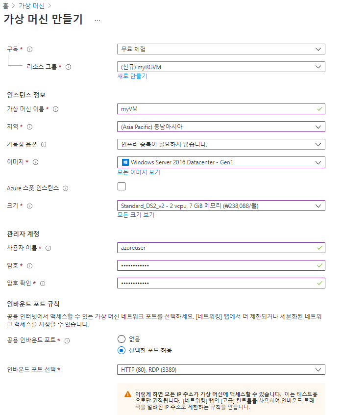
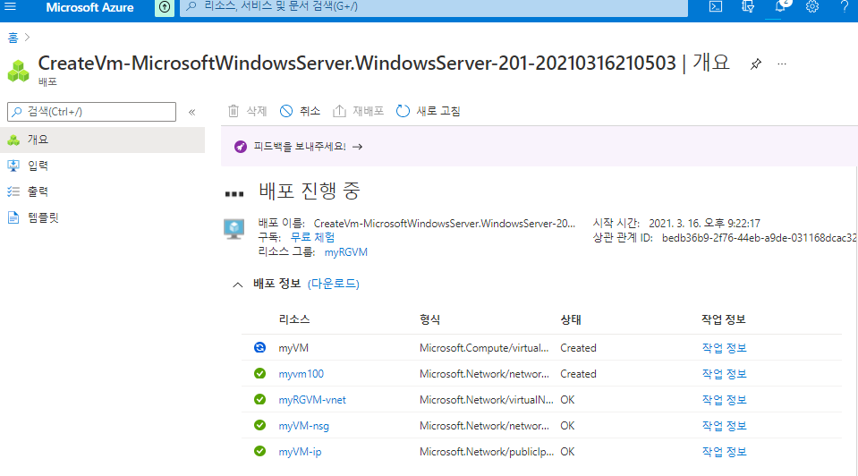
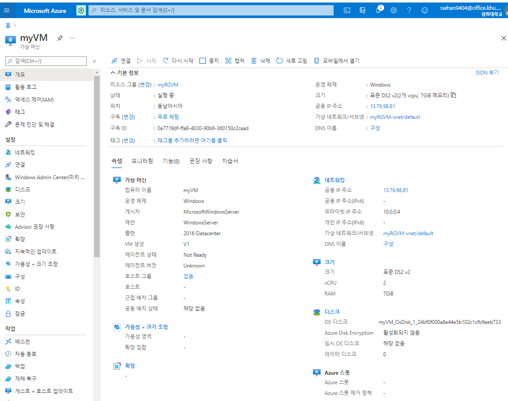
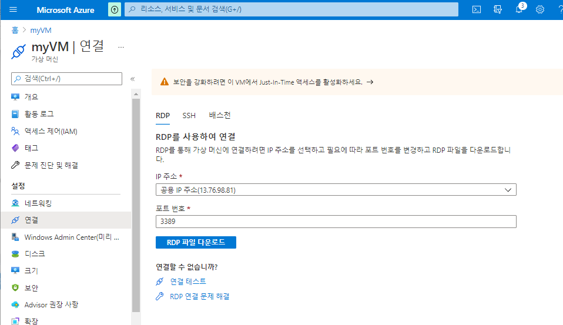
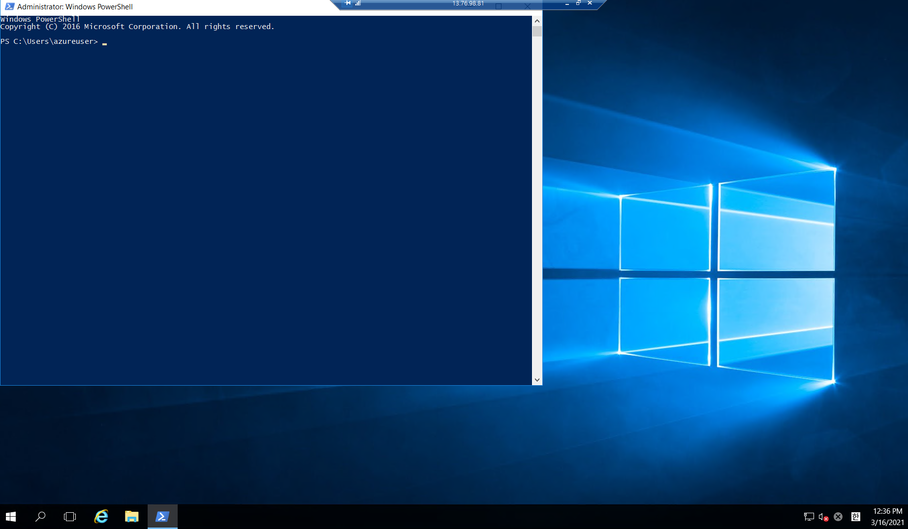
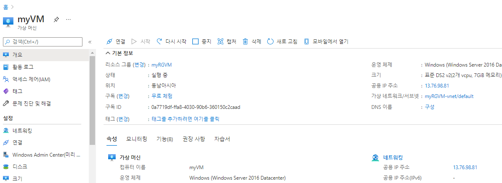
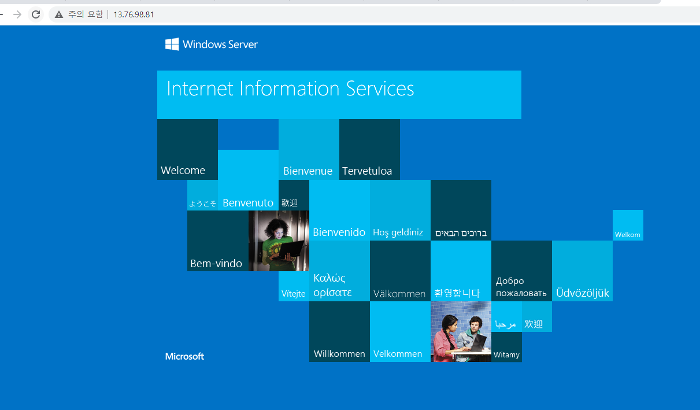
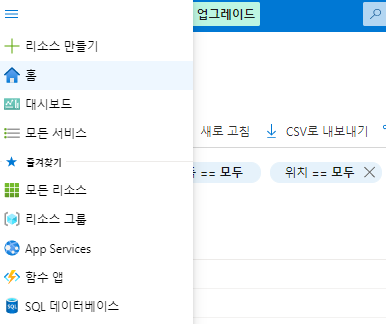
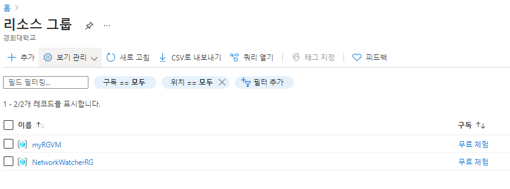
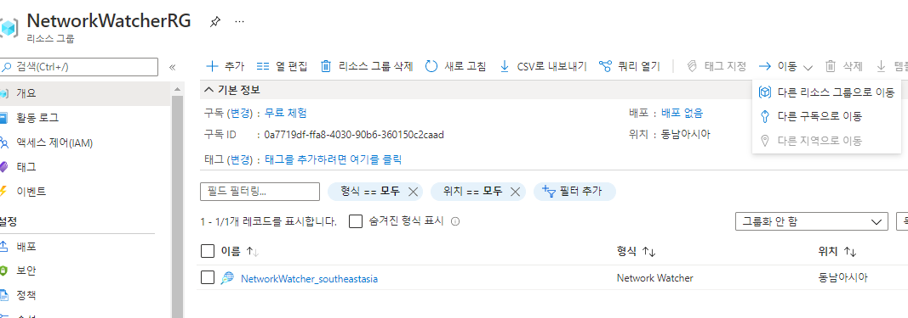

# 1. 가상머신 만들기

1. https://portal.azure.com/#home 접속하기

2. 가상머신 검색

3. 추가 메뉴로 가상머신 추가하기

4. 기본 사항 설정

   - 구독  : 청구(비용), 액세스(접근) 제어, 기술적 제한 - 할당량
     - Azure를 사용하려면 Azure구독이 필요, 애저의 시작은 첫 단계의 구독을 하나 이상 만드는 것
     - 애저 구독은 애저 계정과 연결된 애저 서비스의 논리적 단위
   - 리소스 그룹 : 리소스는 리소스 그룹으로 결합합니다. 리소스 그룹은 웹앱, 데이터베이스, 스토리지 계정과 같은 Azure 리소스가 배포되고 관리되는 논리적 컨테이너 역할
     - 리소스 : 리소스는 가상 머신, 스토리지 또는 SQL 데이터베이스와 같이 사용자가 만드는 서비스의 인스턴스
   - 가상머신 이름 만들기
   - 지역선택 - (Asia Pacific) 동남아시아
     - 한국꺼도 있는데 게임사가 많이 리소스를 차지하고 있어서 느릴 수도 있다고함
   - 가용성 옵션 - 인프라 중복이 필요하지 않습니다 클릭
     - 하나의 데이터센터에서 저장하는 것에 대한 오류로 부터 보호하는 옵션
     - 하나의 가용성 영역의 장애 시, 다른 영역에서 연속적으로 서비스 지원합니다. 중복성 지원. 고가용성 구현. 
     - 지역 내의 고유한 실제 위치. 애저 지역 내에서의 물리적으로 분리된 데이터 센터, 독립된 영역으로 동작. 격리 경계로 설정(한 영역이 다운되어도 다른 영역은 계속 자동)
   - 이미지 - Windows Server 2016 Datacenter - Gen1
     - 가상 머신의 os를 선택하는 것
   - 크기 - DS2_v2 선택
     - 서비스에 맞춘 가상머신의 크기를 선택하는 것이 경험과 실력
   - 관리자 계정 - 사용자이름 : azureuser
     - 연습이니까 이렇게 일단
   - 암호 - Pa$$w0rd1234
   - 공용 인바운드 포트 - 선택한 포트 허용
     - 인바운드 - 들어오는 것

   - 인바운드 포트 선택 - HTTP(80), RDP(3389)

5. 가상머신 만들기 - 디스크 설정
   - 여기서 설정하는 것은 없음
     - OS 디스크 유형 에서 프리미엄 SSD는 거의 100% 가용성을 보장할 수 있지만, 일시디스크이기 때문에 선택에 주의해야함

6. 가상머신 만들기 - 네트워킹 설정
   - 여기서 설정하는 것 없음
7. 가상머신 만들기 - 관리
   - 모니터링 
     - 부트진단 - 사용안함 선택
8.  가상머신 만들기 - 고급
   - 여기서 설정할 것 없음
   - 호스트
9.  가상머신 만들기 - 태그
   - 내 VM을 여러개로 만들 때 분류할 때 사용됨
   - 비용추적할 때 태그를 잘 달아놔야 비용관리가 편해짐
10. 최종으로 만들어진 결과

# 2. 만들어진 가상머신 확인하기

1. `myVM`(아까 정했던 가상머신 이름) 을 검색창에 검색
   - 활동 로그 - 가상머신으로 한 활동 log들 쌓이는 곳
   - 액세스 제어(IAM) - 역할 할당해서 각자의 권한 제어하는 곳
   - 네트워킹 
     - 우선순위 숫자가 작을 수록 우선순위가 높은 것

2. 내 컴퓨터와 가상머신 연결하기
   - 연결 - RDP 파일 다운로드
   - 실행시키면 원격 데스크톱 연결이 됨
   - 아까 정해줬던 관리자이름, 패스워드 입력
   - 그럼 가상머신이 작동됨

3. 검색 > `powershell` 을 관리자 모드로 실행하기

   - 웹서버 설치하기

   - Install-WindowsFeature -name Web-Server -IncludeManagementTools

     쓰고 엔터

   - 원격 데스크톱 연결 종료

4. 개요 - 네트워크 - 공용IP주소 복사 후 주소창에 붙여보면 접속됨

# 3. 가상머신 제거 하기

1. 왼쪽 메뉴를 눌러서 > 리소스 그룹 들어가기

2. NetWorkWatcherRG 클릭 / myRGVM 클릭
   - 리소스 그룹 삭제 클릭
   - 이름 다시 쓰고 삭제됨

